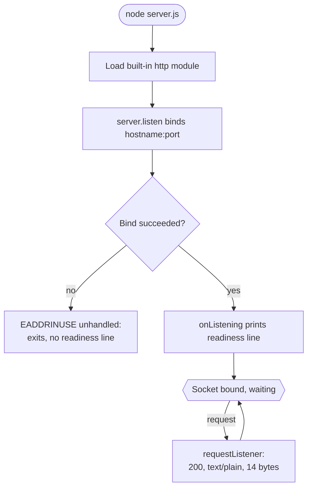
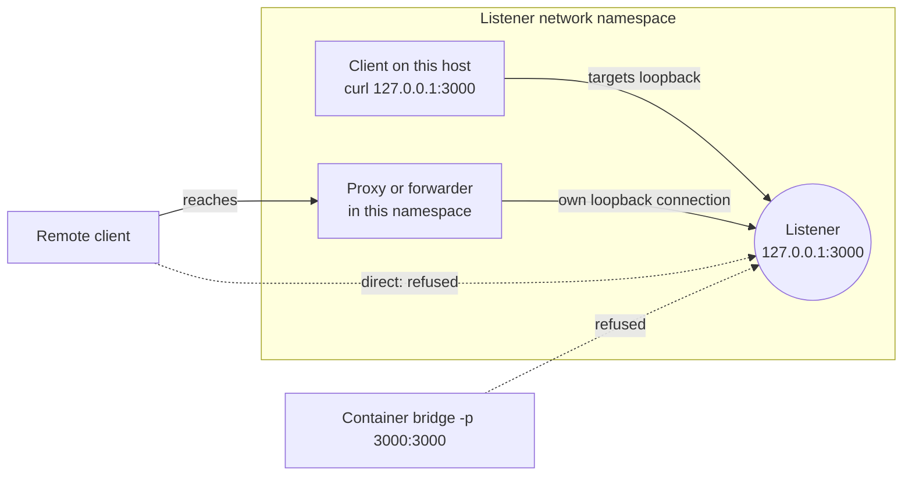

# Hello_world_26_Aug_01

A minimal fixed-response HTTP server in a single file. `server.js` binds a
listener to `127.0.0.1:3000` and, for every request event delivered to its
request listener, selects the same response: status `200`, media type
`text/plain`, and a 14-byte plain-text body — `Hello, World!` followed by a
newline. Node.js frames that response on the wire and may suppress the
body, notably for a `HEAD` request; the HTTP Contract section documents
those cases. There is nothing to install, nothing to build, and nothing to
configure.

## Overview

`server.js` is a process entry point, not a library. It requires one
built-in Node.js module, `http`, declares the two constants that fix where
it listens, registers a request listener, and starts listening
[server.js:module]. It exports nothing, so there is no reusable API for
another module to import.

`require('./server.js')` is not an error, but it is not useful either: it
executes the file, starts the listener as a side effect, and hands back an
empty exports object [server.js:module]. Run the file; do not import it.

What the program is, and what it is not:

- One built-in dependency, the `http` module, and no third-party packages.
- One response, selected without inspecting the request.
- No exports, no routing, no HTTPS, no error handling, no shutdown
  handling, no environment configuration, and no tests.

## Prerequisites and Quick Start

**Runtime.** The repository declares no supported Node.js version: there is
no `package.json` `engines` field, no `.nvmrc`, no `.node-version`, no
`.tool-versions`, no Dockerfile, and no CI configuration. There is
therefore no project minimum to quote and no support matrix to report. This
documentation was verified against Node.js 24.20.0 and 22.23.2, and every
behaviour described below was identical on both. Running a currently
supported LTS release is the recommendation —
[Node.js downloads](https://nodejs.org/en/download) — rather than a promise
about releases nobody tested here.

**No install step and no build step.** The program imports a single
built-in module, so there is nothing to fetch and nothing to compile
[server.js:module]. The repository has no manifest, so there is no
`npm install` step and no `npm start` script; neither exists here, and
neither is needed.

**Other prerequisites.** TCP port 3000 must be free on loopback in the
network namespace the process will run in [server.js:port]. The examples
below use `curl` and a POSIX shell; a browser pointed at
`http://127.0.0.1:3000/` is the alternative.

**Run it.** From the repository root:

```bash
node server.js
```

On a successful bind the process writes one line to stdout — the readiness
line — and nothing else [server.js:onListening]:

```text
Server running at http://127.0.0.1:3000/
```

Nothing follows it on stdout: there is no request log. The process's
stderr stays empty unless the bind fails, in which case Node.js writes a
crash diagnostic there and the process exits — see Troubleshooting and
Limitations.

**Verify it.** From another shell in the same network namespace:

```bash
curl -s http://127.0.0.1:3000/
```

```text
Hello, World!
```

**Stop it.** Press `Ctrl-C` in the foreground shell.

## How It Works

Each block below is quoted exactly from `server.js`, as one contiguous
region of the file, in the order the file is read. Where a region contains
JSDoc or inline comments, they are quoted with it.

**The dependency.** One built-in module is required, and it is the only
dependency the program has [server.js:module]:

```javascript
const http = require('http');
```

**The two constants.** The bind address and the port are source literals,
each with its own `@constant` block [server.js:hostname] [server.js:port]:

```javascript
/**
 * Hardcoded loopback bind address. Binding here is what sets the
 * reachability boundary: a client reaches the listener only by opening a
 * connection to it from inside the listener's own network namespace.
 * @constant {string}
 * @default '127.0.0.1'
 */
const hostname = '127.0.0.1';
/**
 * Hardcoded TCP port, with no fallback. Nothing reads an environment
 * variable, so if this port is already taken the program does not try
 * another one.
 * @constant {number}
 * @default 3000
 */
const port = 3000;
```

`hostname` fixes the reachability boundary described under Deployment and
Reachability. `port` has no fallback, so a port that is already taken is
fatal rather than retried.

**The request listener.** `http.createServer` receives the function this
document calls the request listener [server.js:requestListener]:

```javascript
const server = http.createServer((req, res) => {
  // Applies to every request the listener receives; `req` is never read.
  res.statusCode = 200;
  // No `charset` parameter is set, so the client chooses the encoding.
  res.setHeader('Content-Type', 'text/plain');
  // The body is 14 bytes, including the trailing newline.
  res.end('Hello, World!\n');
});
```

Three statements, in order, each preceded in the source by the inline
comment shown above it. The status is set to `200`. The media type is set
to `text/plain`, with no `charset` parameter, so the client chooses the
encoding. The response then ends with a 14-byte body — `Hello, World!` plus
the trailing newline. `req` is never read, which is why the application
selects the same response whatever the request contains.

**Binding and readiness.** `listen` receives the port and the host
positionally, and its callback runs once the socket is bound, writing the
readiness line [server.js:onListening]:

```javascript
server.listen(port, hostname, () => {
  console.log(`Server running at http://${hostname}:${port}/`);
});
```

No `'error'` listener is registered on the server, so application code
never handles a bind failure: Node.js writes the unhandled `EADDRINUSE`
error as a stack trace to the process's own stderr, and the process exits
non-zero. That diagnostic is local process output, not an HTTP response —
no client sees it. See Troubleshooting and Limitations.

The lifecycle, including the request path:



## HTTP Contract

The request listener never inspects `req`, so what follows describes one
response rather than a set of routes. There are no routes to describe, and
the application never produces a `404` [server.js:requestListener].

**What the application selects.** For every request delivered to the
request listener — whatever its method, path, query string, headers, or
body — the application sets the same three things and inspects nothing:

| Element | Value |
| --- | --- |
| Status | `200` |
| Media type | `Content-Type: text/plain` |
| Body | `Hello, World!` plus a newline, 14 bytes |

**The evidence for that breadth.** Eight methods — GET, POST, PUT, PATCH,
DELETE, OPTIONS, TRACE, and PURGE — issued across four paths with a request
body produced 32 responses. Every one was `200`, and every one carried the
identical body checksum:

```text
c98c24b677eff44860afea6f493bbaec5bb1c4cbb209c6fc2bbb47f66ff2ad31
```

That is evidence that the response is request-independent; it is not a list
of supported endpoints.

**Baseline framing.** On an ordinary HTTP/1.1 request the response reaches
the wire as below. The `Date` value is the moment of the request:

```bash
curl -sS -D - http://127.0.0.1:3000/
```

```text
HTTP/1.1 200 OK
Content-Type: text/plain
Date: Mon, 07 Sep 2026 06:47:09 GMT
Connection: keep-alive
Keep-Alive: timeout=5
Content-Length: 14

Hello, World!
```

`Keep-Alive: timeout=5` appears when the connection is kept alive.

**Application-set versus module-added headers.** Only `Content-Type` comes
from application code [server.js:requestListener]. The others are framing
added by the `http` module:

| Header | Set by |
| --- | --- |
| `Content-Type: text/plain` | the application |
| `Content-Length: 14` | the `http` module |
| `Date` | the `http` module |
| `Connection`, `Keep-Alive` | the `http` module |

**The catch-all, demonstrated.** A different method against a different
path, carrying a request body, is answered with the same
application-selected status, media type, and body. Only the module-added
`Date` varies, and it varies with the moment of the request rather than
with the request itself:

```bash
curl -sS -X POST -d 'ignored=1' -D - 'http://127.0.0.1:3000/api/x?q=1'
```

```text
HTTP/1.1 200 OK
Content-Type: text/plain
Date: Mon, 07 Sep 2026 06:47:09 GMT
Connection: keep-alive
Keep-Alive: timeout=5
Content-Length: 14

Hello, World!
```

**The `HEAD` exception.** A `HEAD` request is answered `200` with no
`Content-Length` at all and no body, so the `Content-Length: 14` above is
not universal:

```bash
curl -sS -I http://127.0.0.1:3000/
```

```text
HTTP/1.1 200 OK
Content-Type: text/plain
Date: Mon, 07 Sep 2026 06:47:09 GMT
Connection: keep-alive
Keep-Alive: timeout=5
```

That is conformant rather than a defect: a server may omit header fields
whose value is determined only while generating the content, which is why
the header is absent rather than zero — see §9.3.2 of
[RFC 9110](https://www.rfc-editor.org/rfc/rfc9110.html).

**Outcomes the runtime decides.** The Node.js `http` module also answers
some malformed or unusual requests itself, with statuses the application
never sets, and which requests those are varies by Node.js version.

**Documented absences.** Application code sets none of the headers below,
and none appeared in any response observed for a request delivered to the
request listener on Node.js 24.20.0 and 22.23.2. Each absence has a
consequence for the client. Responses the `http` module generates on its
own — the runtime-decided outcomes above — are outside this table:

| Absent | Consequence for the client |
| --- | --- |
| `Server` | no server product is advertised |
| `charset` on `Content-Type` | the client chooses the encoding |
| `Cache-Control`, `ETag` | nothing directs or validates caching |
| `Last-Modified` | no modification time is offered |
| `Content-Encoding` | the body is never compressed |
| CORS headers | browser scripts cannot read a cross-origin response |

No `Content-Encoding` is sent even when the client offers encodings: a
request advertising four of them drew a response carrying none, so the body
is never compressed. The CORS absence is narrower than it looks — without
those headers a browser script is not permitted to read a cross-origin
response, while the request itself may still be sent, and a non-browser
client such as `curl` is unaffected.

## Configuration

Configuration is not externalized. The two values the program uses are
source literals:

| Setting | Value | Symbol in `server.js` |
| --- | --- | --- |
| Bind address | `'127.0.0.1'` | `hostname` |
| Listening port | `3000` | `port` |

`hostname` is the literal `'127.0.0.1'` [server.js:hostname]. `port` is the
literal `3000`, with no fallback [server.js:port]. Setting a `PORT` or
`HOST` environment variable has no effect, because nothing in the program
reads the environment; there is no command-line flag layer and no
configuration file. Changing either value means editing `server.js` and
restarting the process.

## Deployment and Reachability

One reachability model governs every deployment decision here:

- A client reaches the listener only by opening a connection to
  `127.0.0.1:3000` from inside the listener's own network namespace
  [server.js:hostname]. Verified: `200` on loopback, and a refused
  connection on the host's routable address.
- A remote client is served only through a proxy or forwarder that itself
  runs in that network namespace and opens its own loopback connection to
  the listener. That arrangement needs no source change, so remote access
  does not require editing the bind address.
- Publishing the port out of a container with ordinary bridge networking
  does not create such a path, which is why `-p 3000:3000` alone yields a
  running but unreachable service.

The boundary is the network namespace, not the host. Two unmodified copies
can run on one physical host in separate network namespaces, each with its
own loopback, and the port collision described under Troubleshooting and
Limitations happens only within one namespace.



**The supported procedure.** The launch and check steps below were run
against this program; the last row records what it does not support
without a source change:

| Step | What it involves |
| --- | --- |
| Prerequisites | Supported runtime; port 3000 free on loopback |
| Copy | The two tracked files to a directory on that host |
| Launch | `node server.js` in the foreground |
| Check | `curl -s http://127.0.0.1:3000/` in that namespace |
| Logs | Readiness line on stdout; bind crash on stderr |
| Restart and stop | `Ctrl-C`; a restart is a full process restart |
| Not supported | Direct outside-namespace access; ordinary bridge publish |

There is no install step, no build step, and no manifest to place beside
the two files. The check returns the 14-byte body when it runs in the same
network namespace as the process; from anywhere else the connection is
refused. Both unsupported cases are about direct paths: serving a client
outside the namespace, including one arriving on a published container
port, is what the in-namespace proxy or forwarder described above is for.
There is no reload and no graceful drain, because no signal handler is
registered, so a restart is always a full process restart. Logs are one
line on stdout at startup and nothing thereafter: no request log, and no
application-managed error logging or log file. The one exception is
written by the runtime rather than by the application: a failure to bind
sends an unhandled-error stack trace to stderr just before the process
exits.

**Running under supervision** imposes two requirements, and they are
different things. The supervisor must run `node server.js` as its command,
capture its stdout so the readiness line is visible, capture its stderr
separately from stdout so a bind-failure stack trace is not lost, and
restart the process on exit — the program performs no retry of its own and
any exit is a full stop, so restart-on-exit with a backoff is the only
sensible policy. Access to the captured stderr has to be restricted: it
carries a raw stack trace that discloses runtime-internal file paths, and
it is local process output the request listener never sends to any client.
Separately, whatever connects to the listener — a health check, a proxy, a
forwarder — must run in the same network namespace as the process, because
opening `127.0.0.1:3000` is what being served requires. A supervisor may
launch its child into another network namespace; if it does, its own health
check fails unless the check runs there too.

Those are requirements, not a recipe. No unit file, process-manager
configuration, reverse-proxy configuration, or container definition is
given here, and none exists in the repository.

## Troubleshooting and Limitations

Every entry below was reproduced against the running program.

**Port already in use.** A second instance in the same network namespace
crashes. No `'error'` listener is registered on the server
[server.js:onListening], so application code never handles the event:
Node.js writes the unhandled error as a stack trace to that process's own
stderr, and the process exits non-zero. Nothing reaches its stdout, so the
readiness line never appears. Look on stderr for the line that identifies
the failure:

```text
Error: listen EADDRINUSE: address already in use 127.0.0.1:3000
```

That output is a local process diagnostic, not an HTTP response: no client
is involved, and the request listener never sends it anywhere. Identify
the failure by the `EADDRINUSE` code and that message; the numeric `errno`
printed alongside is platform detail. The stack trace also discloses
runtime-internal file paths, so treat captured stderr as sensitive. Free
port 3000 in that network namespace, or run the second copy in a network
namespace of its own.

**Connection refused.** The client could not open a loopback connection
inside the listener's network namespace; requests to the host's routable
address are refused for that reason. Either move the client into that
namespace or put a proxy or forwarder there, as described under Deployment
and Reachability.

**A status the application never assigned.** A malformed request can be
answered by the Node.js `http` module before the request listener runs, so
a client may see a status this program never sets: the application assigns
`200` and nothing else. Nothing is wrong with the program — the request did
not reach it.

**Node.js missing or too old.** The run command needs `node` on the `PATH`:

```bash
node --version
```

```text
v24.20.0
```

If the command is not found, install a currently supported LTS release.
This documentation was verified against 24.20.0 and 22.23.2.

**Limitations.** What follows is what the program lacks, stated without
assuming what it was meant for:

- No direct reachability from outside the listener's network namespace; a
  remote client requires an in-namespace proxy or forwarder.
- Only one process can own `127.0.0.1:3000` within a given network
  namespace.
- Not container-ready under ordinary bridge publishing.
- No reusable API and no exports, so no other module can import it.
- None of the controls production operation requires: no configuration
  surface, no error handling, no graceful shutdown, no application logging
  beyond the readiness line, and no tests.

## Project Structure, Verification and Licence

Two files are tracked, and nothing else is:

| Path | Role |
| --- | --- |
| `server.js` | The executable entry point [server.js:module] |
| `README.md` | This document |

**Verification.** `node --check server.js` parses the file without running
it, and is the only mechanical check available without adding tooling:

```bash
node --check server.js
```

It prints nothing and exits `0`. There are no tests to run.

**Absences, stated plainly.** No tests and no test directory. No CI
configuration. No third-party dependencies, no manifest, and no lockfile —
the only dependency is the built-in `http` module. No database. No
authentication. No environment configuration. The repository contains no
`LICENSE` file, so no licence terms are stated for this code.
