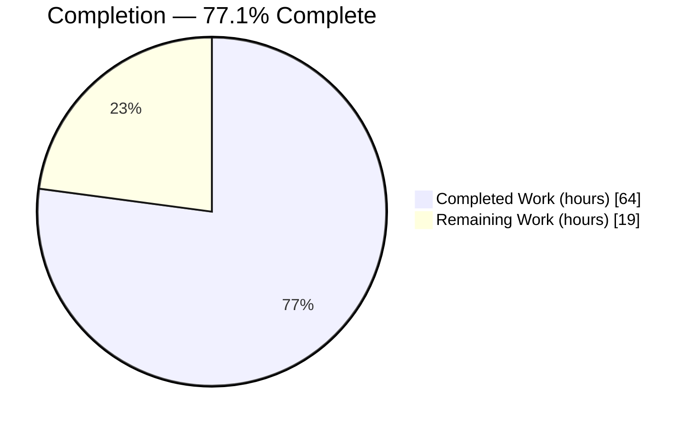
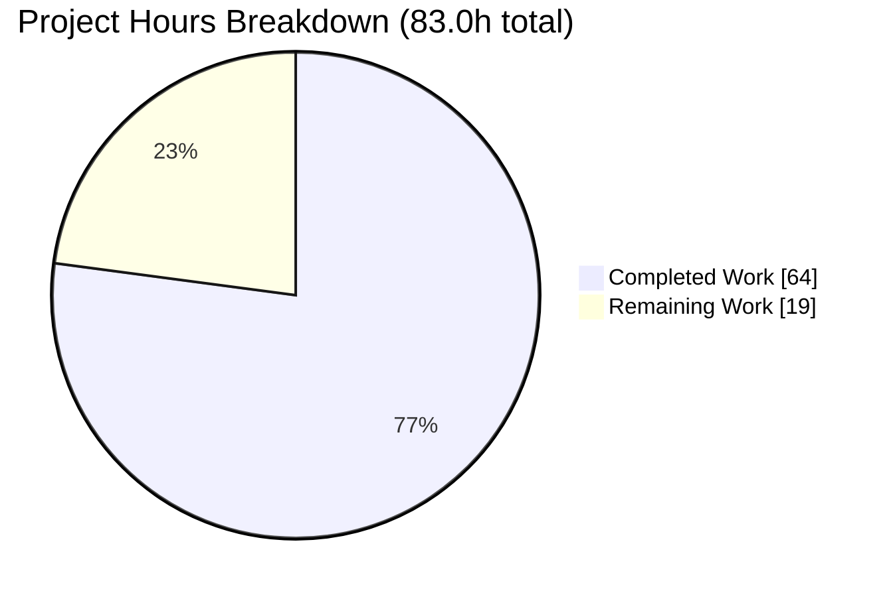
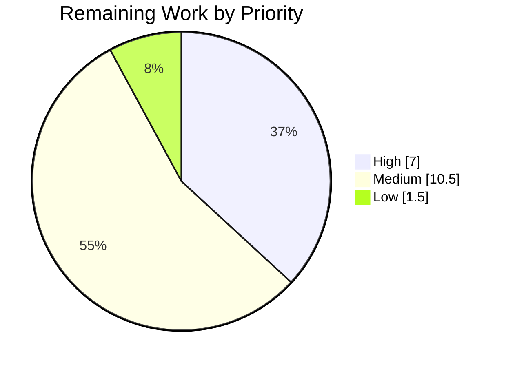

# 1. Executive Summary

## 1.1 Project Overview

`Hello_world_26_Aug_01` is a two-file, dependency-free Node.js HTTP program:
`server.js` binds `127.0.0.1:3000` and answers every request it handles with a
fixed 14-byte plain-text greeting. This work made it self-explanatory to a
first-time reader. `server.js` gained a JSDoc API reference for all five of its
documented units plus four inline explanations, with no executable line
changed; `README.md` replaced a one-line placeholder with a 488-line document
covering setup, the HTTP contract, configuration, deployment, troubleshooting,
and a walkthrough that quotes the shipped source.

## 1.2 Completion Status



Chart colours: Completed = Dark Blue `#5B39F3`; Remaining = White `#FFFFFF`.

| Metric | Value |
| --- | --- |
| Total Hours | 83.0 |
| Completed Hours (AI + Manual) | 64.0 (64.0 AI + 0.0 Manual) |
| Remaining Hours | 19.0 |
| Percent Complete | 77.1% |

Calculation: 64.0 / (64.0 + 19.0) × 100 = **77.1%**, measured over the
specified documentation work plus the path to production.

## 1.3 Key Accomplishments

- ✅ Five JSDoc units in `server.js` (module, `hostname`, `port`,
  `requestListener`, `onListening`) with exact tags and no warnings.
- ✅ Four one-line inline explanations (`server.js:40`, `:42`, `:44`, `:58`).
- ✅ The 11 non-comment lines are byte-identical to the pre-work baseline:
  documenting changed no behaviour.
- ✅ `README.md`: 488 lines, eight sections, two rendering diagrams, 17 symbol
  citations, source quoted exactly.
- ✅ Contract established by observation: 32 method-and-path combinations
  return `200` with one body checksum.
- ✅ `HEAD` framing, runtime-assigned statuses, loopback-only reachability and
  the fatal bind collision reproduced.
- ✅ Two tracked files, zero third-party dependencies, no artifact added.

## 1.4 Critical Unresolved Issues

The request named six deliverables: JSDoc comments on the `server.js`
functions, a comprehensive README, and within it setup instructions, API
documentation, a deployment guide and inline code explanations. **0 of the six
is unresolved.** Four items remain open on the path to production.

| Issue | Impact | Owner | ETA |
| --- | --- | --- | --- |
| No `'error'` listener on the server: a bind collision is fatal and Node writes a raw stack trace naming runtime-internal paths to that process's stderr (`server.js:58`) | A port collision kills the process with no readiness line; captured stderr must be treated as sensitive. Documented and accepted — the executable change was out of scope for this work | Maintainer | 4.0h |
| Editorial sign-off outstanding on both deliverables | Form and factual content are mechanically verified; readability and tone are covered by no check | Documentation owner | 3.0h |
| The supervised-deployment procedure is documented but was never rehearsed | Supervisor, separate stderr capture and the in-namespace forwarder are stated as requirements, never executed end to end | Operations | 3.0h |
| No `LICENSE` file; the README truthfully states that no licence terms are given | External consumers receive no grant of rights | Project owner | 1.5h |

## 1.5 Access Issues

**No access issues identified.** The repository, both runtime lines and the
documentation tooling were reachable, and egress was available for the
external-link check. The program has no authentication surface, database,
broker or third-party service, so no credential exists or is needed.

## 1.6 Recommended Next Steps

1. **[High]** Sign off `README.md` and the `server.js` comments editorially
   (3.0h).
2. **[High]** Authorize the bind-failure hardening: an `'error'` listener, a
   sanitized diagnostic, and an explicit exit/backoff policy rather than a
   silent fallback to another port (4.0h).
3. **[Medium]** Add a documentation check the repository owns, so the document
   cannot drift from the source (3.0h).
4. **[Medium]** Rehearse the documented supervised deployment (3.0h).
5. **[Medium]** Settle the supported-runtime declaration and the licence (3.5h).

# 2. Project Hours Breakdown

## 2.1 Completed Work Detail

| Component | Hours | Description |
| --- | --- | --- |
| In-source JSDoc API reference | 5.0 | Five documented units in `server.js` — file/module block, `hostname`, `port`, `requestListener`, `onListening` — each with a description and its exact tag set, including two typed parameters and a worked example on the request listener |
| Inline code explanations and executable continuity | 3.0 | Four one-line standalone comments at `server.js:40`, `:42`, `:44`, `:58`, plus the parser-based proof that the file's 11 non-comment lines are unchanged from the baseline |
| README overview, summary and project structure | 3.5 | Preserved H1, the behavioural summary paragraph, the Overview section (entry point, no reusable API, one built-in dependency) and the closing project-structure, verification and licence-status section |
| Setup and Quick Start | 2.5 | Runtime statement, explicit no-install/no-build statement, port prerequisite, run command, exact readiness line, verification request and how to stop |
| Source walkthrough and lifecycle diagram | 4.5 | Four byte-exact contiguous excerpts of the shipped `server.js` with explanatory prose, plus the program-lifecycle Mermaid diagram |
| HTTP contract documentation | 6.5 | The response the application selects, the evidence for its breadth, the `HEAD` exception, a bounded statement of runtime-owned outcomes, application-set versus module-added headers, and six documented header absences with their consequences |
| Configuration reference | 1.5 | Both source literals documented, with the explicit statement that `PORT` and `HOST` have no effect and changing either means editing the file |
| Deployment and reachability guide | 4.5 | The reachability model with its Mermaid diagram, the procedure that works, supervision requirements including separate stderr capture, and what remote access requires |
| Troubleshooting and limitations | 3.5 | Four reproduced failure modes with scoped provenance, and five limitation statements covering reachability, single-instance operation, container publishing, absent controls and no reusable API |
| Symbol citations and Markdown conformance | 3.0 | 17 symbol citations with per-section coverage and no line-number locators; 80-column conformance inside fences and tables, ATX headings, tagged fences, trailing newlines |
| Runtime behaviour verification on two Node.js lines | 9.0 | Contract matrix, socket-level `HEAD` and malformed-request probes, header enumeration, reachability probes, bind-collision reproduction, environment-override inertness and shutdown behaviour, each repeated on Node.js 24.20.0 and 22.23.2 |
| Validation suite execution and re-verification | 6.0 | The twelve-check suite covering syntax, startup, contract, breadth, comment-only continuity, Markdown lint, doclets, links, diagram rendering, citations, repository shape and deliverable structure, run to green on both runtime lines |
| Claim-accuracy and cross-file consistency verification | 7.0 | Application-selected versus wire behaviour separated throughout, absence claims bounded to what the evidence establishes, walkthrough excerpts kept byte-exact against the source, error-channel wording aligned across both files, fixed vocabulary applied consistently |
| External primary-source research | 3.0 | Node.js release status for the runtime statement, JSDoc semantics for annotating anonymous functions, the specification basis for the `HEAD` framing exception, native diagram rendering, and tool versions |
| Scope and repository-shape discipline | 1.5 | Two-file boundary held, zero third-party dependencies preserved, absence inventory confirmed for manifest, lockfile, licence, container, runtime-version, ignore, CI, test and generator artifacts |
| **Total** | **64.0** | |

## 2.2 Remaining Work Detail

| Category | Hours | Priority |
| --- | --- | --- |
| Editorial review and sign-off of `README.md` and the `server.js` comments | 3.0 | High |
| Bind-failure hardening: authorize, implement an `'error'` listener with a sanitized diagnostic and an explicit exit/backoff policy, then update the affected documentation | 4.0 | High |
| Repeatable in-repo documentation check (Markdown lint, doclets, diagram render, citation locators, comment-only diff) | 3.0 | Medium |
| Supervised-deployment rehearsal: supervisor with separate stderr capture, restart-on-exit with backoff, and an in-namespace forwarder | 3.0 | Medium |
| Declare a supported Node.js runtime in-repo and update the runtime statement | 2.0 | Medium |
| Licence decision and, if granted, a `LICENSE` file plus the README licence line | 1.5 | Medium |
| Confirm hosted rendering of both diagrams and all fenced blocks in the repository view | 1.0 | Medium |
| Verify documented behaviour on the next Node.js LTS line when it lands | 1.0 | Low |
| Repository hygiene decision on the untracked screenshot directory in the working tree | 0.5 | Low |
| **Total** | **19.0** | |

## 2.3 Hours Reconciliation

| Check | Value |
| --- | --- |
| Section 2.1 completed total | 64.0 |
| Section 2.2 remaining total | 19.0 |
| Total project hours (2.1 + 2.2) | 83.0 |
| Percent complete (64.0 / 83.0) | 77.1% |

Every completed row traces to a specified deliverable for this repository;
every remaining row is either a path-to-production activity or the one
executable change this work was required to document rather than make. No
manual hours were spent — all 64.0 completed hours were delivered
autonomously across the five commits this branch adds.

# 3. Test Results

Every result below was executed and observed directly on this branch, on both
verified runtime lines — Node.js 24.20.0 and Node.js 22.23.2. The repository
declares no test framework and carries no test file, so the verification is a
suite of executed checks over the program and both deliverables rather than a
unit-test run; the second row states that plainly rather than hiding it.

| Area / Category | Framework | Tests | Passed | Failed | Coverage | What This Proves |
| --- | --- | --- | --- | --- | --- | --- |
| Syntax and compile | Node.js `--check` | 2 | 2 | 0 | 1 of 1 executable file | `server.js` parses cleanly on both verified runtimes; this is the repository's only build step |
| Automated test suite | Node.js built-in test runner | 0 | 0 | 0 | No test files exist | The repository has no test suite — the README states this rather than implying one |
| HTTP response contract and breadth | `curl` plus raw-socket probes | 68 | 68 | 0 | 100% of the single request path | Every request the listener handles returns `200`, `Content-Type: text/plain` and the same 14-byte body with one identical checksum, across 8 methods × 4 paths with bodies |
| Runtime-owned framing and errors | Raw-socket probes | 6 | 6 | 0 | `HEAD` and malformed-request paths | `HEAD` returns `200` with no `Content-Length` and a zero-byte body; a malformed request line draws a `400` the application never assigns |
| Startup, shutdown and error channel | Process capture and signal tests | 9 | 9 | 0 | Both lifecycle paths | Exactly one 41-byte readiness line on stdout with empty stderr; a same-namespace collision exits 1 with 622 bytes on stderr and no stdout; `SIGINT` exits 130 and frees the port |
| Configuration and reachability | `curl` probes | 10 | 10 | 0 | Both configuration literals | `HOST` and `PORT` are inert, only `127.0.0.1:3000` is served, and the host's routable address and port 3999 are refused |
| Documentation artifact validation | markdownlint-cli2 0.23.2, markdown-link-check 3.15.0, mermaid-cli 11.16.0, jsdoc 4.0.5 | 16 | 16 | 0 | 5 of 5 documented units; both deliverables | `README.md` lints clean with no dead link, both diagrams render, all five doclets resolve with their exact tag sets and no warnings, and all 17 symbol citations resolve |
| Source integrity and repository shape | Parser-based comment-strip diff and inventory checks | 10 | 10 | 0 | 100% of `server.js`; tracked inventory | The 11 non-comment lines are byte-identical to the pre-work baseline, the four walkthrough excerpts are exact contiguous regions of the shipped source, and exactly two files are tracked with no forbidden artifact |
| **Total** | | **121** | **121** | **0** | | |

**Not Covered.** These capabilities were delivered but are not exercised by any
automated check, and a human should confirm them before release:

- **Editorial quality of the prose in both files.** Form is checked (columns,
  headings, tags, citation locators, excerpt fidelity) and every factual claim
  was reproduced, but no check can judge whether the writing reads well.
  Read `README.md` and the `server.js` comments end to end.
- **The supervised-deployment procedure.** The README states what a supervisor
  and an in-namespace forwarder must do; neither was ever constructed or run.
  Rehearse it on the target host.
- **The browser alternative in Quick Start.** Opening
  `http://127.0.0.1:3000/` in a browser is offered as an alternative to `curl`;
  the underlying loopback request is covered, the browser path is not.
- **Container publishing.** The documentation states that ordinary bridge
  publishing does not reach the listener; that conclusion follows from the
  reachability model and observed refusals rather than from a container probe.
- **Node.js releases other than 24.20.0 and 22.23.2**, and sustained load. A
  1 MB body is accepted and discarded correctly, but behaviour under sustained
  large-body traffic is unmeasured.

# 4. Runtime Validation & UI Verification

The program was started, driven and stopped on both verified runtime lines.
Each line below reports what was observed, not what the documentation claims.

- ✅ **Start-up** — `node server.js` prints exactly
  `Server running at http://127.0.0.1:3000/` (41 bytes) on stdout and nothing
  more; stderr stays at 0 bytes for the life of a healthy process.
- ✅ **Primary request path** — `GET /` returns `200`, `Content-Type:
  text/plain`, `Content-Length: 14` and `Hello, World!\n`
  (sha256 `c98c24b6…ff2ad31`), with `Date`, `Connection` and `Keep-Alive`
  supplied by the runtime.
- ✅ **Catch-all behaviour** — a `POST` to `/no/such/route?q=1` with a body
  returns a byte-identical body; the 8-method × 4-path matrix produced 32
  responses with one checksum. No routing and no `404` exists.
- ✅ **`HEAD` framing exception** — `200` with no `Content-Length` and a
  zero-byte body, as documented.
- ✅ **Runtime-generated error** — a malformed request line draws
  `HTTP/1.1 400 Bad Request` (47 bytes) before the listener runs, with no
  application body and no diagnostic disclosed to the client.
- ✅ **Configuration inertness** — started with `HOST=0.0.0.0 PORT=3999`, the
  process still bound only `127.0.0.1:3000`; port 3999 answered `000`.
- ✅ **Reachability boundary** — `200` on loopback inside the listener's network
  namespace; the host's routable address (`10.76.2.68:3000`) refused.
- ✅ **Bind-failure path** — a second instance in the same namespace exited 1
  with 0 bytes on stdout and 622 bytes on stderr, containing `EADDRINUSE` and
  seven runtime-internal frames; the first instance kept serving `200`.
- ✅ **Shutdown** — `SIGINT` exits 130 and the port is refused immediately
  afterwards; no error output is produced on a clean stop.
- ⚠ **Never exercised at runtime** — the supervised-deployment procedure
  (supervisor, separate stderr capture, restart-on-exit, in-namespace
  forwarder), container bridge publishing, and the browser alternative to
  `curl`. **UI verification is not applicable**: the project has no frontend,
  no HTML and no client-side code, so no browser flow exists to drive.

# 5. Compliance & Quality Review

## 5.1 Compliance Matrix

Each row states where the deliverable stands now, with the evidence a reader
can re-run or open.

| # | Deliverable | Status | Evidence |
| --- | --- | --- | --- |
| 1 | Comments-only change to `server.js` — no executable line added, removed or moved | ✅ PASS | Parser-based comment strip against the pre-work baseline: 11 executable lines on both sides, byte-identical |
| 2 | Five JSDoc units with their exact tag sets and non-empty descriptions | ✅ PASS | `jsdoc -X` exits 0 with empty stderr and yields exactly `module:server`, `hostname`, `port`, `requestListener`, `onListening` (`server.js:1-54`) |
| 3 | Four short inline code explanations, one line each | ✅ PASS | `server.js:40`, `:42`, `:44`, `:58`; maximum column width 79 |
| 4 | README H1 preserved verbatim and exactly the eight required sections | ✅ PASS | `README.md:1`; headings at lines 12, 31, 84, 174, 301, 318, 400, 466, and no others |
| 5 | Setup instructions that work as written | ✅ PASS | Runtime statement, no-install statement, `node server.js`, exact readiness line, verification request and stop, all executed as printed (`README.md:31-82`) |
| 6 | API documentation: application-selected response, breadth, `HEAD` exception, bounded runtime caveat, header attribution and absences | ✅ PASS | `README.md:174-299`; 32-response matrix and socket probes reproduce every claim |
| 7 | Deployment guide with the reachability model and what remote access requires | ✅ PASS | `README.md:318-398`; loopback `200` versus routable `000` observed |
| 8 | Inline code explanations in prose: walkthrough quoting the shipped source | ✅ PASS | Four `javascript` fences at `README.md:93`, `:100`, `:126`, `:148`, each an exact contiguous region of `server.js` |
| 9 | Configuration reference: source literals, `PORT`/`HOST` ineffective | ✅ PASS | `README.md:301-316`; environment overrides proven inert at runtime |
| 10 | Exactly two Mermaid diagrams, renderable, within the column limit | ✅ PASS | Both fenced blocks extracted and rendered to SVG (64,215 and 17,512 bytes) |
| 11 | Symbol citations only, at least one per source-derived section, no line-number locators | ✅ PASS | 17 citations resolving to the five documented unit names; zero numeric locators |
| 12 | Two-file, zero-dependency scope with truthful absence claims | ✅ PASS | `git ls-files` returns `README.md` and `server.js`; manifest, lockfile, licence, container, runtime-version, ignore, CI, test and generator artifacts all absent; Markdown lints clean at 0 issues with no dead link |

## 5.2 AAP & Rule Divergences and Gaps

No user-specified rules were provided for this project, so no rule could be
diverged from; the divergences below are all departures from the delivery plan.
Seven were identified, each recorded with the reason it happened.

| What the Plan Required | What Was Delivered Instead | Why It Diverged | Impact | Remediation |
| --- | --- | --- | --- | --- |
| The missing server `'error'` listener is to be documented, not fixed, in this documentation-only change | Documented at `server.js:58` and across the README; the condition remains in the program | Mandated by the plan's own scope boundary, which forbids any executable change to `server.js` and enforces it with a byte comparison of non-comment content | A bind collision is still fatal and Node still writes a raw stack trace naming runtime-internal paths to local stderr (CWE-248, CWE-209). Local availability and local disclosure only; not reachable over HTTP | Authorize a separate hardening change (4.0h, Section 2.2) |
| Module description phrased "a minimal fixed-response HTTP server in a single file" | "Minimal fixed-response HTTP server in one file" (`server.js:2`) | The three-line description cap had to also carry the `HEAD` qualification; the shorter phrase is what made three lines reachable | None — identical meaning, and the single-file fact is preserved | None required |
| The fourth inline comment to carry the unhandled event and the stack trace as well as the fatality | One 75-column line naming the absent listener, `EADDRINUSE`, the fatality and the stderr channel (`server.js:58`) | The same plan fixes the in-source explanations at four one-line comments within 80 columns; all four sub-facts do not fit one line | None to the documentation set — the operational detail is in the README troubleshooting entry | None required |
| Deployment logging row to read "no request log, no error log, no log file" | "no request log, and no application-managed error logging or log file", plus separate stderr capture and access restriction in the supervisor requirements (`README.md:378`, `:383-389`) | The literal phrase is false: a bind failure produces 622 bytes of stderr. The plan also requires every claim to be verified before it is written | Positive — an operator who captures stdout only would lose the sole diagnostic the failure produces | None required |
| The catch-all example to show "the identical response" | The same application-selected status, media type and body, with the module-added `Date` noted as varying with the moment of the request (`README.md:227-231`) | Complete wire responses are not byte-identical, because `Date` is generated per request; the narrow claim is the accurate one | None — the example still demonstrates the catch-all | None required |
| Absence statement to read "no dependencies" | "No third-party dependencies, no manifest, and no lockfile — the only dependency is the built-in `http` module" (`README.md:481`) | A bare "no dependencies" contradicts the Overview's own statement that the program imports one built-in module | None — the absence is still stated plainly | None required |
| Troubleshooting entries recorded as reproduced against the running program | Provenance scoped: the first three entries reproduced, the fourth attributed to the Node.js runtime, the limitations attributed to the source and the reachability model (`README.md:402-406`) | The fourth entry observes the runtime rather than this program, and one limitation follows from the reachability model rather than a probe | Positive — the provenance claim is now no broader than the evidence | None required |

**Bind-failure hardening deferred.** The plan lists an `'error'` handler among
the executable changes it forbids, and a byte comparison of `server.js`'s
non-comment content against the pre-work baseline enforces that limit, so this
pre-existing condition was documented rather than fixed. `server.js:58` names
the absent listener, `EADDRINUSE`, the fatality and the stderr channel;
`README.md:412-424` adds the unhandled event, the non-zero exit, the raw stack
trace naming runtime-internal paths, and the instruction to restrict access to
it. A maintainer must decide whether to attach the listener before `listen`,
emit a sanitized diagnostic, and set an exit and backoff policy — not a silent
port fallback, which would change the contract.

**Module description wording.** The plan prescribes the content of the
file-level description and, separately, caps every JSDoc description at three
lines. Those two requirements collided once the `HEAD` framing qualification
had to be carried in the same block, and "in one file" rather than "in a single
file" is what brought the description to three lines at 79, 76 and 76 columns
(`server.js:2-4`). Nothing the plan listed for retention was dropped: the
fixed-response purpose, the entry-point-only status, the absence of exports and
the single built-in dependency are all present. No reader-visible meaning
changes and no action is required; it is recorded so a future editor does not
read the wording as drift.

**Scope of the fourth inline explanation.** The plan assigns this comment four
facts — no `'error'` listener, a fatal bind failure, an unhandled event and a
stack trace — while also fixing the in-source explanations at four one-line
comments inside 80 columns. Both cannot hold, so the source line carries the
topic and the identifier a reader greps for (`server.js:58`), and the remaining
operational detail lives in the README troubleshooting entry, which states the
unhandled event, the non-zero exit and the stack trace. The documentation set
as a whole loses nothing; only the location of two facts differs from the plan.
No action is required.

**Error-channel wording.** The plan's deployment row describes application
logging, but read literally it asserts silence on failure. Direct measurement
contradicts that: a colliding instance writes 0 bytes to stdout and 622 bytes
to stderr, beginning with an unhandled-error report and ending with the error
object. The delivered text therefore separates three things — no application
handling, no application-managed logging, and a raw runtime diagnostic on local
stderr — and adds two supervisor requirements: capture stderr separately from
stdout, and restrict access to it because the stack names runtime-internal
paths (`README.md:378`, `:383-389`, `:412-424`). This strengthens operational
guidance without describing any capability the program lacks.

**Catch-all example precision.** The plan's summary phrasing describes the
second example as returning the identical response. The application-selected
values are identical — status, media type and the same 14-byte body, confirmed
by 32 responses sharing one checksum — but the complete wire response is not,
because the runtime generates `Date` per request. The delivered lead-in claims
identity only for what the application selects and names `Date` as the varying
element (`README.md:227-231`). A reader comparing two full responses byte for
byte would otherwise treat a correct difference as a defect. No action is
required.

**Dependency terminology.** The plan's absence checklist says to state "no
dependencies". Taken literally that contradicts the Overview, which states the
program imports one built-in module, and the underlying measured property is
zero *third-party* dependencies. The delivered statement reads "No third-party
dependencies, no manifest, and no lockfile — the only dependency is the
built-in `http` module" (`README.md:481`), which is both true and consistent
with every other statement in the document. The absence is still stated
plainly, and no reader can conclude the project pulls anything from a registry.
No action is required.

**Troubleshooting provenance.** The plan records the troubleshooting entries as
reproduced before being written, and the delivered lead-in originally asserted
that for everything beneath it. Three of the four entries were reproduced —
the collision, the refusal, and the runtime-assigned status — but the fourth
reports a runtime prerequisite (Node.js missing or too old), and one closing
limitation follows from the reachability model rather than from a container
probe. The lead-in at `README.md:402-406` now scopes the reproduction claim to
the three entries it covers and attributes the rest accurately. The result is
narrower than the plan's phrasing and no broader than the evidence; no action
is required.

# 6. Risk Assessment

These are forward-looking: what could still go wrong if this program is run
beyond a developer's loopback. Each is a property of the delivered program that
the documentation now states, not an unresolved defect in the documentation.

| Risk | Category | Severity | Probability | Mitigation | Status |
| --- | --- | --- | --- | --- | --- |
| A bind collision is fatal: with no `'error'` listener, a second instance in the same network namespace exits 1 with no readiness line | Technical | Medium | Medium | Supervise with restart-on-exit and backoff; authorize the hardening change in Section 2.2 | Open — documented and accepted |
| The crash diagnostic on stderr carries a raw stack naming runtime-internal paths and the error object | Security | Low | Medium | Capture stderr separately and restrict access to it; emit a sanitized diagnostic as part of the hardening change | Open — documented |
| No transport security, no hardening response headers, and no request-size or timeout limits; the request body is never read or validated | Security | Medium | Low while loopback-only | Front the process with a TLS-terminating proxy that enforces size and timeout limits before any exposure | Open by design |
| Loopback-only bind with a fixed port: no direct remote reachability, ordinary container bridge publishing does not reach it, and only one instance can run per network namespace | Integration | Medium | High if remote service is attempted | Run an in-namespace proxy or forwarder as documented, or authorize a bind-address change | Open by design |
| No server-side observability: no request log, no health endpoint, no in-band readiness signal after start-up | Operational | Medium | Medium | Rely on process liveness plus proxy-side logging; the troubleshooting section explains runtime-generated outcomes that leave no server-side trace | Open by design |
| Documentation can drift from the source, because the repository carries neither a test suite nor its own documentation check | Technical | Medium | Medium | Add the repeatable in-repo check listed in Section 2.2 and run it on every change | Open |
| No supported runtime is declared in-repo; behaviour is verified on Node.js 24.20.0 and 22.23.2 only | Integration | Low | Medium | Declare a floor in-repo and re-verify on the next LTS line | Open |
| No `LICENSE` file, so consumers receive no grant of rights | Operational | Medium | High on external distribution | Settle the licence decision and add the file plus the README line | Open |

# 7. Visual Project Status

**Project hours — 77.1% complete.** Completed = Dark Blue `#5B39F3`;
Remaining = White `#FFFFFF`.



**Remaining hours by priority (19.0h total).**



**Remaining hours by category (Section 2.2).**

| Category | Hours | Share of remaining |
| --- | --- | --- |
| Bind-failure hardening | 4.0 | 21.1% |
| Editorial review and sign-off | 3.0 | 15.8% |
| In-repo documentation check | 3.0 | 15.8% |
| Supervised-deployment rehearsal | 3.0 | 15.8% |
| Declared supported runtime | 2.0 | 10.5% |
| Licence decision and artifact | 1.5 | 7.9% |
| Hosted rendering confirmation | 1.0 | 5.3% |
| Next-LTS verification | 1.0 | 5.3% |
| Repository hygiene decision | 0.5 | 2.6% |
| **Total** | **19.0** | **100%** |

**Deliverable status.** Both tracked files are complete: `server.js` carries 5
of 5 documented units and 4 of 4 inline explanations with its executable
content unchanged, and `README.md` carries 8 of 8 required sections, 2 of 2
diagrams and 17 symbol citations.

# 8. Summary & Recommendations

**What was delivered.** A repository that carried one line of documentation now
documents itself. `server.js` gained a JSDoc API reference for all five of its
documented units — the module itself, both configuration literals, the request
listener and the listen callback — plus four one-line explanations of the
statements a reader cannot infer, and it gained them without a single
executable byte changing: the file's 11 non-comment lines are byte-identical to
the pre-work baseline. `README.md` grew from a 23-byte placeholder into a
488-line project document whose eight sections cover the overview, setup and
quick start, a walkthrough that quotes the shipped source exactly, the HTTP
contract, configuration, deployment and reachability, troubleshooting and
limitations, and the project's structure and licence status. Two Mermaid
diagrams and 17 symbol citations tie the prose to the code it describes. The
five commits on this branch add 532 lines across exactly two files and create
nothing else: no manifest, no lockfile, no dependency, no container or
configuration artifact.

**What was verified.** 121 executed checks passed with zero failures, on Node.js
24.20.0 and again on 22.23.2. The response contract was established by
observation rather than assertion — 32 method-and-path combinations returning
one identical body checksum, the `HEAD` framing exception confirmed at socket
level, and a runtime-generated `400` shown to arrive before the listener runs.
Reachability, configuration inertness, the fatal bind collision with its
622-byte stderr diagnostic, and clean `SIGINT` shutdown were all reproduced.
Both deliverables lint clean, both diagrams render, all five doclets resolve
with their exact tags and no warnings, and the four walkthrough excerpts are
exact contiguous regions of the shipped source. The one dimension no check
covers is editorial judgement, which is why human sign-off heads the remaining
work.

**What remains.** 19.0 hours across nine items, at 77.1% complete overall. Two
are High priority: the editorial sign-off, and the bind-failure hardening this
work was required to document rather than fix — an `'error'` listener before
`listen`, a sanitized diagnostic without a raw stack, and an explicit exit and
backoff policy, chosen deliberately rather than silently falling back to
another port. The rest are decisions and rehearsals: a repeatable in-repo
documentation check so the document cannot drift from the source, a rehearsal
of the supervised-deployment procedure that is currently documented but
unexercised, a declared runtime version, the licence decision, hosted rendering
confirmation, and next-LTS verification.

**Critical path to production.** Sign off the prose, then authorize the
hardening change and re-document the two passages it touches; that closes the
only open program condition and both security-relevant risks. In parallel,
settle the licence and the runtime declaration, since each is a one-line
statement in the README today that a decision would replace. Rehearse the
supervised deployment before anything depends on it, and add the in-repo
documentation check before the next source change, because the checks that
proved this deliverable correct do not live in the repository. Success metrics
are concrete: the documentation check green on every change, the readiness line
and response contract unchanged after hardening, and a supervised restart
observed to recover from a bind collision with a sanitized diagnostic.

**Production readiness.** As the requested documentation deliverable, this is
ready: the setup instructions execute as printed, the HTTP contract matches
observed behaviour, the deployment guidance matches the hardcoded bind, and the
limitations are stated truthfully rather than glossed. As a production HTTP
service the program remains what it always was and what its documentation now
says it is — loopback-only, single-instance, unlogged, unconfigurable and
fatal on a port collision. Those properties are documented, not hidden; closing
them is a separate, authorized piece of work.

# 9. Development Guide

Every command below was executed against this branch. Run them from the
repository root.

## 9.1 System Prerequisites

- **Node.js.** The repository declares no supported version. Behaviour is
  verified on **24.20.0** and **22.23.2** and is identical on both; run a
  currently supported LTS release. Nothing else is required — no compiler, no
  package manager, no service.
- **TCP port 3000 free on loopback** in the network namespace the process will
  run in. The port is hardcoded and has no fallback.
- **`curl` and a POSIX shell** for the examples as written; a browser pointed at
  `http://127.0.0.1:3000/` is the alternative.
- **Operating system.** Any platform with a supported Node.js build. The
  failure-path details in Section 4 were observed on Linux.

```bash
node --version      # expect a supported LTS, e.g. v24.20.0
```

## 9.2 Environment Setup

There is **no install step and no build step**. The program imports one
built-in module, so there is nothing to fetch and nothing to compile, and the
repository has no manifest — an `npm install` here would fail because there is
no manifest to read, so do not run one.

There are **no environment variables to set**. `server.js` reads no
`process.env`; `HOST` and `PORT` are inert, which was confirmed by starting the
process with both set and observing it bind `127.0.0.1:3000` anyway. Changing
the address or the port means editing the two literals in the source.

If your host carries more than one Node.js installation, put the one you intend
to run on `PATH` first before anything else, then confirm it:

```bash
export PATH="/path/to/your/node/bin:$PATH"   # only if you pin a runtime
command -v node && node --version
```

## 9.3 Verify The Source Compiles

`node --check` is the repository's only build step:

```bash
node --check server.js && echo "syntax OK"
```

The repository contains no test suite by design; the built-in runner confirms
it collects nothing:

```bash
node --test          # tests 0, pass 0, fail 0
```

## 9.4 Application Startup

Foreground, exactly as the README documents it:

```bash
node server.js
# Server running at http://127.0.0.1:3000/
```

That single 41-byte line is the only output on success. Nothing follows it —
there is no request log — and stderr stays empty unless the bind fails.

Detached, when you need the shell back. Keep the log and pid outside the
checkout so the repository stays at two files:

```bash
SCRATCH="$(mktemp -d)"
nohup node server.js > "$SCRATCH/app.log" 2>&1 & echo $! > "$SCRATCH/app.pid"
cat "$SCRATCH/app.log"
```

## 9.5 Verification Steps

```bash
curl -s http://127.0.0.1:3000/
# Hello, World!
```

```bash
curl -sS -D - -o /dev/null http://127.0.0.1:3000/
# HTTP/1.1 200 OK
# Content-Type: text/plain
# Date: <request time>
# Connection: keep-alive
# Keep-Alive: timeout=5
# Content-Length: 14
```

Only `Content-Type` comes from the application; the rest are added by the
runtime. Confirm the catch-all and the `HEAD` exception:

```bash
curl -s -o /dev/null -w '%{http_code} %{size_download}\n' \
  -X POST -d 'x=1' 'http://127.0.0.1:3000/no/such/route?q=1'
# 200 14

curl -sS --head http://127.0.0.1:3000/
# HTTP/1.1 200 OK with no Content-Length and no body
```

## 9.6 Stopping The Process

```bash
# foreground: Ctrl-C   (exit status 130)
kill "$(cat "$SCRATCH/app.pid")"   # detached, by recorded pid
kill "$(lsof -ti :3000)"           # or by the owner of the port
```

The port is released immediately; a request afterwards is refused. There is no
graceful drain, so an in-flight request is cut.

## 9.7 Example Usage

```bash
# start, exercise, stop — one sequence
node server.js & sleep 1
curl -s http://127.0.0.1:3000/          # Hello, World!
curl -s -o /dev/null -w '%{http_code}\n' -X DELETE http://127.0.0.1:3000/x
kill %1
```

Two instances cannot share a namespace. To run several copies on one host, give
each its own network namespace:

```bash
unshare --net bash -c 'ip link set lo up; node server.js'
```

## 9.8 Working On The Documentation

These tools validate the deliverables. None is a project dependency and none
writes into the repository — run them from the repository root but send every
output to a scratch directory, so the tracked inventory stays at two files.

```bash
SCRATCH="$(mktemp -d)"

# JSDoc units: expect exit 0, empty stderr, five documented doclets
npx --yes jsdoc@4.0.5 -X server.js > "$SCRATCH/doclets.json"

# Browsable API reference (never commit the output)
npx --yes jsdoc@4.0.5 server.js -d "$SCRATCH/jsdoc-out"

# Markdown: expect "0 issues in 0 files" (80-column limit applies in fences)
npx --yes markdownlint-cli2@0.23.2 README.md

# External links: silence means every link resolved
npx --yes markdown-link-check@3.15.0 -q README.md
```

Diagram source is validated by rendering it. Extract a fenced `mermaid` block
to a `.mmd` file in the scratch directory, then render it. On a container host
the renderer needs an explicit browser configuration, because it has no bundled
browser download and Chrome will not start as root without these flags:

```bash
printf '{ "args": ["--no-sandbox", "--disable-dev-shm-usage"] }\n' \
  > "$SCRATCH/puppeteer.json"

npx --yes @mermaid-js/mermaid-cli@11.16.0 -p "$SCRATCH/puppeteer.json" \
  -i "$SCRATCH/diagram-1.mmd" -o "$SCRATCH/diagram-1.svg"
```

A successful render writes an SVG of roughly 64 KB for the lifecycle diagram
and 18 KB for the reachability diagram. Nothing generated is committed.

## 9.9 Troubleshooting

| Symptom | Cause | Resolution |
| --- | --- | --- |
| Process exits immediately, no readiness line | Another process in this network namespace already holds `127.0.0.1:3000`; the unhandled bind error is fatal | Look on **stderr**, not stdout, for the line naming `EADDRINUSE`. Free the port or run in a separate network namespace. Treat that stderr as sensitive: it carries a stack trace naming runtime-internal paths |
| `curl: (7) Failed to connect` / HTTP code `000` | No loopback path to the listener from where you are: a different network namespace, a routable address, or a published container port | Connect to `127.0.0.1:3000` from inside the listener's namespace, or put a proxy/forwarder in that namespace and reach the listener through it |
| A status the application never sets (`400`, and other `4xx`) | The runtime's HTTP parser answered a malformed or unusual request before the listener ran | Expected. The application only ever sets `200`; check the request line, headers and their sizes |
| `node: command not found`, or an old release | No Node.js on `PATH`, or one older than the verified lines | Install a supported LTS; confirm with `node --version` |
| `npm install` fails with a missing-manifest error | There is no `package.json`, by design | Skip it — this project has no install step |
| Port 3000 answers when your process is stopped | Another instance is running on the host | Identify the owner with `lsof -ti :3000` before starting yours |

# 10. Appendices

## A. Command Reference

| Purpose | Command |
| --- | --- |
| Syntax check (the only build step) | `node --check server.js` |
| Confirm no test suite exists | `node --test` |
| Run in the foreground | `node server.js` |
| Create a scratch directory for logs and tool output | `SCRATCH="$(mktemp -d)"` |
| Run detached and record the pid | `nohup node server.js > "$SCRATCH/app.log" 2>&1 & echo $! > "$SCRATCH/app.pid"` |
| Verify the response body | `curl -s http://127.0.0.1:3000/` |
| Inspect the full header block | `curl -sS -D - -o /dev/null http://127.0.0.1:3000/` |
| Confirm the `HEAD` exception | `curl -sS --head http://127.0.0.1:3000/` |
| Stop by recorded pid | `kill "$(cat "$SCRATCH/app.pid")"` |
| Stop by port owner | `kill "$(lsof -ti :3000)"` |
| Run several copies on one host | `unshare --net bash -c 'ip link set lo up; node server.js'` |
| Validate JSDoc units | `npx --yes jsdoc@4.0.5 -X server.js` |
| Lint the README | `npx --yes markdownlint-cli2@0.23.2 README.md` |
| Check external links | `npx --yes markdown-link-check@3.15.0 -q README.md` |

## B. Port Reference

| Port | Bound to | Used by | Notes |
| --- | --- | --- | --- |
| 3000 | `127.0.0.1` | The HTTP listener | Hardcoded with no fallback and no environment override; one owner per network namespace |

No other port is opened. The program makes no outbound connection.

## C. Key File Locations

| Path | Role |
| --- | --- |
| `server.js` | The entire program: 58 lines, of which 11 are executable. Five documented units and four inline explanations |
| `server.js:17` | `hostname` — the `'127.0.0.1'` literal that sets the reachability boundary |
| `server.js:25` | `port` — the `3000` literal, no fallback |
| `server.js:39-46` | The request listener and its three statements |
| `server.js:55-57` | The `listen` call and the listen callback that prints the readiness line |
| `server.js:58` | The bind-failure disclosure comment |
| `README.md` | The project document: 488 lines, eight sections, two diagrams, 17 symbol citations |
| `README.md:31-82` | Prerequisites and Quick Start |
| `README.md:174-299` | HTTP Contract |
| `README.md:318-398` | Deployment and Reachability |
| `README.md:400-464` | Troubleshooting and Limitations |

## D. Technology Versions

| Component | Version | Notes |
| --- | --- | --- |
| Node.js | 24.20.0 and 22.23.2 | Both verified; behaviour identical on each. No version is declared in-repo |
| Third-party runtime dependencies | 0 | The sole dependency is the built-in `http` module |
| jsdoc | 4.0.5 | Validation only; never a project dependency |
| markdownlint-cli2 | 0.23.2 (markdownlint 0.41.1) | 80-column limit applies inside fences and tables |
| markdown-link-check | 3.15.0 | External-link validation |
| @mermaid-js/mermaid-cli | 11.16.0 | Diagram rendering; requires an explicit browser configuration on this host |

## E. Environment Variable Reference

| Variable | Effect |
| --- | --- |
| *(none)* | The program reads no environment variable. `HOST` and `PORT` are inert — confirmed by starting with `HOST=0.0.0.0 PORT=3999` and observing the process bind `127.0.0.1:3000` and refuse 3999 |

To change the address or the port, edit the two literals in `server.js`. Note
that any such edit changes executable content, which this documentation work
deliberately left untouched.

## F. Developer Tools Guide

- **Reading the API reference.** `npx --yes jsdoc@4.0.5 server.js -d
  "$SCRATCH/jsdoc-out"` produces a browsable reference from the in-source
  comments. Keep the output out of the repository — nothing generated is
  committed.
- **Keeping the walkthrough honest.** The four `javascript` fences in
  `README.md` are exact contiguous regions of `server.js`. If the source is
  ever reformatted, re-copy those regions; a stale excerpt is the most likely
  documentation defect this project can develop.
- **Citations.** Prose attributes source claims by unit name — for example
  `[server.js:requestListener]` — never by line number, so a citation survives
  the file growing. Keep that form.
- **Column limit.** 80 columns everywhere in both files, including inside fenced
  blocks and tables. `server.js` currently peaks at 79 and `README.md` at 80.
- **Running checks alongside another copy.** The port cannot be partitioned.
  Either serialize on an advisory lock or give each copy its own network
  namespace, as shown in Appendix A.

## G. Glossary

| Term | Meaning in this project |
| --- | --- |
| Request listener | The function passed to `http.createServer`, documented as `requestListener`. It never inspects the request |
| Readiness line | The single line the listen callback writes to stdout once the socket is bound: `Server running at http://127.0.0.1:3000/` |
| Network namespace | The reachability boundary set by binding `127.0.0.1`. A client is served only by opening a loopback connection from inside the listener's own namespace |
| Application-selected response | The status, media type and body the listener sets for every request it handles: `200`, `text/plain`, 14 bytes |
| Module-added header | A header the runtime supplies rather than the application — `Date`, `Connection`, `Keep-Alive`, `Content-Length` |
| Runtime-owned outcome | A response the runtime produces itself for malformed or unusual input, carrying a status the application never assigns |
| Documented unit | One of the five things the in-source reference describes: the module, `hostname`, `port`, `requestListener`, `onListening` |
