# Technical Specification

# 1. Introduction

## 1.1 Executive Summary

### 1.1.1 Project Overview

This Technical Specification documents **Hello_world_26_Aug_01**, a deliberately minimal Node.js HTTP server. The repository is near-empty by design: it contains exactly two version-controlled files totaling 365 bytes, and no subdirectories other than `.git`.

| Artifact | Size | Role |
|---|---|---|
| `server.js` | 342 bytes (14 lines) | Sole executable module; creates and starts the HTTP listener |
| `README.md` | 23 bytes (1 line) | Project identity only — the heading `# Hello_world_26_Aug_01` |

`server.js` loads the Node.js built-in `http` module, binds a listener to the hard-coded loopback address `127.0.0.1` on port `3000`, and answers **every** inbound request with an identical HTTP `200` response carrying `Content-Type: text/plain` and the body `Hello, World!\n`. On successful bind it writes one line to standard output: `Server running at http://127.0.0.1:3000/`.

The project name, the `README.md` heading, and the git history (two commits — `e511e05` "Initial commit" and `5925dae` "Add files via upload", both dated 2026-08-26 on the `github.com/lakshya-blitzy/Hello_world_26_Aug_01` remote) together establish this as a canonical "Hello, World!" exercise rather than a business application.

### 1.1.2 Core Problem Being Solved

The repository contains no requirements document, issue tracker reference, roadmap, or design note, so no business problem is stated anywhere in the source. What the code *does* solve is narrow and verifiable:

| Problem addressed | How the code addresses it |
|---|---|
| Prove a Node.js runtime can execute and bind a socket | `server.listen(3000, '127.0.0.1', …)` with a stdout confirmation line |
| Provide the smallest possible working HTTP endpoint | A single `http.createServer` callback returning a fixed `200`/`text/plain` payload |
| Give a starting point free of dependency and tooling overhead | Zero third-party packages; no manifest, lockfile, or build step exists in the repository |

Stated plainly: this is a runtime-validation and scaffolding artifact. Any claim of commercial purpose, market need, or revenue impact would be an invention — the repository supports none.

### 1.1.3 Key Stakeholders and Users

No stakeholders, owners, teams, personas, or contacts are named anywhere in the repository. `README.md` carries only a title, and there is no `LICENSE`, `CONTRIBUTING`, `CODEOWNERS`, or authorship metadata beyond the two git commits. The only user roles the code itself implies are:

| Role | Interaction with the system | Evidence |
|---|---|---|
| Developer / operator | Starts the process (`node server.js`) and reads the startup log line | `server.js` lines 12-14 |
| HTTP client on the same host | Issues any request to `http://127.0.0.1:3000/` and receives the fixed greeting | `server.js` lines 3-10 |

Because the listener is bound to `127.0.0.1`, both roles are necessarily local to the machine running the process — no remote or third-party consumer can reach it as configured.

### 1.1.4 Value Proposition and Expected Impact

The repository defines no business metrics, service-level agreements, targets, or analytics instrumentation, so no quantified business impact can be reported. The value the artifact genuinely delivers is technical and immediate:

- **Zero-friction startup.** With no dependency manifest and no build tooling, the single file runs on any Node.js installation with one command and no install step.
- **Unambiguous baseline.** A fixed, byte-identical response for every request makes the process a reliable probe for verifying that a runtime, host, port, or network path works before more complex software is introduced.
- **Minimal reading surface.** Fourteen lines of CommonJS with one built-in import make the whole system comprehensible in a single pass, which is the primary teaching and demonstration value of the pattern.
- **Clean extension point.** The absence of framework and configuration commitments leaves every subsequent architectural decision — routing, configuration, persistence, deployment — fully open.

The counterpart to that value is equally material to stakeholders: as it stands the codebase provides no configurability, no error handling, no automated verification, and no deployment definition. Those gaps are enumerated in sub-section 1.3.2 Out-of-Scope.


## 1.2 System Overview

### 1.2.1 Project Context

#### 1.2.1.1 Business Context and Positioning

The repository states no business context. `README.md` contains a single line — the heading `# Hello_world_26_Aug_01` — and there is no product description, requirements document, architecture note, roadmap, or license file anywhere in the tree. There is likewise no `package.json`, so the project declares no name, version, author, or license metadata programmatically.

What can be established about positioning comes from naming and history rather than from any statement of intent:

| Signal | Observed value | What it establishes |
|---|---|---|
| Project name | `Hello_world_26_Aug_01` (`README.md`) | A dated "hello world" exercise, not a named product |
| Git history | 2 commits, both 2026-08-26: `e511e05` "Initial commit", `5925dae` "Add files via upload" | Created in a single sitting; no iterative feature development |
| Remote origin | `github.com/lakshya-blitzy/Hello_world_26_Aug_01` | Personal/organizational sandbox repository |
| Behavior | One fixed response for all requests | A demonstration artifact, not a service with domain logic |

The system therefore occupies the position of a **reference baseline**: the smallest complete HTTP program that can be run, observed, and extended. It competes with nothing and serves no market segment.

#### 1.2.1.2 Relationship to Any Existing System

This is not a replacement, migration, or upgrade of a prior system. Evidence: the git history begins with an initial commit and reaches its current state in one further commit, both on the same day; there are no legacy directories, no deprecated modules, no compatibility shims, no migration scripts, and no dual-implementation patterns in the tree. The only architecture present is the single-file CommonJS one in `server.js`.

The limitations that matter are therefore those of the current implementation itself, not of a predecessor:

| Limitation | Root cause in code |
|---|---|
| Reachable only from the same host | `hostname` is the literal `'127.0.0.1'` (`server.js` line 3) |
| Fixed port, no override | `port` is the literal `3000` (`server.js` line 4); no env var, CLI flag, or config file exists |
| Cannot differentiate any request | The `req` argument is never read in the listener (`server.js` lines 6-10) |
| A bind failure or runtime fault crashes the process | No `'error'` event handler and no signal handlers are registered |
| No install-time reproducibility guarantees | No `package.json`, lockfile, or engine constraint exists in the repository |

#### 1.2.1.3 Integration with the Enterprise Landscape

There is no integration surface. The verified position is:

- **Inbound:** one TCP listener on `127.0.0.1:3000`, speaking HTTP/1.1 via the Node.js built-in `http` module. Loopback binding means no other host — and no other container or pod — can connect.
- **Outbound:** none. `server.js` imports exactly one module (`http`, line 1) and makes no HTTP client calls, no database connections, no message-queue or cache operations, and no filesystem access.
- **Identity and access:** none. No authentication, authorization, API key, token, or TLS material is present.
- **Data stores:** none. No database driver, ORM, schema, migration, or persisted file is present; the process holds no state between requests.
- **Third-party services:** none. There is no dependency manifest, so no SDK or vendor client is installed.

Consequently the system has no upstream or downstream systems to coordinate with, and no shared data contract to honor beyond the fixed plain-text payload it emits.

### 1.2.2 High-Level Description

#### 1.2.2.1 Primary System Capabilities

| Capability | Implementation | Observed behavior |
|---|---|---|
| HTTP listener lifecycle | `server.listen(port, hostname, …)` (`server.js` line 12) | Binds `127.0.0.1:3000` at process start |
| Uniform request handling | `http.createServer` callback (`server.js` lines 6-10) | Returns `200` with `Content-Type: text/plain` and body `Hello, World!\n` for every request |
| Startup observability | `console.log` in the listen callback (`server.js` line 13) | Emits `Server running at http://127.0.0.1:3000/` to stdout |

Verified by direct execution: a `GET /` and a `POST /any/path?q=1` with a request body produced byte-identical responses (`HTTP/1.1 200 OK`, `Content-Type: text/plain`, `Content-Length: 14`). The response is independent of method, path, query string, headers, and body. Transport headers `Date`, `Connection`, `Keep-Alive`, and `Content-Length` are added by the Node.js `http` module, not by application code.

#### 1.2.2.2 Major System Components

The whole system is one module. Its internal responsibilities separate as follows:

| Component | Location | Responsibility |
|---|---|---|
| Runtime dependency binding | `server.js` line 1 | Loads the built-in `http` module via CommonJS `require` |
| Configuration constants | `server.js` lines 3-4 | Hold the hard-coded bind host and port |
| Request listener | `server.js` lines 6-10 | Sets status, sets content type, ends the response with the fixed body |
| Server instance | `server.js` line 6 | The `http.Server` object created with the listener attached |
| Startup logger | `server.js` line 13 | Writes the one-line readiness message to stdout |

There are no classes, no named standalone functions, and no `module.exports`, so the file cannot be imported as a library — it is only meaningful as a process entry point.

#### 1.2.2.3 Core Technical Approach

- **Runtime and module system:** Node.js executing CommonJS (`require`), with a single built-in import and zero third-party packages.
- **No framework:** HTTP handling uses the standard-library `http` API directly rather than Express, Koa, Fastify, or any router.
- **Concurrency model:** the default single-threaded event loop with callback-based I/O. No `cluster`, no `worker_threads`, no `async`/`await`, and no process manager are used.
- **Statelessness:** no variables mutate across requests; the response is a constant literal.
- **Configuration style:** compile-time literals inside the source file rather than environment variables or config files.
- **Execution model:** `node server.js` runs in the foreground and stays alive because the listening socket keeps the event loop referenced.

The startup sequence and the per-request cycle are shown below.

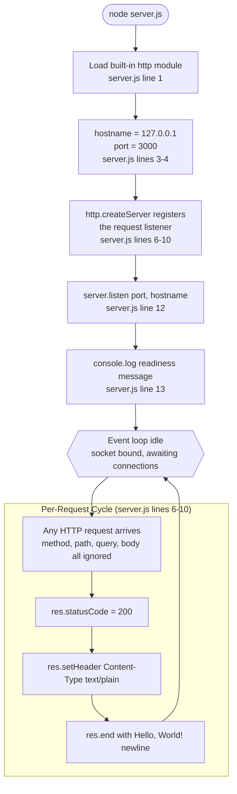
```mermaid
flowchart TD
    Start(["node server.js"]) --> Require["Load built-in http module<br/>server.js line 1"]
    Require --> Consts["hostname = 127.0.0.1<br/>port = 3000<br/>server.js lines 3-4"]
    Consts --> Create["http.createServer registers<br/>the request listener<br/>server.js lines 6-10"]
    Create --> Listen["server.listen port, hostname<br/>server.js line 12"]
    Listen --> Log["console.log readiness message<br/>server.js line 13"]
    Log --> Idle{{"Event loop idle<br/>socket bound, awaiting connections"}}

    subgraph PerRequest["Per-Request Cycle (server.js lines 6-10)"]
        Incoming["Any HTTP request arrives<br/>method, path, query, body all ignored"] --> Status["res.statusCode = 200"]
        Status --> Header["res.setHeader Content-Type text/plain"]
        Header --> Body["res.end with Hello, World! newline"]
    end

    Idle --> Incoming
    Body --> Idle
```

### 1.2.3 Success Criteria

#### 1.2.3.1 Basis for Evaluation

The repository defines **no** success criteria of its own. There are no test files, no test framework configuration, no coverage thresholds, no CI workflow directory, no linter or formatter configuration, no monitoring or SLO definitions, and no acceptance documentation. Any KPI, SLA, latency target, or availability figure attributed to this system would be fabricated.

The criteria below are therefore derived strictly from what the code specifies and what direct execution confirms. They are functional acceptance conditions, not performance or business objectives.

#### 1.2.3.2 Measurable, Code-Verifiable Objectives

| Objective | Verification method | Observed result |
|---|---|---|
| Process starts without error | `node server.js` | Starts and remains in the foreground |
| Listener binds the specified socket | Connect to `http://127.0.0.1:3000/` | Connection accepted |
| Readiness is announced on stdout | Inspect process output | `Server running at http://127.0.0.1:3000/` |
| Status code is 200 | `curl -i http://127.0.0.1:3000/` | `HTTP/1.1 200 OK` |
| Content type is plain text | Inspect response headers | `Content-Type: text/plain` |
| Body is the exact fixed payload | Inspect response body and length | `Hello, World!` with `Content-Length: 14` |
| Response is request-independent | Vary method, path, query, and body | Byte-identical response returned |

#### 1.2.3.3 Critical Success Factors

| Factor | Why it is critical | Consequence if unmet |
|---|---|---|
| A Node.js runtime is installed on the host | The repository ships no runtime and declares no engine range | The program cannot execute at all |
| TCP port `3000` is free on `127.0.0.1` | The port is a hard-coded literal with no fallback | Bind failure raises an unhandled error and the process exits |
| The client runs on the same host | Loopback binding excludes all remote clients | Requests from other hosts cannot reach the listener |
| The process is kept running by its supervisor or shell | There is no restart, daemonization, or shutdown handling in the code | Any crash or terminal close ends availability with no recovery |

#### 1.2.3.4 Key Performance Indicators

No KPIs are defined or instrumented in the repository — there is no metrics library, no timing code, no request counter, and no log aggregation. The only quantitative characteristics that can be reported are static properties of the codebase and its single response:

| Quantitative property | Value | Source |
|---|---|---|
| Response payload size | 14 bytes | Verified `Content-Length` |
| Distinct response variants | 1 | `server.js` lines 6-10 |
| Third-party runtime dependencies | 0 | No `package.json`, no `node_modules` |
| Automated tests and CI quality gates | 0 | No test files, no workflow directory |
| Total source footprint | 342 bytes across 1 executable file | `server.js` |


## 1.3 Scope

Scope below is drawn entirely from what the two files in the repository implement. Nothing is projected from convention, and every out-of-scope item was confirmed absent from the tree rather than assumed.

### 1.3.1 In-Scope

#### 1.3.1.1 Core Features and Functionalities

| Must-have capability | Implementation evidence |
|---|---|
| Create an HTTP/1.1 server using the Node.js standard library | `require('http')` and `http.createServer(…)` (`server.js` lines 1, 6) |
| Bind and listen on a fixed loopback socket | `server.listen(3000, '127.0.0.1', …)` (`server.js` lines 3-4, 12) |
| Return HTTP status `200` for all requests | `res.statusCode = 200` (`server.js` line 7) |
| Declare the response media type | `res.setHeader('Content-Type', 'text/plain')` (`server.js` line 8) |
| Emit the fixed greeting payload and close the response | `res.end('Hello, World!\n')` (`server.js` line 9) |
| Report readiness on standard output | `console.log(\`Server running at http://${hostname}:${port}/\`)` (`server.js` line 13) |
| Identify the project in documentation | The heading `# Hello_world_26_Aug_01` (`README.md`) |

#### 1.3.1.2 Primary User Workflow

Exactly one workflow exists, and it has no variants or branches:

1. An operator runs `node server.js` on the host.
2. The process binds `127.0.0.1:3000` and prints `Server running at http://127.0.0.1:3000/`.
3. A client on that host issues any HTTP request to the listener.
4. The server answers `200` / `text/plain` / `Hello, World!\n`, regardless of the request's method, path, query string, headers, or body.
5. The connection is kept alive per the `http` module's defaults; step 3 may repeat indefinitely.
6. The operator terminates the process to stop the service.

There is no second endpoint, no administrative path, no configuration step, and no build or install step preceding step 1.

#### 1.3.1.3 Essential Integrations

| Integration | Type | Status |
|---|---|---|
| Node.js built-in `http` module | Standard-library API | In scope — the only import in the codebase |
| Node.js `console` (stdout) | Standard-library global | In scope — used once for the readiness line |
| Any third-party package, service, or datastore | External dependency | Not present — no manifest, lockfile, or `node_modules` exists |

#### 1.3.1.4 Key Technical Requirements

- A Node.js runtime capable of executing CommonJS and providing the `http` module must be installed on the host; the repository declares no version range because it contains no `package.json`.
- TCP port `3000` must be available on the loopback interface; the value is a source literal with no fallback logic.
- No dependency installation, compilation, transpilation, or bundling step is required or possible — `node server.js` is the complete execution contract.
- The process must be run in an environment that permits binding a listening socket and writing to stdout.

#### 1.3.1.5 Implementation Boundaries

| Boundary dimension | Defined limit |
|---|---|
| System boundary | The single OS process and its one listening socket on `127.0.0.1:3000`; nothing crosses it outbound |
| Interface boundary | HTTP/1.1 request-response only; no CLI arguments, no library exports, no IPC, no filesystem interface |
| User groups covered | Any HTTP client on the same host — no roles, tenants, accounts, or permission tiers exist in the code |
| Geographic / market coverage | None. Loopback binding confines reachability to the local machine; there is no region, locale, or market configuration |
| Data domains included | None persisted. The only data the system produces is one constant plain-text string; no request data is read, stored, or transformed |
| Environments covered | Whatever host the process is started on; no environment-specific configuration or deployment target is defined in the repository |

### 1.3.2 Out-of-Scope

#### 1.3.2.1 Explicitly Excluded Capabilities

Each item below was verified as absent from `server.js`, `README.md`, and the repository tree.

| Excluded capability | Confirming evidence |
|---|---|
| Request routing, multiple endpoints, method dispatch | The `req` argument is never inspected (`server.js` lines 6-10) |
| Request validation, query/body parsing, content negotiation | No parsing or header-reading code exists |
| HTTPS/TLS termination | `http` is imported; `https`, `tls`, and certificate material are absent |
| Authentication, authorization, sessions, API keys | No credential handling of any kind exists |
| Data persistence, ORM, schemas, migrations, caching | No database driver, model, or storage code exists |
| Structured logging, metrics, tracing, health endpoints | Only a single `console.log` at startup exists |
| Error handling, graceful shutdown, restart policy | No `'error'` listener and no `SIGTERM`/`SIGINT` handlers are registered |
| Externalized configuration (env vars, flags, config files) | Host and port are source literals; no `.env` or config file exists |
| Static file serving, templating, any user interface | No assets, views, or client-side code exist |
| Rate limiting, CORS, security headers, input sanitization | No middleware or header policy code exists |
| Horizontal scaling, clustering, worker threads | No `cluster` or `worker_threads` usage exists |
| Internationalization or localization | The response is a single hard-coded English string |
| Automated tests, linting, type checking | No test files and no ESLint/Prettier/TypeScript configuration exist |
| Dependency management and reproducible installs | No `package.json` and no lockfile exist |
| Containerization, orchestration, CI/CD pipelines | No Dockerfile, compose file, manifest, or workflow directory exists |
| Licensing and contribution governance | No `LICENSE`, `CONTRIBUTING`, or `CODEOWNERS` file exists |

#### 1.3.2.2 Future Phase Considerations

The repository contains no roadmap, backlog, milestone file, or `TODO`/`FIXME` marker, so no planned future work is documented. The absent capabilities in 1.3.2.1 are simply not built; treating any of them as a committed next phase would go beyond the evidence. The architecture does leave the natural extension points open — a dependency manifest, environment-driven configuration, request routing, and a deployment definition would each be additive rather than a rewrite — but the repository asserts no intent to add them.

#### 1.3.2.3 Integration Points Not Covered

No integration is in scope beyond the inbound loopback listener. Specifically not covered: reverse proxies, load balancers, service meshes and service discovery, API gateways, identity providers, databases and object stores, message brokers and event streams, caches, email/SMS/notification providers, payment or analytics vendors, secret managers, and log or metric backends. The codebase makes no outbound network call of any kind.

#### 1.3.2.4 Unsupported Use Cases

| Use case | Why it is unsupported |
|---|---|
| Serving remote or internet clients | The listener is bound to `127.0.0.1`, so no non-local client can connect |
| Running multiple instances on one host | The hard-coded port `3000` collides, and the resulting bind error is unhandled |
| Deploying to a container or cluster without changes | Loopback binding is unreachable from outside the container; no image or manifest exists |
| Serving any content other than the fixed greeting | The response body is a literal with no branching |
| Being consumed as a reusable module | `server.js` exports nothing and starts a listener as a side effect of loading |
| Production operation under an availability or compliance obligation | No error handling, observability, security controls, tests, or deployment automation exist |


## 1.4 References

### 1.4.1 Repository Files Examined

- `server.js` - The complete implementation, read in full (14 lines). Established the CommonJS `require('http')` import (line 1), the hard-coded `hostname = '127.0.0.1'` and `port = 3000` constants (lines 3-4), the `http.createServer` request listener that sets status `200`, sets `Content-Type: text/plain`, and ends every response with `Hello, World!\n` without inspecting `req` (lines 6-10), and the `server.listen` call with its stdout readiness message (lines 12-14). Also established the absence of exports, classes, named functions, error handlers, and signal handlers.
- `README.md` - Read in full. Established the project identity `Hello_world_26_Aug_01` from its single 23-character heading line, and the absence of any purpose statement, prerequisites, run/build/test instructions, API documentation, or license text.

### 1.4.2 Repository Folders Examined

- Repository root (`""`) - Enumerated via folder listing and via a full recursive filesystem walk including hidden entries. Established that the only children are `server.js`, `README.md`, and `.git`; that there are no source, test, configuration, or asset subdirectories; and that the tracked payload totals 365 bytes across exactly two files.

### 1.4.3 Verified Absences Underpinning Scope Claims

The following were confirmed missing from the repository and are the basis for the corresponding limitation, boundary, and out-of-scope statements in sub-sections 1.2 and 1.3:

| Absent artifact class | Statements it supports |
|---|---|
| `package.json`, lockfile, `node_modules` | Zero third-party dependencies; no declared engine, version, or license; no install step |
| Test files, test/coverage configuration | No automated verification; no KPI or quality gate |
| CI workflow directory, Dockerfile, compose or cluster manifests | No CI/CD, containerization, or deployment definition |
| ESLint / Prettier / TypeScript configuration | No static analysis or type checking |
| `.env`, config directory, settings files | No externalized configuration; host and port are source literals |
| Database, ORM, migration, or schema artifacts | No persistence layer and no data domains |
| `LICENSE`, `CONTRIBUTING`, `CODEOWNERS` | No governance, ownership, or named stakeholders |
| `src/`, `lib/`, `public/`, `client/` directories | Single-file implementation at the repository root |

### 1.4.4 Runtime and Provenance Evidence

- Direct execution of `node server.js` in the repository checkout - Confirmed the startup line `Server running at http://127.0.0.1:3000/`, and confirmed that `GET /` and `POST /any/path?q=1` with a request body both return byte-identical `HTTP/1.1 200 OK`, `Content-Type: text/plain`, `Content-Length: 14`, `Hello, World!` responses, proving method-, path-, query-, and body-independent behavior. Also confirmed that `Date`, `Connection`, `Keep-Alive`, and `Content-Length` originate from the Node.js `http` module rather than application code.
- Git repository metadata - Established provenance used in sub-sections 1.1.1 and 1.2.1: two commits, `e511e05` "Initial commit" and `5925dae` "Add files via upload", both dated 2026-08-26; branches `main` and `2608_01`; remote origin `github.com/lakshya-blitzy/Hello_world_26_Aug_01`. Established that the project is not a replacement or migration of any prior system.

### 1.4.5 Cross-References and External Sources

- No other Technical Specification sections were available for cross-reference; the supplied list of relevant sections was empty, so this section was written solely from repository evidence.
- No external or web sources were used. All factual claims in sub-sections 1.1 through 1.3 derive from the files, folder listing, execution behavior, and git metadata cited above.


# 2. Product Requirements

## 2.1 Feature Catalog

The repository contains no requirements document, backlog, issue reference, or design note. Every feature below was therefore reverse-engineered from the two version-controlled files — `server.js` (342 bytes, 14 code lines) and `README.md` (23 bytes, 1 line) — and from direct execution of the program. No feature is projected from convention, and no roadmap item is included, because none is documented anywhere in the tree.

Because the codebase is a single completed artifact rather than work in progress, every feature carries the status **Completed**: each is fully implemented in the committed source and was confirmed by running the process and probing it. There is no partially built, feature-flagged, or commented-out capability in the file.

### 2.1.1 Catalog Overview

| ID | Feature Name | Category |
|---|---|---|
| F-001 | HTTP Listener Bootstrap and Loopback Binding | Runtime & Networking |
| F-002 | Request-Independent Request Handling | HTTP Request Processing |
| F-003 | Fixed Plain-Text Response Contract | HTTP Response Contract |
| F-004 | Startup Readiness Logging | Operability & Observability |
| F-005 | Zero-Dependency, Zero-Build Execution Model | Build & Distribution |
| F-006 | Project Identification Documentation | Documentation |

| ID | Priority | Status | Primary Evidence |
|---|---|---|---|
| F-001 | Critical | Completed | `server.js` lines 1, 3-4, 6, 12 |
| F-002 | Critical | Completed | `server.js` lines 6-10 |
| F-003 | Critical | Completed | `server.js` lines 7-9 |
| F-004 | Medium | Completed | `server.js` lines 12-13 |
| F-005 | High | Completed | `server.js` line 1; absence of any manifest or lockfile |
| F-006 | Low | Completed | `README.md` |

Priority is assigned by whether the system can fulfil its single observed workflow without the feature: F-001, F-002, and F-003 are jointly indispensable (remove any one and no HTTP response is produced), F-005 is the property that makes the artifact usable with one command, F-004 is a convenience signal, and F-006 carries no runtime effect at all.

### 2.1.2 F-001 — HTTP Listener Bootstrap and Loopback Binding

| Metadata Field | Value |
|---|---|
| Unique ID | F-001 |
| Feature Name | HTTP Listener Bootstrap and Loopback Binding |
| Feature Category | Runtime & Networking |
| Priority Level | Critical |
| Status | Completed |

**Overview.** The feature acquires HTTP capability from the Node.js standard library, fixes the network identity of the process as two module-scoped constants, constructs an `http.Server` instance with a request listener already attached, and binds that instance to a TCP socket. `server.js` line 1 performs the CommonJS import; lines 3-4 declare `hostname = '127.0.0.1'` and `port = 3000`; line 6 creates the server; line 12 calls `server.listen(port, hostname, …)`. The bound socket is what keeps the event loop referenced, so this feature is also what makes the process long-running rather than exiting immediately after evaluation.

**Business value.** Establishes that a Node.js runtime on the host can execute code and claim a listening socket. This is the entire deliverable of a runtime-validation artifact: a reachable endpoint proves the runtime, the host permissions, and the local network path all work before heavier software is introduced.

**User benefits.** For the developer/operator role, one command produces a live, addressable endpoint at a predictable URL with no preparatory configuration step. Because the address and port are literals rather than derived values, the operator knows the exact URL before starting the process.

**Technical context.** Construction and binding both happen as side effects of module evaluation — there is no `main()` guard, no deferred start, and no export, so loading the file is inseparable from starting the listener. `127.0.0.1` restricts acceptance to connections originating on the same host. No `'error'` listener is registered on the server object, which was confirmed empirically: attempting a second concurrent bind raised an unhandled `'error'` event (`Error: listen EADDRINUSE: address already in use 127.0.0.1:3000`, `errno -98`) and terminated the process.

| Dependency Type | Detail |
|---|---|
| Prerequisite features | F-005 (the stdlib-only, install-free execution model that makes `node server.js` sufficient) |
| System dependencies | A Node.js runtime providing CommonJS `require` and the `http` module; an OS permitting a listening socket on the loopback interface |
| External dependencies | None — no third-party package is imported or installed |
| Integration requirements | TCP port `3000` must be free on `127.0.0.1`; no reverse proxy, service registry, or discovery registration is performed by the code |

### 2.1.3 F-002 — Request-Independent Request Handling

| Metadata Field | Value |
|---|---|
| Unique ID | F-002 |
| Feature Name | Request-Independent Request Handling |
| Feature Category | HTTP Request Processing |
| Priority Level | Critical |
| Status | Completed |

**Overview.** A single inline arrow function registered with `http.createServer` (`server.js` lines 6-10) handles every inbound request. It receives Node's request and response objects, never reads the request object, and completes the response synchronously within the same invocation. There is no router, no method dispatch table, no middleware chain, and no conditional branch of any kind inside the callback.

**Business value.** Absolute predictability. A handler with no input dependency and no branching cannot produce a variable outcome, which is precisely what makes the process usable as a fixed probe for verifying connectivity and runtime health.

**User benefits.** A client needs no knowledge of the API surface — any URL, any verb, and any payload elicits a successful answer. This removes the possibility of a client-side mistake (wrong path, wrong method) producing a confusing failure during environment verification.

**Technical context.** The `req` parameter is declared in the signature but never referenced in the body, so no request line, header, query string, or body is parsed. Handling is fully synchronous: no `async`/`await`, promise, timer, or I/O call appears between callback entry and `res.end()`. Empirical probing confirmed uniform invocation — `GET /`, `POST /any/path?q=1` with a form body and a custom header, `HEAD /`, and `DELETE /zzz` were all served identically.

| Dependency Type | Detail |
|---|---|
| Prerequisite features | F-001 (the listener must be constructed and bound before the callback can ever fire) |
| System dependencies | The Node.js `http` module's request parser and its single-threaded event loop, which invokes the callback per request |
| External dependencies | None — no validation library, body parser, router, or framework is present |
| Integration requirements | Client must speak HTTP/1.1 over the bound TCP socket; no other invocation path exists (no CLI interface, no library export, no IPC) |

### 2.1.4 F-003 — Fixed Plain-Text Response Contract

| Metadata Field | Value |
|---|---|
| Unique ID | F-003 |
| Feature Name | Fixed Plain-Text Response Contract |
| Feature Category | HTTP Response Contract |
| Priority Level | Critical |
| Status | Completed |

**Overview.** Three consecutive statements define the complete response contract: `res.statusCode = 200` (line 7), `res.setHeader('Content-Type', 'text/plain')` (line 8), and `res.end('Hello, World!\n')` (line 9). The payload is a string literal, so the response is a compile-time constant of the program rather than a computed value.

**Business value.** A byte-stable response is the reference output that makes the artifact a usable baseline: any deviation observed by a client is attributable to the environment (proxy, network, runtime) and never to the application.

**User benefits.** The client receives an unambiguous success signal — a `200`, a media type it can render as text without negotiation, and a short human-readable body that is meaningful when viewed in a browser, a terminal, or a log.

**Technical context.** Only the status code and one response header are set by application code; `Date`, `Connection`, `Keep-Alive`, and `Content-Length` are supplied by the Node.js `http` module. Observed responses carried `Content-Length: 14`, matching the 13 characters of `Hello, World!` plus the trailing newline. `Content-Type` is set without a `charset` parameter. Because `res.end()` is called unconditionally with a complete body, the response is never streamed, chunked, or left open.

| Dependency Type | Detail |
|---|---|
| Prerequisite features | F-002 (the `res` object the contract is written to exists only inside the request callback) |
| System dependencies | Node.js `http.ServerResponse` API for status assignment, header setting, and response termination |
| External dependencies | None — no template engine, serializer, or content-negotiation library |
| Integration requirements | Consuming clients must tolerate `text/plain` without charset and a trailing newline in the body; no schema, version header, or content negotiation is offered |

### 2.1.5 F-004 — Startup Readiness Logging

| Metadata Field | Value |
|---|---|
| Unique ID | F-004 |
| Feature Name | Startup Readiness Logging |
| Feature Category | Operability & Observability |
| Priority Level | Medium |
| Status | Completed |

**Overview.** The callback passed to `server.listen` (`server.js` lines 12-13) writes exactly one line to standard output once the socket is bound: `Server running at http://127.0.0.1:3000/`. The message is built with a template literal that interpolates the same `hostname` and `port` constants used for the bind.

**Business value.** Converts an otherwise silent background process into one whose readiness is observable, which is the minimum needed for an operator to know that the artifact is serving rather than merely started.

**User benefits.** The operator receives a copy-pasteable URL at the exact moment the endpoint becomes usable, removing any need to guess the address or poll the port.

**Technical context.** This is the only instrumentation in the codebase: there is no request log, no metrics counter, no structured logger, no log level, and no error output path. Because the message interpolates the binding constants rather than restating them as text, the logged URL cannot drift from the socket actually bound — a single-source-of-truth property that survives any future change to lines 3-4. The message is emitted only on the success path; a bind failure produces an unhandled-error stack trace instead, as observed with `EADDRINUSE`.

| Dependency Type | Detail |
|---|---|
| Prerequisite features | F-001 — the listen callback is invoked only after a successful bind, so the log line doubles as proof that F-001 succeeded |
| System dependencies | Node.js `console.log` writing to the process stdout stream |
| External dependencies | None — no logging library, transport, or aggregator |
| Integration requirements | An attached or captured stdout stream. No log file, syslog target, or collector is configured by the code |

### 2.1.6 F-005 — Zero-Dependency, Zero-Build Execution Model

| Metadata Field | Value |
|---|---|
| Unique ID | F-005 |
| Feature Name | Zero-Dependency, Zero-Build Execution Model |
| Feature Category | Build & Distribution |
| Priority Level | High |
| Status | Completed |

**Overview.** The complete execution contract is `node server.js`. This is a property established as much by what the repository omits as by what it contains: a repository-wide check confirmed the absence of `package.json`, `package-lock.json`, `yarn.lock`, `pnpm-lock.yaml`, `node_modules`, `tsconfig.json`, `Makefile`, and any CI, container, or linter configuration, while a grep across all `.js` and `.md` files found exactly one `require(` call — the built-in `http` module on line 1.

**Business value.** Eliminates dependency-resolution and build failure as a category of risk. There is no install step to fail, no lockfile to conflict, no transitive package to audit, and no toolchain version to reconcile — which is what allows the artifact to serve as a trustworthy control when diagnosing an environment.

**User benefits.** The developer clones and runs; time-to-first-response is bounded only by process start. Nothing is downloaded, so the artifact runs identically on a network-isolated host.

**Technical context.** CommonJS is used directly with no module-system configuration, so no `"type"` field is needed. The file defines no classes, no named standalone functions, and no `module.exports`, meaning it cannot be imported as a library and is meaningful only as a process entry point. The counterpart cost is that the repository declares no name, version, license, or supported engine range, so there is no programmatic reproducibility guarantee; the environment used for verification supplied Node.js v22.23.2, which is an environment fact and not a repository-declared constraint.

| Dependency Type | Detail |
|---|---|
| Prerequisite features | None — this is the base-layer property that F-001 relies on |
| System dependencies | A Node.js binary on the host PATH capable of executing CommonJS |
| External dependencies | None by design; zero third-party runtime or development packages are declared or installed |
| Integration requirements | No package registry, build agent, artifact store, or container registry participates in running the program |

### 2.1.7 F-006 — Project Identification Documentation

| Metadata Field | Value |
|---|---|
| Unique ID | F-006 |
| Feature Name | Project Identification Documentation |
| Feature Category | Documentation |
| Priority Level | Low |
| Status | Completed |

**Overview.** `README.md` contains a single level-one markdown heading, `# Hello_world_26_Aug_01`, and nothing else — no description, prerequisites, run instructions, API notes, license, or contributor information.

**Business value.** Provides the repository's only human-readable identity. Given the absence of a `package.json`, this heading is the sole in-repository declaration of what the project is called.

**User benefits.** A reader browsing the repository sees a rendered title identifying the artifact. The benefit stops there: the file offers no guidance on running or extending the program, so the operator must infer the entry point from the file listing.

**Technical context.** The file has no runtime role. No code reads it, no build step consumes it, and no badge, link, or directive is present. Its dated name corroborates the artifact's nature as a single-sitting exercise, consistent with the two-commit git history (`e511e05` "Initial commit", `5925dae` "Add files via upload").

| Dependency Type | Detail |
|---|---|
| Prerequisite features | None — fully independent of all runtime features |
| System dependencies | A markdown renderer for display purposes only; none is required for the program to run |
| External dependencies | None |
| Integration requirements | None. No documentation site generator, wiki sync, or publishing pipeline consumes this file |


## 2.2 Functional Requirements

Seventeen requirements are specified across the six features. Each is stated so that it can be verified either by static inspection of `server.js` / `README.md` or by executing the process and observing the result — the two verification methods actually available, since the repository contains no test suite, no test framework configuration, and no CI quality gate.

Two conventions apply throughout. First, **performance criteria** are reported only where a value was measured or is fixed by the source; the repository defines no latency budget, throughput target, or availability objective anywhere, so no such figure is asserted. Second, **compliance requirements** are recorded as "none applicable" wherever no control exists, rather than being inferred from what a production service would normally carry.

### 2.2.1 F-001 — HTTP Listener Bootstrap and Loopback Binding

#### 2.2.1.1 Requirement Details

| Requirement ID | Description | Priority | Complexity |
|---|---|---|---|
| F-001-RQ-001 | Acquire HTTP server capability from the Node.js standard library via a CommonJS `require` of the built-in `http` module | Must-Have | Low |
| F-001-RQ-002 | Declare the bind address and port as module-scoped constants with the literal values `127.0.0.1` and `3000` | Must-Have | Low |
| F-001-RQ-003 | Construct an `http.Server` instance at module evaluation time with the request listener already attached | Must-Have | Low |
| F-001-RQ-004 | Bind the constructed server to the configured host and port and keep the process resident while the socket is open | Must-Have | Low |

| Requirement ID | Acceptance Criteria |
|---|---|
| F-001-RQ-001 | `server.js` line 1 reads `const http = require('http');`, and a repository-wide grep for `require(` returns this single occurrence with the argument `'http'` |
| F-001-RQ-002 | `server.js` lines 3-4 assign the string `'127.0.0.1'` and the number `3000`; a grep for `process.env` and `process.argv` returns no match, proving the values cannot be overridden at runtime |
| F-001-RQ-003 | `server.js` line 6 assigns the result of `http.createServer(callback)` to `server`; `node --check server.js` reports no syntax error |
| F-001-RQ-004 | After `node server.js`, a TCP connection to `127.0.0.1:3000` is accepted and the process remains in the foreground; the same connection attempt fails before the process is started |

#### 2.2.1.2 Technical Specifications

| Aspect | Specification |
|---|---|
| Input parameters | None accepted from any external source. No CLI arguments, environment variables, config file, or stdin input is read; the only inputs are the two source literals on lines 3-4 |
| Output / response | A bound TCP listening socket on `127.0.0.1:3000` and a resident OS process. No return value or exported handle is produced (`server` is module-private) |
| Performance criteria | Startup is a single synchronous evaluation followed by one `listen` syscall; no measurable initialization work occurs (no dependency loading beyond one built-in module, no file or network I/O). The repository specifies no startup-time target |
| Data requirements | Two constants totalling one IPv4 loopback literal and one port integer. No persistent, cached, or in-memory state is created |

#### 2.2.1.3 Validation Rules

| Rule Category | Rule |
|---|---|
| Business rules | Exactly one listener on exactly one socket per process. Because the port is a literal with no fallback, a second concurrent instance on the same host is invalid by construction |
| Data validation | None performed. The host and port literals are never validated at runtime; correctness is guaranteed only by the fact that they are compile-time constants in the source |
| Security requirements | Binding to `127.0.0.1` is the sole access control in the system — it restricts acceptance to same-host clients. No TLS, credential, allow-list, or firewall rule is configured in code |
| Compliance requirements | None applicable. No certificate, cipher policy, port-registration standard, or audit obligation is referenced in the repository |

### 2.2.2 F-002 — Request-Independent Request Handling

#### 2.2.2.1 Requirement Details

| Requirement ID | Description | Priority | Complexity |
|---|---|---|---|
| F-002-RQ-001 | Invoke the registered request listener for every inbound HTTP request, irrespective of method, path, query string, headers, or body | Must-Have | Low |
| F-002-RQ-002 | Read no attribute of the request object — perform no routing, method dispatch, URL/query parsing, header inspection, or body consumption | Must-Have | Low |
| F-002-RQ-003 | Terminate each response synchronously within the same callback invocation, leaving no pending asynchronous work | Must-Have | Low |

| Requirement ID | Acceptance Criteria |
|---|---|
| F-002-RQ-001 | Probes with `GET /`, `POST /any/path?q=1` (form body plus a custom header), `HEAD /`, and `DELETE /zzz` each return an HTTP `200` — verified |
| F-002-RQ-002 | The `req` parameter declared on `server.js` line 6 appears nowhere in the callback body (lines 7-9); no `req.url`, `req.method`, or `req.headers` reference exists in the file |
| F-002-RQ-003 | `res.end()` is called unconditionally on line 9, the last statement of the callback; the file contains no `async`, `await`, `Promise`, `setTimeout`, or callback-based I/O |

#### 2.2.2.2 Technical Specifications

| Aspect | Specification |
|---|---|
| Input parameters | `req` (`http.IncomingMessage`) and `res` (`http.ServerResponse`), supplied by the Node.js `http` module. `req` is accepted but unused; `res` is the only parameter acted upon |
| Output / response | Invocation of the three response statements of F-003 against the supplied `res`. The callback itself returns `undefined` |
| Performance criteria | Three synchronous property/method operations per request with no I/O wait, so per-request work is constant and independent of request size or shape. Concurrency is bounded by the single-threaded event loop; the repository states no throughput or latency target |
| Data requirements | None. No request data is read, buffered, transformed, or persisted, and no state carries across invocations — the handler is stateless by construction |

#### 2.2.2.3 Validation Rules

| Rule Category | Rule |
|---|---|
| Business rules | One code path only: every request is treated as valid and answered successfully. There is no rejection, redirect, or error branch |
| Data validation | Deliberately absent — with no request attribute read, there is nothing to validate. No schema, parser, sanitizer, or size limit is defined in application code |
| Security requirements | No authentication, authorization, session, CORS policy, rate limit, or security header is applied. Request bodies are never parsed, which removes injection and deserialization attack surface but also means malformed input is silently ignored rather than rejected |
| Compliance requirements | None applicable. Since no request data — including client IP, headers, or body — is read, stored, or logged, the handler processes no personal data and creates no retention obligation |

### 2.2.3 F-003 — Fixed Plain-Text Response Contract

#### 2.2.3.1 Requirement Details

| Requirement ID | Description | Priority | Complexity |
|---|---|---|---|
| F-003-RQ-001 | Set the HTTP response status code to `200` for every response | Must-Have | Low |
| F-003-RQ-002 | Set the `Content-Type` response header to `text/plain` with no charset parameter | Must-Have | Low |
| F-003-RQ-003 | End the response with the exact body `Hello, World!` followed by a single newline | Must-Have | Low |
| F-003-RQ-004 | Emit a byte-identical response for any two requests, regardless of how those requests differ | Must-Have | Low |

| Requirement ID | Acceptance Criteria |
|---|---|
| F-003-RQ-001 | `server.js` line 7 assigns `res.statusCode = 200`; observed status line is `HTTP/1.1 200 OK` on every probe |
| F-003-RQ-002 | `server.js` line 8 calls `res.setHeader('Content-Type', 'text/plain')`; the observed header value is exactly `text/plain` |
| F-003-RQ-003 | `server.js` line 9 passes the literal `'Hello, World!\n'` to `res.end()`; observed `Content-Length: 14` matches the 14-byte payload |
| F-003-RQ-004 | Status line, `Content-Type`, `Content-Length`, and body are identical across the `GET`, `POST`, `HEAD`, and `DELETE` probes; only the module-generated `Date` header varies |

#### 2.2.3.2 Technical Specifications

| Aspect | Specification |
|---|---|
| Input parameters | The `res` object from the enclosing callback. No other input contributes to the response — the status, header value, and body are all source literals |
| Output / response | `HTTP/1.1 200 OK` with `Content-Type: text/plain`, `Content-Length: 14`, and the body `Hello, World!\n`. `Date`, `Connection`, and `Keep-Alive` are added by the Node.js `http` module, not by application code; the observed `Keep-Alive: timeout=5` is a module default |
| Performance criteria | Fixed 14-byte payload with no serialization, template rendering, or compression step, so response size is invariant and never negotiated. No latency target is specified in the repository |
| Data requirements | A single 14-byte immutable string literal. No data source, schema, encoding declaration, or transformation is involved |

#### 2.2.3.3 Validation Rules

| Rule Category | Rule |
|---|---|
| Business rules | The response triple (status, media type, body) is invariant. Success is the only representable outcome; there is no `4xx` or `5xx` path anywhere in the file |
| Data validation | Not applicable to output — the payload is a compile-time constant and therefore cannot be malformed at runtime. No output schema or contract test exists to enforce it |
| Security requirements | The body contains no user-supplied or sensitive data, so no output encoding or escaping is required. No security response header (`Strict-Transport-Security`, `X-Content-Type-Options`, `Content-Security-Policy`) is set, and the absence of a charset parameter leaves character-set interpretation to the client |
| Compliance requirements | None applicable. The response discloses no data subject to privacy, retention, or disclosure obligations, and no accessibility or localization standard applies to a fixed ASCII string |

### 2.2.4 F-004 — Startup Readiness Logging

#### 2.2.4.1 Requirement Details

| Requirement ID | Description | Priority | Complexity |
|---|---|---|---|
| F-004-RQ-001 | On successful bind, write exactly one readiness line to standard output stating the served URL | Should-Have | Low |
| F-004-RQ-002 | Derive the logged URL from the same constants used to bind the socket, so the message cannot diverge from the actual listener | Should-Have | Low |

| Requirement ID | Acceptance Criteria |
|---|---|
| F-004-RQ-001 | Running `node server.js` prints `Server running at http://127.0.0.1:3000/` and nothing further; the line appears once per successful start |
| F-004-RQ-002 | `server.js` line 13 uses a template literal interpolating `${hostname}` and `${port}` — the identical constants passed to `server.listen` on line 12 — rather than a restated string |

#### 2.2.4.2 Technical Specifications

| Aspect | Specification |
|---|---|
| Input parameters | The `hostname` and `port` constants (lines 3-4). The listen callback itself takes no parameters and receives no bind result object |
| Output / response | One newline-terminated line on stdout: `Server running at http://127.0.0.1:3000/`. Nothing is written to stderr by application code |
| Performance criteria | A single synchronous `console.log` executed once per process lifetime, so logging contributes no per-request overhead. No log volume or emission-latency target is defined |
| Data requirements | No log file, rotation policy, retention period, structured format, or log level is defined. Output is ephemeral and exists only in the attached stdout stream |

#### 2.2.4.3 Validation Rules

|| Rule Category | Rule |
|---|---|
| Business rules | The line is emitted only on the success path. It therefore functions as a positive readiness assertion — its absence is the operator's signal that binding did not complete |
| Data validation | None. The interpolated values are trusted constants and no formatting or escaping is applied |
| Security requirements | The message contains no credential, token, or request data, so stdout exposure carries no disclosure risk. Conversely, no audit or access log is produced, so requests leave no trace whatsoever |
| Compliance requirements | None applicable. No audit-logging, tamper-evidence, or log-retention obligation is referenced in the repository |

### 2.2.5 F-005 — Zero-Dependency, Zero-Build Execution Model

#### 2.2.5.1 Requirement Details

| Requirement ID | Description | Priority | Complexity |
|---|---|---|---|
| F-005-RQ-001 | Execute from a fresh clone with the single command `node server.js`, requiring no install, build, transpile, or bundle step | Must-Have | Low |
| F-005-RQ-002 | Declare and consume zero third-party runtime or development dependencies | Must-Have | Low |
| F-005-RQ-003 | Expose no public export; the module functions solely as a process entry point | Should-Have | Low |

| Requirement ID | Acceptance Criteria |
|---|---|
| F-005-RQ-001 | The repository root contains no `package.json`, `package-lock.json`, `yarn.lock`, `pnpm-lock.yaml`, `node_modules`, `Makefile`, `tsconfig.json`, or CI workflow directory — each individually confirmed absent; `node server.js` starts successfully with no preceding command |
| F-005-RQ-002 | The only `require` in the codebase resolves to the built-in `http` module (`server.js` line 1); `git ls-files` lists exactly two files, neither of them a manifest |
| F-005-RQ-003 | A grep for `module.exports` and `exports.` across all files returns no match; the file defines no class and no named standalone function |

#### 2.2.5.2 Technical Specifications

| Aspect | Specification |
|---|---|
| Input parameters | The single command-line invocation `node server.js`. No flags, subcommands, or npm scripts are defined |
| Output / response | A running process (see F-001) plus the readiness line (see F-004). No build artifact, bundle, image, or package is produced |
| Performance criteria | Time-to-first-response is bounded by Node.js process start plus evaluation of 14 lines with one built-in import; no dependency resolution or compilation occurs. The 342-byte source is the entire distribution payload |
| Data requirements | Two version-controlled files totalling 365 bytes. No cache directory, temporary file, lockfile, or generated output is created on disk at any point |

#### 2.2.5.3 Validation Rules

| Rule Category | Rule |
|---|---|
| Business rules | The dependency count must remain zero for the artifact to retain its value as a control baseline; introducing a manifest would change the execution contract from one command to two |
| Data validation | Not applicable — there is no manifest, lockfile, or schema to validate, and consequently no integrity hash or version-range resolution to check |
| Security requirements | Zero third-party code means no supply-chain, transitive-vulnerability, or install-script attack surface. The corresponding weakness is the absence of a declared engine range, so the program will run on any Node.js version present, including an unpatched one |
| Compliance requirements | No `LICENSE` file exists, so the code carries no declared license grant — a licensing gap rather than a satisfied requirement. No SBOM, dependency-scanning, or provenance-attestation process is defined |

### 2.2.6 F-006 — Project Identification Documentation

#### 2.2.6.1 Requirement Details

| Requirement ID | Description | Priority | Complexity |
|---|---|---|---|
| F-006-RQ-001 | Declare the project name in `README.md` as a level-one markdown heading | Could-Have | Low |

| Requirement ID | Acceptance Criteria |
|---|---|
| F-006-RQ-001 | `README.md` consists of exactly one 23-character line, `# Hello_world_26_Aug_01`, and contains no additional heading, paragraph, list, link, or code block |

#### 2.2.6.2 Technical Specifications

| Aspect | Specification |
|---|---|
| Input parameters | None. The file is static content with no front matter, template variable, or include directive |
| Output / response | A rendered level-one heading when viewed in a markdown renderer. No runtime output |
| Performance criteria | Not applicable — the file is never read by the program at any point in its lifecycle |
| Data requirements | 23 bytes of static markdown; no generated, synced, or versioned content beyond the git object itself |

#### 2.2.6.3 Validation Rules

| Rule Category | Rule |
|---|---|
| Business rules | The heading is the repository's only identity declaration and must match the project name, since no `package.json` `name` field exists to corroborate it |
| Data validation | None. No markdown linter, link checker, or spell checker is configured |
| Security requirements | No secret, credential, endpoint inventory, or internal hostname is disclosed in the file |
| Compliance requirements | None satisfied. The file carries no license notice, copyright statement, attribution, or contribution policy, and no `LICENSE`, `CONTRIBUTING`, or `CODEOWNERS` file exists elsewhere to supply them |


## 2.3 Feature Relationships

All relationships below are traceable to a specific construct in `server.js`. Because the system is a single 14-line module, dependencies are expressed as lexical and control-flow coupling within one file rather than as calls between modules or services — there is no second module, no interface, and no import graph to describe.

### 2.3.1 Feature Dependency Map

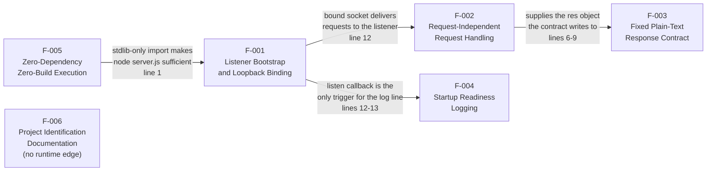
```mermaid
flowchart LR
    F005["F-005<br/>Zero-Dependency<br/>Zero-Build Execution"]
    F001["F-001<br/>Listener Bootstrap<br/>and Loopback Binding"]
    F002["F-002<br/>Request-Independent<br/>Request Handling"]
    F003["F-003<br/>Fixed Plain-Text<br/>Response Contract"]
    F004["F-004<br/>Startup Readiness<br/>Logging"]
    F006["F-006<br/>Project Identification<br/>Documentation<br/>(no runtime edge)"]

    F005 -->|"stdlib-only import makes<br/>node server.js sufficient<br/>line 1"| F001
    F001 -->|"bound socket delivers<br/>requests to the listener<br/>line 12"| F002
    F002 -->|"supplies the res object<br/>the contract writes to<br/>lines 6-9"| F003
    F001 -->|"listen callback is the<br/>only trigger for the log line<br/>lines 12-13"| F004
```

| Dependency Edge | Nature | Evidence |
|---|---|---|
| F-005 → F-001 | Enabling precondition | Line 1 imports only a built-in module, so no install step precedes binding |
| F-001 → F-002 | Hard runtime prerequisite | The listener registered on line 6 can only fire once `server.listen` (line 12) has bound a socket |
| F-002 → F-003 | Lexical containment | Lines 7-9 execute inside the line 6 callback and act on the `res` object it receives |
| F-001 → F-004 | Callback trigger | Line 13 executes only from the completion callback passed to `server.listen` on line 12 |
| F-006 | None | No code path reads `README.md`; the file has no runtime relationship to any feature |

The map is a tree, not a cycle: F-005 is the root property, F-001 the single hinge that both the request path (F-002 → F-003) and the readiness signal (F-004) depend on, and F-006 an isolated documentation node. Consequently a failure in F-001 — as demonstrated by the observed `EADDRINUSE` process termination — suppresses F-002, F-003, and F-004 simultaneously, while no failure mode can affect one of those three without affecting F-001 first.

### 2.3.2 Runtime Sequence and Feature Attribution

The following sequence maps each feature onto the two lifecycle moments the program has: process startup and per-request service. It complements the startup/per-request flowchart in sub-section 1.2.2.3, which shows the same lifecycle at the statement level.

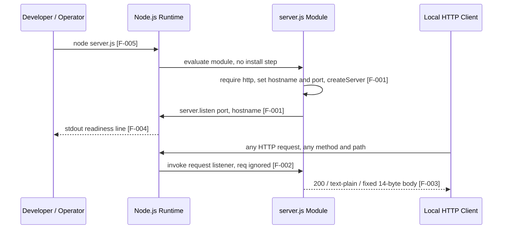
```mermaid
sequenceDiagram
    participant OP as Developer / Operator
    participant NODE as Node.js Runtime
    participant SRV as server.js Module
    participant CLI as Local HTTP Client

    OP->>NODE: node server.js [F-005]
    NODE->>SRV: evaluate module, no install step
    SRV->>SRV: require http, set hostname and port, createServer [F-001]
    SRV->>NODE: server.listen port, hostname [F-001]
    NODE-->>OP: stdout readiness line [F-004]
    CLI->>NODE: any HTTP request, any method and path
    NODE->>SRV: invoke request listener, req ignored [F-002]
    SRV-->>CLI: 200 / text-plain / fixed 14-byte body [F-003]
```

Note the ordering constraint the diagram makes explicit: the readiness line reaches the operator strictly before any request can be served, because both derive from the same `listen` call. An operator who sees the F-004 line has therefore already confirmed F-001, F-005, and the availability of the socket.

### 2.3.3 Integration Points

| Integration Point | Direction | Features Involved |
|---|---|---|
| TCP listening socket on `127.0.0.1:3000` | Inbound | F-001 (binds it), F-002 (consumes requests from it), F-003 (writes responses to it) |
| Process stdout stream | Outbound | F-004 (sole writer) |
| Command-line process invocation | Inbound | F-005 (`node server.js` is the only entry point) |

There is no outbound integration of any kind: the module makes no HTTP client call, opens no database connection, publishes to no queue, and touches no filesystem path. This was confirmed by the single-`require` grep result — an outbound integration would require importing a client or a further built-in module, and no such import exists. The three points above are the complete integration inventory for all six features.

### 2.3.4 Shared Components

| Shared Component | Location | Consuming Features |
|---|---|---|
| `hostname` and `port` constants | `server.js` lines 3-4 | F-001 (bind arguments, line 12), F-004 (log interpolation, line 13) |
| `http` module binding | `server.js` line 1 | F-001 (`createServer`, `listen`), F-002 (listener invocation), F-003 (`ServerResponse` API) |
| `http.ServerResponse` instance (`res`) | Parameter of the line 6 callback | F-002 (receives and terminates it), F-003 (sets status, header, body on it) |
| `server` instance (`http.Server`) | `server.js` line 6 | F-001 (bound on line 12), F-002 (owns the registered listener) |

The `hostname`/`port` pair is the only genuine cross-cutting configuration in the system, and it is shared by reference rather than duplicated — F-004 interpolates the same identifiers F-001 passes to `listen`. That is the one design decision in the file with a maintenance consequence beyond its immediate line: changing either constant automatically updates both the socket and the message, so the two cannot drift apart.

### 2.3.5 Common Services

| Common Service | Provider | Features Relying On It |
|---|---|---|
| HTTP/1.1 protocol handling (parsing, framing, `Date`/`Connection`/`Content-Length` headers, keep-alive) | Node.js built-in `http` module | F-001, F-002, F-003 |
| Console output to stdout | Node.js `console` global | F-004 |
| Single-threaded event loop and socket I/O scheduling | Node.js runtime | F-001 (keeps the process resident), F-002 (dispatches each request) |
| CommonJS module loader | Node.js runtime | F-005 (resolves the one built-in import with no resolution step) |

Every common service is supplied by the Node.js runtime itself; the repository provides none and installs none. This is why the `http` module appears in three of the four rows — it is simultaneously the transport, the framework substitute, and the source of the response headers the application does not set. No shared application-level service exists (no logger abstraction, no configuration loader, no error handler, no health-check service), which is consistent with the absence of any second module in the tree.


## 2.4 Implementation Considerations

Considerations below are derived from the implementation as committed. Where a dimension is genuinely not addressed by the code — scalability being the clearest case — that is stated rather than filled with what a comparable service would normally do.

Two constraints are systemic and therefore apply to every feature, so they are stated once here rather than repeated in each subsection:

| Systemic Constraint | Origin | Consequence |
|---|---|---|
| No automated verification | No test file, test framework config, or CI workflow directory exists | Every acceptance criterion in 2.2 must be checked manually; a regression in any feature would be caught only by a human running the process |
| No unhandled-error containment | No `'error'` listener on the `server` object and no `SIGTERM`/`SIGINT` handler in `server.js` | Any fault in any feature terminates the process; the observed `EADDRINUSE` crash is the demonstrated instance |

### 2.4.1 F-001 — HTTP Listener Bootstrap and Loopback Binding

| Dimension | Consideration |
|---|---|
| Technical constraints | Host and port are source literals (lines 3-4) with no environment-variable, CLI-flag, or config-file override — verified by the absence of any `process.env` or `process.argv` reference. Binding to `127.0.0.1` is unconditional, so the listener is unreachable from another host, container, or pod. Construction and binding are side effects of module evaluation, so the file cannot be loaded without starting a server |
| Performance requirements | None specified in the repository. Startup consists of one built-in import, two constant assignments, one object construction, and one `listen` syscall, so there is no initialization work to optimize |
| Scalability considerations | Not addressed. No `cluster`, `worker_threads`, or process-manager usage exists, so the feature is confined to one process on one core. The hard-coded port makes horizontal scaling on a single host impossible without editing the source — a second instance collides and crashes, as demonstrated |
| Security implications | Loopback binding is the only access control present and is effective for its purpose: no remote client can connect. There is no TLS, so traffic is plaintext (acceptable only because it never leaves the host). A bind failure produces a full stack trace on stderr, disclosing absolute file paths of the runtime internals |
| Maintenance requirements | Changing the bind target means editing lines 3-4 and redeploying the file; there is no runtime reconfiguration path. Anyone operating the process must externally guarantee port `3000` is free, since the code performs no pre-flight check and offers no fallback |

### 2.4.2 F-002 — Request-Independent Request Handling

| Dimension | Consideration |
|---|---|
| Technical constraints | The handler is a single inline anonymous callback with no branch points, so behavior cannot be varied without adding code. The `req` object is unused, which means no request context — not even the method or path — is available to any future logic without first introducing reads. Handling is strictly synchronous; the file contains no `async`, `await`, `Promise`, or timer construct |
| Performance requirements | None specified. Per-request work is three constant-time operations with no I/O wait, so cost is independent of request size, method, or path. Concurrency capacity is whatever the single-threaded event loop provides, with no queue depth, timeout, or backpressure control defined in application code |
| Scalability considerations | Statelessness is inherent — no variable is mutated across invocations — so the handler itself would parallelize cleanly. The limiting factor is entirely F-001's single-process, fixed-port binding, not this feature |
| Security implications | Never parsing a request body eliminates deserialization, injection, and parser-exploit surface at the application layer. The trade-off is that nothing is rejected: there is no size limit, rate limit, method allow-list, or CORS policy, so the process will accept and answer unlimited requests from any local client, and resistance to malformed input rests entirely on the Node.js `http` parser |
| Maintenance requirements | Adding any second behavior requires introducing the first conditional into the callback and, at that point, a routing decision the codebase has deliberately deferred. Since the callback is inline and unnamed, it cannot be unit-tested in isolation without first extracting it to a named function or export |

### 2.4.3 F-003 — Fixed Plain-Text Response Contract

| Dimension | Consideration |
|---|---|
| Technical constraints | Status, media type, and body are three literals on consecutive lines; the payload cannot be varied, templated, or negotiated. Only one response header is set by application code — `Date`, `Connection`, `Keep-Alive`, and `Content-Length` come from the `http` module and are outside application control. `Content-Type` carries no `charset` parameter |
| Performance requirements | None specified. The 14-byte payload requires no serialization, template rendering, or compression, and `Content-Length` is computed by the module from the literal, so response construction cost is constant |
| Scalability considerations | Nothing to scale: the response is a constant, so there is no cache to size, no payload growth path, and no data source that could become a bottleneck |
| Security implications | The body contains no user-supplied or sensitive data, so no output escaping is needed. No security response headers are emitted (`X-Content-Type-Options`, `Strict-Transport-Security`, `Content-Security-Policy` are all absent), and the missing charset parameter leaves character-set interpretation to the client — both are latent concerns only if the payload ever becomes dynamic |
| Maintenance requirements | Any change to the greeting, status, or media type is a single-line edit with no schema, client contract, or consumer version to coordinate — but equally, no contract test exists to detect an unintended change. The 14-byte `Content-Length` is an emergent property, so a body edit silently changes it |

### 2.4.4 F-004 — Startup Readiness Logging

| Dimension | Consideration |
|---|---|
| Technical constraints | One unstructured `console.log` on the success path only. There is no log level, no timestamp, no correlation ID, no JSON structure, and no stderr path in application code. Because the message is emitted from the `listen` callback, it cannot report a failed bind |
| Performance requirements | None specified. A single synchronous write executed once per process lifetime adds no per-request overhead |
| Scalability considerations | Not applicable at one line per process. There is no log volume to manage, but equally no aggregation target, so output from multiple hosts could not be correlated |
| Security implications | The message discloses only the bind address and port and contains no credential or request data. The material exposure is the inverse: with no request logging, there is no audit trail — no record of who connected, when, or how often |
| Maintenance requirements | The template literal interpolates the same `hostname`/`port` identifiers used for binding, so the message self-maintains when those constants change. Operators must capture stdout to observe readiness, since nothing is persisted; if the stream is discarded, the only readiness signal is lost |

### 2.4.5 F-005 — Zero-Dependency, Zero-Build Execution Model

| Dimension | Consideration |
|---|---|
| Technical constraints | No manifest means the repository declares no name, version, license, or supported engine range, so nothing pins or validates the runtime. CommonJS is used directly, so the file is incompatible with ESM-only tooling without a change. With no exports, the module cannot be consumed as a library and cannot be imported by a test harness without starting a listener as a side effect |
| Performance requirements | None specified. Time-to-first-response is bounded by process start plus evaluation of 14 lines with one built-in import; the 342-byte source is the entire distribution payload, and no dependency resolution or compilation occurs |
| Scalability considerations | The model scales perfectly in distribution terms — copying two files to any host with Node.js is a complete deployment — but provides no deployment automation. No `Dockerfile`, compose file, orchestration manifest, or CI pipeline exists, so every rollout is manual |
| Security implications | Zero third-party code removes supply-chain, transitive-vulnerability, and install-script risk entirely, which is the strongest security property the codebase has. Offsetting it: no declared engine range means the program will run on any Node.js version present, including an end-of-life or unpatched one, and no dependency-scanning or SBOM process exists to assert otherwise |
| Maintenance requirements | Preserving the one-command contract is the constraint any future change must respect — adding a single third-party package converts execution into an install-then-run workflow and introduces a lockfile to maintain. The absence of a `LICENSE` file is an open governance gap, since no license grant is declared anywhere in the repository |

### 2.4.6 F-006 — Project Identification Documentation

| Dimension | Consideration |
|---|---|
| Technical constraints | The file is 23 bytes containing one heading. It carries no run instructions, prerequisites, or API notes, so the entry point must be inferred from the file listing. No markdown linter or link checker is configured |
| Performance requirements | Not applicable — the file is never read by the program |
| Scalability considerations | Not applicable. No documentation site generator, wiki sync, or publishing pipeline consumes the file |
| Security implications | No secret, credential, internal hostname, or endpoint inventory is disclosed |
| Maintenance requirements | The heading is the repository's only identity declaration, with no `package.json` `name` field to corroborate it, so a rename must be applied here manually. The documentation gap most relevant to maintenance is the absence of the `node server.js` run instruction, which exists only in this specification and not in the repository itself |


## 2.5 Traceability, Assumptions and Constraints

### 2.5.1 Requirement-to-Evidence Traceability Matrix

Every requirement traces to a concrete artifact location and a verification method. "Static" means the criterion is checked by reading the file; "Runtime" means it was confirmed by executing the process and observing the result; "Absence" means the criterion is satisfied by a verified non-existence check across the repository.

| Requirement ID | Feature | Evidence Location | Verification |
|---|---|---|---|
| F-001-RQ-001 | F-001 | `server.js` line 1 | Static |
| F-001-RQ-002 | F-001 | `server.js` lines 3-4 | Static + Absence |
| F-001-RQ-003 | F-001 | `server.js` line 6 | Static |
| F-001-RQ-004 | F-001 | `server.js` line 12 | Runtime |
| F-002-RQ-001 | F-002 | `server.js` lines 6-10 | Runtime |
| F-002-RQ-002 | F-002 | `server.js` lines 6-10 | Static |
| F-002-RQ-003 | F-002 | `server.js` line 9 | Static |
| F-003-RQ-001 | F-003 | `server.js` line 7 | Static + Runtime |
| F-003-RQ-002 | F-003 | `server.js` line 8 | Static + Runtime |
| F-003-RQ-003 | F-003 | `server.js` line 9 | Static + Runtime |
| F-003-RQ-004 | F-003 | `server.js` lines 6-10 | Runtime |
| F-004-RQ-001 | F-004 | `server.js` lines 12-13 | Runtime |
| F-004-RQ-002 | F-004 | `server.js` line 13 | Static |
| F-005-RQ-001 | F-005 | Repository root inventory | Absence + Runtime |
| F-005-RQ-002 | F-005 | `server.js` line 1 | Static + Absence |
| F-005-RQ-003 | F-005 | `server.js` (whole file) | Absence |
| F-006-RQ-001 | F-006 | `README.md` | Static |

### 2.5.2 Requirement-to-Scope Traceability

This matrix links each requirement to the in-scope capability it implements in sub-section 1.3.1.1, confirming that the feature catalog covers the declared scope with no orphaned requirement and no unimplemented scope item.

| In-Scope Capability (1.3.1.1) | Feature | Requirements |
|---|---|---|
| Create an HTTP/1.1 server using the Node.js standard library | F-001, F-005 | F-001-RQ-001, F-001-RQ-003, F-005-RQ-002 |
| Bind and listen on a fixed loopback socket | F-001 | F-001-RQ-002, F-001-RQ-004 |
| Return HTTP status `200` for all requests | F-002, F-003 | F-002-RQ-001, F-002-RQ-002, F-003-RQ-001, F-003-RQ-004 |
| Declare the response media type | F-003 | F-003-RQ-002 |
| Emit the fixed greeting payload and close the response | F-002, F-003 | F-002-RQ-003, F-003-RQ-003 |
| Report readiness on standard output | F-004 | F-004-RQ-001, F-004-RQ-002 |
| Identify the project in documentation | F-006 | F-006-RQ-001 |

Two requirements have no counterpart row in 1.3.1.1 because they describe the execution model rather than a runtime capability: F-005-RQ-001 (single-command execution) and F-005-RQ-003 (no public exports). Both correspond instead to the key technical requirements in sub-section 1.3.1.4 and to the "not consumable as a reusable module" limitation in 1.3.2.4.

### 2.5.3 Related Process Flows and Specification Cross-References

| Topic | Where It Is Documented |
|---|---|
| Statement-level startup and per-request flowchart | Sub-section 1.2.2.3, Core Technical Approach |
| Feature-attributed runtime sequence | Sub-section 2.3.2 of this section |
| Feature dependency map | Sub-section 2.3.1 of this section |
| End-to-end operator workflow (start → request → terminate) | Sub-section 1.3.1.2, Primary User Workflow |
| Component-to-line responsibility mapping | Sub-section 1.2.2.2, Major System Components |
| Code-verifiable acceptance objectives | Sub-section 1.2.3.2, Measurable Objectives |
| Capabilities explicitly excluded from the requirement set | Sub-section 1.3.2.1, Explicitly Excluded Capabilities |

### 2.5.4 Requirement Version Baseline

The repository has no requirements document, changelog, issue tracker reference, or release tag, so there is no prior requirement version to compare against. Version control is the only history available:

| Attribute | Value |
|---|---|
| Baseline commit | `5925dae` "Add files via upload" — the commit at which both files reached their current content |
| Preceding commit | `e511e05` "Initial commit" |
| Commit count / date | 2 commits, both dated 2026-08-26 |
| Requirement baseline | v1.0 — all 17 requirements introduced simultaneously; none superseded, deprecated, or revised |
| Files under requirement control | `server.js`, `README.md` (confirmed by `git ls-files`) |

Because both commits land on the same day and the source has not changed since, every requirement in 2.2 shares one version and one effective date. Any future amendment should be traced to a new commit, as the repository provides no other versioning mechanism — there is no tag, no `package.json` `version` field, and no release artifact.

### 2.5.5 Assumptions

Each assumption below is required for the requirements in 2.2 to hold, and each is an environmental condition the repository does **not** enforce or declare:

| Assumption | Why It Is Unverified by the Repository |
|---|---|
| A Node.js runtime is installed on the host and is on the PATH | No engine constraint, `.nvmrc`, or manifest exists; verification used Node.js v22.23.2, an environment fact rather than a declared requirement |
| TCP port `3000` is free on `127.0.0.1` at start time | The port is a literal with no pre-flight check and no fallback |
| The consuming client runs on the same host | Loopback binding is unconditional; no configuration can relax it |
| The operator keeps the process running and captures stdout | No daemonization, restart policy, or log persistence exists in code |
| The environment permits binding a listening socket and writing to stdout | No capability check or degraded mode is implemented |
| Manual verification is acceptable in place of automated tests | No test suite or CI gate exists to substitute for it |

### 2.5.6 Constraints

| Constraint | Requirements Affected |
|---|---|
| Configuration is compile-time only — host and port cannot be changed without editing source | F-001-RQ-002, F-001-RQ-004 |
| Reachability is limited to the local host by the `127.0.0.1` literal | F-001-RQ-004, F-002-RQ-001 |
| Exactly one instance per host is possible; a second bind terminates the process with an unhandled `EADDRINUSE` error | F-001-RQ-004, F-005-RQ-001 |
| No error handling, signal handling, or graceful shutdown exists, so any fault ends availability | All runtime requirements (F-001 through F-004) |
| Plaintext HTTP only — no TLS material or `https` usage is present | F-003-RQ-001 through F-003-RQ-004 |
| Single-threaded, single-process execution with no clustering or worker threads | F-002-RQ-001 |
| The module cannot be imported for testing without starting a listener as a side effect | F-005-RQ-003, and the testability of all runtime requirements |
| No license grant is declared anywhere in the repository | F-005-RQ-001, F-006-RQ-001 |

### 2.5.7 Requirements Explicitly Not Specified

The following are recorded so that their absence is understood as a deliberate boundary of this requirement set rather than an omission in this document. Each was verified absent from the codebase, and each is enumerated in sub-section 1.3.2.1: request routing and multiple endpoints; request validation and body parsing; HTTPS/TLS termination; authentication, authorization, and session management; data persistence and caching; structured logging, metrics, tracing, and health endpoints; error handling and graceful shutdown; externalized configuration; static file serving and any user interface; rate limiting, CORS, and security headers; horizontal scaling and clustering; internationalization; automated tests, linting, and type checking; dependency management; containerization and CI/CD; and licensing and contribution governance.

No requirement in this section depends on any of the above, and no future-phase requirement is asserted for them — the repository contains no roadmap, backlog, milestone file, or `TODO`/`FIXME` marker from which one could be derived.


## 2.6 References

### 2.6.1 Repository Files Examined

- `server.js` - Read in full (14 code lines). Sole source of evidence for F-001 through F-005: the `require('http')` import (line 1), the `hostname`/`port` constants (lines 3-4), the `http.createServer` call and its inline request listener (lines 6-10), the status/header/body statements (lines 7-9), and the `server.listen` call with its readiness log (lines 12-13). Also established the negative evidence for F-002-RQ-002 (`req` never referenced) and F-005-RQ-003 (no `module.exports`).
- `README.md` - Read in full (one 23-character line, `# Hello_world_26_Aug_01`). Sole evidence for F-006 and for the finding that no run instructions, license notice, or project description exists.

### 2.6.2 Repository Folders Examined

- `` (repository root) - Enumerated via folder inspection and a full recursive filesystem listing. Established that the tree contains exactly two tracked files and no subdirectories other than `.git`, which is the basis for the single-module architecture described throughout and for the shared-component inventory in 2.3.4.

### 2.6.3 Verified-Absent Artifacts

The following were each individually confirmed not to exist in the repository root. Their absence is the direct evidence for F-005's requirements, for the systemic constraints in 2.4, and for the unspecified-requirement boundary in 2.5.7: `package.json`, `package-lock.json`, `yarn.lock`, `pnpm-lock.yaml`, `node_modules`, `.env`, `.env.example`, `Dockerfile`, `docker-compose.yml`, `LICENSE`, `CONTRIBUTING.md`, `CODEOWNERS`, `.eslintrc`, `.eslintrc.json`, `.prettierrc`, `tsconfig.json`, `jest.config.js`, `.nvmrc`, `.gitignore`, `Makefile`, `.github/`.

Supporting negative-evidence checks:

- Repository-wide grep for `TODO`, `FIXME`, `require(`, `process.env`, and `module.exports` returned exactly one match — `server.js:1` — establishing zero third-party imports, zero environment-variable configuration, zero exports, and no recorded future work.
- A semantic search for requirements, test, or acceptance artifacts returned no results, confirming nothing relevant exists outside the two files.
- `git ls-files` returned `README.md` and `server.js` only; `git log` returned two commits (`e511e05`, `5925dae`), which is the basis for the version baseline in 2.5.4.

### 2.6.4 Runtime Verification Performed

- Execution of `node server.js` and `node --check server.js` - Confirmed syntax validity, successful bind, and the readiness line, supporting F-001-RQ-004 and F-004-RQ-001.
- HTTP probes with `GET /`, `POST /any/path?q=1` (form body plus custom header), `HEAD /`, and `DELETE /zzz` - All returned `HTTP/1.1 200 OK`, `Content-Type: text/plain`, `Content-Length: 14`, and the body `Hello, World!`, establishing the acceptance criteria for F-002-RQ-001 and F-003-RQ-001 through F-003-RQ-004. Also identified `Date`, `Connection`, and `Keep-Alive: timeout=5` as module-supplied rather than application-set headers.
- Concurrent second-instance start - Produced an unhandled `'error'` event (`Error: listen EADDRINUSE: address already in use 127.0.0.1:3000`, `errno -98`) and process termination, establishing the single-instance constraint in 2.5.6 and the systemic error-containment gap in 2.4.

### 2.6.5 Technical Specification Sections Cross-Referenced

- `1.1 Executive Summary` - Corroborated the artifact's file inventory, byte sizes, and the developer/operator and local-HTTP-client roles referenced in the user-benefit statements of 2.1.
- `1.2 System Overview` - Supplied the component-to-line responsibility mapping and the statement-level startup/per-request flowchart referenced from 2.3.2, plus the code-verifiable objectives referenced from 2.5.3.
- `1.3 Scope` - Supplied the in-scope capability list used to build the requirement-to-scope matrix in 2.5.2, the key technical requirements referenced there, and the excluded-capability list underpinning 2.5.7.


# 3. Technology Stack

## 3.1 Programming Languages

The technology stack documented in this section is unusually small, and that is a finding rather than a gap in investigation. The repository contains exactly two version-controlled files — `server.js` (342 bytes) and `README.md` (23 bytes) — with no subdirectories and no manifest, configuration, or tooling file of any kind. Every claim below is therefore drawn either from the 14 statements in `server.js` or from an explicit existence check against the repository root, and each verified absence is reported as such instead of being filled in with what a comparable service would normally carry.

### 3.1.1 Language Inventory

One language is present in the codebase.

| Attribute | Value | Evidence |
|---|---|---|
| Language | JavaScript | `server.js` — the only executable file in the repository |
| Module system | CommonJS | `const http = require('http');` (`server.js` line 1) |
| Syntax level exercised | ES2015 (ES6) | `const` (lines 1, 3, 4, 6), arrow functions (lines 6, 12), template literal (line 13) |
| Declared version constraint | None | No `package.json` (`engines`), `.nvmrc`, `.node-version`, or `.tool-versions` exists |
| Type system | None | No TypeScript source, `tsconfig.json`, or JSDoc type annotation exists |
| Markup / documentation language | Markdown | `README.md`, a single level-one heading |

The ES2015 characterization is precise and deliberately narrow: the file uses no `let`, no `var`, no `class`, no `function` keyword, no `async`/`await`, no `Promise`, no destructuring, no optional chaining, and no ESM `import`/`export`. The most recent language feature it depends on is the template literal on line 13. This matters for compatibility — the source imposes no modern-syntax floor beyond ES2015 — and it is verifiable rather than assumed, because `node --check server.js` parses cleanly and the grep for post-ES2015 constructs returns nothing.

Module format is settled by omission as much as by syntax. `require` is CommonJS, and because there is no `package.json` there is no `"type": "module"` field, so the Node.js resolver treats `.js` as CommonJS by default. The absence of the manifest is what makes the CommonJS interpretation unconditional; adding a manifest with `"type": "module"` would break line 1 without any change to the source file.

### 3.1.2 Language-to-Component Mapping

The system is one process built from one module, so the mapping is correspondingly flat.

| Component | Location | Language / Runtime facility |
|---|---|---|
| HTTP server process (entire application) | `server.js` | JavaScript (CommonJS) on Node.js |
| Bind configuration | `server.js` lines 3-4 | JavaScript string and number literals |
| Request listener | `server.js` lines 6-10 | JavaScript arrow-function callback |
| Startup readiness message | `server.js` line 13 | JavaScript template literal via `console.log` |
| Project identification | `README.md` | Markdown |

No second platform or component tier exists. There is no browser-side code, no build output, no mobile or desktop target, and no service written in another language: the repository contains no `src/`, `public/`, `client/`, or `frontend/` directory, and no Python, TypeScript, Swift, Kotlin, Objective-C, Go, Java, Ruby, Rust, PHP, or .NET source file or manifest. Consequently the reference stack that would ordinarily supply a Python/Flask backend, a React with TypeScript web tier, React Native, or native iOS/Android/macOS/Electron clients is **not adopted here** — none of those languages or runtimes appear anywhere in the tree, and asserting them would contradict the evidence.

### 3.1.3 Selection Criteria and Justification

The repository states no rationale — there is no architecture note, ADR, or design document, and `README.md` contains only the project name. The justification below is therefore inferred from what the code's shape actually optimizes for, and is presented as such.

| Criterion | How the choice satisfies it |
|---|---|
| Zero setup between clone and run | JavaScript on Node.js executes source directly; `node server.js` is the whole contract, with no compile, transpile, or install step (confirmed: no `node_modules`, and `npm ls --depth=0` reports an empty tree) |
| Minimum concept count for a reference example | The complete HTTP capability comes from one standard-library import, so a reader needs no framework vocabulary, dependency graph, or project layout to understand the program |
| Built-in HTTP server capability | Node.js ships an HTTP/1.1 server in its standard library, so the language choice alone removes the need for any third-party web framework (see 3.2) |
| Event-driven I/O suited to a network listener | The single-threaded event loop with callback-based I/O is the runtime's native model; `http.createServer` and `server.listen` are used exactly as intended, with no concurrency primitives added |
| Smallest possible distribution footprint | 365 bytes across two files constitutes the entire deployable artifact |

The corollary is that criteria a production service would weigh — static type safety, compile-time verification, a mature framework ecosystem, or a first-class concurrency story — are not served by this configuration and evidently were not selection drivers.

### 3.1.4 Constraints and Language-Level Dependencies

| Constraint | Origin in the repository | Consequence |
|---|---|---|
| No runtime version is declared or enforced | No `package.json` `engines` field, `.nvmrc`, or `.node-version` file exists | The program runs on whatever Node.js is on `PATH`, including an end-of-life or unpatched build; nothing fails fast on an unsupported runtime |
| A Node.js runtime must pre-exist on the host | The repository ships no runtime and no installer | Without Node.js installed, the source cannot execute at all — this is the single hard external dependency of the language choice |
| CommonJS is load-bearing | `require` on line 1 with no manifest to declare ESM | The file is incompatible with ESM-only tooling; migrating to `import` requires adding a manifest or renaming to `.mjs` |
| No static analysis or type checking | No TypeScript, ESLint, or Prettier configuration exists | Errors surface only at runtime; correctness rests entirely on manual inspection and manual execution |
| No language-level test harness | No test file, framework, or `node:test` usage exists, and `server.js` exports nothing | The module cannot be imported for assertion without binding a socket as a side effect of loading |

For verification purposes only, this specification exercised the code on Node.js **v22.23.2** (V8 12.4.254.21-node.56, `NODE_MODULE_VERSION` 127, OpenSSL 3.5.7), on which `node --check server.js` passes and the process serves traffic as documented in 3.2.2. That version is a property of the verification environment, **not** a requirement the repository states; because no engine range is declared, no supported-version claim can be made on the repository's behalf.


## 3.2 Frameworks &amp; Libraries

No application framework is used. The HTTP capability comes entirely from the Node.js standard library, and the substitution of a framework by a single built-in module is the defining architectural characteristic of this stack.

### 3.2.1 Core Runtime and Standard-Library Framework

| Layer | Component | Version | Source of the version |
|---|---|---|---|
| Runtime | Node.js | Not pinned by the repository; verified on v22.23.2 | Host installation — no `engines` field, `.nvmrc`, or `.node-version` exists |
| HTTP framework | Node.js built-in `http` module | Ships with, and versions with, the runtime | `const http = require('http');` (`server.js` line 1) |
| Logging facility | Node.js global `console` | Ships with the runtime | `console.log(...)` (`server.js` line 13) |
| Web framework (Express, Fastify, Koa, Hapi, NestJS) | **None** | — | Verified absent: no manifest, no `node_modules`, and a case-insensitive grep for each framework name returns no match |

That `http` is a standard-library module rather than an installed package was confirmed programmatically: `require('module').builtinModules.includes('http')` evaluates to `true`. The practical consequence is that the module carries **no independent version number** — its behavior is whatever the installed Node.js release provides. Because the repository declares no engine range, the effective "framework version" is determined at run time by the host, not by the project. This is the single most significant version-management fact about the stack, and it cuts both ways: the project can never suffer a dependency-resolution failure, and it can never guarantee which implementation it will run against.

### 3.2.2 API Surface Consumed

The application touches seven runtime facilities in total. Nothing else in the Node.js standard library is imported or referenced — no `fs`, `path`, `crypto`, `url`, `net`, `tls`, `events`, `cluster`, or `worker_threads`.

| API | Line | Role in the system |
|---|---|---|
| `require('http')` | 1 | Binds the standard-library HTTP implementation |
| `http.createServer(listener)` | 6 | Constructs the `http.Server` and attaches the request listener |
| `server.listen(port, hostname, callback)` | 12 | Binds `127.0.0.1:3000` and registers the readiness callback |
| `res.statusCode = 200` | 7 | Sets the response status on the `http.ServerResponse` |
| `res.setHeader('Content-Type', 'text/plain')` | 8 | Sets the only application-controlled response header |
| `res.end('Hello, World!\n')` | 9 | Writes the fixed body and terminates the response |
| `console.log(...)` | 13 | Emits the single readiness line to stdout |

Everything else observed on the wire is supplied by the module rather than by application code. A verification run on Node.js v22.23.2 produced `HTTP/1.1 200 OK` with `Content-Type: text/plain` (set by line 8) alongside `Date`, `Connection: keep-alive`, `Keep-Alive: timeout=5`, and `Content-Length: 14` — all four generated by the `http` module. The protocol version, header serialization, connection reuse policy, keep-alive timeout, and body length computation are therefore framework concerns that the application neither configures nor overrides.

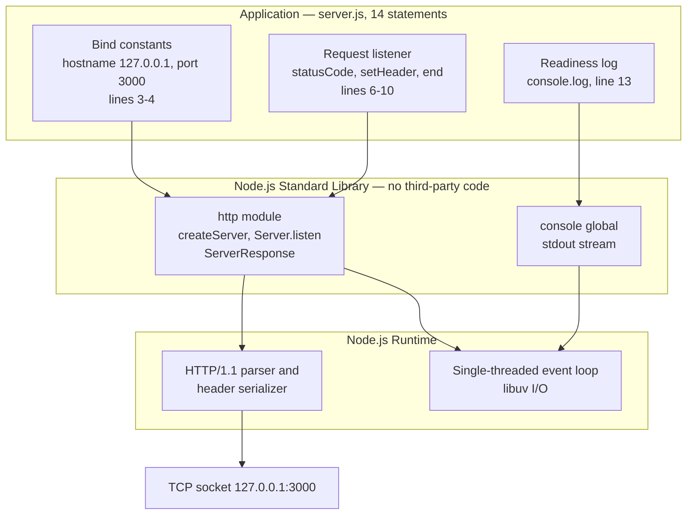
```mermaid
flowchart TD
    subgraph AppLayer["Application — server.js, 14 statements"]
        Consts["Bind constants<br/>hostname 127.0.0.1, port 3000<br/>lines 3-4"]
        Listener["Request listener<br/>statusCode, setHeader, end<br/>lines 6-10"]
        Logger["Readiness log<br/>console.log, line 13"]
    end

    subgraph StdLib["Node.js Standard Library — no third-party code"]
        HttpMod["http module<br/>createServer, Server.listen<br/>ServerResponse"]
        ConsoleMod["console global<br/>stdout stream"]
    end

    subgraph Runtime["Node.js Runtime"]
        EventLoop["Single-threaded event loop<br/>libuv I/O"]
        Parser["HTTP/1.1 parser and<br/>header serializer"]
    end

    Consts --> HttpMod
    Listener --> HttpMod
    Logger --> ConsoleMod
    HttpMod --> Parser
    HttpMod --> EventLoop
    ConsoleMod --> EventLoop
    Parser --> Socket["TCP socket 127.0.0.1:3000"]
```

### 3.2.3 Supporting Libraries

There are none, and the absence is comprehensive rather than partial. The following categories of supporting library — each of which a conventional Node.js service of this shape would normally carry — were individually searched for and found nowhere in the repository:

| Category | Representative packages searched | Result |
|---|---|---|
| Routing / middleware | `express`, `fastify`, `koa`, `hapi`, `@nestjs/*` | Absent |
| Configuration | `dotenv`, `config`, `convict` | Absent — no `process.env` reference exists at all |
| Logging | `winston`, `pino`, `bunyan`, `morgan` | Absent — logging is one `console.log` |
| Validation / schema | `joi`, `zod`, `ajv`, `yup` | Absent — no request data is read to validate |
| HTTP client | `axios`, `node-fetch`, `got`, global `fetch` | Absent — the process makes no outbound call |
| Utility | `lodash`, `ramda`, `date-fns`, `uuid` | Absent |
| Testing | `jest`, `mocha`, `vitest`, `supertest`, `node:test` | Absent |
| Real-time / API layer | `socket.io`, `ws`, `graphql`, `apollo-server` | Absent |

### 3.2.4 Compatibility Requirements

| Requirement | Basis | Implication |
|---|---|---|
| Runtime must provide the built-in `http` module and CommonJS `require` | `server.js` line 1 | Satisfied by any mainstream Node.js release; the module and `require` are long-standing standard-library facilities |
| Runtime must support ES2015 syntax (`const`, arrow functions, template literals) | `server.js` lines 1-13 | No modern-syntax floor beyond ES2015 is imposed by the source |
| `.js` must resolve as CommonJS | No `package.json`, therefore no `"type": "module"` | Introducing a manifest that declares ESM would break line 1 |
| Clients must speak HTTP/1.1 over plaintext TCP | `http` module, not `https` | No TLS handshake is possible; there is no certificate material and no `https` import |
| Clients must tolerate a response with no charset parameter | `res.setHeader('Content-Type', 'text/plain')` (line 8) | Character-set interpretation is left to the client |
| Port `3000` on `127.0.0.1` must be free | `server.js` lines 3-4, 12 | Verified failure mode: a second instance throws an unhandled `EADDRINUSE` `'error'` event (`errno -98`, `syscall: 'listen'`) and the process exits |

Because there is no dependency graph, there are no inter-library compatibility constraints to reconcile — no peer-dependency ranges, no transitive version conflicts, and no resolution overrides. Compatibility is a single-axis question: which Node.js release is installed.

### 3.2.5 Justification and Trade-offs

The repository documents no rationale, so the assessment below is derived from what the implementation demonstrably achieves and forgoes.

**What the standard-library-only choice buys:**

- **A genuinely zero-install execution path.** Adding even one framework converts `node server.js` into an install-then-run workflow with a lockfile to maintain. The current stack has no install step to fail, no registry to reach, and no lockfile to drift.
- **The strongest security posture available to a Node.js project.** With zero third-party code there is no supply-chain attack surface, no transitive vulnerability inventory, no post-install script execution, and nothing for a dependency-audit tool to report. For a demonstration artifact, this eliminates an entire class of risk outright.
- **Behavioral transparency.** The complete request path is seven API calls with no middleware chain, so the response cannot be altered by a plugin, an interceptor, or a framework default the reader cannot see.
- **Longevity.** The `http` module is versioned with the runtime, so the code cannot be broken by an abandoned or breaking-change dependency release.

**What it forgoes — each verifiable as absent from the code:**

- **Routing and method dispatch.** A framework router would supply what lines 6-10 deliberately omit; the `req` argument is never read, so no path, method, query, or header is available to branch on.
- **Middleware-supplied security controls.** No security headers are emitted (`X-Content-Type-Options`, `Strict-Transport-Security`, and `Content-Security-Policy` are all absent), and there is no CORS policy, rate limiter, body-size cap, or input sanitization — protections a framework typically contributes through packages such as Helmet or its own defaults. Resistance to malformed input rests entirely on the Node.js HTTP parser.
- **Structured error handling.** Frameworks install error boundaries; here no `'error'` listener is registered on the server object, so a bind failure prints a stack trace disclosing runtime-internal paths and terminates the process.
- **Observability hooks and testability.** There is no request logging, metrics endpoint, or tracing integration, and because the listener is an inline anonymous callback with no `module.exports`, it cannot be exercised by a test harness without binding a socket as a side effect of loading the module.

For a fixed-response reference program the trade is coherent: every forgone capability presupposes request differentiation or dependency management that this system does not perform. The trade stops being coherent the moment a second behavior, a remote client, or a persisted datum is introduced — at which point a framework decision becomes unavoidable rather than merely deferred.


## 3.3 Open Source Dependencies

The repository has **zero** third-party or open-source dependencies. This is not an inference from a sparse manifest — no manifest exists at all, so there is no declaration of dependency, no version range to resolve, and no package registry in the build or run path.

### 3.3.1 Dependency Declaration Status

| Artifact | Status | What its absence establishes |
|---|---|---|
| `package.json` | Absent | No dependency declaration, no `name`/`version`/`license` metadata, no npm scripts, no `engines` constraint |
| `package-lock.json` | Absent | No resolved dependency tree, no integrity hashes, no reproducible-install guarantee |
| `npm-shrinkwrap.json`, `yarn.lock`, `pnpm-lock.yaml`, `bun.lockb` | Absent | No alternative package manager is in use |
| `node_modules/` | Absent | Nothing has ever been installed into the checkout |
| `.npmrc` | Absent | No registry override, scope mapping, or auth configuration |
| Vendored or bundled third-party source | Absent | The only files in the repository are `server.js` and `README.md` |

Two independent checks corroborate the state. A file-existence test over every common manifest and lockfile name — spanning the npm, PyPI, Go, Maven/Gradle, RubyGems, Cargo, Composer, and NuGet ecosystems — returned no matches. Separately, `npm ls --depth=0` executed in the repository root reports the directory path followed by an empty tree, confirming that the package manager itself sees no declared or installed package.

### 3.3.2 Package Registries and Resolution

| Registry / channel | Used | Evidence |
|---|---|---|
| npm public registry (`registry.npmjs.org`) | No | No manifest, lockfile, or `.npmrc`; no install step exists |
| Private or mirrored npm registry | No | No `.npmrc` and no scoped package reference |
| GitHub Packages, or any Git-URL dependency | No | No manifest and no submodule (`.gitmodules` absent) |
| Any non-JavaScript registry (PyPI, Maven Central, RubyGems, crates.io, NuGet, Packagist) | No | No corresponding manifest exists |
| Node.js standard library (`http`, `console`) | Yes — the only external code | `server.js` lines 1 and 13; `http` confirmed built-in via `require('module').builtinModules` |

The Node.js standard library is deliberately listed here as the one body of code the application consumes that it does not itself contain. It is open-source code, but it is delivered as part of the runtime installation rather than through a package registry, so it is not a dependency in the packaging sense: it cannot be pinned, audited, or upgraded independently of the runtime.

### 3.3.3 Security and Governance Implications

The zero-dependency posture is the single strongest security property of this stack, and it should be read as such rather than as an incidental consequence of the project's size.

| Risk normally present in a Node.js project | Status here | Reason |
|---|---|---|
| Supply-chain compromise of a direct dependency | Eliminated | No direct dependency exists |
| Transitive vulnerability inheritance | Eliminated | No transitive graph exists |
| Malicious `postinstall` / lifecycle script execution | Eliminated | No install step is ever performed |
| Dependency confusion / typosquatting on install | Eliminated | No registry is contacted |
| Lockfile drift between environments | Eliminated | Nothing to resolve; the source is the entire artifact |

Three offsetting gaps are equally real, and each follows from the same absence of a manifest:

- **No runtime patch floor.** With no `engines` range, `.nvmrc`, or `.node-version`, the program will execute on any Node.js build present on the host — including an end-of-life release carrying unpatched vulnerabilities in the very `http` parser it depends on. Removing third-party risk shifts the entire remaining supply-chain surface onto the runtime, which the repository does not constrain.
- **No SBOM or scanning process.** There is no dependency manifest to feed an audit tool, no `npm audit` invocation, no Dependabot or Renovate configuration (no `.github/` directory exists), and no generated software bill of materials. The zero-dependency claim is verifiable only by inspection, as performed for this specification, and nothing in the repository would detect a regression if a dependency were introduced.
- **No license grant.** No `LICENSE` file exists and there is no `package.json` `license` field, so the repository declares no terms under which the code may be used, modified, or redistributed. Conversely, because no third-party code is included, there are no inbound license obligations, attribution requirements, or copyleft interactions to reconcile.

### 3.3.4 Requirements for Introducing a Dependency

Recorded because the current posture is a constraint that any future change must consciously break rather than accidentally erode. Adding the first third-party package would require, at minimum: a `package.json` declaring the dependency and — to preserve any runtime guarantee — an `engines` range; a committed lockfile to make installs reproducible; a `.gitignore` entry for `node_modules/`; an install step ahead of execution, which replaces the current single-command contract described in 3.6; and a vulnerability-scanning mechanism, since none exists today. Each of those artifacts is verified absent at present, so the change is additive across five files rather than a one-line edit.


## 3.4 Third-Party Services

The system integrates with no third-party service of any kind. The process makes **zero** outbound network calls: `server.js` contains exactly one `require` statement (`http`, line 1), no HTTP client invocation, no SDK reference, and no credential handling. Its entire network footprint is a single inbound TCP listener on the loopback interface.

### 3.4.1 External Service Inventory

Each row below was verified by a case-insensitive search across every file in the repository, not inferred from the absence of a manifest alone.

| Service category | Representative technologies searched | Status |
|---|---|---|
| External / partner APIs | `axios`, `node-fetch`, `got`, global `fetch`, `http.request`, `https` | Absent — no outbound request of any kind |
| Authentication / identity | Auth0, Okta, AWS Cognito, OAuth, OIDC, JWT, Passport, sessions, API keys | Absent — no credential is issued, accepted, or validated |
| Monitoring / APM / error tracking | Sentry, Datadog, New Relic, Prometheus, OpenTelemetry | Absent — no agent, exporter, or metrics endpoint |
| Log aggregation | Winston, Pino, Bunyan, Morgan, any shipper or sidecar | Absent — output is one `console.log` line to stdout |
| Cloud provider SDKs | `aws-sdk`, `@aws-sdk/*`, `@google-cloud/*`, Azure SDKs | Absent — no cloud client, region, or resource reference |
| Messaging / streaming | Kafka, RabbitMQ, SQS, SNS, Pub/Sub, `socket.io`, `ws` | Absent |
| Email / SMS / notification | SendGrid, SES, Twilio, any provider client | Absent |
| Payments / analytics / feature flags | Stripe, Segment, LaunchDarkly, any vendor client | Absent |
| Secret management | AWS Secrets Manager, Vault, `.env` files, `process.env` reads | Absent — the grep for `process.env` returns no match anywhere |
| Reverse proxy / gateway / service mesh | Nginx, Envoy, API gateway config, ingress manifest | Absent — no configuration file of any kind exists |

The reference stack that would normally supply AWS as the cloud platform and Auth0 as the authentication service is therefore **not adopted**: no AWS SDK, credential file, region setting, resource identifier, Auth0 tenant, domain, client ID, or callback URL appears anywhere in the two files that constitute this repository.

### 3.4.2 Network Surface

| Direction | Surface | Evidence |
|---|---|---|
| Inbound | One HTTP/1.1 listener on `127.0.0.1:3000`, plaintext | `server.js` lines 3-4, 12 |
| Outbound | None | Single `require` on line 1; no client library, socket, or DNS lookup in the code |
| Loopback confinement | No remote host, container, or pod can connect | `hostname` is the literal `'127.0.0.1'` |
| Transport security | None — no TLS | The `http` module is imported; `https` and `tls` are absent, and no certificate or key material exists |

Because the bind address is a source literal with no environment-variable or flag override, the confinement is unconditional: it cannot be relaxed by configuration, only by editing line 3. This is what makes the "no third-party service" finding structural rather than merely current — the process has no route to any external endpoint, and nothing external has a route to it.

### 3.4.3 Security Implications

| Property | Consequence |
|---|---|
| No credentials, tokens, or API keys exist in the codebase | Nothing can be leaked through the source, and there is no secret-rotation or key-management obligation |
| No egress | No data exfiltration path exists from the process, and no vendor outage can affect availability |
| No identity or access control | Any local client is answered unconditionally; there is no authentication, authorization, or tenancy boundary |
| No audit trail | With no request logging and no external log sink, there is no record of who connected, when, or how often — the only output is the one-time readiness line |
| Plaintext transport | Traffic is unencrypted, which is tolerable only because loopback binding guarantees it never leaves the host; the same code exposed on a routable interface would transmit in the clear |
| No third-party attack surface | There is no vendor SDK to compromise, no webhook to forge, and no callback endpoint to hijack |

### 3.4.4 Integration Requirements for Future Services

Documented so that the current zero-integration state is understood as a boundary with known crossing costs. Introducing any external service would require, at minimum: a dependency manifest and install step for the vendor SDK (see 3.3.4); an externalized configuration mechanism, since the codebase reads no environment variable and contains no config file; a secret-storage decision, as no `.env`, secret manager, or credential store is present; outbound network permission and, for anything beyond the local host, a change to the loopback bind on line 3; TLS for any credential-bearing call, which the `http`-only import cannot provide; and error handling around the call, since no `'error'` listener or exception boundary exists anywhere in the process today. None of these prerequisites is satisfied by the current stack.


## 3.5 Databases &amp; Storage

The system has no persistence layer. There is no database, no cache, no object store, and no filesystem write path — the process holds no state between requests and produces no durable output beyond one line on stdout.

### 3.5.1 Database Inventory

| Tier | Technology in use | Evidence |
|---|---|---|
| Primary database | **None** | No driver, connection string, or client instantiation exists |
| Secondary / read-replica / analytical store | **None** | No second data path of any kind |
| ORM / query builder / data-mapping layer | **None** | No `prisma`, `sequelize`, `typeorm`, `knex`, or `mongoose` reference |
| Schema, migration, or seed artifacts | **None** | No `migrations/` or `db/` directory; no `.sql` or schema file |
| Embedded / file-based store | **None** | No SQLite file, no JSON data file, no `fs` usage |

A case-insensitive search across every file in the repository for MongoDB, Mongoose, PostgreSQL, MySQL, SQLite, Redis, Memcached, Prisma, Sequelize, TypeORM, and Knex returns no match. The reference stack that would ordinarily specify MongoDB as the database is therefore **not adopted** — there is no MongoDB driver, connection URI, database name, collection reference, or document schema anywhere in the codebase.

### 3.5.2 Data Persistence Strategy

The strategy is the absence of one, and it is a coherent position for this system rather than an oversight: the application has no data to persist.

| Characteristic | Observed implementation |
|---|---|
| Application state | None. No variable is mutated after module evaluation; `hostname`, `port`, and `server` are `const` bindings assigned once |
| Cross-request state | None. The response body is the literal `'Hello, World!\n'` on line 9, identical for every invocation of the listener |
| Request data retention | None. The `req` argument is never read, so no request attribute is captured, transformed, or stored |
| Session or cookie state | None. No `Set-Cookie` header and no session store exist |
| Filesystem interaction | None. `fs` is never required; the process reads and writes no file at run time |
| Durable output | None. The only output is the readiness line written to stdout, which is not persisted by the application |

The single consequence worth stating plainly is that the process is fully disposable: it can be terminated and restarted at any moment with no data loss, no recovery procedure, no backup obligation, and no consistency or durability guarantee to honor — because there is nothing to lose. The corresponding limitation is that nothing the system observes is recoverable either; there is no record of any request it has served.

### 3.5.3 Caching

No caching solution is present at any layer.

| Cache layer | Status | Evidence |
|---|---|---|
| Distributed cache (Redis, Memcached) | Absent | No client library or connection configuration |
| In-process / in-memory cache | Absent | No map, LRU structure, or memoization in the 14 statements of `server.js` |
| HTTP response caching directives | Absent | The only application-set header is `Content-Type` (line 8); no `Cache-Control`, `ETag`, `Last-Modified`, or `Expires` is emitted |
| CDN or edge cache | Absent | No deployment or CDN configuration exists in the repository |

Caching would have nothing to accelerate: the response is a 14-byte constant returned by three constant-time operations with no I/O wait, so there is no computation or fetch whose result could be reused. The absence of `Cache-Control` and `ETag` does mean clients and intermediaries receive no explicit freshness guidance, which is a latent gap only if the payload ever becomes dynamic or the listener is ever exposed beyond loopback.

### 3.5.4 Storage Services

| Storage concern | Status | Evidence |
|---|---|---|
| Object storage (S3, GCS, Azure Blob) | Absent | No cloud SDK or bucket reference — see 3.4.1 |
| Block or file storage / mounted volumes | Absent | No container or orchestration definition exists to declare one |
| Static asset storage | Absent | No `public/`, `assets/`, or `static/` directory; no file is served |
| File upload handling | Absent | No body parsing occurs, so no upload can be received |
| Log storage | Absent | Startup output goes to stdout with no rotation, file sink, or aggregation target |
| Secret storage | Absent | No `.env` file, vault client, or `process.env` read — see 3.4.1 |

The complete storage footprint of the project is therefore the 365 bytes of source held in Git: `server.js` (342 bytes) and `README.md` (23 bytes). Git version control is the only durable storage mechanism the repository relies on, and it stores the artifact rather than any application data.


## 3.6 Development &amp; Deployment

The repository contains no build system, no containerization definition, no infrastructure-as-code, and no CI/CD configuration. Development and deployment consist of editing a text file and running one command. What follows separates the tooling the workflow genuinely requires from the tooling that is verifiably absent, because both are load-bearing facts about this stack.

### 3.6.1 Development Toolchain

| Tool | Required | Basis |
|---|---|---|
| Node.js runtime | Yes — the only hard requirement | `server.js` cannot execute without it; the repository ships no runtime and declares no version range |
| Git | Yes, for source management | The checkout is a Git working tree with branches `main` and `2608_01` and remote `github.com/lakshya-blitzy/Hello_world_26_Aug_01` |
| Any text editor | Yes, implicitly | No `.editorconfig`, `.vscode/`, or `.idea/` directory exists, so no editor is prescribed or configured |
| npm (or any package manager) | No | There is no manifest to install from; `npm ls --depth=0` in the root reports an empty tree |
| Compiler / transpiler / bundler | No | JavaScript source executes directly |

Tooling that a conventional Node.js project would carry was individually checked and is absent in every case: ESLint and Prettier (no `.eslintrc*`, `eslint.config.js`, or `.prettierrc*`), TypeScript (no `tsconfig.json` or `jsconfig.json`), Babel (no `babel.config.js` or `.babelrc`), bundlers (no Webpack, Vite, Rollup, or esbuild configuration), task runners (no `Makefile`, `Taskfile.yml`, `gulpfile.js`, or `Gruntfile.js`), test frameworks (no Jest, Vitest, Mocha, or `node:test` usage, and no test file), coverage tooling (no `.nycrc` or `.c8rc`), Git hooks (no `.husky/` directory or `.pre-commit-config.yaml`), and repository hygiene files (no `.gitignore`, `.gitattributes`, `LICENSE`, `CONTRIBUTING.md`, or `CODEOWNERS`).

The practical effect is that there is no automated quality gate anywhere in the lifecycle. Syntax, style, type correctness, and behavior are all verified — if at all — by a human running the program. The one mechanical check available without adding tooling is `node --check server.js`, which parses the file without executing it; it passes on the current source.

### 3.6.2 Build System

There is no build system, and none is needed. The execution contract is a single command:

```bash
node server.js
```

| Build-pipeline stage | Status |
|---|---|
| Dependency installation | Not performed — no manifest, no lockfile, no `node_modules` |
| Compilation / transpilation | Not performed — ES2015 CommonJS source runs natively |
| Bundling / minification | Not performed — no bundler configuration |
| Asset processing | Not applicable — no assets exist |
| Artifact packaging | Not performed — the two source files *are* the artifact |
| Version stamping | Not possible — no `package.json` `version` field and no Git tag exists |

This was verified rather than assumed: with no `node_modules` directory present and no install step executed, `node server.js` started successfully, printed `Server running at http://127.0.0.1:3000/`, and served `HTTP/1.1 200 OK` with `Content-Type: text/plain` and a 14-byte body. The deployable footprint is 365 bytes, and "build time" is process startup — one built-in import plus evaluation of 14 statements.

The constraint worth recording is that this one-command contract is fragile in exactly one direction: introducing a single third-party package or a TypeScript file converts it into an install-then-build-then-run pipeline, along with the lockfile and scanning obligations described in 3.3.4.

### 3.6.3 Containerization

No containerization exists. `Dockerfile`, `.dockerignore`, `docker-compose.yml`, `compose.yaml`, and any Kubernetes manifest, Helm chart, `Procfile`, `app.yaml`, `vercel.json`, or `netlify.toml` were each checked for and are absent, as are the `k8s/`, `helm/`, `infra/`, and `terraform/` directories.

Beyond the missing files, one code-level fact makes containerization a change rather than a wrapper: the listener binds the literal `127.0.0.1` (`server.js` line 3). A process bound to loopback inside a container is unreachable from outside that container regardless of published ports, so containerizing this application as written would produce a running but unreachable service. Making it container-viable requires editing the bind address — the value is not overridable, because the codebase reads no environment variable and has no configuration file.

### 3.6.4 Infrastructure as Code and CI/CD

| Concern | Status | Evidence |
|---|---|---|
| CI/CD pipelines | Absent | No `.github/` directory, no `.circleci/`, no `.gitlab-ci.yml`, `Jenkinsfile`, `.travis.yml`, or `azure-pipelines.yml` |
| Infrastructure as code | Absent | No Terraform (`main.tf`, `variables.tf`), CloudFormation, or `serverless.yml` |
| Deployment automation | Absent | No deploy script, `scripts/` directory, or release workflow |
| Process supervision | Absent | No systemd unit, PM2 configuration, or restart policy; the process runs in the foreground |
| Environment promotion | Absent | No environment-specific configuration exists to promote |

Git history corroborates that no pipeline was ever configured: the repository holds exactly two commits, both dated 2026-08-26 — `e511e05` "Initial commit" and `5925dae` "Add files via upload" — with no workflow file introduced in either. There is no tag and no release artifact, so the commit SHA is the only version identifier available for anything deployed.

Deployment, in the absence of automation, reduces to copying two files to a host that has Node.js installed and starting the process. That is genuinely sufficient for the artifact, and it is also the ceiling: there is no rollback mechanism, health check, or readiness probe beyond the single stdout line, and no supervisor to restart the process after the failure mode documented below.

### 3.6.5 Verification Workflow

With no test suite and no CI gate, verification is manual. The procedure below is the one actually executed to substantiate this section, on Node.js v22.23.2.

```bash
node --check server.js          # parse without executing
node server.js &                # start; expect the readiness line
curl -s -i http://127.0.0.1:3000/
```

| Check | Observed result |
|---|---|
| Syntax parse | Passes |
| Startup output | `Server running at http://127.0.0.1:3000/` |
| Response line and headers | `HTTP/1.1 200 OK`, `Content-Type: text/plain`, `Content-Length: 14`, plus module-generated `Date`, `Connection: keep-alive`, `Keep-Alive: timeout=5` |
| Body size | 14 bytes |
| Request independence | `POST /x?q=1` with a body returns the same `200` / `text/plain` response |
| Second instance on the same port | Crashes: unhandled `'error'` event, `Error: listen EADDRINUSE: address already in use 127.0.0.1:3000` (`errno -98`, `syscall: 'listen'`), process exits |

The `EADDRINUSE` result is a reproducible operational characteristic of the deployment model, not an incidental test artifact: because no `'error'` listener is registered on the server object, a port conflict terminates the process and prints a stack trace that discloses runtime-internal file paths. With no supervisor configured, that termination ends availability with no recovery.

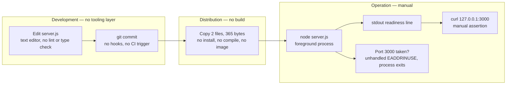
```mermaid
flowchart LR
    subgraph Dev["Development — no tooling layer"]
        Edit["Edit server.js<br/>text editor, no lint or type check"]
        Commit["git commit<br/>no hooks, no CI trigger"]
    end

    subgraph Distribute["Distribution — no build"]
        Copy["Copy 2 files, 365 bytes<br/>no install, no compile, no image"]
    end

    subgraph Operate["Operation — manual"]
        Run["node server.js<br/>foreground process"]
        Ready["stdout readiness line"]
        Verify["curl 127.0.0.1:3000<br/>manual assertion"]
        Fail["Port 3000 taken?<br/>unhandled EADDRINUSE, process exits"]
    end

    Edit --> Commit --> Copy --> Run
    Run --> Ready --> Verify
    Run --> Fail
```


## 3.7 References

### 3.7.1 Repository Files Examined

- `server.js` - The sole executable module and the primary evidence for this entire section. Established: CommonJS module format and the single `require('http')` import (line 1); the hard-coded bind constants `'127.0.0.1'` and `3000` (lines 3-4); the request listener that sets `statusCode`, one `Content-Type` header, and the fixed 14-byte body (lines 6-10); the `server.listen(port, hostname, callback)` bind (line 12); the single `console.log` readiness message (line 13); and the ES2015-only syntax level with no exports, classes, `async`/`await`, `process.env` read, or `fs`/`crypto`/`cluster` usage.
- `README.md` - Established that Markdown is the only non-executable language present and that the repository documents no dependency, build instruction, run command, license, or runtime requirement — the file's entire content is the level-one heading `# Hello_world_26_Aug_01`.
- `/` (repository root) - Established the complete file inventory via `get_source_folder_contents` with path `""`: exactly two first-order children and no subdirectories, which is the basis for every "verified absent" claim in sub-sections 3.1 through 3.6.

### 3.7.2 Verified-Absent Artifacts

Each of the following was checked for by name in the repository root and confirmed not to exist. Their absence is cited as evidence throughout this section.

- Package manifests and lockfiles - `package.json`, `package-lock.json`, `npm-shrinkwrap.json`, `yarn.lock`, `pnpm-lock.yaml`, `bun.lockb`, `node_modules/`, `requirements.txt`, `pyproject.toml`, `Pipfile`, `setup.py`, `go.mod`, `Gemfile`, `pom.xml`, `build.gradle`, `Cargo.toml`, `composer.json` — basis for 3.3.1 and for the single-language finding in 3.1.2.
- Runtime version pins - `.nvmrc`, `.node-version`, `.npmrc`, `.tool-versions`, `volta.json` — basis for the "no declared engine range" constraint in 3.1.4 and 3.2.1.
- Build and transpile configuration - `tsconfig.json`, `jsconfig.json`, `babel.config.js`, `.babelrc`, `webpack.config.js`, `vite.config.js`, `rollup.config.js`, `esbuild.config.js`, `Makefile`, `Taskfile.yml`, `gulpfile.js`, `Gruntfile.js` — basis for 3.6.2.
- Quality tooling - `.eslintrc*`, `eslint.config.js`, `.prettierrc*`, `.editorconfig`, `jest.config.js`, `vitest.config.js`, `.mocharc.json`, `.nycrc`, `.c8rc`, `.pre-commit-config.yaml`, `.husky/` — basis for 3.6.1.
- Containerization, IaC, and CI/CD - `Dockerfile`, `.dockerignore`, `docker-compose.yml`, `compose.yaml`, `Procfile`, `app.yaml`, `vercel.json`, `netlify.toml`, `Jenkinsfile`, `.gitlab-ci.yml`, `.travis.yml`, `azure-pipelines.yml`, `main.tf`, `variables.tf`, `serverless.yml`, and the directories `.github/`, `.circleci/`, `k8s/`, `helm/`, `terraform/`, `infra/`, `scripts/` — basis for 3.6.3 and 3.6.4.
- Configuration, governance, and source directories - `.env`, `.env.example`, `.env.local`, `config.json`, `config.yaml`, `settings.json`, `LICENSE`, `CONTRIBUTING.md`, `CODEOWNERS`, `.gitignore`, `.gitattributes`, and the directories `src/`, `lib/`, `test/`, `tests/`, `__tests__/`, `spec/`, `public/`, `client/`, `frontend/`, `api/`, `migrations/`, `db/`, `docs/`, `.vscode/`, `.idea/` — basis for 3.3.3, 3.4.1, and 3.5.4.

### 3.7.3 Verification Commands and Observed Results

- `git ls-files`, `find . -not -path "./.git*"` - Confirmed exactly two tracked files totalling 365 bytes (`server.js` 342 B, `README.md` 23 B) and no subdirectories.
- `git log --pretty='%h %ad %s' --date=short`, `git branch -a`, `git remote -v` - Established the two-commit history (`e511e05` "Initial commit", `5925dae` "Add files via upload", both 2026-08-26), branches `main` and `2608_01`, and the GitHub remote cited in 3.6.1 and 3.6.4.
- Case-insensitive grep across all `*.js`/`*.md`/`*.json` files for 40+ framework, database, cloud, auth, monitoring, and configuration identifiers - Returned no matches, substantiating the absence tables in 3.2.3, 3.4.1, and 3.5.1.
- `node -p "require('module').builtinModules.includes('http')"` → `true` - Confirmed `http` is a standard-library module rather than an installed package (3.2.1, 3.3.2).
- `npm ls --depth=0` - Reported an empty tree in the repository root, confirming no declared or installed package (3.3.1, 3.6.1).
- `node --check server.js` → passes; `node -v` → v22.23.2; `npm -v` → 11.18.0; `node -p process.versions` → V8 12.4.254.21-node.56, `NODE_MODULE_VERSION` 127, OpenSSL 3.5.7 - Established the verification-environment runtime cited in 3.1.4 and 3.2.1. These are environment facts, not repository-declared requirements.
- `node server.js` with `curl -s -i http://127.0.0.1:3000/` and `curl -s -i -X POST "http://127.0.0.1:3000/x?q=1" -d 'a=b'` - Confirmed the readiness line, the `200` / `text/plain` / `Content-Length: 14` response, the module-generated `Date`, `Connection: keep-alive`, and `Keep-Alive: timeout=5` headers, and request independence (3.2.2, 3.6.2, 3.6.5).
- Starting a second instance while port 3000 was bound - Reproduced the unhandled `'error'` event failure: `Error: listen EADDRINUSE: address already in use 127.0.0.1:3000`, `code: 'EADDRINUSE'`, `errno: -98`, `syscall: 'listen'`, followed by process exit (3.2.4, 3.6.5).

### 3.7.4 Technical Specification Sections Cross-Referenced

- `1.2 System Overview` - Corroborated the single-module component breakdown, the CommonJS/no-framework technical approach, and the zero-third-party-dependency count.
- `1.3 Scope` - Corroborated the two in-scope integrations (the `http` module and `console`), the `node server.js` execution contract with no declared version range, and the excluded-capability list underlying 3.4 and 3.5.
- `2.4 Implementation Considerations` - Corroborated the security framing carried into 3.2.5 and 3.3.3 (zero third-party code as the strongest security property, offset by the absent engine range and missing security headers) and the single application-set response header.
- `2.5 Traceability, Assumptions and Constraints` - Corroborated the unenforced runtime assumption, the compile-time-only configuration constraint, the plaintext-HTTP-only constraint, the single-instance-per-host constraint, and the absent license grant.

### 3.7.5 External Sources

- [web] Two web searches were performed for current Node.js release-line and LTS status (queries on the Node.js release schedule and current LTS version). Both returned no results, and no external network access was available to fetch the Node.js release documentation directly. Consequently **no external version, LTS, or end-of-life claim is asserted anywhere in this section**; all runtime version statements are limited to what the repository declares (nothing) and what the verification environment provided (Node.js v22.23.2).


# 4. Process Flowchart

## 4.1 System Workflows

The workflow inventory of this system is unusually small, and that smallness is a verified property rather than an abbreviation of this document. `server.js` contains fourteen lines of code whose complete call inventory is six calls — `require('http')` (L1), `http.createServer(...)` (L6), `res.setHeader(...)` (L8), `res.end(...)` (L9), `server.listen(...)` (L12) and `console.log(...)` (L13). A grep across the only two tracked files (`server.js`, `README.md`) for `if`, `switch`, `try`, `catch`, `throw`, `async`, `await`, `Promise`, `setTimeout`, `setInterval`, `process.on`, `.on(`, `retry`, `validate`, `auth`, `cache`, `transaction` and `module.exports` returns **zero matches**. Consequently the application code contains no branch at all: every decision point documented in this section is owned by the Node.js `http` module, the event loop, or the operating system — not by the repository.

Three workflows exist, and no fourth can be constructed from the code:

| Workflow | Trigger | Owning Code | Terminal Outcome |
|---|---|---|---|
| W1 — Initialization and bind | Operator runs `node server.js` | `server.js` L1-L4, L6, L12-L13 | Listening on `127.0.0.1:3000` with one stdout readiness line, or process exit code 1 |
| W2 — Request service | Inbound HTTP request on the bound socket | `server.js` L6-L10 | `200` / `text/plain` / 14-byte body, identical for every request |
| W3 — Termination | `SIGINT`, `SIGTERM`, or an unhandled server `error` event | None — no handler is registered | Immediate process exit (130, 143, or 1) with no drain and no shutdown message |

Related views documented elsewhere and deliberately not repeated here: the statement-level startup/per-request flowchart in sub-section 1.2.2.3, the operator workflow in 1.3.1.2, the feature dependency map in 2.3.1, and the feature-attributed runtime sequence in 2.3.2. This section adds the lane-partitioned view, the runtime-owned decision points, the failure and recovery paths, and the state machines.

### 4.1.1 Core Business Processes

#### 4.1.1.1 End-to-End Operator and Client Journey

The system has exactly two actors: an operator who starts and stops the process, and a same-host HTTP client that issues requests. There is no user interface, no account, no session, and no multi-step business transaction — `README.md` (23 bytes, one heading line) documents no process, and no code path reads it.

The diagram below partitions the end-to-end journey into four lanes so that responsibility is unambiguous: what the operator does, what the fourteen lines of application code do, what the Node.js runtime and OS do on the application's behalf, and what the client observes.

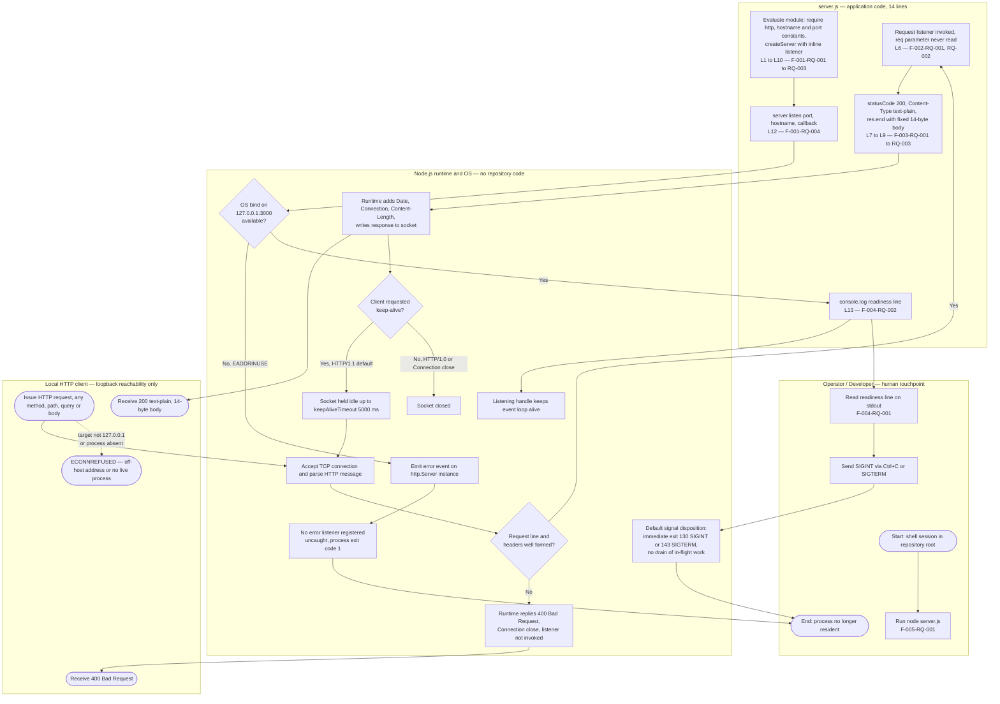
```mermaid
flowchart TD
    subgraph OperatorLane["Operator / Developer — human touchpoint"]
        OpStart(["Start: shell session in repository root"])
        OpRun["Run node server.js<br/>F-005-RQ-001"]
        OpWatch["Read readiness line on stdout<br/>F-004-RQ-001"]
        OpSignal["Send SIGINT via Ctrl+C or SIGTERM"]
        OpEnd(["End: process no longer resident"])
        OpStart --> OpRun
    end
    subgraph AppLane["server.js — application code, 14 lines"]
        Construct["Evaluate module: require http, hostname and port constants,<br/>createServer with inline listener<br/>L1 to L10 — F-001-RQ-001 to RQ-003"]
        Listen["server.listen port, hostname, callback<br/>L12 — F-001-RQ-004"]
        Log["console.log readiness line<br/>L13 — F-004-RQ-002"]
        Handle["Request listener invoked, req parameter never read<br/>L6 — F-002-RQ-001, RQ-002"]
        Respond["statusCode 200, Content-Type text-plain,<br/>res.end with fixed 14-byte body<br/>L7 to L9 — F-003-RQ-001 to RQ-003"]
        Construct --> Listen
    end
    subgraph RuntimeLane["Node.js runtime and OS — no repository code"]
        BindDec{"OS bind on<br/>127.0.0.1:3000<br/>available?"}
        EmitErr["Emit error event on http.Server instance"]
        Crash["No error listener registered<br/>uncaught, process exit code 1"]
        Ready["Listening handle keeps event loop alive"]
        Accept["Accept TCP connection and parse HTTP message"]
        ParseDec{"Request line and<br/>headers well formed?"}
        Reject400["Runtime replies 400 Bad Request,<br/>Connection close, listener not invoked"]
        Flush["Runtime adds Date, Connection, Content-Length,<br/>writes response to socket"]
        KeepDec{"Client requested<br/>keep-alive?"}
        Hold["Socket held idle up to keepAliveTimeout 5000 ms"]
        CloseSock["Socket closed"]
        Kill["Default signal disposition:<br/>immediate exit 130 SIGINT or 143 SIGTERM,<br/>no drain of in-flight work"]
    end
    subgraph ClientLane["Local HTTP client — loopback reachability only"]
        Req(["Issue HTTP request, any method, path, query or body"])
        Ok(["Receive 200 text-plain, 14-byte body"])
        Bad(["Receive 400 Bad Request"])
        Refused(["ECONNREFUSED — off-host address or no live process"])
    end
    Listen --> BindDec
    BindDec -- "No, EADDRINUSE" --> EmitErr
    EmitErr --> Crash
    Crash --> OpEnd
    BindDec -- "Yes" --> Log
    Log --> Ready
    Log --> OpWatch
    Req --> Accept
    Req -. "target not 127.0.0.1<br/>or process absent" .-> Refused
    Accept --> ParseDec
    ParseDec -- "No" --> Reject400
    Reject400 --> Bad
    ParseDec -- "Yes" --> Handle
    Handle --> Respond
    Respond --> Flush
    Flush --> Ok
    Flush --> KeepDec
    KeepDec -- "Yes, HTTP/1.1 default" --> Hold
    KeepDec -- "No, HTTP/1.0 or Connection close" --> CloseSock
    Hold --> Accept
    OpWatch --> OpSignal
    OpSignal --> Kill
    Kill --> OpEnd
```

The journey has three user touchpoints, all of them operator-facing: the `node server.js` invocation, the single readiness line on stdout, and the terminating keystroke or signal. The client's touchpoint is the socket itself. No touchpoint accepts configuration — `hostname` and `port` are source literals (L3-L4) with no environment-variable or CLI override, so the journey cannot be parameterised without editing the file.

#### 4.1.1.2 System Interactions

| Interacting Parties | Mechanism | Direction | Evidence |
|---|---|---|---|
| Operator ↔ Node.js runtime | Process invocation and default signal disposition | Bidirectional | Verified: exit 143 on `SIGTERM`, exit 130 on `SIGINT` |
| `server.js` ↔ `http` module | `createServer`, `listen`, `ServerResponse` API | Bidirectional | `server.js` L1, L6-L9, L12 |
| Node.js runtime ↔ OS network stack | `listen` syscall, socket accept, read/write | Bidirectional | Bind observed on `127.0.0.1:3000`; off-host connect refused |
| `server.js` → stdout | `console.log` once per successful start | Outbound | `server.js` L13 |
| HTTP client ↔ Node.js `http` module | HTTP/1.1 or HTTP/1.0 over TCP | Bidirectional | Verified across `GET`, `POST`, `PURGE`, pipelined and keep-alive exchanges |

The application never talks to anything except the `http` module and `console`. The complete integration inventory of three points established in sub-section 2.3.3 — inbound socket, outbound stdout, inbound process invocation — is confirmed by the single-`require` grep result.

#### 4.1.1.3 Decision Points

Every decision below was located by inspection and confirmed by observation. The **Owner** column is the operative fact: not one decision is expressed in repository code.

| # | Decision | Owner | Branches Observed |
|---|---|---|---|
| D1 | Is `127.0.0.1:3000` bindable? | OS / runtime | Success → readiness line; failure → `EADDRINUSE` crash, exit 1 |
| D2 | Is the connecting peer on the loopback interface? | OS routing + bind scope | Loopback → accepted; `10.76.5.30:3000` → `ECONNREFUSED` |
| D3 | Is the request line and header block well formed? | `http` module parser | Well formed → listener invoked; malformed → `400 Bad Request`, `Connection: close`, listener **never** invoked |
| D4 | Is `Expect: 100-continue` present? | `http` module | Present → automatic `100 Continue` (no `checkContinue` listener exists); absent → direct dispatch |
| D5 | How is the response body framed? | `http` module | HTTP/1.1 → `Content-Length: 14` + `Connection: keep-alive` + `Keep-Alive: timeout=5`; HTTP/1.0 → `Connection: close`, no `Content-Length` |
| D6 | Should the connection be reused or closed? | `http` module + client | Reused (three sequential requests observed over one TCP connection); closed after `keepAliveTimeout` (5000 ms) or on `Connection: close` |
| D7 | What should the response be? | **Not a decision** | Single path — `200` / `text/plain` / 14 bytes for `GET`, `POST` with body, `HEAD`, `DELETE` and the non-standard `PURGE` alike |

D7 is the defining characteristic of the request workflow: because the `req` parameter declared on L6 is never dereferenced, request shape cannot influence the outcome. Ten concurrent requests all returned `200`, and a `POST /a/b?q=1` carrying a body and a custom header produced a byte-identical response to `GET /`.

#### 4.1.1.4 Error Handling Paths

| Error Condition | Detected By | Application Response | Observed Outcome |
|---|---|---|---|
| Port already bound | `listen` syscall → `'error'` event | None — no `'error'` listener exists | `Error: listen EADDRINUSE ... 127.0.0.1:3000` (`errno -98`, `syscall listen`), unhandled-event rethrow, exit code 1 |
| Malformed request | `http` parser | None — listener not reached | Runtime emits `400 Bad Request` + `Connection: close` |
| Incomplete request head | `http` parser + timeout sweep | None | Connection held open with no response until `headersTimeout` (60000 ms) elapses |
| Client aborts mid-request | Socket layer | None | Socket destroyed, process survives, stdout unchanged — the fault is completely silent |
| Signal during an in-flight request | Default signal disposition | None — no `process.on` handler | Immediate exit, in-flight connection reset, no drain |
| Application-level exception | — | No throw site exists | The three statements on L7-L9 are literal assignments and calls with no I/O and no branch |

Two structural facts follow. First, the only fault that the runtime surfaces loudly is a startup bind failure, and it surfaces as a stack trace on stderr plus a non-zero exit code. Second, every request-time fault is handled by the `http` module and is invisible to the application and to the operator, because the process emits no request log, no metric, and no health signal after its single startup line.

### 4.1.2 Integration Workflows

#### 4.1.2.1 Data Flow Between Systems

There is no second system. The data-flow diagram therefore describes boundaries rather than hops: what crosses into the process, what happens inside it, and what crosses out.

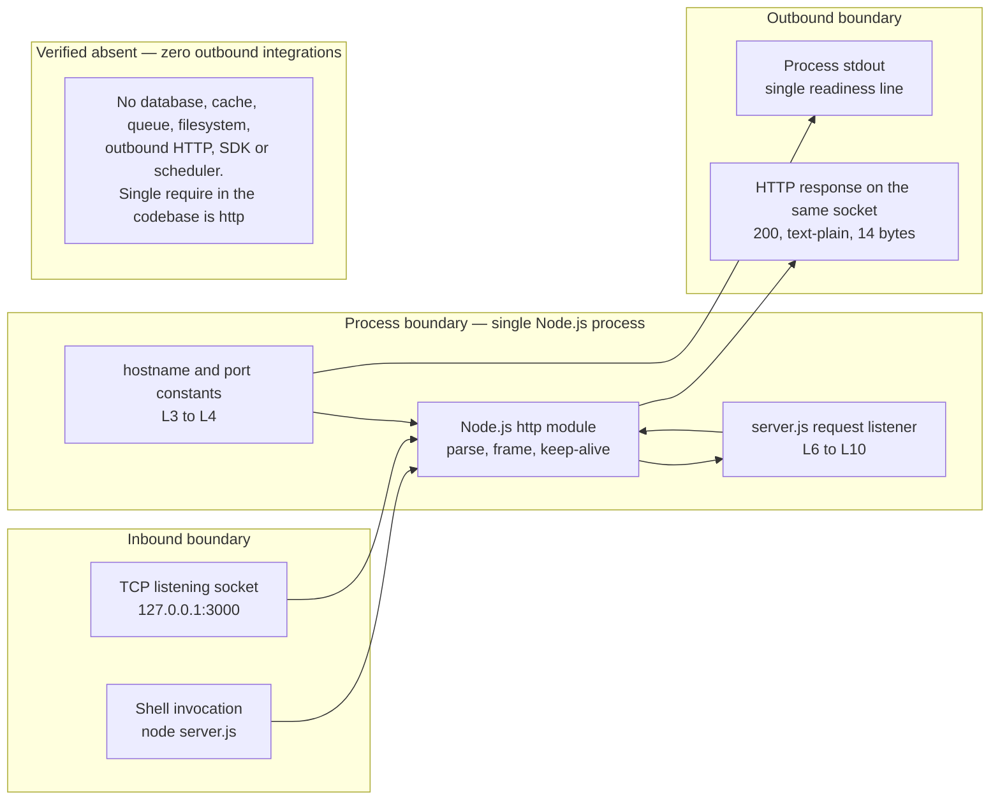
```mermaid
flowchart LR
    subgraph InboundBoundary["Inbound boundary"]
        CLI["Shell invocation<br/>node server.js"]
        Sock["TCP listening socket<br/>127.0.0.1:3000"]
    end
    subgraph ProcessBoundary["Process boundary — single Node.js process"]
        Runtime["Node.js http module<br/>parse, frame, keep-alive"]
        AppCode["server.js request listener<br/>L6 to L10"]
        Const["hostname and port constants<br/>L3 to L4"]
    end
    subgraph OutboundBoundary["Outbound boundary"]
        Stdout["Process stdout<br/>single readiness line"]
        Wire["HTTP response on the same socket<br/>200, text-plain, 14 bytes"]
    end
    subgraph AbsentIntegrations["Verified absent — zero outbound integrations"]
        NoneNode["No database, cache, queue, filesystem,<br/>outbound HTTP, SDK or scheduler.<br/>Single require in the codebase is http"]
    end
    CLI --> Runtime
    Sock --> Runtime
    Const --> Runtime
    Runtime --> AppCode
    AppCode --> Runtime
    Runtime --> Wire
    Const --> Stdout
```

Data volumes are fixed by construction: 14 bytes out per request, and zero bytes of request data read in. Since no request attribute — method, path, query, header, body, or client address — is read, no inbound data is ever copied into application memory, transformed, logged, or forwarded.

#### 4.1.2.2 API Interactions

The system exposes one HTTP surface and consumes none.

| Aspect | Observed Behaviour |
|---|---|
| Endpoint surface | Every path on `http://127.0.0.1:3000/` resolves to the same handler — there is no route table, so the surface is "any path" rather than an enumerated set |
| Accepted methods | All, including non-standard ones — `GET`, `POST`, `HEAD`, `DELETE` and `PURGE` all returned `200` |
| Request contract | None. No required header, content type, query parameter, or body schema |
| Response contract | `200` with `Content-Type: text/plain` and the 14-byte body; `Date`, `Connection`, `Keep-Alive` and `Content-Length` are added by the `http` module (F-003-RQ-002, F-003-RQ-004) |
| Protocol versions | HTTP/1.1 and HTTP/1.0 both served; pipelined requests answered in order on one socket |
| Outbound API calls | None. No `fetch`, `https`, `http.request`, or client SDK appears in the codebase |
| Authentication | None at any layer — loopback binding is the only access restriction |

#### 4.1.2.3 Event Processing Flows

The only event machinery in the system is the Node.js event loop and the `http` module's internal emitters; the application subscribes to nothing (`.on(` and `once(` return zero matches). The following flow shows how a request becomes a listener invocation, including the timeout sweep that governs half-open connections.

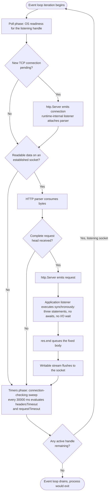
```mermaid
flowchart TD
    Start(["Event loop iteration begins"]) --> Poll["Poll phase: OS readiness for the listening handle"]
    Poll --> HasConn{"New TCP connection<br/>pending?"}
    HasConn -- "Yes" --> ConnEvt["http.Server emits connection<br/>runtime-internal listener attaches parser"]
    HasConn -- "No" --> HasData{"Readable data on an<br/>established socket?"}
    ConnEvt --> HasData
    HasData -- "No" --> Timers["Timers phase: connection-checking sweep<br/>every 30000 ms evaluates headersTimeout<br/>and requestTimeout"]
    HasData -- "Yes" --> ParseStep["HTTP parser consumes bytes"]
    ParseStep --> Complete{"Complete request<br/>head received?"}
    Complete -- "No" --> Timers
    Complete -- "Yes" --> ReqEvt["http.Server emits request"]
    ReqEvt --> Cb["Application listener executes synchronously:<br/>three statements, no awaits, no I/O wait"]
    Cb --> EndCall["res.end queues the fixed body"]
    EndCall --> Write["Writable stream flushes to the socket"]
    Write --> Timers
    Timers --> Idle{"Any active handle<br/>remaining?"}
    Idle -- "Yes, listening socket" --> Start
    Idle -- "No" --> Exit(["Event loop drains, process would exit"])
```

Two consequences of this shape are worth stating. Because the listener body is fully synchronous (no `async`, `await`, `Promise`, or timer appears in the file — F-002-RQ-003), each invocation runs to completion before the loop returns to the poll phase, so requests are effectively serialised on a single thread; ten parallel client requests were nonetheless all answered `200`. And because the listening handle is always active, the loop never drains on its own — the process is terminated only by a signal or a fault, which is why W3 has no graceful variant.

#### 4.1.2.4 Batch Processing Sequences

None exist. There is no scheduler, cron entry, timer, queue consumer, worker thread, or background job anywhere in the repository — `setTimeout`, `setInterval`, `cron`, `schedule`, `queue`, `worker_threads` and `cluster` all return zero matches across the two tracked files, and the repository contains no job definition, no CI workflow directory, and no deployment manifest that could schedule one externally. All work in this system is request-triggered or startup-triggered; nothing is deferred, accumulated, or processed in bulk.


## 4.2 Detailed Process Flows and Validation Rules

Each of the three workflows identified in 4.1 is expanded below with explicit start and end points, process steps mapped to source lines, decision diamonds, system boundaries, and error states. The validation rules and timing characteristics that apply across all three are consolidated in 4.2.4 and 4.2.5 so that the absence of a control is stated once, precisely, rather than repeated per step.

### 4.2.1 W1 — Server Initialization Flow

**Start point:** the operator executes `node server.js` in a shell. **End points:** either the *Ready* state (socket bound, one readiness line printed) or the *Failed* terminal state (process exited with code 1). There is no intermediate retry, no partial-start state, and no health gate between them.

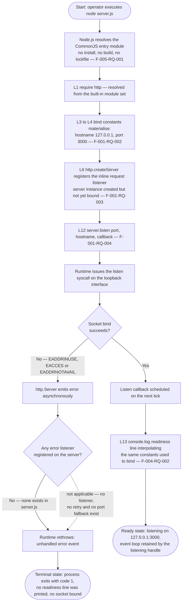
```mermaid
flowchart TD
    S(["Start: operator executes node server.js"]) --> Rt["Node.js resolves the CommonJS entry module<br/>no install, no build, no lockfile — F-005-RQ-001"]
    Rt --> L1["L1 require http — resolved from the built-in module set"]
    L1 --> L34["L3 to L4 bind constants materialise:<br/>hostname 127.0.0.1, port 3000 — F-001-RQ-002"]
    L34 --> L6["L6 http.createServer registers the inline request listener<br/>server instance created but not yet bound — F-001-RQ-003"]
    L6 --> L12["L12 server.listen port, hostname, callback — F-001-RQ-004"]
    L12 --> Syscall["Runtime issues the listen syscall on the loopback interface"]
    Syscall --> D1{"Socket bind<br/>succeeds?"}
    D1 -- "No — EADDRINUSE, EACCES or EADDRNOTAVAIL" --> Err["http.Server emits error asynchronously"]
    Err --> D2{"Any error listener<br/>registered on the server?"}
    D2 -- "No — none exists in server.js" --> Throw["Runtime rethrows: unhandled error event"]
    Throw --> Dead(["Terminal state: process exits with code 1,<br/>no readiness line was printed, no socket bound"])
    D1 -- "Yes" --> CbFire["Listen callback scheduled on the next tick"]
    CbFire --> L13["L13 console.log readiness line interpolating<br/>the same constants used to bind — F-004-RQ-002"]
    L13 --> Ready(["Ready state: listening on 127.0.0.1:3000,<br/>event loop retained by the listening handle"])
    D2 -. "not applicable — no listener,<br/>no retry and no port fallback exist" .-> Throw
```

| Step | Source | System Boundary Crossed | Notes |
|---|---|---|---|
| Module resolution | Runtime | Shell → process | No dependency resolution occurs: the single `require` targets a built-in module and no `node_modules` exists |
| Constant materialisation | `server.js` L3-L4 | None | Compile-time configuration only — no `process.env` or `process.argv` read anywhere |
| Server construction | `server.js` L6 | None | The listener is attached before any bind attempt, so no request can arrive before a handler exists |
| Bind | `server.js` L12 → runtime → OS | Process → OS network stack | The only asynchronous step in startup; the outcome is delivered either to the listen callback or to the `'error'` event |
| Readiness log | `server.js` L13 | Process → stdout | Verified output: `Server running at http://127.0.0.1:3000/`, exactly once |

The failure branch was reproduced rather than inferred. Starting a second instance while the first held the port produced `Error: listen EADDRINUSE: address already in use 127.0.0.1:3000` with `{ code: 'EADDRINUSE', errno: -98, syscall: 'listen', address: '127.0.0.1', port: 3000 }`, preceded by the runtime's `Unhandled 'error' event` rethrow and followed by exit code 1. Because the branch is reached through the generic unhandled-`'error'` path, any `listen` failure — a privileged port or an unavailable address, were the constants edited — terminates the process the same way. The first instance was unaffected and kept serving traffic.

### 4.2.2 W2 — Request-Response Flow

**Start point:** a client opens a TCP connection to `127.0.0.1:3000` and writes a request. **End point:** the 14-byte response is flushed and the socket is either retained for reuse or closed. Note that the application lane in the diagram contains no diamond at all — every diamond sits in the runtime lane.

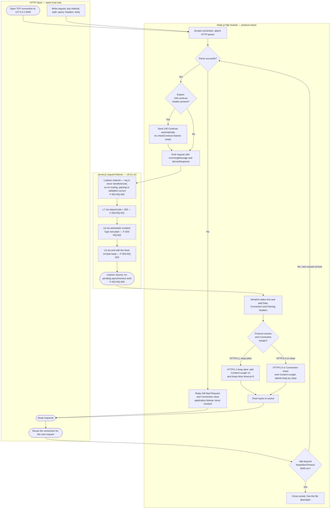
```mermaid
flowchart TD
    subgraph ClientSide["HTTP client — same host only"]
        C1(["Open TCP connection to 127.0.0.1:3000"])
        C2["Write request: any method, path, query, headers, body"]
        C3(["Read response"])
        C4(["Reuse the connection for the next request"])
    end
    subgraph RuntimeSide["Node.js http module — protocol owner"]
        R1["Accept connection, attach HTTP parser"]
        R2{"Parse succeeds?"}
        R3["Reply 400 Bad Request and Connection close<br/>application listener never invoked"]
        R4{"Expect:<br/>100-continue<br/>header present?"}
        R5["Send 100 Continue automatically<br/>no checkContinue listener exists"]
        R6["Emit request with IncomingMessage and ServerResponse"]
        R7["Serialize status line and add Date,<br/>Connection and framing headers"]
        R8{"Protocol version<br/>and Connection<br/>header?"}
        R9["HTTP/1.1 keep-alive: add Content-Length 14<br/>and Keep-Alive timeout=5"]
        R10["HTTP/1.0 or Connection close:<br/>omit Content-Length, delimit body by close"]
        R11["Flush bytes to socket"]
        R12{"Idle beyond<br/>keepAliveTimeout<br/>5000 ms?"}
        R13["Close socket, free the file descriptor"]
    end
    subgraph AppSide["server.js request listener — L6 to L10"]
        A1["Listener entered — req is never dereferenced,<br/>so no routing, parsing or validation occurs<br/>F-002-RQ-002"]
        A2["L7 res.statusCode = 200 — F-003-RQ-001"]
        A3["L8 res.setHeader Content-Type text-plain — F-003-RQ-002"]
        A4["L9 res.end with the fixed 14-byte body — F-003-RQ-003"]
        A5(["Listener returns; no pending asynchronous work<br/>F-002-RQ-003"])
        A1 --> A2 --> A3 --> A4 --> A5
    end
    C1 --> R1
    C2 --> R1
    R1 --> R2
    R2 -- "No" --> R3
    R3 --> C3
    R2 -- "Yes" --> R4
    R4 -- "Yes" --> R5
    R5 --> R6
    R4 -- "No" --> R6
    R6 --> A1
    A5 --> R7
    R7 --> R8
    R8 -- "HTTP/1.1, keep-alive" --> R9
    R8 -- "HTTP/1.0 or close" --> R10
    R9 --> R11
    R10 --> R11
    R11 --> C3
    C3 --> C4
    C4 --> R12
    R12 -- "No, new request arrives" --> R2
    R12 -- "Yes" --> R13
```

Observed responses that ground each branch:

| Probe | Result |
|---|---|
| `GET /` (HTTP/1.1) | `200 OK`, `Content-Type: text/plain`, `Date`, `Connection: keep-alive`, `Keep-Alive: timeout=5`, `Content-Length: 14`, body `Hello, World!` + newline |
| `POST /a/b?q=1` with form body and custom header | Byte-identical to `GET /` apart from the runtime-generated `Date` |
| `PURGE /zzz` (non-standard method) | `200 OK`, identical headers — no method allow-list exists |
| `GET / HTTP/1.0` | `200 OK` with `Connection: close` and **no** `Content-Length`; body delimited by connection close |
| Two pipelined requests in one write | Two `200` responses on the same socket, the second carrying `Connection: close` because the client asked for it |
| `Expect: 100-continue` | `100 Continue` emitted by the runtime, then the standard `200` |
| Three sequential requests, one connection | One TCP connect followed by two reuses — keep-alive confirmed |
| Ten parallel requests | All `200`; the synchronous listener serialises them on the single thread |
| Malformed request line (`GARBAGE!!!`) | `400 Bad Request` + `Connection: close`, produced by the parser with the listener never invoked |

The response-side error state deserves emphasis: there is no `4xx` or `5xx` transition anywhere in `server.js`. The only non-`200` status this system can produce is the parser's `400`, which the application neither generates nor observes.

### 4.2.3 W3 — Process Termination Flow

**Start point:** the *Ready* or *Serving* state. **End points:** process exit with code 130, 143, or 1. There is no drain phase, because `server.close` never appears in the codebase and no `process.on` handler is registered.

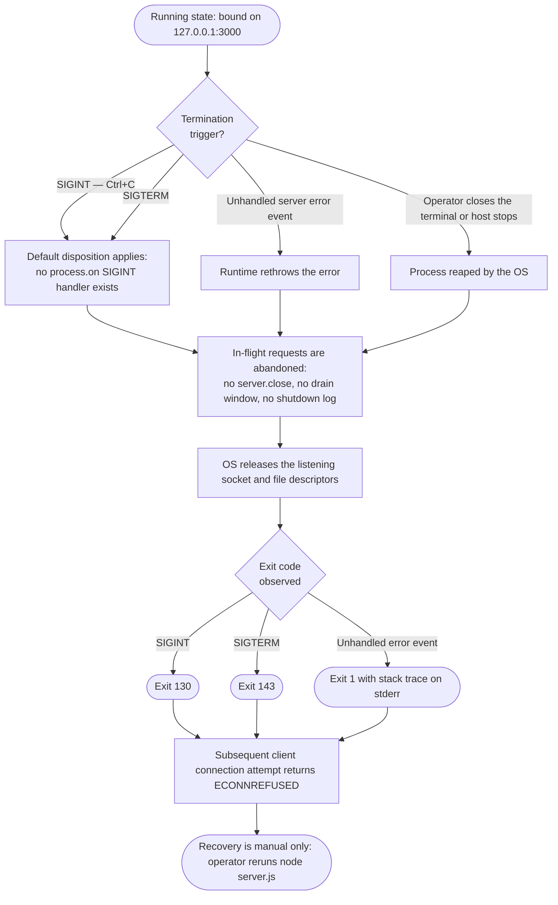
```mermaid
flowchart TD
    Live(["Running state: bound on 127.0.0.1:3000"]) --> Trig{"Termination<br/>trigger?"}
    Trig -- "SIGINT — Ctrl+C" --> Sig["Default disposition applies:<br/>no process.on SIGINT handler exists"]
    Trig -- "SIGTERM" --> Sig
    Trig -- "Unhandled server error event" --> Fault["Runtime rethrows the error"]
    Trig -- "Operator closes the terminal or host stops" --> Host["Process reaped by the OS"]
    Sig --> NoDrain["In-flight requests are abandoned:<br/>no server.close, no drain window, no shutdown log"]
    Fault --> NoDrain
    Host --> NoDrain
    NoDrain --> Release["OS releases the listening socket and file descriptors"]
    Release --> Code{"Exit code<br/>observed"}
    Code -- "SIGINT" --> E130(["Exit 130"])
    Code -- "SIGTERM" --> E143(["Exit 143"])
    Code -- "Unhandled error event" --> E1(["Exit 1 with stack trace on stderr"])
    E130 --> Post["Subsequent client connection attempt returns ECONNREFUSED"]
    E143 --> Post
    E1 --> Post
    Post --> Recover(["Recovery is manual only: operator reruns node server.js"])
```

Both signal paths were exercised: `SIGTERM` produced exit code 143 and `SIGINT` produced exit code 130, each with no additional stdout output, and a TCP probe to `127.0.0.1:3000` immediately afterwards returned `ECONNREFUSED`, confirming the OS released the port. The operational implication is that termination is indistinguishable from a crash from the client's perspective — the same reset and the same refusal follow either way, and nothing in the repository records that a shutdown occurred.

### 4.2.4 Validation Rules, Authorization Checkpoints and Compliance Checks

#### 4.2.4.1 Business Rules Per Step

| Workflow Step | Business Rule In Force | Enforcement Mechanism |
|---|---|---|
| Bind (W1) | Exactly one instance per host may own `127.0.0.1:3000` | Enforced by the OS, not by code — violation terminates the second process |
| Bind (W1) | Reachability is restricted to the local host | The `127.0.0.1` literal on L3; verified by `ECONNREFUSED` from `10.76.5.30` |
| Readiness log (W1) | The logged URL must match the bound socket | Structural: L13 interpolates the same `hostname`/`port` identifiers passed to `listen` on L12, so the two cannot drift |
| Request dispatch (W2) | Every request is admissible; none is rejected by the application | Single code path — no branch exists to reject one |
| Response (W2) | The response triple (status, media type, body) is invariant | Three unconditional statements, L7-L9; verified byte-identical across all probes |
| Termination (W3) | Availability ends immediately when the process ends | No supervisor, restart policy, or drain logic exists in the repository |

#### 4.2.4.2 Data Validation Requirements

No data validation is performed at any step, and the reason is structural rather than an omission of rigour in one place: the `req` object is never dereferenced, so there is no value to validate.

| Candidate Validation | Status | Evidence |
|---|---|---|
| Request method allow-list | Absent | `PURGE /zzz` answered `200` |
| Path or route validation | Absent | Every path answered identically; no route table exists |
| Query-string or body parsing and schema validation | Absent | `POST` body ignored; no parser, schema, or `JSON` usage in the file |
| Header validation, content negotiation | Absent | No `req.headers` reference; `Content-Type` is set on the response unconditionally |
| Request size limits | Absent from application code | `maxHeadersCount` is `null` and `maxRequestsPerSocket` is `0` (unlimited) — the runtime defaults, unmodified |
| Host/port literal validation at startup | Absent | Constants are never checked; correctness rests on them being compile-time literals |
| Output validation | Not applicable | The payload is a source literal and cannot be malformed at runtime |

The only inbound validation that occurs anywhere in the stack is HTTP framing validation by the parser (decision D3), which yields the observed `400 Bad Request`. That check protects the runtime, not the business logic, and the application is not informed when it fires.

#### 4.2.4.3 Authorization Checkpoints

| Checkpoint Position | Control Present |
|---|---|
| Network admission | Loopback-only bind — the sole access control in the system |
| Transport | None — plaintext HTTP; no TLS material and no `https` usage |
| Pre-dispatch (before the listener runs) | None — no credential extraction, token check, or IP allow-list |
| In-handler | None — no authentication, authorization, session, cookie, or CORS logic (`auth`, `token`, `session`, `cookie` all return zero matches) |
| Rate limiting or throttling | None in application code |
| Response | None — no security headers (`Strict-Transport-Security`, `X-Content-Type-Options`, `Content-Security-Policy`) are set |

Any client process on the same host can obtain the full response without presenting anything. That is the complete authorization model.

#### 4.2.4.4 Regulatory Compliance Checks

None applicable, and this is verifiable rather than assumed. No request attribute — including client address, headers, and body — is read, stored, forwarded, or logged, so no personal data is processed and no retention, disclosure, or audit obligation is created by operation of the program. The response payload is a fixed ASCII string containing no user or sensitive data. Correspondingly, no compliance *control* exists either: there is no audit log, no request trace, no consent or data-subject mechanism, no certificate or cipher policy, and no `LICENSE` file declaring a license grant.

### 4.2.5 Timing and SLA Considerations

The repository declares no service-level objective, latency budget, throughput target, or availability commitment — there is no configuration file, monitoring definition, health endpoint, or CI performance gate in which one could be expressed. The figures below are therefore measurements and runtime defaults, explicitly not commitments.

| Timing Property | Value | Source |
|---|---|---|
| Loopback request latency (5 samples) | 0.379–0.461 ms total, of which ~0.05–0.07 ms is connection setup and 0.361–0.442 ms is time-to-first-byte | Measured against the running process |
| Per-request application work | Three synchronous statements, no I/O wait, no allocation beyond the response object | `server.js` L7-L9 |
| Startup time to readiness | One module evaluation plus one `listen` syscall; no dependency loading beyond a built-in module | `server.js` L1-L14 |
| `keepAliveTimeout` | 5000 ms — surfaces to clients as the `Keep-Alive: timeout=5` response header | Node.js `http.Server` default, not overridden |
| `headersTimeout` | 60000 ms — bounds how long an incomplete request head is tolerated | Node.js `http.Server` default, not overridden |
| `requestTimeout` | 300000 ms — bounds total request receipt time | Node.js `http.Server` default, not overridden |
| Socket inactivity `timeout` | `0` — disabled | Node.js `http.Server` default, not overridden |
| Connection-checking sweep interval | 30000 ms — the cadence at which the two timeouts above are evaluated | Node.js `http.Server` default, not overridden |
| `maxRequestsPerSocket` | `0` (unlimited requests per keep-alive connection) | Node.js `http.Server` default, not overridden |
| Recovery time after termination | Unbounded — depends entirely on an operator noticing and rerunning `node server.js` | No supervisor, restart policy, or health check exists |

Two timing risks follow directly from these defaults being untouched. A client that opens a connection and stops writing occupies a file descriptor for up to 60 seconds without the application ever being aware, and because `maxRequestsPerSocket` is unlimited and `timeout` is disabled, the process applies no per-connection ceiling of its own. Both behaviours are inherited from the runtime, so changing them would require code that does not currently exist.


## 4.3 Technical Implementation

### 4.3.1 State Management

#### 4.3.1.1 State Inventory and Transitions

The system holds three pieces of state, all of them in process memory and none of them survivable across a restart:

| State | Lifetime | Mutability | Location |
|---|---|---|---|
| `hostname` and `port` constants | Process lifetime | Immutable (`const`) | `server.js` L3-L4 |
| `server` (`http.Server`) instance and its listening handle | From L6 until process exit | Bound once, never closed | `server.js` L6, L12 |
| Per-request `IncomingMessage` / `ServerResponse` pair | One listener invocation | `res` mutated three times; `req` never touched | Parameters of the L6 callback |

No state crosses request boundaries. There is no counter, cache entry, session map, connection pool, or module-level mutable variable — the handler is stateless by construction (F-002), which is why a failed request has no effect on any subsequent one. The formal state machines for the process, the connection, and the response object are given in 4.5.

The transition table below is the compact form of those machines, listing what causes each move and what the durable effect is:

| From | To | Trigger | Durable Effect |
|---|---|---|---|
| Not running | Listening | `server.listen` succeeds (L12) | A kernel-level listening socket; nothing written to disk |
| Not running | Failed (exit 1) | `'error'` emitted with no listener | A stack trace on stderr; no artifact retained |
| Listening | Serving | `request` event dispatched to the L6 listener | None — no record that a request occurred |
| Serving | Listening | `res.end` completes (L9) | None — per-request memory released |
| Listening or Serving | Terminated | `SIGINT` / `SIGTERM` / unhandled error | The port is released by the OS |

#### 4.3.1.2 Data Persistence Points

There are none. Every candidate persistence point was checked individually and found absent, which is what the dotted edges in the following diagram denote — they mark paths that do **not** exist in code.

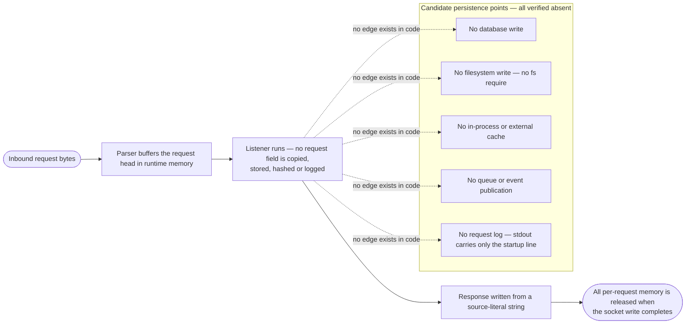
```mermaid
flowchart LR
    In(["Inbound request bytes"]) --> Parse["Parser buffers the request head in runtime memory"]
    Parse --> Handled["Listener runs — no request field is copied,<br/>stored, hashed or logged"]
    Handled --> Out["Response written from a source-literal string"]
    Out --> Gone(["All per-request memory is released when<br/>the socket write completes"])
    subgraph PersistencePoints["Candidate persistence points — all verified absent"]
        NoDb["No database write"]
        NoFile["No filesystem write — no fs require"]
        NoCache["No in-process or external cache"]
        NoQueue["No queue or event publication"]
        NoLog["No request log — stdout carries only the startup line"]
    end
    Handled -. "no edge exists in code" .-> NoDb
    Handled -. "no edge exists in code" .-> NoFile
    Handled -. "no edge exists in code" .-> NoCache
    Handled -. "no edge exists in code" .-> NoQueue
    Handled -. "no edge exists in code" .-> NoLog
```

The single `require` in the codebase targets `http`; there is no `fs`, no database driver, and no client SDK, so the process creates no file, temporary artifact, lockfile, or cache directory during its lifetime. The only durable artifacts in the repository are the two tracked source files themselves.

#### 4.3.1.3 Caching Requirements

No caching layer exists and none is required by the workload: the response is a 14-byte source literal, so there is nothing to compute, fetch, or memoise. The consequences worth recording are on the HTTP side rather than the storage side — the application sets no `Cache-Control`, `ETag`, `Last-Modified`, or `Expires` header, so client and intermediary caching behaviour for this endpoint is left entirely to client defaults. Connection reuse via keep-alive (5000 ms idle window) is the only reuse mechanism present anywhere in the flow, and it is supplied by the `http` module rather than by application code.

#### 4.3.1.4 Transaction Boundaries

There is no transactional resource in the system — no database, message broker, or file write — so there is no commit, rollback, or compensation logic (`transaction`, `commit`, `rollback` all return zero matches). The nearest analogue to a transaction boundary is the request listener invocation itself, and it has useful atomicity properties worth stating precisely:

- The boundary opens when the runtime emits `request` and closes when the L9 `res.end` call returns; nothing is scheduled beyond it because the file contains no `async`, `await`, `Promise`, or timer (F-002-RQ-003).
- Within the boundary the three mutations (status, header, body) are unconditional, so the response can never be half-formed by a skipped branch.
- The boundary is not atomic at the transport level: if the client aborts mid-write, the runtime destroys the socket and the partial write is simply lost. Nothing needs to be undone, because no side effect outside the socket ever occurred.
- Concurrent boundaries do not interleave. The listener is fully synchronous on a single-threaded event loop, so each invocation runs to completion before the next begins — verified by ten parallel requests all returning `200`.

### 4.3.2 Error Handling

#### 4.3.2.1 Error Classification and Handling Paths

The application contains no error-handling construct: `try`, `catch`, `throw`, `.on('error')`, `process.on('uncaughtException')` and `process.on('unhandledRejection')` are all absent. Fault handling is therefore entirely inherited from the runtime, and the diagram below traces each fault class to the actor that handles it, the notification channel available, and the recovery route.

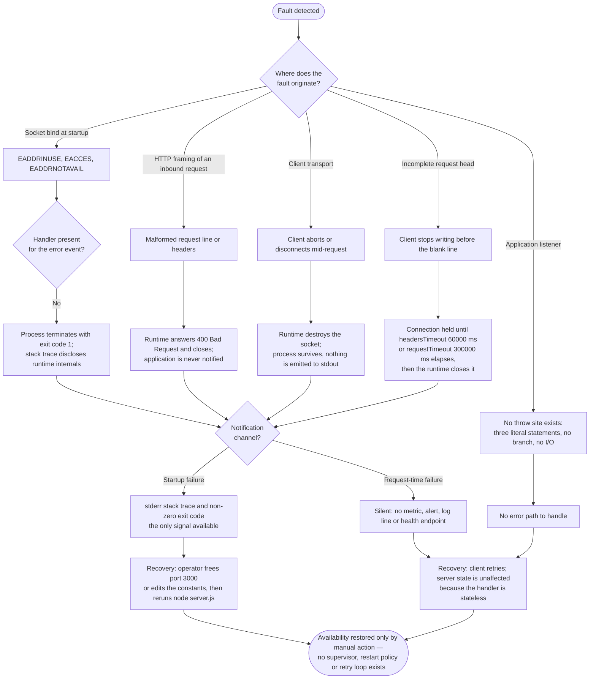
```mermaid
flowchart TD
    Fault(["Fault detected"]) --> Class{"Where does the<br/>fault originate?"}
    Class -- "Socket bind at startup" --> F1["EADDRINUSE, EACCES, EADDRNOTAVAIL"]
    Class -- "HTTP framing of an inbound request" --> F2["Malformed request line or headers"]
    Class -- "Client transport" --> F3["Client aborts or disconnects mid-request"]
    Class -- "Incomplete request head" --> F4["Client stops writing before the blank line"]
    Class -- "Application listener" --> F5["No throw site exists:<br/>three literal statements, no branch, no I/O"]
    F1 --> H1{"Handler present<br/>for the error event?"}
    H1 -- "No" --> R1["Process terminates with exit code 1;<br/>stack trace discloses runtime internals"]
    F2 --> H2["Runtime answers 400 Bad Request and closes;<br/>application is never notified"]
    F3 --> H3["Runtime destroys the socket;<br/>process survives, nothing is emitted to stdout"]
    F4 --> H4["Connection held until headersTimeout 60000 ms<br/>or requestTimeout 300000 ms elapses,<br/>then the runtime closes it"]
    F5 --> H5["No error path to handle"]
    R1 --> Notify{"Notification<br/>channel?"}
    H2 --> Notify
    H3 --> Notify
    H4 --> Notify
    Notify -- "Startup failure" --> N1["stderr stack trace and non-zero exit code<br/>the only signal available"]
    Notify -- "Request-time failure" --> N2["Silent: no metric, alert, log line or health endpoint"]
    N1 --> Rec1["Recovery: operator frees port 3000<br/>or edits the constants, then reruns node server.js"]
    N2 --> Rec2["Recovery: client retries; server state is unaffected<br/>because the handler is stateless"]
    H5 --> Rec2
    Rec1 --> End(["Availability restored only by manual action —<br/>no supervisor, restart policy or retry loop exists"])
    Rec2 --> End
```

#### 4.3.2.2 Retry Mechanisms

None exist in the repository. There is no retry helper, no backoff calculation, no attempt counter, and no port-fallback logic — `retry`, `backoff`, `setTimeout` and `setInterval` return zero matches. Specifically:

- A failed bind is not retried. The `'error'` event goes unhandled and the process exits immediately with code 1, which is why exactly one instance per host is possible.
- A failed or aborted request is not retried server-side, and cannot be: the server holds no record that the request existed.
- Retry responsibility rests entirely with external actors — the operator for startup, the client for requests. This is safe for the client because the endpoint is idempotent by construction (every request produces the same response and no side effect).

#### 4.3.2.3 Fallback Processes

No fallback path exists at any layer. There is no alternate port, no degraded response mode, no static error page, no circuit breaker, and no secondary instance — and because the response is a source literal with no upstream dependency, there is also nothing for a fallback to substitute for. The system is binary: either the socket is bound and every request receives the same `200`, or the process is absent and every connection attempt receives `ECONNREFUSED`.

#### 4.3.2.4 Error Notification Flows

| Fault Class | Channel | Recipient | Observed Content |
|---|---|---|---|
| Startup bind failure | stderr + exit code 1 | Whoever is watching the foreground shell | Full stack trace including runtime internal frames (`Server.setupListenHandle`, `listenInCluster`, `emitErrorNT`) and the error object with `code`, `errno`, `syscall`, `address`, `port` |
| Signal termination | Exit code only (130 / 143) | Parent shell | No message — stdout ends after the readiness line |
| Malformed request | HTTP `400` on the wire | The offending client only | Status line plus `Connection: close`; the operator sees nothing |
| Client abort, half-open connection | None | — | Completely silent; verified that stdout remained unchanged and the process stayed alive |

The notification model has one usable positive signal and one usable negative signal, both at startup: the presence of the readiness line means the socket is bound, and its absence means it is not. After startup the process is silent, so an operator cannot distinguish a healthy idle server from one that has been receiving malformed traffic for an hour. There is no health endpoint, structured log, metric, or alert integration anywhere in the repository to close that gap.

#### 4.3.2.5 Recovery Procedures

| Scenario | Recovery Procedure | Automation Available |
|---|---|---|
| `EADDRINUSE` on start | Identify and stop the process holding `127.0.0.1:3000`, or edit the `port` constant on L4, then rerun `node server.js` | None |
| Process terminated by signal or crash | Rerun `node server.js`; startup is stateless so no cleanup, migration, or cache warm-up is needed | None — no supervisor, systemd unit, container restart policy, or CI/CD deployment exists in the repository |
| Client-visible request failure | Client retries; the server requires no action because it retained no state | Client-side only |
| Need to change host or port | Edit L3-L4 and restart — configuration is compile-time only | None |

Recovery is fast in the sense that startup does no work beyond one module evaluation and one syscall, and it is entirely manual in the sense that nothing in the repository will notice a stopped process or start a new one. Mean time to recovery is therefore a function of operator attention, not of system design — a property that follows from the same absences recorded as constraints in sub-section 2.5.6.


## 4.4 Integration Sequence Diagrams

The participants in these diagrams are the complete set of integration parties available to this system: the operator's shell, the Node.js runtime (acting as HTTP framework, protocol handler, and process host), the `server.js` module, the OS network stack, and a same-host HTTP client. No external service, broker, datastore, or peer process appears, because none is referenced anywhere in the codebase. Sub-section 2.3.2 shows the happy-path sequence attributed to features; the sequences below add the runtime/OS hops and the four failure sequences.

### 4.4.1 Startup Integration Sequence

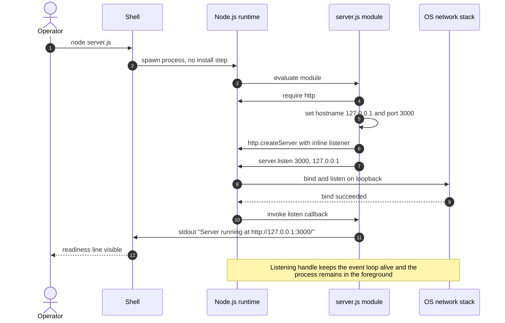
```mermaid
sequenceDiagram
    autonumber
    actor OP as Operator
    participant SH as Shell
    participant NODE as Node.js runtime
    participant APP as server.js module
    participant OS as OS network stack
    OP->>SH: node server.js
    SH->>NODE: spawn process, no install step
    NODE->>APP: evaluate module
    APP->>NODE: require http
    APP->>APP: set hostname 127.0.0.1 and port 3000
    APP->>NODE: http.createServer with inline listener
    APP->>NODE: server.listen 3000, 127.0.0.1
    NODE->>OS: bind and listen on loopback
    OS-->>NODE: bind succeeded
    NODE->>APP: invoke listen callback
    APP->>SH: stdout "Server running at http://127.0.0.1:3000/"
    SH-->>OP: readiness line visible
    Note over NODE,OS: Listening handle keeps the event loop alive and the<br/>process remains in the foreground
```

The ordering constraint that matters operationally is that the readiness line (step 12) can only follow a successful bind (step 9), so an operator who sees it has already confirmed the socket exists. The reverse also holds: no readiness line means no socket, with no ambiguous middle case.

### 4.4.2 Request Service Sequence with Connection Reuse

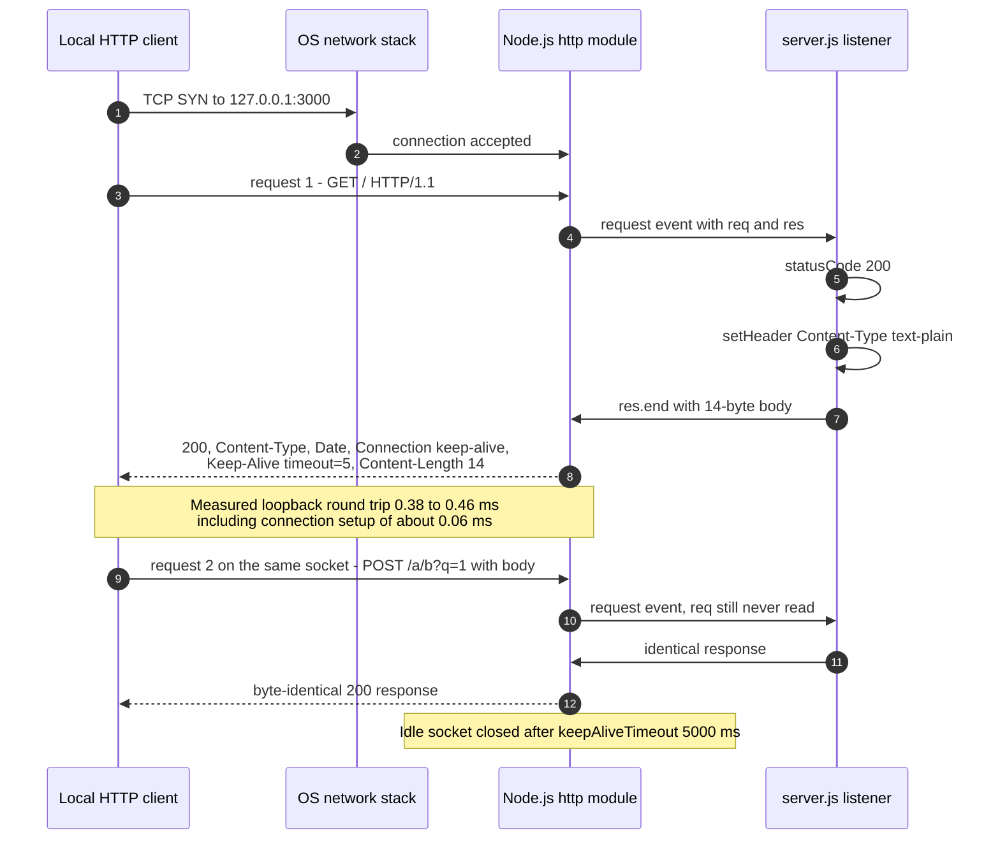
```mermaid
sequenceDiagram
    autonumber
    participant CL as Local HTTP client
    participant OS as OS network stack
    participant NODE as Node.js http module
    participant APP as server.js listener
    CL->>OS: TCP SYN to 127.0.0.1:3000
    OS->>NODE: connection accepted
    CL->>NODE: request 1 - GET / HTTP/1.1
    NODE->>APP: request event with req and res
    APP->>APP: statusCode 200
    APP->>APP: setHeader Content-Type text-plain
    APP->>NODE: res.end with 14-byte body
    NODE-->>CL: 200, Content-Type, Date, Connection keep-alive,<br/>Keep-Alive timeout=5, Content-Length 14
    Note over CL,NODE: Measured loopback round trip 0.38 to 0.46 ms<br/>including connection setup of about 0.06 ms
    CL->>NODE: request 2 on the same socket - POST /a/b?q=1 with body
    NODE->>APP: request event, req still never read
    APP->>NODE: identical response
    NODE-->>CL: byte-identical 200 response
    Note over NODE: Idle socket closed after keepAliveTimeout 5000 ms
```

Step 11 is the sequence's substantive point: the second request differs from the first in method, path, query string, and body, and yet steps 12-13 are indistinguishable from steps 4-8. The `Date` header is the only varying byte in the response, and it is generated by the runtime.

### 4.4.3 Bind Conflict Failure Sequence

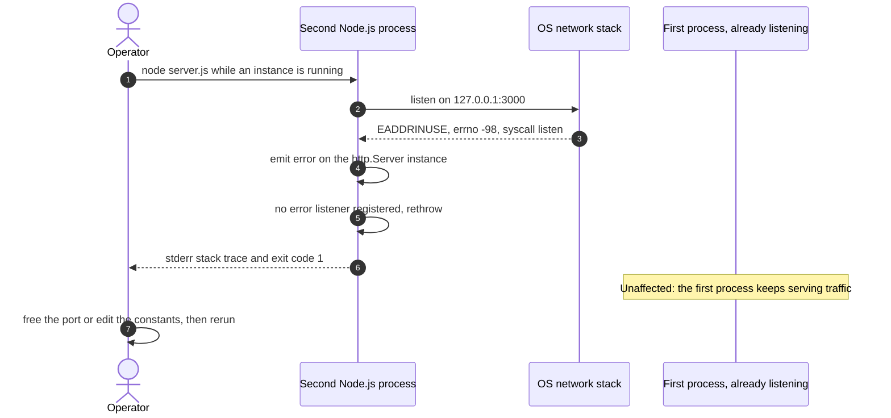
```mermaid
sequenceDiagram
    autonumber
    actor OP as Operator
    participant NODE2 as Second Node.js process
    participant OS as OS network stack
    participant NODE1 as First process, already listening
    OP->>NODE2: node server.js while an instance is running
    NODE2->>OS: listen on 127.0.0.1:3000
    OS-->>NODE2: EADDRINUSE, errno -98, syscall listen
    NODE2->>NODE2: emit error on the http.Server instance
    NODE2->>NODE2: no error listener registered, rethrow
    NODE2-->>OP: stderr stack trace and exit code 1
    Note over NODE1: Unaffected: the first process keeps serving traffic
    OP->>OP: free the port or edit the constants, then rerun
```

This sequence is the concrete form of the "exactly one instance per host" constraint. Note the isolation property confirmed during verification: the incumbent process was not disturbed by the failed second start and continued serving requests normally, so the failure mode is a start-time rejection rather than a service outage.

### 4.4.4 Protocol-Level Fault Sequences

The three faults below share one property that makes them worth grouping: in each case the runtime handles the fault and the application is never informed, so no application-level trace of them exists.

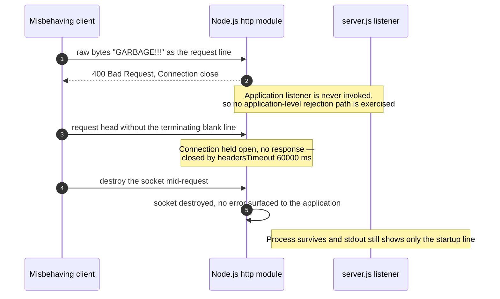
```mermaid
sequenceDiagram
    autonumber
    participant CL as Misbehaving client
    participant NODE as Node.js http module
    participant APP as server.js listener
    CL->>NODE: raw bytes "GARBAGE!!!" as the request line
    NODE-->>CL: 400 Bad Request, Connection close
    Note over NODE,APP: Application listener is never invoked,<br/>so no application-level rejection path is exercised
    CL->>NODE: request head without the terminating blank line
    Note over NODE: Connection held open, no response —<br/>closed by headersTimeout 60000 ms
    CL->>NODE: destroy the socket mid-request
    NODE->>NODE: socket destroyed, no error surfaced to the application
    Note over APP: Process survives and stdout still shows only the startup line
```

All three were exercised against the running process, and the process remained alive and responsive throughout. The resilience is real but it is the runtime's, not the application's: the same absence of application error handling that makes a bind failure fatal also means these request-level faults cannot reach any application code to destabilise it.

### 4.4.5 Termination Sequence with an In-Flight Request

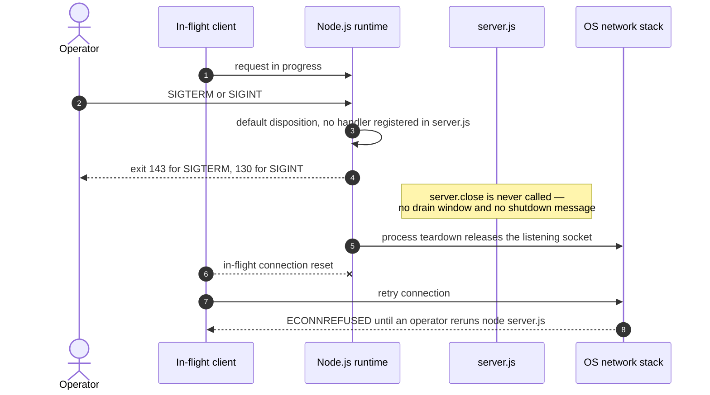
```mermaid
sequenceDiagram
    autonumber
    actor OP as Operator
    participant CL as In-flight client
    participant NODE as Node.js runtime
    participant APP as server.js
    participant OS as OS network stack
    CL->>NODE: request in progress
    OP->>NODE: SIGTERM or SIGINT
    NODE->>NODE: default disposition, no handler registered in server.js
    NODE-->>OP: exit 143 for SIGTERM, 130 for SIGINT
    Note over APP: server.close is never called —<br/>no drain window and no shutdown message
    NODE->>OS: process teardown releases the listening socket
    CL--x NODE: in-flight connection reset
    CL->>OS: retry connection
    OS-->>CL: ECONNREFUSED until an operator reruns node server.js
```

Steps 3-5 are where a graceful-shutdown implementation would normally sit — stop accepting, drain in-flight work, close the server, then exit. None of those steps exists here, which is why the in-flight client observes a reset rather than a completed response. Because the handler is stateless and writes nothing outside the socket, an abandoned request leaves no partial work to reconcile, so the cost of the missing drain is confined to the affected client connection.


## 4.5 State Transition Diagrams

Three state machines are observable in this system, at three different scopes: the process and its server instance, an individual TCP connection, and a single response object. All three are complete — every state and transition shown was either read directly from `server.js` or produced during runtime verification, and no state was added for symmetry.

### 4.5.1 Process and Server Lifecycle

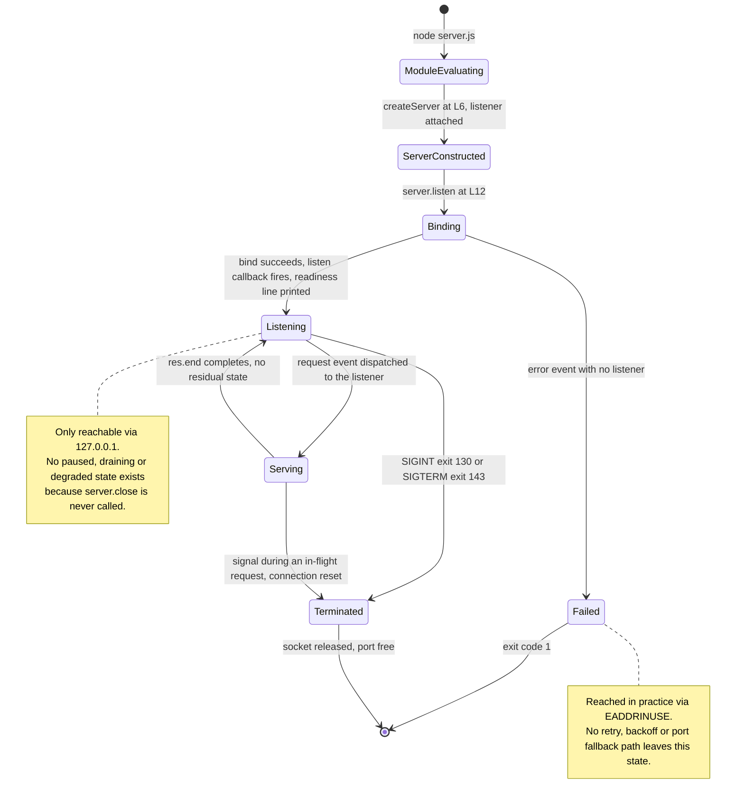
```mermaid
stateDiagram-v2
    [*] --> ModuleEvaluating : node server.js
    ModuleEvaluating --> ServerConstructed : createServer at L6, listener attached
    ServerConstructed --> Binding : server.listen at L12
    Binding --> Listening : bind succeeds, listen callback fires, readiness line printed
    Binding --> Failed : error event with no listener
    Listening --> Serving : request event dispatched to the listener
    Serving --> Listening : res.end completes, no residual state
    Listening --> Terminated : SIGINT exit 130 or SIGTERM exit 143
    Serving --> Terminated : signal during an in-flight request, connection reset
    Failed --> [*] : exit code 1
    Terminated --> [*] : socket released, port free
    note right of Listening
        Only reachable via 127.0.0.1.
        No paused, draining or degraded state exists
        because server.close is never called.
    end note
    note right of Failed
        Reached in practice via EADDRINUSE.
        No retry, backoff or port fallback path leaves this state.
    end note
```

| Transition | Trigger | Persistence / Side Effect |
|---|---|---|
| `ModuleEvaluating → ServerConstructed` | `http.createServer` (L6) | In-memory server object; listener attached before any bind, so no request can arrive unhandled |
| `ServerConstructed → Binding` | `server.listen` (L12) | `listen` syscall issued; the only asynchronous step in startup |
| `Binding → Listening` | Bind success | Kernel listening socket; one stdout line (L13) |
| `Binding → Failed` | `'error'` with no listener | stderr stack trace; exit code 1 |
| `Listening → Serving` | `request` event | None |
| `Serving → Listening` | `res.end` returns (L9) | None — the handler retains nothing |
| `Listening`/`Serving → Terminated` | `SIGINT` (130), `SIGTERM` (143) | Port released by the OS; no shutdown record |

The machine has no *Draining* or *Degraded* state, and that is a code-level fact rather than a simplification: `server.close` never appears in the file, and no `process.on` handler exists to invoke it. It also has no self-loop for recovery — `Failed` and `Terminated` both lead only to process exit, so the sole route back to `Listening` is a fresh operator invocation.

### 4.5.2 Connection and Keep-Alive Lifecycle

This machine is owned entirely by the Node.js `http` module. It is documented here because it is where every timeout, rejection, and abort in the system actually resolves — the application participates in exactly one transition (`Dispatched → Responded`).

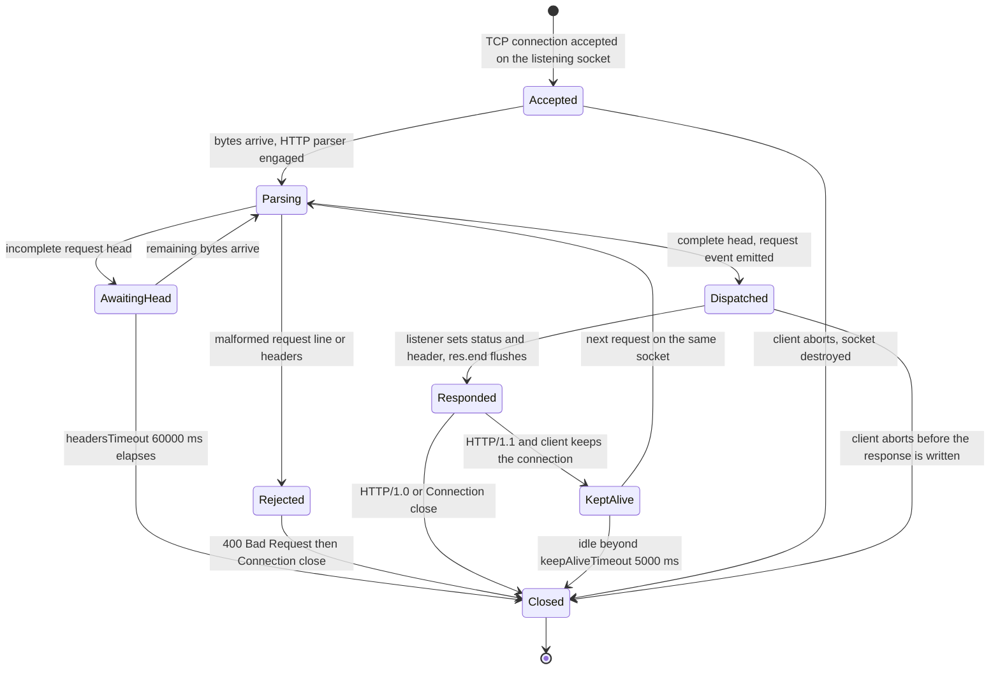
```mermaid
stateDiagram-v2
    [*] --> Accepted : TCP connection accepted on the listening socket
    Accepted --> Parsing : bytes arrive, HTTP parser engaged
    Parsing --> AwaitingHead : incomplete request head
    AwaitingHead --> Parsing : remaining bytes arrive
    AwaitingHead --> Closed : headersTimeout 60000 ms elapses
    Parsing --> Rejected : malformed request line or headers
    Rejected --> Closed : 400 Bad Request then Connection close
    Parsing --> Dispatched : complete head, request event emitted
    Dispatched --> Responded : listener sets status and header, res.end flushes
    Responded --> KeptAlive : HTTP/1.1 and client keeps the connection
    Responded --> Closed : HTTP/1.0 or Connection close
    KeptAlive --> Parsing : next request on the same socket
    KeptAlive --> Closed : idle beyond keepAliveTimeout 5000 ms
    Accepted --> Closed : client aborts, socket destroyed
    Dispatched --> Closed : client aborts before the response is written
    Closed --> [*]
```

Each timing-governed transition is annotated with the runtime default in force, none of which the repository overrides: `headersTimeout` 60000 ms, `requestTimeout` 300000 ms (bounding the whole `Parsing`/`AwaitingHead` phase), and `keepAliveTimeout` 5000 ms with the sweep that evaluates them running every 30000 ms. The `KeptAlive → Parsing` loop was observed serving three requests over one connection and answering two pipelined requests in order, and `maxRequestsPerSocket` is `0`, so the loop is not bounded by a request count.

### 4.5.3 Response Object Lifecycle

```mermaid
stateDiagram-v2
    [*] --> Fresh : ServerResponse constructed by the http module
    Fresh --> StatusSet : L7 statusCode = 200
    StatusSet --> HeaderSet : L8 setHeader Content-Type text-plain
    HeaderSet --> Ended : L9 res.end with the fixed 14-byte body
    Ended --> Flushed : runtime adds Date, Connection and framing headers, writes to socket
    Flushed --> [*] : object eligible for garbage collection
    note right of Fresh
        Headers are mutable only between Fresh and Ended.
        No branch can skip a transition because the
        three statements execute unconditionally.
    end note
    note right of Ended
        No writeHead, write, chunked streaming, trailer
        or 4xx-5xx transition exists anywhere in the code.
    end note
```

This machine is strictly linear, which is the structural reason for the invariance recorded as F-003-RQ-004: with no conditional and no alternate terminal state, two responses cannot differ except in the runtime-generated `Date` header and the framing choice the runtime makes for HTTP/1.0 clients. The `Flushed` transition is also the point at which all per-request state ceases to exist — there is no post-response hook, no `finish` or `close` listener, and nothing that outlives the object.


## 4.6 References

### 4.6.1 Repository Files and Folders Examined

- `server.js` - The sole executable module and the origin of every workflow step in this section: L1 `require('http')`; L3-L4 the `hostname` / `port` literals that fix the bind target; L6-L10 the inline request listener (status, header, fixed body) that constitutes the entire request workflow; L12-L14 the `listen` call and the readiness log that constitute the startup workflow. Its complete six-call inventory established that the application contains no branch, no error handler, no signal handler, no exports, and no asynchronous work.
- `README.md` - Confirmed to contain a single 23-byte heading line and therefore no workflow, runbook, operational procedure, or SLA statement that this section could draw on.
- `/` (repository root) - Enumerated to confirm only two first-order children and no subfolders, establishing the absence of scheduler definitions, job manifests, deployment or CI configuration, and any second module that could contribute a workflow.

### 4.6.2 Verified Absences That Shape This Section

Established by exhaustive existence checks and pattern searches over the two tracked files; each is documented above as an absence rather than an assumption:

- No `.blitzyignore` file anywhere in the repository or on the filesystem, so no path exclusions applied to this investigation.
- Zero matches for `if`, `switch`, `try`, `catch`, `throw`, `process.on`, `.on(`, `once(`, `setTimeout`, `setInterval`, `async`, `await`, `Promise`, `emit`, `server.close`, `writeHead`, `retry`, `validate`, `auth`, `cache`, `transaction`, `module.exports` and `req.` / `url` / `method` — the basis for every "no decision point", "no retry", "no validation", "no authorization", "no persistence", and "no graceful shutdown" statement.
- No `package.json`, lockfile, `node_modules`, test suite, CI workflow directory, container or deployment manifest, or environment/configuration file — the basis for the compile-time-only configuration finding and the absence of automated recovery.

### 4.6.3 Runtime Verification Performed Against the Repository

All timing values, status codes, headers, exit codes, and error traces cited in this section were produced by executing the unmodified `server.js` and observing it:

- Startup: stdout `Server running at http://127.0.0.1:3000/`, emitted exactly once.
- Request probes: `GET /`, `POST /a/b?q=1` with body and custom header, `PURGE /zzz`, `HTTP/1.0` request, two pipelined requests, `Expect: 100-continue`, three sequential requests over one connection, and ten parallel requests — all yielding the `200` / `text/plain` / 14-byte response documented in 4.2.2.
- Malformed and partial requests over a raw socket: `400 Bad Request` with `Connection: close`, and an incomplete head held open with no response.
- Client abort mid-request: socket destroyed, process survived, stdout unchanged.
- Loopback boundary: connect to the host's non-loopback address `10.76.5.30:3000` returned `ECONNREFUSED` while `127.0.0.1:3000` served traffic.
- Bind conflict: `Error: listen EADDRINUSE: address already in use 127.0.0.1:3000` with `code: 'EADDRINUSE'`, `errno: -98`, `syscall: 'listen'`, an unhandled-`'error'` rethrow, and exit code 1.
- Signals: `SIGTERM` → exit 143, `SIGINT` → exit 130, followed by `ECONNREFUSED` on the released port.
- `http.Server` defaults in force (introspected on an equivalent server, none overridden by the repository): `keepAliveTimeout` 5000 ms, `headersTimeout` 60000 ms, `requestTimeout` 300000 ms, `timeout` 0, `maxHeadersCount` `null`, `maxRequestsPerSocket` 0, connection-checking interval 30000 ms.
- Latency samples on loopback: 0.379-0.461 ms total per request, with connection setup of 0.053-0.072 ms.
- Verification runtime: Node.js v22.23.2, an environment fact — the repository declares no engine constraint.

### 4.6.4 Technical Specification Cross-References

- `2.2 Functional Requirements` - Source of the `F-001`…`F-006` and `F-XXX-RQ-YYY` identifiers used to annotate the flow diagrams, and of the convention that performance figures are reported only where measured.
- `2.3 Feature Relationships` - Established the three-point integration inventory (inbound socket, outbound stdout, inbound process invocation) and the Node-runtime-supplied common services that this section's integration workflows expand on; its dependency map (2.3.1) and feature-attributed sequence (2.3.2) are referenced rather than repeated.
- `2.5 Traceability, Assumptions and Constraints` - Source of the constraint wording honoured throughout (compile-time-only configuration, loopback-only reachability, one instance per host, no error or signal handling, plaintext HTTP, single-threaded execution) and of the pointers to the existing flow views in sub-sections 1.2.2.3 and 1.3.1.2.


# 5. System Architecture

## 5.1 High-Level Architecture

### 5.1.1 System Overview

#### 5.1.1.1 Architecture Style and Rationale

The system is a **single-process, single-module synchronous HTTP responder** built directly on the Node.js standard library. The entire architecture is contained in one 14-line CommonJS file, `server.js`, whose only import is the built-in `http` module (line 1). There is no second module, no directory hierarchy, no dependency manifest, and no build artifact — `git ls-files` returns exactly `server.js` and `README.md`.

Classified against conventional architecture styles, the system is best described as a **degenerate monolith**: a monolith in that one deployable unit owns every responsibility, degenerate in that the unit contains a single request path with no branching, no layers, and no domain logic. The following classification is asserted only where the code supports it:

| Architectural Dimension | Observed Style | Evidence |
|---|---|---|
| Deployment topology | Single process, single instance per host | One entry point; port `3000` is a literal with no fallback (`server.js` L4) |
| Internal structure | One module, no layering | Single `require.cache` entry at runtime; no `module.exports` (L1-L14) |
| Communication | Synchronous request/response | `http.createServer` listener writes and ends inline (L6-L10) |
| State model | Stateless | No module-level mutable variable, no store, no session |
| Configuration | Compile-time literals | `hostname` and `port` are `const` (L3-L4); no `process.env` read exists |

The rationale is not stated in the repository — `README.md` contains only the heading `# Hello_world_26_Aug_01` — so it must be inferred from the design's internal consistency rather than from documented intent. Every choice in the file points the same direction: eliminate everything not required to answer an HTTP request. Using the standard-library `http` API instead of a framework removes the install step; hard-coding the socket removes configuration loading; ignoring the request removes routing and parsing; binding loopback removes exposure. The result is an architecture whose complete behavior can be read in one screen and executed with one command, which is the coherent design goal the code supports.

#### 5.1.1.2 Architectural Principles Actually Present

These principles are derived from code properties, each individually verified:

- **Zero-dependency execution (F-005).** The dependency graph has exactly one node. At runtime `require.cache` holds a single entry, so there is no transitive dependency tree, no lockfile to reconcile, and no supply-chain surface.
- **Statelessness by construction (F-002).** The `req` parameter is never read and no variable outlives a request, so no request can influence another. This is what makes the endpoint idempotent and makes concurrent handling safe without any locking.
- **Unconditional execution path.** The listener body (L7-L9) contains no branch, no loop, and no `await`. There is exactly one code path from request to response, so the response cannot be partially formed by a skipped branch.
- **Runtime-delegated protocol handling.** HTTP/1.1 parsing, framing, keep-alive management, and the `Date`, `Connection`, `Keep-Alive`, and `Content-Length` headers are produced by the `http` module, not by application code. The application contributes only a status code, one header, and a body.
- **Fail-fast startup.** The server object carries **zero `'error'` listeners** (verified by inspecting the object the L6 call constructs), so a bind failure terminates the process rather than degrading it. There is no half-available state.

The principles that are conspicuously *absent* are equally load-bearing for this document: there is no separation of concerns (no layers to separate), no dependency inversion (no interface to invert), no defensive programming (no validation or error handling), and no configurability (no injection point of any kind).

#### 5.1.1.3 System Boundaries and Major Interfaces

The system has exactly **one inbound interface and zero outbound interfaces**. The boundary was confirmed empirically rather than inferred: with the process running, a request to `http://127.0.0.1:3000/` returned `HTTP/1.1 200 OK`, while a request to the same port on the host's own routable interface (`10.76.5.30:3000`) was unreachable. Loopback binding is therefore a hard boundary, not a convention.

| Boundary | Interface | Direction | Contract |
|---|---|---|---|
| Network | TCP listener on `127.0.0.1:3000`, HTTP/1.1 | Inbound | Any method, path, query, or body yields `200` / `text/plain` / `Hello, World!\n` |
| Process stdout | `console.log` readiness line | Outbound (observability) | Exactly one line, emitted once at bind success (L13) |
| Process invocation | `node server.js` | Inbound (control) | The only entry point; no exports, no CLI arguments parsed |
| Process signals | `SIGINT` / `SIGTERM` | Inbound (control) | Handled by runtime defaults only — no handler is registered, so termination is immediate |

Nothing crosses the boundary outward except the response bytes and the single startup line. There is no outbound HTTP client, no database connection, no message publication, and no filesystem access — the single `require` in the codebase targets `http`, and an outbound integration would necessarily require a further import that does not exist.

```mermaid
flowchart TB
    subgraph External["Outside the Boundary — same host only"]
        Operator["Operator or Developer<br/>shell session"]
        Client["HTTP client<br/>curl, browser, script"]
    end

    subgraph Runtime["Node.js Runtime — supplies all common services"]
        Loader["CommonJS module loader"]
        HttpMod["Built-in http module<br/>HTTP/1.1 parse, frame, keep-alive"]
        Loop["Single-threaded event loop<br/>socket I O scheduling"]
        Stdout["console and stdout stream"]
    end

    subgraph App["Application — server.js, one module"]
        Config["Configuration constants<br/>hostname 127.0.0.1, port 3000<br/>L3-L4"]
        Srv["http.Server instance<br/>created L6, bound L12"]
        Listener["Request listener<br/>status, header, body<br/>L7-L9"]
        Logger["Readiness logger<br/>L13"]
    end

    Operator -->|"node server.js"| Loader
    Loader --> Config
    Config --> Srv
    Config --> Logger
    Srv -->|"listen port, hostname"| Loop
    Loop -->|"bind success invokes callback"| Logger
    Logger --> Stdout
    Stdout -->|"one readiness line"| Operator

    Client -->|"HTTP request on 127.0.0.1:3000"| HttpMod
    HttpMod -->|"request event, req never read"| Listener
    Listener -->|"res.end fixed 14-byte body"| HttpMod
    HttpMod -->|"200 text-plain plus runtime headers"| Client

    NoOut["No outbound interface exists:<br/>no DB, cache, queue, filesystem or<br/>third-party API call anywhere in the code"]
    App -. "verified absent" .-> NoOut
```

### 5.1.2 Core Components

The system's five components are internal responsibilities within one file rather than separately deployable units. They are treated as components because they have distinct lifecycles and distinct failure characteristics, which is what makes the distinction useful architecturally.

| Component | Primary Responsibility | Key Dependencies |
|---|---|---|
| Runtime Dependency Binding (L1) | Resolve the built-in `http` module into the module scope | Node.js CommonJS loader; no package registry |
| Configuration Constants (L3-L4) | Hold the immutable bind address `127.0.0.1` and port `3000` | None — literal values in source |
| HTTP Server Instance (L6, bound L12) | Own the listening socket and dispatch `request` events | `http` module; OS TCP stack; free port on loopback |
| Request Listener (L6-L10) | Produce the invariant response for every request | The `ServerResponse` object supplied per invocation |
| Startup Readiness Logger (L13) | Emit the one-line readiness signal to stdout | `console` global; the `listen` completion callback; the L3-L4 constants |

The integration points and the consideration that dominates each component's risk profile:

| Component | Integration Points | Critical Consideration |
|---|---|---|
| Runtime Dependency Binding | CommonJS loader only | Adding one third-party import converts the zero-install contract into an install-and-lockfile pipeline |
| Configuration Constants | Consumed by `listen` (L12) and the log message (L13) | The only cross-cutting value in the system; changing either constant requires a source edit and restart |
| HTTP Server Instance | Inbound TCP socket; event loop | Carries **no `'error'` listener**, so `EADDRINUSE` terminates the process with exit code 1 and a stack trace |
| Request Listener | `request` event in; response bytes out | Cannot differentiate any request — method, path, query, headers, and body are all ignored |
| Startup Readiness Logger | Process stdout | The system's entire observability surface; nothing is emitted after startup |

Because the `hostname`/`port` pair is shared by reference between the bind call and the log message, the readiness line can never advertise a socket different from the one actually bound — a small but genuine architectural invariant.

### 5.1.3 Data Flow Description

#### 5.1.3.1 Primary Data Flows

There are two flows in the system, and they meet only at the configuration constants.

The **startup flow** runs once. The loader evaluates `server.js`, binding `http` into scope and materialising the two constants. `http.createServer` constructs the server object with the listener already attached, which is why no request can ever arrive before a handler exists. `server.listen(port, hostname, …)` issues the only asynchronous operation in startup; on success the runtime invokes the completion callback, which interpolates the same two constants into the readiness line and writes it to stdout. Startup ends with the process resident and idle, held alive solely by the referenced listening socket.

The **request flow** runs per request and is entirely inbound-to-outbound with no fan-out. The `http` module accepts the connection, parses the request head, and emits `request`. The listener sets `res.statusCode = 200`, sets `Content-Type: text/plain`, and calls `res.end('Hello, World!\n')` — three unconditional mutations of the response object. The runtime then adds `Date`, `Connection`, `Keep-Alive`, and `Content-Length` and flushes 14 bytes to the socket. Verified end to end: `Content-Length: 14`, `Connection: keep-alive`, `Keep-Alive: timeout=5`.

The critical property of the request flow is that **no request data enters it**. The `req` object is bound as a parameter and never dereferenced, so the flow carries information in one direction only. This was confirmed behaviourally: varying method, path, query string, and body produced byte-identical responses.

#### 5.1.3.2 Integration Patterns and Protocols

| Aspect | Observed Value | Notes |
|---|---|---|
| Inbound protocol | HTTP/1.1 over TCP, plaintext | No `https` or `tls` import exists |
| Interaction pattern | Synchronous request/response | No queue, callback, webhook, or streaming pattern |
| Connection management | Keep-alive, runtime-managed | Three requests served over one TCP connection, verified |
| Content negotiation | None | `Accept` is never read; `text/plain` is unconditional |
| Outbound protocols | None | Zero outbound calls of any kind |

Connection reuse is worth noting as an architectural property because it is the only resource-efficiency mechanism anywhere in the flow, and it is supplied entirely by the `http` module: `keepAliveTimeout` is 5000 ms, `maxRequestsPerSocket` is 0 (unbounded), and the application overrides neither.

#### 5.1.3.3 Data Transformation Points

The system performs no data transformation in the usual sense — there is no parsing of input into a domain model, no serialisation of a domain model into output, and no mapping, validation, or enrichment step. The only transformations that occur are:

1. **Template interpolation at startup** — `hostname` and `port` are interpolated into the readiness string (L13). This is the sole computed value in the entire system.
2. **String-to-bytes encoding at response time** — `res.end` encodes the 14-character literal into the socket write. Performed by the runtime, not by application code.

The response body is a source literal, so there is no point in the flow at which its content is derived from anything.

#### 5.1.3.4 Data Stores and Caches

There are none, and the absence is structural rather than incidental. No database driver, ORM, schema, or migration exists; no `fs` import exists, so the process creates no file, temporary artifact, or lockfile; no in-process cache, memoisation table, or external cache client exists. The only memory the system holds is the two constants, the server object, and the per-request request/response pair, all of which are released or persist for the process lifetime as described in sub-section 4.3.1.

One consequence deserves architectural emphasis: because the application sets no `Cache-Control`, `ETag`, `Last-Modified`, or `Expires` header, caching behaviour for this endpoint at clients and intermediaries is left entirely to client defaults. The system neither caches nor instructs anyone else how to.

### 5.1.4 External Integration Points

The verified integration inventory contains **no external systems**. The three integration points that exist are all local to the host and are properly characterised as platform interfaces rather than system integrations:

| Interface | Integration Type | Data Exchange Pattern | Protocol / Format |
|---|---|---|---|
| Local HTTP client | Inbound, synchronous | Request/response, one exchange per request | HTTP/1.1 plaintext, `text/plain` body |
| Process stdout | Outbound, fire-and-forget | Single write at startup | UTF-8 text line |
| Shell / process invocation | Inbound, control plane | One-shot process start | `node server.js`, no arguments parsed |

Categories checked individually and confirmed absent: databases and data warehouses, caches and key-value stores, message brokers and event streams, third-party or partner APIs, identity providers and authentication services, payment or notification providers, object storage, monitoring or log-aggregation backends, service registries, and feature-flag services. There is no dependency manifest, so no vendor SDK or client library is installed.

**On SLA requirements:** the repository declares none, and none can be attributed to this system without fabrication. There is no SLO definition, monitoring configuration, uptime target, latency budget, error-budget policy, or contractual document anywhere in the tree, and no supervisor or restart policy exists that could underpin an availability commitment. What can be stated is the measured behaviour and the structural availability ceiling:

| Property | Observed Value | Status |
|---|---|---|
| Local round-trip latency (20 sequential requests) | median 0.233 ms, min 0.185 ms, max 0.557 ms | Sandbox measurement, not a commitment |
| Concurrent request success rate (50 parallel) | 50 of 50 returned `200` | Sandbox measurement |
| Availability model | Binary — either bound and serving, or absent with `ECONNREFUSED` | Structural consequence of no error handling and no supervisor |
| Recovery mechanism | Manual re-invocation only | No automation exists in the repository |

These are reported as evidence of current behaviour under specific conditions. They are not performance guarantees, and the measurement environment (Node.js v22.23.2, loopback, unloaded host) is an environment fact rather than a declared requirement.


## 5.2 Component Details

Five application components and one platform boundary make up the system. Each is documented against the same five attributes — purpose, technologies, interfaces, persistence, and scaling — so that the uniform absences (persistence in particular) are visible as a pattern rather than repeated by omission.

### 5.2.1 Component Interaction Model

The diagram below shows control and data flow between components, distinguishing the one-time startup interactions from the repeating request interactions. Note that no component calls another component's function: coupling is by shared constant, by object construction, and by runtime event dispatch.

```mermaid
flowchart TB
    subgraph Startup["Startup Path — executes once per process"]
        L1["Runtime Dependency Binding<br/>L1 require http"]
        L34["Configuration Constants<br/>L3 hostname, L4 port"]
        L6["HTTP Server Instance<br/>L6 createServer"]
        L12["Bind Operation<br/>L12 server.listen"]
        L13["Readiness Logger<br/>L13 console.log"]
        L1 -->|"provides createServer and Server class"| L6
        L34 -->|"supplies bind arguments by reference"| L12
        L6 -->|"server object with listener pre-attached"| L12
        L12 -->|"invokes completion callback on bind success"| L13
        L34 -->|"same two constants interpolated into the message"| L13
    end

    subgraph RequestPath["Request Path — executes per request, unbounded repetitions"]
        Dispatch["Runtime dispatches the request event<br/>owned by the http module"]
        Handler["Request Listener<br/>L7 status, L8 header, L9 end"]
        ResObj["ServerResponse instance<br/>constructed fresh per request"]
        Dispatch -->|"invokes listener with req and res"| Handler
        Handler -->|"three unconditional mutations"| ResObj
        ResObj -->|"runtime frames and flushes 14 bytes"| Dispatch
    end

    L12 ==>|"bound socket enables dispatch"| Dispatch
    L1 -->|"http module also owns parsing, framing and keep-alive"| Dispatch
    Handler -.->|"never reads req — no coupling to request data"| Dispatch
```

Two structural facts are visible in the diagram. First, the Configuration Constants component is the only node with two consumers, making it the system's single point of shared state. Second, the Bind Operation is a strict gate: nothing on the request path can execute until it succeeds, which is why its failure (documented in 5.4.3) suppresses every other component simultaneously.

### 5.2.2 Configuration Constants

| Attribute | Detail |
|---|---|
| Purpose | Hold the immutable network identity of the listener — bind address `127.0.0.1` (L3) and TCP port `3000` (L4) |
| Technologies | ECMAScript `const` bindings in CommonJS module scope. No configuration library, parser, or schema |
| Interfaces | Consumed twice: as positional arguments to `server.listen` (L12) and via template interpolation in the readiness message (L13) |
| Persistence | None. Values live in the module scope for the process lifetime and are re-materialised from source on every start |
| Scaling | This component is the primary scaling obstacle. The port literal admits exactly one instance per host, and the loopback literal excludes every remote client and every container-external caller |

The component has no override mechanism of any kind: `process.env` is never read, no CLI argument is parsed, no config file is loaded, and no default-with-fallback expression exists. Changing either value is a source edit followed by a restart. This is recorded as a constraint in sub-section 2.5.6 and is the direct cause of the containerization finding in 3.6.3 — a loopback-bound process inside a container is unreachable regardless of published ports.

### 5.2.3 HTTP Server Instance

| Attribute | Detail |
|---|---|
| Purpose | Own the listening TCP socket, accept connections, and dispatch a `request` event per parsed request head |
| Technologies | `http.Server` from the Node.js built-in `http` module, created by `http.createServer` (L6) and bound by `server.listen` (L12) |
| Interfaces | Inbound: TCP on `127.0.0.1:3000`, HTTP/1.1. Outbound to the application: the `request` event. Control: `listen` |
| Persistence | None. The listening handle is kernel state, released by the OS at process exit. `server.close` never appears in the code |
| Scaling | Bounded to one process and one event loop. No `cluster`, no `worker_threads`, no load balancer, no `maxConnections` cap set |

The instance is configured entirely by runtime defaults, none of which the repository overrides. These values were read from the object that the L6 call constructs and they define the component's real timing behaviour:

| Property | Value | Architectural Effect |
|---|---|---|
| `keepAliveTimeout` | 5000 ms | Idle connections are reclaimed automatically; verified as three requests over one connection |
| `headersTimeout` | 60000 ms | Bounds a client that stops mid-head |
| `requestTimeout` | 300000 ms | Bounds the whole request-receipt phase |
| `server.timeout` | 0 | Per-socket inactivity timeout is disabled |
| `maxRequestsPerSocket` | 0 | Connection reuse is unbounded by request count |
| `'error'` listener count | **0** | Any server-level error becomes an unhandled event and terminates the process |

The zero error-listener count is the single most consequential property of this component. It converts every socket-level failure into a process-level failure, which is the mechanism behind the `EADDRINUSE` termination reproduced in 3.6.5 and diagrammed in 5.4.3.

Two interactions worth noting for correctness reasoning: the listener is attached at construction (L6) *before* the bind (L12), so a request can never arrive at an unhandled server; and because `close` is never called, the component has no draining or degraded state — it is either bound or gone.

### 5.2.4 Request Listener

| Attribute | Detail |
|---|---|
| Purpose | Produce the invariant response for every request — status `200`, `Content-Type: text/plain`, body `Hello, World!\n` (F-002, F-003) |
| Technologies | An anonymous arrow function passed to `createServer` (L6-L10), using the `ServerResponse` API only. No router, middleware chain, or framework |
| Interfaces | Receives `(req, res)`. Calls exactly three members: `res.statusCode`, `res.setHeader`, `res.end` |
| Persistence | None, and none is possible — no field of `req` is copied, hashed, logged, or stored |
| Scaling | Fully synchronous with no I/O, so each invocation runs to completion on the event loop before the next begins. Throughput is bound by event-loop turnaround, not by contention |

The listener's defining architectural property is that it is a **constant function of a request it never inspects**. `req` is bound as a parameter and never dereferenced, which yields three useful consequences: the endpoint is idempotent, concurrent invocations cannot interfere (verified as 50 of 50 parallel requests returning `200`), and no request-derived data can leak into a response or a log.

Its second property is the absence of any failure mode of its own. The body is three unconditional statements with no branch, no I/O, no `await`, no timer, and no `throw` site, so there is no application-level error path to design around — the fault classification in 5.4.3 attributes every fault class to the runtime or the client, never to this component.

The response headers the application does *not* set are architecturally significant: no `Cache-Control`, `ETag`, or `Last-Modified` (so caching is left to client defaults), and no `X-Content-Type-Options`, `Content-Security-Policy`, `Strict-Transport-Security`, or CORS header (so no security header policy is expressed at all).

### 5.2.5 Startup Readiness Logger

| Attribute | Detail |
|---|---|
| Purpose | Emit the single readiness signal `Server running at http://127.0.0.1:3000/` after a successful bind (F-004) |
| Technologies | The `console` global writing to process stdout, invoked from the `listen` completion callback (L13). No logging library |
| Interfaces | Outbound to stdout only. Triggered exclusively by the L12 completion callback |
| Persistence | None. Output is not written to a file, rotated, or shipped anywhere; retention depends entirely on how the operator captured the terminal |
| Scaling | Not applicable — the component executes exactly once per process lifetime |

This component is the system's entire observability surface, and its coverage is precisely one event. Verified: after more than seventy requests, stdout still contained exactly one line. The positive signal (line present, therefore socket bound) and the negative signal (line absent, therefore not bound) are both available only at startup; afterwards the process is silent regardless of what it is doing.

Because the message interpolates the same constants passed to `listen`, the advertised URL and the bound socket cannot drift apart — a genuine invariant, though one that also means an operator reading the log learns nothing the source does not already state.

### 5.2.6 Runtime Platform Boundary

The Node.js runtime is not part of the repository, but every service the application depends on is provided by it, so its responsibilities must be enumerated to make the architecture complete:

| Runtime Service | What It Provides Here | Application's Contribution |
|---|---|---|
| CommonJS module loader | Resolves the single built-in import with no resolution step (L1) | One `require` call |
| `http` module | HTTP/1.1 parsing, framing, keep-alive, `400` rejection of malformed requests, and the `Date`, `Connection`, `Keep-Alive`, `Content-Length` headers | Status, one header, body |
| Event loop and socket I/O | Single-threaded dispatch that keeps the process resident while the socket is referenced | Nothing — no scheduling code exists |
| `console` / stdout | The one output channel | One `console.log` call |
| Default signal handling | Immediate termination on `SIGINT` / `SIGTERM` | Nothing — no handler is registered |

The repository declares no engine range, `.nvmrc`, or manifest, so the runtime version is an environment fact rather than a specified dependency; verification for this document was performed on Node.js v22.23.2. The measured resident footprint of the running process was approximately 47 MB with 7 OS threads — the threads belong to the libuv pool and V8 helpers, while JavaScript execution remains single-threaded. The architectural reading is that essentially the entire footprint is runtime, not application: the deployable source is 342 bytes.

### 5.2.7 Component State Transitions

The authoritative state machines for the process, the connection, and the response object are in sub-section 4.5. What follows is the component-scoped view: the state of the **HTTP Server Instance** annotated with which component is active in each state, which is the information needed when reasoning about component responsibility rather than about lifecycle.

```mermaid
stateDiagram-v2
    [*] --> Unconstructed : module evaluation begins, L1 binding resolved
    Unconstructed --> Constructed : L6 createServer — Request Listener attached before any bind
    Constructed --> Binding : L12 listen invoked with the L3-L4 constants
    Binding --> Bound : bind succeeds — Readiness Logger fires, then falls silent forever
    Binding --> ProcessDead : error event with zero listeners — exit code 1
    Bound --> Dispatching : runtime emits request — Request Listener is the active component
    Dispatching --> Bound : res.end returns — no component retains anything
    Bound --> ProcessDead : SIGINT 130 or SIGTERM 143 — no handler, no drain
    Dispatching --> ProcessDead : signal during an in-flight request — connection reset
    ProcessDead --> [*] : port released by the OS
    note right of Bound
        The steady state. Every component is idle
        and the process is silent. No health endpoint
        or metric distinguishes this from an overloaded server.
    end note
    note right of ProcessDead
        The only route back to Bound is a fresh
        operator invocation of node server.js.
        No supervisor or restart policy exists.
    end note
```

The machine contains no *Degraded*, *Draining*, or *ReadOnly* state. That is a code-level fact: `server.close` never appears, no `process.on` handler exists to invoke it, and no component has a mode switch or feature flag.

### 5.2.8 Key Flow Sequences

#### 5.2.8.1 Startup Sequence — Component View

```mermaid
sequenceDiagram
    participant OP as Operator Shell
    participant LOADER as CommonJS Loader
    participant CONST as Configuration Constants
    participant SRV as HTTP Server Instance
    participant OS as OS TCP Stack
    participant LOG as Readiness Logger

    OP->>LOADER: node server.js
    LOADER->>LOADER: resolve built-in http, single cache entry
    LOADER->>CONST: materialise hostname and port as const
    LOADER->>SRV: createServer with the Request Listener attached
    Note over SRV: Handler exists before any socket does,<br/>so no request can arrive unhandled
    SRV->>CONST: read bind arguments by reference
    SRV->>OS: listen on 127.0.0.1 port 3000
    alt Bind succeeds
        OS-->>SRV: socket bound and listening
        SRV->>LOG: invoke completion callback
        LOG->>CONST: interpolate the same two values
        LOG-->>OP: stdout Server running at http URL
        Note over OP: This is the last output the operator<br/>will ever see from the process
    else Port already in use
        OS-->>SRV: EADDRINUSE
        SRV->>SRV: emit error with zero listeners registered
        SRV-->>OP: stderr stack trace and exit code 1
    end
```

#### 5.2.8.2 Request Service Sequence — Component View

```mermaid
sequenceDiagram
    participant CLI as Local HTTP Client
    participant HTTP as http Module
    participant HANDLER as Request Listener
    participant RES as ServerResponse Object

    CLI->>HTTP: request on the bound socket, any method or path
    HTTP->>HTTP: parse request head, construct req and res
    HTTP->>HANDLER: emit request with req and res
    Note over HANDLER: req is never dereferenced —<br/>the response is independent of the input
    HANDLER->>RES: statusCode = 200
    HANDLER->>RES: setHeader Content-Type text-plain
    HANDLER->>RES: end with the fixed 14-byte body
    RES->>HTTP: response complete
    HTTP->>HTTP: add Date, Connection, Keep-Alive, Content-Length
    HTTP-->>CLI: 200 OK with 14-byte body
    Note over HTTP,CLI: Connection held for keep-alive up to 5000 ms —<br/>verified serving three requests over one connection
    HTTP->>HANDLER: next request on the same connection reuses this path
```

Both sequences are complete: there is no third flow. The system has exactly one startup path and one request path, and no background job, scheduled task, or shutdown routine exists to document. The broader operator-facing and failure-mode sequences are covered in sub-section 4.4.


## 5.3 Technical Decisions

The repository contains **no architecture documentation, ADR directory, design note, or commit message that states a rationale** — the two commits are titled "Initial commit" and "Add files via upload", and `README.md` holds only the project heading. Every decision below is therefore *reconstructed from the artifact*: the choice is a verified fact of the code, while the rationale is the reading the evidence best supports, and the tradeoffs are the consequences that follow whether or not they were intended. Nothing in this sub-section should be read as a recovered author intent.

### 5.3.1 Decision Summary

| Decision Point | Option Selected | Verified In |
|---|---|---|
| Architecture style | Single-process, single-module monolith | `server.js` — the only source file |
| HTTP layer | Node.js built-in `http` module | L1, the sole `require` |
| Dependency posture | Zero third-party dependencies | No manifest, no lockfile, one `require.cache` entry |
| Module system | CommonJS with no exports | L1 `require`, absence of `module.exports` |
| Communication pattern | Synchronous HTTP request/response | L6-L10, no async primitive anywhere |
| Configuration source | Compile-time literals | L3-L4, no `process.env` read |
| Bind scope | Loopback only | L3 `'127.0.0.1'`, confirmed unreachable off-loopback |
| Data storage | None | No driver, no `fs` import, no schema |
| Caching | None, and no cache directives emitted | No cache client, no `Cache-Control` header |
| Error handling | Delegated entirely to the runtime | Zero `try`/`catch`/`throw`, zero `'error'` listeners |
| Concurrency model | Single-threaded event loop | No `cluster`, no `worker_threads` |
| Transport security | Plaintext HTTP | No `https` or `tls` import, no certificate material |

### 5.3.2 Architecture Style Decision and Tradeoffs

The decision to keep the entire system in one 14-line module rather than introducing layers, routers, or services is the root decision from which most others follow. Its tradeoff profile is unusually clean because the system has no requirement the structure fails to meet:

| Dimension | Benefit Realised | Cost Incurred |
|---|---|---|
| Comprehensibility | Complete behaviour readable in one screen | No structure to guide any future extension |
| Startup and footprint | Startup is one module evaluation plus one syscall; source is 342 bytes | Essentially the whole ~47 MB resident footprint is runtime overhead |
| Change safety | No inter-module contract can break | Any change touches the only file, so blast radius is total |
| Testability | Nothing to mock | The module cannot be imported without starting a listener as a side effect, because it exports nothing |
| Operability | Nothing to configure or orchestrate | No seam exists at which configuration, logging, or error handling could be inserted without editing the request path |

The most significant reconstructed tradeoff is the **standard library over framework** choice. Using `http.createServer` directly rather than Express, Koa, or Fastify is what makes `node server.js` sufficient with no install step (F-005), and for a single fixed response a router and middleware chain would add cost with no benefit. The cost is that the application inherits nothing: no routing, no body parsing, no error middleware, no security headers, and no request logging exist because nothing supplies them. Every one of those absences documented elsewhere in this specification is a direct consequence of this single decision.

The **zero-dependency posture** deserves separate emphasis as an architectural property rather than a convenience. With one node in the dependency graph there is no transitive tree to audit, no lockfile to reconcile, no version drift, and no supply-chain surface. The boundary is sharp and fragile in one direction: introducing a single third-party package converts the one-command execution contract into an install-then-run pipeline with the lockfile and scanning obligations described in sub-section 3.6.2.

### 5.3.3 Communication Pattern Choice

The system implements exactly one communication pattern: **synchronous, stateless request/response over HTTP/1.1**. The evidence for its completeness is the absence of every alternative — no `async`/`await`, no `Promise`, no timer, no event emitter registration, no queue client, no WebSocket or SSE usage, and no outbound call of any kind.

| Pattern | Present | Basis |
|---|---|---|
| Synchronous request/response | Yes | The listener body completes within one event-loop turn (L7-L9) |
| Connection reuse (keep-alive) | Yes, runtime-supplied | `keepAliveTimeout` 5000 ms; three requests over one connection, verified |
| Asynchronous messaging or events | No | No broker client, no publication, no subscription |
| Streaming or long-lived connections | No | `res.write`, chunked transfer, and trailers are all absent |
| Request/reply to any upstream | No | Zero outbound integrations |

The choice is well matched to the workload: the response requires no I/O, so there is nothing to await, and making the handler asynchronous would add scheduling overhead without enabling any concurrency the event loop does not already provide. The measured consequence is that 50 parallel requests all succeeded with no contention handling in the code, because each fully synchronous invocation runs to completion before the next begins.

The pattern's limit is that it offers no back-pressure mechanism of its own. `maxConnections` is unset and `maxRequestsPerSocket` is 0, so admission control is entirely the runtime's and the OS accept queue's concern; the application expresses no limit, no rate cap, and no queue depth.

### 5.3.4 Data Storage and Caching Rationale

**Storage: none, and none is required.** The response is a source literal, so there is no state to durably hold — no entity, no session, no counter, no audit record. Every candidate persistence mechanism was individually verified absent: no database driver or ORM, no `fs` import (so not even a temporary file or lockfile is created), no object-storage client, and no schema or migration artifact. The rationale is therefore not a tradeoff between storage options but the observation that the workload has no storage requirement at all. The architectural benefit is that startup does no warm-up, recovery needs no cleanup or migration, and the process can be killed at any instant without risking data loss or inconsistency. The corresponding limit is absolute: nothing the system does can be remembered, counted, or audited.

**Caching: none at any layer, and no directive to clients.** There is no in-process memoisation, no external cache client, and no HTTP cache header. Justifying the absence of a cache is straightforward — the "computation" being cached would be reading a 14-byte string literal, so a cache lookup would cost more than the operation it replaces:

| Cache Layer | Status | Assessment |
|---|---|---|
| In-process memoisation | Absent | Nothing is computed, so there is nothing to memoise |
| External cache (Redis, Memcached) | Absent | Would introduce a network hop and a dependency to serve a constant |
| HTTP response cache directives | Absent | **This is the consequential gap** — no `Cache-Control`, `ETag`, `Last-Modified`, or `Expires` is set |
| Connection reuse | Present, runtime-supplied | The only reuse mechanism in the system |

The third row is the one with a real effect: because the application emits no cache directives for a response that is provably immutable, client and intermediary caching behaviour is left entirely to client defaults. A response that could safely be cached indefinitely is served with no guidance about caching at all.

### 5.3.5 Security Mechanism Selection

The application implements **no security mechanism in code**. There is no authentication, authorization, session handling, input validation, rate limiting, CORS policy, security header, or TLS material — verified by the single-`require` result, which excludes `crypto`, `tls`, and `https`. The one control that exists is a network-scope decision rather than a security feature:

| Control | Status | Effective Protection |
|---|---|---|
| Loopback-only bind (L3) | Present, de facto | The sole control. Confirmed: off-loopback requests to the host's routable interface are unreachable |
| Authentication / authorization | Absent | None — every caller is equally and fully authorised |
| TLS / HTTPS | Absent | Traffic is plaintext, though it never leaves the host |
| Input validation | Absent, and not required | No request field is read, so no injection surface exists |
| Rate limiting / DoS controls | Absent | No connection or request cap is expressed by the application |
| Security response headers | Absent | No CSP, HSTS, `X-Content-Type-Options`, or CORS policy |

The reconstructed rationale is coherent for the artifact as written: with no request data read, no data store, no credential, and no outbound call, the system holds nothing worth protecting and offers no injection or exfiltration surface, so network isolation is a proportionate control. Two attack surfaces nonetheless remain and should be recorded plainly. First, a bind failure prints a stack trace disclosing runtime-internal paths to whoever can see stderr. Second, the loopback boundary is the *only* thing standing between this endpoint and an unauthenticated internet-reachable service — a one-character edit to L3 removes every control the system has at once.

### 5.3.6 Decision Tree

The tree below shows the decision points that shaped the architecture and the branch actually taken at each, read from the code. Unselected branches are shown to make the tradeoff space explicit, not to imply they were deliberated.

```mermaid
flowchart TD
    Start(["Serve an HTTP response"]) --> Q1{"Framework or<br/>standard library?"}
    Q1 -->|"SELECTED — stdlib"| A1["require http, L1<br/>no install step, F-005"]
    Q1 -->|"not taken"| B1["Express, Koa or Fastify<br/>adds manifest, lockfile, install"]

    A1 --> Q2{"Does the response<br/>depend on the request?"}
    Q2 -->|"SELECTED — no"| A2["req never dereferenced, L6-L10<br/>no router, parser or validator needed"]
    Q2 -->|"not taken"| B2["Routing plus body parsing<br/>plus validation plus error branches"]

    A2 --> Q3{"Is any state<br/>retained?"}
    Q3 -->|"SELECTED — no"| A3["Stateless handler<br/>no store, cache, session or counter"]
    Q3 -->|"not taken"| B3["Database or cache client<br/>plus connection pool plus migrations"]

    A3 --> Q4{"Where does<br/>configuration live?"}
    Q4 -->|"SELECTED — in source"| A4["const literals, L3-L4<br/>nothing to load or validate"]
    Q4 -->|"not taken"| B4["Environment variables or config file<br/>enables ports, hosts and environments"]

    A4 --> Q5{"Who handles<br/>faults?"}
    Q5 -->|"SELECTED — the runtime"| A5["Zero error listeners<br/>fail fast, exit code 1"]
    Q5 -->|"not taken"| B5["error listener plus signal handlers<br/>plus graceful shutdown"]

    A5 --> Q6{"What is the<br/>network scope?"}
    Q6 -->|"SELECTED — loopback"| A6["Bind 127.0.0.1<br/>isolation replaces authentication"]
    Q6 -->|"not taken"| B6["Bind 0.0.0.0<br/>would require auth, TLS and rate limiting"]

    A6 --> Outcome(["Result: 342 bytes, one command,<br/>one invariant response, no external surface"])
```

The tree is a single unbranched path, which is the point: each selection removes the need for the machinery the next question would otherwise introduce. It is also the map of what any future extension costs — moving off any one branch pulls in the machinery of every branch below it.

### 5.3.7 Architecture Decision Records

The records below are reconstructed, not recovered. Each states the decision as observed, the context available from the artifact, and the consequences that are verified facts of the running system. All carry the same status — **Accepted, as evidenced by the code at commit `5925dae`** — because no alternative was ever recorded as proposed, superseded, or deprecated.

#### ADR-001 — Use the Node.js Standard Library Instead of a Web Framework

- **Context.** A single fixed HTTP response is required. No routing, negotiation, or middleware requirement is expressed anywhere in the repository.
- **Decision.** Build on `http.createServer` (L1, L6). Take no third-party dependency.
- **Consequences.** `node server.js` runs with no install step and the source is the artifact (F-005). The dependency graph has one node, so there is no lockfile, version drift, or supply-chain surface. Conversely the application inherits no routing, body parsing, error middleware, security headers, or request logging — every such absence documented in this specification traces here. Introducing one package converts the execution contract into an install-then-run pipeline.

#### ADR-002 — Handle Every Request Identically and Ignore Request Data

- **Context.** The system serves one greeting. No endpoint inventory, request schema, or content-negotiation requirement exists.
- **Decision.** Never dereference `req`. Set status, one header, and a literal body unconditionally (L7-L9).
- **Consequences.** The endpoint is idempotent and inherently safe under concurrency — 50 parallel requests all returned `200` with no synchronisation code. There is no injection surface, because no input is read. The handler has no `throw` site, so no application-level error path exists. The cost is that the system cannot ever distinguish a caller, a path, or a method, and cannot log or count what it served.

#### ADR-003 — Hold Configuration as Compile-Time Literals

- **Context.** One deployment target — the developer's own host. No environment matrix is described in the repository.
- **Decision.** Declare `hostname` and `port` as module-scope `const` values (L3-L4) and read no environment variable or file.
- **Consequences.** Startup requires no configuration loading or validation, and the readiness message provably matches the bound socket because both read the same identifiers. The costs are structural: one instance per host, no per-environment override, no container viability without a source edit (3.6.3), and no way to relocate the listener at runtime.

#### ADR-004 — Bind Loopback Only, Using Network Isolation in Place of Authentication

- **Context.** No authenticated caller, credential, or exposure requirement is described. The system holds no data.
- **Decision.** Bind the literal `127.0.0.1` (L3). Implement no authentication, TLS, or rate limiting.
- **Consequences.** Remote reachability is eliminated — verified by the failed off-loopback request — which is why the total absence of authentication is not immediately exploitable. Equally, isolation is the *only* control present, so it is a single point of security failure: changing the bind address exposes an unauthenticated plaintext endpoint with no rate limiting or security headers.

#### ADR-005 — Delegate All Fault Handling to the Runtime and Fail Fast

- **Context.** No availability target, supervisor, or restart policy exists in the repository.
- **Decision.** Register no `'error'` listener, no `try`/`catch`, and no signal handler. Let the runtime terminate the process on any server-level error.
- **Consequences.** Failure is unambiguous: the process is either serving correctly or gone, with no partially functional state to diagnose. Startup problems surface immediately with a non-zero exit code. The costs are that a port conflict terminates the process and prints a stack trace disclosing runtime internals; there is no graceful shutdown, so an in-flight request is reset on `SIGTERM`; and because no supervisor exists, recovery is entirely manual (5.4.6).

#### ADR-006 — Remain Single-Threaded and Single-Instance

- **Context.** No throughput requirement or load profile is stated anywhere in the repository.
- **Decision.** Use the default event loop. Introduce no `cluster`, `worker_threads`, or process manager.
- **Consequences.** Handling is contention-free and needs no locking. Capacity is bounded by one event loop on one core, and the hard-coded port means a second instance cannot even start on the same host — horizontal scaling requires the configuration change in ADR-003 first. Vertical scaling beyond one core is unavailable without new code.


## 5.4 Cross-Cutting Concerns

Cross-cutting concerns are normally implemented by shared infrastructure spanning components. This system has one module and therefore no place for such infrastructure to live: no logger abstraction, no middleware, no interceptor, no configuration loader, and no error handler exist. What follows documents the concern-by-concern reality, including the mechanisms the Node.js runtime supplies on the application's behalf, since in several cases those are the only mechanisms present.

### 5.4.1 Monitoring and Observability

The observability surface is **one log line emitted once**. `console.log` in the `listen` completion callback (L13) is the only instrumentation in the codebase; there is no metrics library, no timing code, no request counter, no health or readiness endpoint, no `/metrics` route, and no exporter or agent configuration.

| Observability Capability | Status | Consequence |
|---|---|---|
| Readiness signal | Present — one stdout line at bind success | The only positive health signal that exists |
| Liveness / health endpoint | Absent | Liveness can only be inferred by issuing a real request |
| Metrics (counters, histograms, gauges) | Absent | Request volume, latency, and error rate are unknowable from the system |
| Distributed tracing | Absent | No trace context is read, generated, or propagated |
| Request logging | Absent | Verified: stdout still held exactly one line after 70+ requests |
| Alerting integration | Absent | No threshold, rule, or notification channel exists |

The practical gap is precise and worth stating: **an operator cannot distinguish a healthy idle server from a saturated one, nor from one that has been receiving malformed traffic for an hour.** All three look identical — a resident process and a silent stdout. The only monitoring available is external black-box probing: issue a request and observe whether `200` comes back or the connection is refused.

Two properties partially offset the gap. Because the readiness line and the bind share the same constants, its presence is a trustworthy confirmation that the advertised socket is actually bound. And because the handler is stateless and branch-free, there is no accumulating internal state that could silently degrade — the failure modes are binary rather than gradual, which is why the absence of trend metrics costs less here than it would in a stateful service.

### 5.4.2 Logging and Tracing Strategy

| Attribute | Observed Value |
|---|---|
| Mechanism | `console.log` to process stdout (L13) |
| Total log events | Exactly one per process lifetime |
| Format | Unstructured plain text — `Server running at http://127.0.0.1:3000/` |
| Levels | None — no debug, info, warn, or error distinction |
| Correlation / request IDs | None generated, read, or propagated |
| Destination and retention | Terminal stdout. Not written to a file, rotated, or shipped |
| Sensitive-data risk | Nil by construction — no request field is ever read, so nothing user-supplied can reach a log |

Only one message flows through this channel, so a logging *strategy* in the usual sense does not exist. Two secondary channels carry information the application never intends: **stderr**, which receives an unhandled-error stack trace on a bind failure — including runtime-internal frames and the error object's `code`, `errno`, `syscall`, `address`, and `port` — and the **process exit code**, which distinguishes a bind failure (1) from `SIGINT` (130) and `SIGTERM` (143). For a system with no other diagnostics, the exit code is the highest-fidelity signal available after startup.

Tracing is absent in every sense: no OpenTelemetry or vendor SDK, no span creation, and no reading or forwarding of `traceparent`, `X-Request-Id`, or any correlation header. Since the system makes no outbound call, there is also no downstream hop for a trace to span.

### 5.4.3 Error Handling Patterns

The application contains **no error-handling construct of any kind** — `try`, `catch`, `throw`, `.on('error')`, `process.on('uncaughtException')`, and `process.on('unhandledRejection')` are all absent, and the server object created at L6 carries **zero `'error'` listeners**. The operative pattern is therefore *fail-fast by delegation*: every fault is resolved by the Node.js runtime, the OS, or the client, never by application code. Sub-section 4.3.2 classifies the fault taxonomy and its handling paths; the diagram below adds the architectural view — how far each fault propagates, what signal it produces, and who must act.

```mermaid
flowchart TD
    Fault(["Fault occurs"]) --> Scope{"What is the<br/>containment scope?"}

    Scope -->|"Process-wide"| P1["Bind failure at startup:<br/>EADDRINUSE, EACCES, EADDRNOTAVAIL"]
    Scope -->|"Process-wide"| P2["Signal received:<br/>SIGINT or SIGTERM, no handler registered"]
    Scope -->|"Single connection"| C1["Malformed request line or headers"]
    Scope -->|"Single connection"| C2["Client aborts mid-request"]
    Scope -->|"Single connection"| C3["Incomplete request head"]
    Scope -->|"None possible"| N1["Application listener:<br/>three literal statements, no branch,<br/>no I O, no throw site"]

    P1 --> S1["Signal: stderr stack trace<br/>plus exit code 1"]
    P2 --> S2["Signal: exit code only, 130 or 143<br/>in-flight request reset, no drain"]
    C1 --> S3["Runtime answers 400 and closes<br/>application is never notified"]
    C2 --> S4["Runtime destroys the socket<br/>process survives, stdout unchanged"]
    C3 --> S5["Held until headersTimeout 60000 ms<br/>or requestTimeout 300000 ms, then closed"]
    N1 --> S6["No error path exists to signal"]

    S1 --> R1{"Is the signal<br/>observable?"}
    S2 --> R1
    S3 --> R2{"Is the signal<br/>observable?"}
    S4 --> R2
    S5 --> R2

    R1 -->|"Yes, if the shell is watched"| A1["Recovery actor: operator<br/>free port 3000 or edit L4, then rerun"]
    R2 -->|"No — silent to the operator"| A2["Recovery actor: client only<br/>retry is safe, server holds no state"]

    A1 --> End(["Availability restored only by manual action —<br/>no supervisor, restart policy or retry loop exists"])
    A2 --> End
    S6 --> End
```

The architecture that follows from this pattern has three notable properties:

- **Blast radius is bimodal.** A fault is either fully contained in one connection with zero effect on the process, or it destroys the process entirely. No fault degrades the service partially, because there is no state to corrupt and no branch to leave half-executed.
- **Every connection-scoped fault is silent.** The operator sees nothing for a `400`, an abort, or a timeout. Silence carries no information, so the absence of alarms cannot be read as health.
- **Retry responsibility is external.** No retry, backoff, port fallback, or circuit breaker exists — the operator retries startup, the client retries requests. Client retry is unconditionally safe because the endpoint is idempotent with no side effect.

There is also no fallback path at any layer: no alternate port, no degraded response mode, no static error page, and no secondary instance. Because the response has no upstream dependency, there is likewise nothing a fallback could substitute for.

### 5.4.4 Authentication and Authorization Framework

**No authentication or authorization framework exists.** The system implements no identity concept whatsoever — no credential store, token validation, API key check, session, cookie, role, permission, or access-control list. The single `require` in the codebase excludes `crypto`, `tls`, and `https`, so no cryptographic primitive is even available to the process.

| Concern | Status | Effective Position |
|---|---|---|
| Caller identification | Absent | All callers are anonymous and indistinguishable |
| Authorization decision | Absent | Every request is fully authorised for the only operation that exists |
| Transport encryption | Absent | Plaintext HTTP, though traffic never leaves the host |
| Session or token handling | Absent | The system is stateless, so no session could be maintained |
| Network-level access control | **Present** — loopback bind (L3) | The sole access control in the system |

The access model is therefore purely topological: *anything that can execute on this host can call this endpoint, and nothing else can.* This was confirmed empirically — a request to the host's own routable interface on port 3000 was unreachable while the loopback request succeeded. As recorded in ADR-004, that makes the bind address the system's single point of security failure: no defence-in-depth layer exists behind it.

For completeness, the reason the absence is tolerable in the artifact as written is that the protected surface is empty. There is no data store to read, no credential to steal, no request field parsed (hence no injection vector), no outbound call to pivot through, and no state-changing operation to invoke. The only information disclosure risk observed is the stderr stack trace on a bind failure, which reveals runtime-internal file paths.

### 5.4.5 Performance Characteristics

**The repository declares no performance requirement, SLA, SLO, latency budget, throughput target, or error budget.** There is no monitoring configuration, load-test script, benchmark, or capacity document anywhere in the tree, and no supervisor or redundancy exists that could underpin an availability commitment. Any figure presented as a target for this system would be fabricated.

What can be reported is measured behaviour under stated conditions and the structural bounds that the code imposes. The measurements below were taken on Node.js v22.23.2 over loopback on an unloaded host; they characterise the current artifact, they are not commitments:

| Property | Measured / Structural Value | Nature |
|---|---|---|
| Round-trip latency, 20 sequential requests | median 0.233 ms, min 0.185 ms, max 0.557 ms | Sandbox measurement |
| Concurrent success rate, 50 parallel requests | 50 of 50 returned `200` | Sandbox measurement |
| Response payload | 14 bytes, one variant | Static property of L9 |
| Resident memory of the running process | ≈47 MB, 7 OS threads with single-threaded JS execution | Sandbox measurement — almost entirely runtime, not application |
| Deployable source footprint | 342 bytes in one executable file | Static property |
| Startup work | One built-in import, 14 statements, one `listen` syscall | Static property |

The structural performance envelope is set by three code facts rather than by tuning. Capacity is bounded to **one event loop on one core** — no `cluster`, `worker_threads`, or process manager exists, and the hard-coded port prevents a second instance on the same host, so neither vertical nor horizontal scaling is available without a code change. Per-request work is **constant and I/O-free**, so latency is dominated by event-loop turnaround and socket handling rather than by anything the application does. Admission control is entirely delegated: `maxConnections` is unset, `maxRequestsPerSocket` is 0, and the application expresses no rate limit or queue depth, so overload behaviour is governed by the runtime and the OS accept queue.

### 5.4.6 Disaster Recovery

Disaster recovery for this system is unusually simple, and the reason is worth stating precisely: **there is nothing to recover except the process itself.** No data store, cache, queue, uploaded file, or generated artifact exists, so no backup, replication, snapshot, or restore procedure is needed or present. The recovery objectives that follow from the architecture are:

| Objective | Derived Value | Basis |
|---|---|---|
| Recovery Point Objective | Zero data loss is trivially guaranteed | The system holds no data to lose (5.1.3.4) |
| Recovery Time Objective | Undefined by the repository — bounded below by process startup, in practice bounded by operator attention | No supervisor, restart policy, or alert exists to trigger recovery |
| Recovery procedure | Rerun `node server.js` | Startup is stateless — no cleanup, migration, or cache warm-up |
| Backup requirement | Source control only | `server.js` and `README.md` at commit `5925dae` are the entire recoverable asset |

The procedures for each observed failure scenario:

| Scenario | Procedure | Automation |
|---|---|---|
| Port `3000` already bound (`EADDRINUSE`) | Stop the process holding `127.0.0.1:3000`, or edit the `port` constant at L4, then rerun | None |
| Process crashed or signalled | Rerun `node server.js`; no cleanup is required | None — no systemd unit, PM2 config, or container restart policy exists |
| Host lost | Copy the two files to a host with Node.js installed and start the process | None |
| Client-visible request failure | Client retries; the server needs no action, having retained no state | Client-side only |
| Host or port must change | Edit L3-L4 and restart — configuration is compile-time only | None |

Two limits define the disaster-recovery posture. First, **detection is unautomated**: nothing in the repository will notice that the process has stopped, so mean time to recovery is a function of operator attention rather than of system design. Second, **there is no redundancy**: a single instance on a single host with a port that admits no second instance means no failover target can exist without first changing the configuration decision in ADR-003. Recovery is fast once initiated — startup performs one module evaluation and one syscall — and entirely manual until then.


## 5.5 References

### 5.5.1 Repository Files Examined

- `server.js` — the complete system. Established every architectural fact in this section: the single `require('http')` (L1), the compile-time `hostname`/`port` constants (L3-L4), the server construction with the listener pre-attached (L6), the three unconditional response mutations (L7-L9), the bind call (L12), and the readiness log (L13). Its 14 lines are also the evidence for every absence recorded — no error handling, no exports, no environment reads, no async primitives, no outbound calls.
- `README.md` — established that the repository states no rationale, requirement, architecture note, or run instruction; contains only the heading `# Hello_world_26_Aug_01`.

### 5.5.2 Repository Folders Examined

- Repository root (`/`) — contained exactly two files and zero subdirectories. This inventory established the absence of `package.json`, any lockfile, `Dockerfile`, `docker-compose.yml`, `Makefile`, `.env`, `.gitignore`, `tsconfig.json`, linter/formatter configuration, test configuration, `LICENSE`, and any `src/`, `test/`, `.github/`, `k8s/`, or `infra/` directory — the basis for the zero-dependency, zero-build, no-CI findings in 5.3.1 and 5.4.6.

### 5.5.3 Verification Activities Performed

- **Static analysis of `server.js`** — a pattern search for `require(`, `process.env`, `try`, `catch`, `throw`, `.on(`, `export`, `async`, `await`, `Promise`, `setTimeout`, `fs`, `crypto`, `tls`, and `https` returned exactly one match (L1). This is the evidence for the zero-outbound-interface boundary (5.1.1.3), the absent error handling (5.4.3), and the absent security primitives (5.4.4).
- **Runtime inspection of the `http.Server` object constructed as at L6** — established 1 request listener and **0 `'error'` listeners**, `keepAliveTimeout` 5000 ms, `headersTimeout` 60000 ms, `requestTimeout` 300000 ms, `server.timeout` 0, `maxRequestsPerSocket` 0, and a single `require.cache` entry (5.2.3).
- **Live process execution and probing** on Node.js v22.23.2 — established the response contract (`200`, `Content-Type: text/plain`, `Content-Length: 14`, runtime-added `Date`, `Connection: keep-alive`, `Keep-Alive: timeout=5`); the **loopback-only boundary** (`127.0.0.1:3000` served `200` while the host's routable interface `10.76.5.30:3000` was unreachable); 50 of 50 parallel requests returning `200`; keep-alive reuse of one TCP connection across three requests; latency of median 0.233 ms over 20 sequential requests; ≈47 MB RSS with 7 OS threads; stdout remaining at one line after 70+ requests; unhandled `EADDRINUSE` termination of a second instance; and connection refusal after termination.
- **Git history inspection** — established two commits, `e511e05` "Initial commit" and `5925dae` "Add files via upload", and that `git ls-files` tracks only the two files. This is the basis for statusing the ADRs in 5.3.7 against commit `5925dae` and for the finding that no design rationale is recorded anywhere.

### 5.5.4 Technical Specification Sections Cross-Referenced

- **1.2 System Overview** — component-to-line responsibility mapping and the statement-level startup/per-request flowchart; adopted here as the basis for the component naming in 5.1.2.
- **2.3 Feature Relationships** — feature identifiers F-001 through F-006, the three-point integration inventory, and the shared-components and common-services tables; reused for terminology consistency in 5.1 and 5.2.
- **2.5 Traceability, Assumptions and Constraints** — the constraints list (compile-time configuration, loopback reachability, one instance per host, no error handling, plaintext only, single-threaded) and the explicitly-not-specified capability list; referenced in 5.2.2, 5.3, and 5.4.
- **3.6 Development & Deployment** — the absence of build system, containerization, IaC, CI/CD, and process supervision, the manual verification workflow, and the containerization-versus-loopback finding; referenced in 5.2.2, 5.3.2, and 5.4.6.
- **4.3 Technical Implementation** — the state inventory, the verified-absent persistence points, the caching position, the transaction-boundary analysis, and the fault classification; 5.4.3 extends rather than repeats its error taxonomy.
- **4.5 State Transition Diagrams** — the authoritative process/server, connection/keep-alive, and response-object state machines, including the runtime timeout defaults; 5.2.7 presents the component-scoped view and defers to it.

No external or web sources were required for this section: every claim is grounded in the repository or in direct observation of the running program. The one environment fact used — Node.js v22.23.2 as the execution runtime — is a property of the verification host, not a requirement declared by the repository, which specifies no engine range.


# 6. SYSTEM COMPONENTS DESIGN

## 6.1 Core Services Architecture

### 6.1.1 Applicability Assessment

**Core Services Architecture is not applicable for this system.**

The repository contains exactly two tracked files — `server.js` (342 bytes, 14 lines) and `README.md` (23 bytes) — confirmed by `git ls-tree -r HEAD` at commit `5925dae`. `server.js` is the only executable artifact, and it constitutes one OS process that opens one TCP listener and answers every request with one invariant response. There is no second service, no second process, no inter-service call, and no infrastructure definition that could distribute work across services. The architecture is the "degenerate monolith" classified in sub-section 5.1.1.1, and a core-services architecture presupposes a plurality of services that does not exist here.

#### 6.1.1.1 Determination Criteria

Each precondition for a core-services architecture was individually tested against the codebase. None is met.

| Precondition for Core Services Architecture | Present | Verification |
|---|---|---|
| Two or more independently deployable services | No | `git ls-tree -r HEAD` returns one executable file; one entry point, `node server.js` |
| Inter-service communication (HTTP client, RPC, broker) | No | No outbound client of any kind — no `fetch`, `http.get`/`http.request`, `net`, `dgram`, gRPC, AMQP, Kafka, Redis, socket or WebSocket reference in `server.js` |
| Service discovery or registry integration | No | No Consul/etcd/Eureka client, no DNS resolution call, no registration logic; the address is the literal on `server.js` line 3 |
| Load balancer, reverse proxy, or ingress definition | No | No proxy, ingress, or LB configuration file exists in the repository |
| Container or orchestration manifest | No | No `Dockerfile`, compose file, Kubernetes manifest, or Helm chart (sub-section 3.6.3) |
| Shared or per-service data store | No | No database driver, ORM, cache client, or `fs` import (sub-section 5.1.3.4) |
| Distributed coordination (locks, leader election, consensus) | No | No state exists to coordinate; no library or primitive present |
| Multi-process concurrency within the deployable unit | No | No `cluster`, `worker_threads`, `child_process`, `fork`, or `spawn` in `server.js` |

The single `require` in the codebase (`server.js` line 1) targets the built-in `http` module. Because every one of the mechanisms above would require at least one additional import or configuration file, and neither exists anywhere in the tree, the absences are structural rather than merely unconfigured.

#### 6.1.1.2 Why the Design Requires No Service Decomposition

The workload provides nothing to decompose. The request listener on `server.js` lines 6-10 sets a status code, sets one header, and ends the response with a 14-byte literal; it performs no I/O, consults no upstream, and never dereferences `req`. Behaviour was confirmed to be invariant across inputs: `GET /`, `GET /anything/deep?x=1`, and `POST /` with a body all returned `200` with `Content-Type: text/plain`.

Service decomposition exists to give differing workloads independent scaling, independent failure domains, independent release cadence, and independent technology choices. This system has one workload with one code path, so each of those motivations is empty:

| Motivation for Decomposition | Status in This System |
|---|---|
| Independent scaling of differing workloads | Only one workload exists — a constant-time, I/O-free response |
| Independent failure isolation between domains | Only one failure domain exists — the single process |
| Independent release cadence per service | One 342-byte file is released as a whole; no interface to version |
| Polyglot or per-service technology selection | One runtime, one built-in module, zero dependencies (F-005) |
| Team-aligned ownership boundaries | No ownership metadata exists — no `CODEOWNERS`, no manifest |

#### 6.1.1.3 What This Sub-Section Documents Instead

Because the prompt areas — service components, scalability design, and resilience patterns — remain meaningful questions about any deployed system, the remainder of sub-section 6.1 documents them against the single deployable unit that does exist. Each area records the mechanism actually present, names the mechanisms verified absent, and identifies the code fact that would have to change before the conventional pattern could be introduced. No pattern is described as implemented unless it was observed in `server.js`.

#### 6.1.1.4 Diagram: Deployment Topology of the Single Service Unit

The diagram below is the complete service topology. It contains one deployable unit, one inbound edge, and zero service-to-service edges; the dashed box enumerates the tiers a core-services architecture would add, all of which are verified absent.

```mermaid
flowchart TB
    subgraph Host["Single Host — all communication is intra-host"]
        Operator["Operator shell<br/>node server.js"]
        Client["HTTP client on the same host<br/>curl, browser, script"]

        subgraph Unit["The Only Deployable Unit — one OS process"]
            Listener["http.Server bound to 127.0.0.1:3000<br/>server.js L6, L12"]
            Handler["Request listener<br/>200, text-plain, 14-byte literal<br/>server.js L7-L9"]
            Log["Readiness line to stdout<br/>server.js L13"]
        end
    end

    subgraph Absent["Verified Absent — no artifact in the repository defines any of these"]
        LB["Load balancer / reverse proxy / ingress"]
        Reg["Service registry or discovery client"]
        Peer["Peer or downstream service"]
        Store["Database, cache, message broker"]
        Orch["Container image or orchestrator manifest"]
    end

    Operator -->|"one-shot process start"| Listener
    Listener -->|"bind success invokes callback"| Log
    Log -->|"single line, once per lifetime"| Operator
    Client -->|"HTTP/1.1 request, any method or path"| Listener
    Listener -->|"request event, req never read"| Handler
    Handler -->|"invariant 200 response"| Client

    Unit -. "no edge exists to any of these" .-> Absent
    Client -. "off-host callers are refused:<br/>10.76.5.30:3000 unreachable while<br/>127.0.0.1:3000 served 200" .-> Absent
```


### 6.1.2 Service Components

The system has one service component in the deployment sense: the `node server.js` process. Its internal structure is five in-process responsibilities documented individually in sub-section 5.2; this sub-section documents them as a *service* — what the unit owns, what crosses its boundary, and which of the six service-level patterns named in the section prompt exist in the code.

#### 6.1.2.1 Service Boundaries and Responsibilities

The unit's boundary is the OS process. Everything inside it lives in one CommonJS module scope; everything outside it is either the operator's shell, a same-host HTTP client, or the Node.js runtime.

| Boundary Element | Owned By the Unit | Evidence |
|---|---|---|
| TCP listener on `127.0.0.1:3000` | Yes — created and bound by the process | `server.js` L6, L12 |
| HTTP/1.1 parsing, framing, keep-alive | No — owned by the built-in `http` module | Only `status`, one header, and the body are set by application code (L7-L9) |
| Response content decision | Yes, trivially — one literal, no inputs | `res.end('Hello, World!\n')` (L9) |
| Network identity (host, port) | Yes, immutably — compile-time literals | `const hostname`, `const port` (L3-L4); no `process.env` read exists |
| Readiness signalling | Yes — one stdout line at bind success | `console.log` in the `listen` callback (L13) |
| Process lifecycle and restart | No — owned by the operator; no supervisor exists | No systemd unit, PM2 config, or restart policy (sub-section 3.6.4) |

The unit's responsibility set is exactly three obligations, all discharged unconditionally: hold a listening socket, answer every request with the fixed `200` / `text/plain` / `Hello, World!\n` response (F-002, F-003), and announce readiness once (F-004). It has no responsibility it can fail to discharge selectively — the listener body contains no branch, so partial fulfilment is not reachable.

Two properties of the boundary are worth recording because they determine every other answer in this sub-section:

- **The boundary is intra-host and hard.** With the process running, `http://127.0.0.1:3000/` returned `HTTP/1.1 200 OK`, while the same port on the host's own routable address (`10.76.5.30:3000`) refused the connection. No off-host caller — peer service, sidecar, or balancer — can reach this unit as written (ADR-004).
- **The boundary is exclusive per host.** Port `3000` is a literal with no fallback (L4), and the server carries zero `'error'` listeners, so a second instance on the same host terminates immediately with `Error: listen EADDRINUSE: address already in use 127.0.0.1:3000` and exit code 1. The unit therefore admits no same-host replica.

#### 6.1.2.2 Inter-Service Communication Patterns

**No inter-service communication exists.** The unit is a pure sink for inbound HTTP and originates no traffic whatsoever. The complete identifier inventory of `server.js` is 28 tokens, and none of them names a client, transport, or serialisation mechanism other than the inbound `http` server.

| Communication Pattern | Status | Basis |
|---|---|---|
| Inbound synchronous HTTP/1.1 request/response | **Present — the only pattern** | `http.createServer` listener completes within one event-loop turn (L6-L10) |
| Outbound synchronous call (REST, GraphQL, RPC) | Absent | No HTTP client, no gRPC, no `net`/`dgram` usage |
| Asynchronous messaging (queue, topic, event bus) | Absent | No broker client, publication, or subscription |
| Streaming or long-lived channels (SSE, WebSocket) | Absent | `res.write`, chunked transfer, and trailers never appear |
| Shared-database or shared-file integration | Absent | No driver and no `fs` import, so no shared medium exists |
| Connection reuse on the inbound path | Present, runtime-supplied | `keepAliveTimeout` 5000 ms; observed `Connection: keep-alive`, `Keep-Alive: timeout=5` |

The only serialisation the unit performs is encoding a 14-character string literal to socket bytes, done by the runtime inside `res.end`. There is no contract, schema, protobuf definition, or API version to coordinate with any counterpart, because no counterpart exists.

#### 6.1.2.3 Service Discovery Mechanisms

**No service discovery mechanism exists, and none is reachable without a code change.** Discovery requires an address that is resolved rather than compiled in; here the address is two `const` literals evaluated at module load (L3-L4).

| Discovery Concern | Implementation | Consequence |
|---|---|---|
| How the unit learns its own address | Source literals, `server.js` L3-L4 | No per-environment override; a change is a source edit plus restart |
| How the unit is registered | Not registered anywhere | No registry, no DNS record managed by the system, no heartbeat |
| How the unit finds dependencies | Not applicable — it has none | Zero outbound calls, so nothing to resolve |
| How clients find the unit | Out-of-band: the operator reads the stdout readiness line | The advertised URL cannot drift from the bound socket — both interpolate the same constants |

The readiness line `Server running at http://127.0.0.1:3000/` (L13) is the closest thing to an advertisement in the system. It is a one-shot, human-readable, non-machine-consumable signal: it is written once, is not persisted or shipped anywhere, and nothing re-emits it. As recorded in ADR-003, the compile-time configuration decision is what forecloses every dynamic discovery option.

#### 6.1.2.4 Load Balancing Strategy

**No load balancing exists at any layer, and the code actively prevents the usual approaches.** No proxy, ingress, or balancer configuration file exists in the repository, and no in-process distribution mechanism is used.

| Load Balancing Approach | Feasible As Written | Blocking Code Fact |
|---|---|---|
| OS-level load sharing across processes (`cluster`) | No | No `cluster` usage; the shared-port mechanism it relies on is never invoked (ADR-006) |
| Multiple same-host instances behind a proxy | No | Hard-coded port `3000` (L4) plus zero `'error'` listeners — the second instance crashes with `EADDRINUSE` |
| Multiple hosts behind an external balancer | No | Loopback bind (L3) makes each instance unreachable from off-host |
| Kernel connection distribution (`SO_REUSEPORT`) | No | `listen` is called with only port and host; no socket option is set |
| Client-side balancing across replicas | No | No replica can exist, so there is no pool to balance across |

Admission control — the concern a balancer normally shares — is also entirely unexpressed by the application: `maxConnections` is unset, `maxRequestsPerSocket` is 0 (unbounded reuse), and no rate limit or queue-depth cap appears in the code. Overload behaviour is therefore governed solely by the OS accept queue and the runtime, as recorded in sub-section 5.4.5.

#### 6.1.2.5 Circuit Breaker Patterns

**No circuit breaker exists, and none is applicable.** A circuit breaker protects a caller from a failing dependency by tracking failures and short-circuiting further calls. This unit makes no calls: it has zero outbound integrations, so there is no dependency whose failure could be tracked, no error-rate threshold to trip, no half-open probe to schedule, and no fallback to route to.

| Circuit Breaker Element | Status |
|---|---|
| Protected dependency | None exists — zero outbound calls |
| Failure counter / rolling error window | Absent — no counter of any kind exists in the code |
| Trip threshold and open-state timer | Absent — no timer construct (`setTimeout`, `setInterval`) appears |
| Half-open probing | Absent |
| Bulkhead / concurrency isolation | Absent — one event loop serves everything |

The inverse protection is equally absent: the unit does nothing to shield itself from a misbehaving *client*. There is no per-client tracking, no connection cap, and no shedding path, so a client that opens connections without completing requests is bounded only by the runtime's `headersTimeout` (60000 ms) and `requestTimeout` (300000 ms) defaults documented in sub-section 5.2.3.

#### 6.1.2.6 Retry and Fallback Mechanisms

**No retry or fallback logic exists inside the unit.** `server.js` contains no `try`, `catch`, `finally`, `throw`, retry loop, backoff calculation, timer, or alternate code path — verified by exhaustive inspection of the 14-line file. Every retry responsibility is external, and the code's properties make external retry unusually safe.

| Failure Situation | Retry Actor | Retry Safety |
|---|---|---|
| Bind fails at startup (`EADDRINUSE`, `EACCES`) | Operator only — process has already exited with code 1 | Requires freeing port `3000` or editing L4 first; the code offers no port fallback |
| Client request fails (connection refused, reset) | Client only | Unconditionally safe: the endpoint is idempotent, holds no state, and has no side effect (ADR-002) |
| Malformed request | Client only | The runtime answers `400` and closes; the application is never notified |
| Process killed by signal | Operator only | No `SIGTERM`/`SIGINT` handler and no `server.close()`, so no drain occurs |

Fallback is absent in all three senses that would normally apply: no alternate port or bind address, no degraded or cached response mode (the response is already a constant), and no secondary instance to fail over to. Because the response has no upstream dependency, there is also nothing a fallback value could substitute for — the only outcome available is the correct one or no response at all.

#### 6.1.2.7 Diagram: Service Interaction

The diagram labels each candidate interaction as either **present** (solid, annotated with the code line that implements it) or **absent** (dashed, annotated with the verification). Every service-to-service edge falls in the second category.

```mermaid
flowchart LR
    subgraph Actors["External Actors — same host only"]
        OP["Operator shell"]
        CL["HTTP client"]
    end

    subgraph Service["Service Unit — node server.js, one process"]
        BIND["Bind: listen 127.0.0.1:3000<br/>L12, zero error listeners"]
        HTTPM["http module: parse, frame, keep-alive<br/>runtime-owned"]
        HND["Request listener: status, header, end<br/>L7-L9, req never dereferenced"]
        RDY["Readiness log, once<br/>L13"]
    end

    subgraph NotPresent["Service Patterns Verified Absent"]
        DISC["Discovery / registry client"]
        LBAL["Load balancer or cluster fan-out"]
        CB["Circuit breaker + retry / backoff"]
        DOWN["Downstream service or broker"]
    end

    OP -->|"start process, control plane"| BIND
    BIND -->|"bind success"| RDY
    RDY -->|"one stdout line, the only advertisement"| OP
    CL -->|"HTTP/1.1 any method or path"| HTTPM
    HTTPM -->|"request event"| HND
    HND -->|"200 text-plain 14 bytes"| HTTPM
    HTTPM -->|"response, keep-alive up to 5000 ms"| CL

    Service -. "no registration call exists" .-> DISC
    Service -. "no cluster, no proxy config, port literal admits one instance" .-> LBAL
    Service -. "no try, catch, timer or retry construct in 14 lines" .-> CB
    Service -. "zero outbound calls; single require targets http" .-> DOWN
    CL -. "off-host request to 10.76.5.30:3000 refused" .-> LBAL
```


### 6.1.3 Scalability Design

There is **no scalability design in the repository**: no scaling configuration, no concurrency primitive, no capacity document, no load test, and no auto-scaling rule. What follows records the scaling envelope the code imposes, the two code facts that close every conventional scaling path, and the guidance that can be derived without fabricating targets. Sub-section 2.4.1 states the same finding at feature level — for F-001, scalability is "Not addressed".

#### 6.1.3.1 Vertical Scaling Approach

The unit is single-threaded by construction. JavaScript execution occurs on one event loop, and inspection of the running process confirmed one OS process with 7 OS threads — the libuv threadpool and V8 helpers, not application concurrency. Because the handler performs no filesystem, DNS, or crypto work, the threadpool is never recruited; all useful work happens on the main thread.

| Vertical Scaling Lever | Available | Basis |
|---|---|---|
| Additional CPU cores | No benefit as written | One event loop cannot span cores; no `cluster` or `worker_threads` (ADR-006) |
| Faster single-core clock | Yes, the only effective lever | Per-request work is three constant-time statements (L7-L9) |
| Larger heap (`--max-old-space-size`) | No benefit | No allocation growth path — the response is a literal; no accumulating state |
| Larger libuv threadpool (`UV_THREADPOOL_SIZE`) | No benefit | The handler issues no threadpool-backed operation |
| Tuned socket/timeout limits | Not exercised by the app | `maxConnections` unset, `maxRequestsPerSocket` 0, `server.timeout` 0 (sub-section 5.2.3) |

The memory footprint is dominated by the runtime rather than the application — the deployable source is 342 bytes against a resident footprint measured in tens of megabytes (see sub-section 5.4.5) — so vertical sizing is effectively sizing a Node.js process, not this program.

#### 6.1.3.2 Horizontal Scaling Approach

Horizontal scaling is **unavailable without a source change**, and this was demonstrated rather than inferred: starting a second instance on the same host produced `Error: listen EADDRINUSE: address already in use 127.0.0.1:3000` as an unhandled `'error'` event, terminating the new process with exit code 1.

Two independent code facts each block replication, and both must be changed before any replica topology becomes possible:

| Blocker | Code Fact | Blocks |
|---|---|---|
| Fixed port with no fallback | `const port = 3000` (L4); no `process.env` read; zero `'error'` listeners | A second instance on the same host — it crashes at bind |
| Loopback-only bind | `const hostname = '127.0.0.1'` (L3) | Any off-host reachability, hence any external balancer, container, or pod (sub-section 3.6.3) |

The handler itself is not the obstacle. It mutates no shared state and never dereferences `req`, so replicas would be interchangeable and require no session affinity, distributed lock, or shared cache — the statelessness noted for F-002 in sub-section 2.4.2. The obstacle is entirely F-001's network identity, which means the enabling change is configuration externalisation (ADR-003) *before* any concurrency change (ADR-006), in that order.

#### 6.1.3.3 Auto-Scaling Triggers and Rules

**No auto-scaling exists, and no trigger could be evaluated even if a scaler were attached.** Auto-scaling requires three things the system lacks: a signal to scale on, an actuator to change replica count, and a health check to gate new instances.

| Auto-Scaling Prerequisite | Status | Basis |
|---|---|---|
| Load signal (RPS, latency, queue depth, CPU) | Absent | No metrics, counters, or timing code; stdout holds one line for the process lifetime (sub-section 5.4.1) |
| Scaling actuator (orchestrator, ASG, scaler config) | Absent | No container image, orchestration manifest, or IaC (sub-section 3.6.4) |
| Health / readiness probe endpoint | Absent | `req` is never dereferenced, so no `/health`, `/ready`, or `/metrics` route exists |
| Scale-in safety (graceful drain) | Absent | No `SIGTERM` handler and no `server.close()`, so scale-in would reset in-flight requests |

The only scaling-relevant signal the system emits at all is the single startup line, which is a one-shot readiness indication rather than a continuous metric. An operator cannot distinguish an idle process from a saturated one, so no threshold rule — of any value — can be defined against this artifact as written.

#### 6.1.3.4 Resource Allocation Strategy

**No resource allocation strategy is expressed anywhere in the repository.** There is no container image (so no CPU or memory limit/request), no cgroup or ulimit configuration, no Node.js flag file or `NODE_OPTIONS` setting, and no process-manager configuration that could pin resources.

| Resource | Allocation Mechanism | Effective Policy |
|---|---|---|
| CPU | None declared | The process competes freely with everything on the host; uses at most one core |
| Memory | None declared | V8 defaults apply; no application-side cap or pressure handling |
| File descriptors / connections | None declared | Bounded only by the OS; `maxConnections` is unset |
| Network | One loopback port, exclusively held | Port `3000` is occupied for the process lifetime; no second binder can coexist |
| Storage | None consumed | No `fs` import — the process creates no file, temp artifact, or lockfile |

The de facto allocation strategy is therefore "whatever the host grants a foreground process". This is coherent for a developer-host artifact and is the direct consequence of the zero-tooling posture in sub-section 3.6, but it means the unit has no defined resource envelope to plan against and no mechanism to enforce one.

#### 6.1.3.5 Performance Optimisation Techniques

The application performs no optimisation and needs none — the optimisations that materially affect throughput are all supplied by the runtime. Techniques were classified by whether they were observed in the code, observed as a runtime default, or verified absent.

| Technique | Source | Observed Effect |
|---|---|---|
| Constant-time, I/O-free handling | Application (L7-L9) | No branch, no `await`, no allocation beyond the response; per-request cost is independent of method, path, or body size |
| Connection reuse (keep-alive) | Runtime default | Observed `Connection: keep-alive`, `Keep-Alive: timeout=5`; the only resource-efficiency mechanism in the request path |
| Handler attached before bind | Application (L6 before L12) | No request can arrive before a handler exists, so no queueing-at-startup penalty |
| Zero-dependency startup | Application (F-005) | Startup is one built-in import plus one `listen` syscall — no dependency resolution or compilation |
| Response compression | Verified absent | No `zlib` import; the 14-byte payload would not benefit |
| Caching (in-process, external, or HTTP directives) | Verified absent | No cache client and no `Cache-Control`/`ETag` header (sub-section 5.3.4) |
| Static-response precomputation, pooling, batching | Verified absent | Nothing to precompute, pool, or batch |

Measured behaviour is reported in sub-section 5.4.5 (median 0.233 ms round-trip over loopback; 50 of 50 parallel requests returning `200`), and a 50-request sequential run during this review returned `200` in every case. These are sandbox observations characterising the current artifact, not performance targets — the repository declares none.

#### 6.1.3.6 Capacity Planning Guidelines

The repository contains no capacity plan, benchmark, load-test script, or throughput requirement, so no capacity figure can be attributed to this system. The guidance below is derived strictly from code facts and is expressed as bounds and prerequisites rather than as numbers the repository does not contain.

| Planning Question | What the Code Determines |
|---|---|
| Maximum concurrent instances per host | Exactly one — the port literal at L4 with no `'error'` listener makes a second instance a crash, not a queue |
| Maximum usable cores per instance | One — single event loop, no `cluster` or `worker_threads` |
| Maximum reachable client population | Processes on the same host only — verified by the refused off-host request |
| Memory to provision per instance | A Node.js process baseline; application contribution is a 342-byte module and no growing state |
| Payload/bandwidth per request | 14-byte body plus HTTP/1.1 headers, invariant for every request (F-003) |
| Headroom signal for re-planning | None available in-system — capacity exhaustion produces no metric, log, or alert |

Practical consequences for anyone planning capacity against this artifact: any headroom figure must be **measured externally** on the target host, because the system emits nothing to measure itself with; and any increase in capacity is a **code change first**, in a fixed order — externalise `hostname` and `port` (reversing ADR-003), then introduce multi-process or multi-host replication (reversing ADR-006), then add the health endpoint and graceful drain that a scaler would require. Until the first of those steps is taken, the ceiling is one process, one core, one host, one port.

#### 6.1.3.7 Diagram: Scalability Architecture

The diagram shows the single serving lane that exists today, the two code-level gates that close the scaling paths, and what each path would require. Nothing to the right of the gates is implemented.

```mermaid
flowchart LR
    subgraph Current["Implemented Today — one lane, one core"]
        C1["Same-host clients"]
        C2["Single TCP listener<br/>127.0.0.1:3000, L3-L4"]
        C3["Single event loop<br/>one JS thread, 7 OS threads idle"]
        C4["Constant-time handler<br/>L7-L9, no I/O, no state"]
        C1 --> C2 --> C3 --> C4
    end

    subgraph Gates["Code-Level Gates — both are source literals"]
        G1{{"Port is the literal 3000<br/>no env read, no error listener"}}
        G2{{"Host is the literal 127.0.0.1<br/>no off-host reachability"}}
    end

    subgraph Blocked["Scaling Paths — none implemented"]
        B1["Vertical: use more cores<br/>needs cluster or worker_threads"]
        B2["Horizontal same-host: N processes<br/>needs port externalisation first"]
        B3["Horizontal multi-host: replicas + balancer<br/>needs bind-address change first"]
        B4["Elastic: orchestrator auto-scaling<br/>needs metrics, probe, graceful drain"]
    end

    C4 --> G1
    C4 --> G2
    G1 -->|"blocks — second instance crashes EADDRINUSE, exit 1"| B2
    G1 -->|"blocks — no shared-port mechanism invoked"| B1
    G2 -->|"blocks — container or pod would be unreachable"| B3
    G2 -->|"blocks — nothing to register or probe"| B4
    B2 -.->|"prerequisite ordering: ADR-003 then ADR-006"| B3
    B3 -.->|"then add health endpoint and drain"| B4
```


### 6.1.4 Resilience Patterns

The unit implements **no resilience pattern in application code**. `server.js` contains no `try`, `catch`, `throw`, `.on('error')`, `process.on('uncaughtException')`, `process.on('unhandledRejection')`, `SIGTERM`/`SIGINT` handler, timer, or `server.close()` call, and the server object created at L6 carries zero `'error'` listeners. The operative posture is *fail-fast by delegation* (ADR-005): every fault is absorbed by the Node.js runtime, the OS, or the client. Sub-section 5.4.3 documents the fault taxonomy and propagation paths; this sub-section documents the same reality as a set of service-level resilience properties.

#### 6.1.4.1 Fault Tolerance Mechanisms

Fault tolerance divides cleanly into what the runtime absorbs on the unit's behalf and what terminates the unit outright. Nothing sits in between, because there is no application-level error path.

| Fault | Tolerance Mechanism | Blast Radius |
|---|---|---|
| Malformed request line or headers | Runtime answers `400` and closes the connection; the application is never notified | One connection |
| Client aborts mid-request | Runtime destroys the socket; the process continues serving | One connection |
| Incomplete request head | Held until `headersTimeout` (60000 ms) or `requestTimeout` (300000 ms), then closed | One connection |
| Concurrent request interference | Structurally impossible — no shared mutable state, `req` never read | None |
| Application logic error | No `throw` site exists — three unconditional literal statements (L7-L9) | None |
| Bind failure (`EADDRINUSE`, `EACCES`) | **No tolerance** — unhandled `'error'` event, stack trace to stderr, exit code 1 | Whole process |
| Signal (`SIGINT` / `SIGTERM`) | **No tolerance** — immediate termination, exit code 130 / 143, no drain | Whole process |

Two derived properties define the tolerance profile. First, **blast radius is bimodal**: a fault is either fully contained within one connection with no effect on the process, or it destroys the process entirely — no fault leaves the service partially functional, because there is no state to corrupt and no branch to leave half-executed. Second, **every connection-scoped fault is silent**: a `400`, an abort, and a timeout all leave stdout unchanged, so the absence of output carries no information about health.

#### 6.1.4.2 Disaster Recovery Procedures

The recovery objectives and per-scenario procedures are established in sub-section 5.4.6 and are not restated here. The service-level summary is that recovery consists of restarting the process — there is no data to restore, no cache to warm, no migration to run, and no cleanup to perform, because the process creates no file and holds no state.

| Recovery Property | Value for This Unit |
|---|---|
| Recovery action | Rerun `node server.js` on a host with Node.js installed |
| Recoverable asset | The two tracked files at commit `5925dae`, held in the Git remote |
| Prerequisite for recovery | Port `3000` must be free on loopback; the code performs no pre-flight check and offers no fallback |
| Detection of the need to recover | Manual — no supervisor, health probe, or alert exists (sub-section 3.6.4) |
| Automation coverage | None at any step |

The recovery-time profile is therefore asymmetric in a way worth stating plainly: **the repair is near-instantaneous and the detection is unbounded.** Startup performs one module evaluation and one `listen` syscall, so restoring service costs a single command; but nothing in the repository will notice that the process stopped, so time-to-recovery is a function of operator attention rather than of system design.

#### 6.1.4.3 Data Redundancy Approach

**No data redundancy is required or implemented, because the unit holds no data.** Every candidate persistence mechanism was verified absent: no database driver or ORM, no cache client, no object-storage client, and no `fs` import — so the process creates not even a temporary file or lockfile (sub-section 5.1.3.4). The response body is a source literal, so the only "data" in the system is code.

| Redundancy Concern | Status |
|---|---|
| Replicated datastore or read replicas | Not applicable — no datastore exists |
| Backup and restore procedure | Not applicable — nothing to back up beyond source |
| Snapshot / point-in-time recovery | Not applicable — no durable state |
| Data-loss exposure on abrupt termination | Zero — the process can be killed at any instant without inconsistency |
| Source redundancy | **The only redundancy present** — Git working tree plus the `origin` remote |

The single redundancy mechanism in the system is therefore source control: the 365 bytes of `server.js` and `README.md` exist in the local working tree and in the configured Git remote. There is no tag or release artifact, so the commit SHA is the only version identifier for anything deployed (sub-section 3.6.4).

#### 6.1.4.4 Failover Configuration

**No failover configuration exists, and no failover target can exist without a code change.** Failover requires at least two instances and a mechanism to shift traffic; the unit forecloses both.

| Failover Element | Status | Blocking Fact |
|---|---|---|
| Standby instance (active-passive) | Absent | Port `3000` is exclusive on loopback; a standby cannot pre-bind, and starting one crashes it with `EADDRINUSE` |
| Active-active pair | Absent | Same port exclusivity, plus no balancer to fan out across |
| Cross-host failover | Absent | Loopback bind makes any remote instance unreachable to any shared client |
| Traffic-shifting mechanism (VIP, DNS, proxy) | Absent | No such configuration exists in the repository |
| Automatic process restart | Absent | No systemd unit, PM2 config, or container restart policy |
| Health signal to drive a decision | Absent | Only a one-shot startup line; no probe endpoint |

The availability model is consequently binary and single-instance: the socket is either bound and serving `200`, or absent and refusing connections. There is no third state, and the transition back to serving is exclusively a manual operator action.

#### 6.1.4.5 Service Degradation Policy

**No degradation policy exists, and the code contains no mechanism that could express one.** Degradation requires a decision point — a branch that selects reduced behaviour — and the listener has none: its body is three unconditional statements with no conditional, no feature flag, no mode variable, and no alternate response path.

| Degradation Mechanism | Status | Basis |
|---|---|---|
| Reduced-functionality mode | Absent | No branch in the handler; one code path only (L7-L9) |
| Load shedding / rate limiting | Absent | `maxConnections` unset, `maxRequestsPerSocket` 0, no application-level cap |
| Read-only or maintenance mode | Absent | No state and no mode switch; nothing to restrict |
| Graceful draining on shutdown | Absent | `server.close()` never appears; no signal handler exists to invoke it |
| Static error page or cached fallback response | Absent | No alternate response exists to serve |
| Backpressure signalling to clients (`503`, `Retry-After`) | Absent | Only `200` can ever be produced by application code |

As the component state machine in sub-section 5.2.7 shows, there is no *Degraded*, *Draining*, or *ReadOnly* state to enter. The effective policy is therefore all-or-nothing availability: under overload the unit continues attempting to serve every accepted connection at whatever latency the event loop and OS accept queue produce, with no shedding, and under fatal fault it disappears entirely. The one mitigating property is that client retry is unconditionally safe — the endpoint is idempotent with no side effect (ADR-002) — so the resilience burden that the unit declines is one an external caller can carry without risk.

### 61.4.6 Diagram: Resilience Pattern Implementation

The diagram maps each fault class to the layer that absorbs it, the observable signal it produces, and the actor who must act. The three lanes are the complete resilience implementation: runtime-absorbed containment, process-fatal termination, and a manual recovery loop.

```mermaid
flowchart TB
    subgraph Contained["Lane 1 — Absorbed by the Runtime, Process Survives"]
        F1["Malformed request"]
        F2["Client abort mid-request"]
        F3["Incomplete head"]
        R1["Runtime replies 400 and closes"]
        R2["Runtime destroys the socket"]
        R3["Closed at headersTimeout 60000 ms<br/>or requestTimeout 300000 ms"]
        S1["Signal: none — stdout unchanged,<br/>application never notified"]
        F1 --> R1 --> S1
        F2 --> R2 --> S1
        F3 --> R3 --> S1
    end

    subgraph Fatal["Lane 2 — Fatal to the Process, No Tolerance Layer"]
        F4["Bind failure at startup<br/>EADDRINUSE or EACCES"]
        F5["SIGINT or SIGTERM received"]
        R4["Unhandled error event —<br/>zero listeners on the L6 server"]
        R5["Default signal handling —<br/>no handler, no server.close"]
        S2["Signal: stderr stack trace, exit code 1"]
        S3["Signal: exit code 130 or 143,<br/>in-flight request reset"]
        F4 --> R4 --> S2
        F5 --> R5 --> S3
    end

    subgraph Recovery["Lane 3 — Recovery Loop, Fully Manual"]
        D1{{"Who detects the outage?"}}
        D2["Operator notices, or a client<br/>observes ECONNREFUSED"]
        D3["Free port 3000 or edit the port literal"]
        D4["Rerun node server.js —<br/>no cleanup, migration or warm-up"]
        D5["Readiness line confirms the bind"]
        D1 --> D2 --> D3 --> D4 --> D5
    end

    subgraph Missing["Verified Absent — No Artifact Implements These"]
        M1["Supervisor / restart policy"]
        M2["Replica, standby or failover target"]
        M3["Circuit breaker, retry, backoff"]
        M4["Degraded mode, load shedding, drain"]
        M5["Backup, replication, snapshot"]
    end

    S2 -->|"availability ends immediately"| D1
    S3 -->|"availability ends immediately"| D1
    S1 -.->|"silent — never reaches a human"| D1
    D1 -. "no automated detector exists" .-> M1
    Fatal -. "no second instance can bind port 3000" .-> M2
    Contained -. "no client-side protection in 14 lines" .-> M3
    Contained -. "no branch exists to select reduced behaviour" .-> M4
    Recovery -. "no data to restore — nothing is persisted" .-> M5
```


### 6.1.5 References

#### 6.1.5.1 Repository Files and Folders Examined

- `server.js` — the sole executable artifact and the evidence base for every claim in this sub-section: line 1 (`require('http')`, the only import), line 3 (`hostname = '127.0.0.1'`, the loopback bind that blocks off-host reachability), line 4 (`port = 3000`, the literal that makes the unit exclusive per host), lines 6-10 (the branch-free, I/O-free request listener that never dereferences `req`), lines 12-14 (`server.listen` with the one-shot readiness log). Established the absence of `cluster`, `worker_threads`, outbound clients, discovery calls, retry/circuit-breaker logic, error listeners, signal handlers, and `server.close()`.
- `README.md` — 23 bytes containing only the project heading; established that no service topology, scaling guidance, capacity plan, or operational runbook is documented in the repository.
- Repository root (`/`) — contained exactly the two files above and no subfolders; established the absence of `Dockerfile`, compose files, Kubernetes/Helm manifests, IaC, CI/CD configuration, process-manager configuration, environment files, and `package.json`.

#### 6.1.5.2 Repository Verification Performed

- `git ls-tree -r HEAD`, `git ls-files`, `git status --porcelain` — confirmed the definitive two-file inventory at commit `5925dae` with a clean working tree, and confirmed the `origin` remote as the only redundancy for the source.
- Static inspection of `server.js` for concurrency, communication, discovery, resilience, and configuration primitives — all searched categories returned no matches; the file's complete identifier set is 28 tokens.
- Runtime verification of the process (Node.js v22.23.2) — confirmed the readiness line, the invariant `200` / `text/plain` / 14-byte response across `GET /`, `GET /anything/deep?x=1`, and `POST /`, a 50-of-50 success rate over sequential requests, one OS process with 7 OS threads, and `Connection: keep-alive` with `Keep-Alive: timeout=5`.
- Reachability verification — `http://127.0.0.1:3000/` returned `200` while the host's routable address `10.76.5.30:3000` refused the connection, establishing the loopback boundary as a hard limit on any balancer, replica, or peer topology.
- Second-instance verification — reproduced `Error: listen EADDRINUSE: address already in use 127.0.0.1:3000` as an unhandled `'error'` event with exit code 1, establishing that no same-host replica can exist.

#### 6.1.5.3 Technical Specification Sections Cross-Referenced

- `2.4 Implementation Considerations` — F-001's "Scalability considerations: Not addressed" finding and F-002's inherent statelessness, used to attribute the scaling limit to network identity rather than to the handler.
- `3.6 Development & Deployment` — the absence of build tooling, containerization, IaC, CI/CD, and process supervision, and the finding that a loopback-bound process in a container is unreachable regardless of published ports.
- `5.1 High-Level Architecture` — the "degenerate monolith" classification, the system boundary and interface inventory, and the confirmed absence of data stores and caches.
- `5.2 Component Details` — the five-component model with line references, the runtime default timeouts read from the L6 server object (`keepAliveTimeout` 5000 ms, `headersTimeout` 60000 ms, `requestTimeout` 300000 ms, `maxRequestsPerSocket` 0, zero `'error'` listeners), and the component state machine that contains no degraded or draining state.
- `5.3 Technical Decisions` — ADR-002 (request data ignored), ADR-003 (compile-time configuration), ADR-005 (fault handling delegated to the runtime), and ADR-006 (single-threaded, single-instance), which together define the change ordering required before any scaling or failover pattern becomes available.
- `5.4 Cross-Cutting Concerns` — the observability gap that prevents any auto-scaling trigger, the fault-propagation model and exit-code semantics, the published performance measurements, and the disaster-recovery objectives summarised rather than restated here.


## 6.2 Database Design

### 6.2.1 Applicability Determination

**Database Design is not applicable to this system.**

The repository contains exactly two tracked files at commit `5925dae` — `server.js` (342 bytes, 14 lines) and `README.md` (23 bytes) — confirmed by `git ls-tree -r HEAD` against a clean working tree with no subdirectories. `server.js` issues one `require`, and it targets the built-in `http` module. There is no database, no embedded or file-based store, no cache, no object store, no schema artifact, and no filesystem write path; the process holds no state across requests and writes nothing durable. Sub-section 3.5 records the same finding at the technology-inventory level.

Because there is no data store, the design questions this sub-section would normally answer — which entities exist, how they relate, how they are indexed, partitioned, replicated, migrated, retained, and queried — have no subject. The remainder of 6.2 therefore documents each prompt area against the data structures that *do* exist (all of them transient, in-process, and non-durable), names the mechanism verified absent in each case, and identifies the code fact that would have to change before a persistence layer could be introduced. No storage mechanism is described as implemented unless it was observed in `server.js`.

#### 6.2.1.1 Determination Criteria

Every precondition for a database design was tested individually against the codebase. None is met.

| Precondition for a Database Design | Present | Verification |
|---|---|---|
| A database engine, service, or embedded store | No | No driver, client, connection string, or engine configuration file exists anywhere in the tree |
| A schema, DDL, or entity-model artifact | No | No `*.sql`, `schema.prisma`, model directory, or entity class; the extension sweep for data and schema files returned zero matches |
| A migration or seed mechanism | No | No `migrations/`, `db/`, `seeds/`, `alembic.ini`, `knexfile.js`, or ORM configuration file |
| Any durable write path (file, blob, queue) | No | `fs`, `fs/promises`, `writeFile`, `createWriteStream`, and every object-storage and broker client return zero matches |
| Any in-memory data collection surviving a request | No | No `new Map`, `new Set`, `new WeakMap`, no `let`/`var`, and no module-level mutable binding — all four declarations are `const` |
| A cache tier (distributed or in-process) | No | No `redis`, `memcached`, or memoisation structure; no HTTP cache directive is emitted (3.5.3) |
| A connection pool or transactional resource | No | `createPool`, `createConnection`, `pool`, `transaction`, `commit`, and `rollback` return zero matches (4.3.1.4) |
| Data received from clients that could require storage | No | `req` is bound as a parameter but never dereferenced — no request field is read, parsed, or captured (ADR-002) |

Each of the mechanisms above would require at least one additional import, dependency, or configuration file. Since the repository contains no `package.json`, no lockfile, no `node_modules`, and no configuration file of any kind, the absences are **structural rather than merely unconfigured** — no persistence capability is present-but-disabled or awaiting environment variables.

#### 6.2.1.2 Evidence Matrix

The determination rests on static inspection of the only source file, an exhaustive artifact sweep of the repository, and runtime inspection of the running process.

| Evidence Class | Method | Result |
|---|---|---|
| Repository artifact inventory | `git ls-tree -r HEAD`, full `find` excluding `.git` | Two files, no directories; existence checks over 45 database and storage artifact names all returned absent |
| Data-file sweep | `find` for `*.sql`, `*.sqlite*`, `*.db`, `*.csv`, `*.json`, `*.yaml`, `*.toml`, `*.env`, `*.parquet`, `*.bson` | Zero matches — the repository contains no data file, fixture, or serialised state of any kind |
| Driver, ORM, cache, and storage grep | Case-insensitive search over all tracked files for 60+ engine, ORM, cache, broker, and cloud-storage identifiers | Zero matches |
| Persistence-primitive grep | Search for `fs` usage, stream writers, `process.env`, cookies, sessions, and mutable collections | Zero matches |
| Runtime file-descriptor inspection | Classified `/proc/<pid>/fd` for the running process | Exactly **one socket descriptor** (the `127.0.0.1:3000` listener, state `LISTEN`) and no data-file descriptor; the count stayed at one after 20 completed requests |
| Write-path verification | `find -newermt` in the working tree and `git status --porcelain` after serving traffic | Nothing created or modified — the process writes nothing to disk |
| State-accumulation verification | Hashed three successive responses; inspected stdout after sustained traffic | Byte-identical responses (identical MD5) and stdout unchanged at one line — no counter, no accumulating state |

The runtime file-descriptor result is the decisive positive evidence: a process that maintained a database connection, a connection pool, a cache client, or a log file would hold additional socket or regular-file descriptors, and none exist. The complete identifier inventory of `server.js` is 28 tokens, none of which names a storage mechanism.

#### 6.2.1.3 The Complete Data Inventory

For completeness, this is everything in the system that could be called data. All three items are in-process and non-durable, matching the state inventory in 4.3.1.1.

| Data Item | Location | Lifetime |
|---|---|---|
| `hostname` (`'127.0.0.1'`) and `port` (`3000`) constants | `server.js` L3-L4, module scope | Process lifetime, immutable |
| `http.Server` instance and its listening socket handle | `server.js` L6, bound at L12 | Process lifetime; bound once, never closed |
| Per-request `IncomingMessage` / `ServerResponse` pair | Parameters of the L6 listener | One listener invocation; released when the socket write completes |
| Response body literal `'Hello, World!\n'` (14 bytes) | `server.js` L9, source literal | Compiled into the module; never varies |

Nothing in this inventory is written to storage, and nothing in it derives from a client. The listener's only mutation is to the transient `ServerResponse` object, so the system's data model is a compile-time constant rather than a persisted record set.


### 6.2.2 Schema Design

There is **no schema** in this system: no table, collection, document type, key space, index, or constraint definition exists, because no store exists to hold one. What follows documents the only data structures present — four in-process items, none of them durable — and records, for each schema-design concern named in the prompt, the mechanism verified absent and the reason it has no subject.

#### 6.2.2.1 Entity Relationships and Data Models

The system defines no entity in the persistence sense. The diagram below is the complete data-structure inventory of the running process, expressed in ERD form so that the relationships and cardinalities are explicit. **Every structure shown is in-memory only**; none is written to, read from, or backed by any store, and the entire diagram is reconstructed from source on every process start.

```mermaid
erDiagram
    MODULE_CONSTANTS {
        string hostname "loopback literal at server.js L3"
        number port "3000 literal at server.js L4"
    }
    HTTP_SERVER_INSTANCE {
        handle listening_socket "bound once at L12 and never closed"
        number error_listener_count "zero - bind failure exits the process"
        number keepAliveTimeout "5000 ms runtime default"
    }
    INCOMING_MESSAGE {
        never method "exists on the object but is never read"
        never url "exists on the object but is never read"
        never headers "exists on the object but is never read"
        never body_stream "never consumed or buffered by app code"
    }
    SERVER_RESPONSE {
        number statusCode "assigned 200 at L7"
        string content_type "text-plain assigned at L8"
        string body_literal "14-byte source constant emitted at L9"
    }
    SOURCE_REPOSITORY {
        blob server_js "342 bytes - the only executable artifact"
        blob readme_md "23 bytes - project heading only"
    }

    SOURCE_REPOSITORY ||--|| MODULE_CONSTANTS : "compiles into"
    MODULE_CONSTANTS ||--|| HTTP_SERVER_INSTANCE : "supplies bind address"
    HTTP_SERVER_INSTANCE ||--o{ INCOMING_MESSAGE : "emits one per request then discards"
    INCOMING_MESSAGE ||--|| SERVER_RESPONSE : "paired within one listener invocation"
    SOURCE_REPOSITORY ||--|| SERVER_RESPONSE : "supplies the body literal"
```

Three properties of this model are worth stating precisely, because they are what make a database design unnecessary rather than merely omitted:

- **The only persistent entity is the source itself.** `SOURCE_REPOSITORY` is the sole durable box in the diagram, and its durability is provided by Git, not by the application (3.5.4). Every other structure has a lifetime bounded by the process or by a single request.
- **The relationship between request and response carries no data.** `INCOMING_MESSAGE` is connected to `SERVER_RESPONSE` by invocation, not by content: no field flows from one to the other, because `req` is never dereferenced (ADR-002). The response is therefore a function of nothing — a constant.
- **Cardinality collapses at the durable boundary.** `HTTP_SERVER_INSTANCE ||--o{ INCOMING_MESSAGE` is the only one-to-many relationship in the system, and it is a *transient* fan-out: each `INCOMING_MESSAGE` is released when the socket write completes, so the collection never accumulates. As 4.3.1.1 records, no state crosses request boundaries.

| Data Model Concern | Implementation Observed |
|---|---|
| Normalisation / denormalisation | Not applicable — no relations exist to normalise |
| Field types and nullability | Not declared anywhere; JavaScript values are dynamically typed and there is no type-declaration file |
| Schema definition language | None — no DDL, no ORM model, no JSON Schema, no validation library |
| Schema evolution surface | The four `const` declarations and the response literal in `server.js`; changing the data model means editing those lines |
| Serialisation format | Plain-text bytes on the wire only; `JSON.stringify`, `JSON.parse`, and `Buffer` are all absent |

#### 6.2.2.2 Indexing Strategy

**No index exists and none is definable.** Indexes accelerate selective retrieval from a collection; this system performs no retrieval — the single "read" in the request path resolves a source literal at L9, which is a constant-time operation with no search component.

| Index Type | Status | Reason |
|---|---|---|
| Primary key / clustered index | Absent | No table or collection exists |
| Secondary / covering index | Absent | No queryable attribute exists |
| Unique index | Absent | No stored record could collide |
| Full-text / geospatial / vector index | Absent | No searchable corpus of any kind |
| In-memory lookup structure (map, hash, LRU) | Absent | `new Map`, `new Set`, and `new WeakMap` return zero matches |

The nearest analogue to an index anywhere in the system is the OS kernel's socket lookup that dispatches an inbound packet to the listening descriptor on `127.0.0.1:3000` — a runtime-owned mechanism, not an application data structure.

#### 6.2.2.3 Constraints

No database constraint exists, but the program does enforce a small set of invariants through the language and the OS. Documenting them completes the constraint picture honestly: these are the only rules that can be violated at run time.

| Invariant | Enforcement Mechanism | Violation Behaviour |
|---|---|---|
| `hostname`, `port`, `http`, `server` are immutable after module evaluation | `const` binding — all four declarations are `const` (L1, L3, L4, L6) | Reassignment would be a `TypeError` at parse or run time; no reassignment exists in the file |
| Exactly one process may hold `127.0.0.1:3000` | OS socket exclusivity; no `SO_REUSEPORT` option is set | Second binder fails with `EADDRINUSE`; with zero `'error'` listeners the process exits with code 1 |
| Response status is always `200` and body is always the 14-byte literal | Three unconditional statements with no branch (L7-L9) | Not reachable — no code path produces any other response (F-003) |
| No request attribute may influence the response | `req` is never dereferenced | Not reachable — structurally guaranteed, not validated |
| Foreign keys, `NOT NULL`, `CHECK`, uniqueness on stored data | **None** | No stored data exists to constrain |

#### 6.2.2.4 Partitioning Approach

**No partitioning exists and none is meaningful.** Partitioning distributes a dataset across ranges, hashes, or lists to bound the size of any single unit of storage. The dataset here is a 14-byte literal of fixed size that never grows, so there is nothing to divide.

| Partitioning Strategy | Status |
|---|---|
| Horizontal partitioning / sharding | Absent — no dataset and no shard key candidate; no request field is even read to derive one |
| Vertical partitioning | Absent — no record with columns to split |
| Time-based or range partitioning | Absent — no timestamped data is captured; the system retains no record that a request occurred (4.3.1.1) |
| Tenant-based partitioning | Absent — no tenant, account, or caller identity concept exists (5.4.4) |

#### 6.2.2.5 Replication Configuration

**No replication is configured at any tier, and two code facts prevent even the process-level replication that would precede data replication.** There is no replica set, no primary/standby pair, no streaming or logical replication, no read replica, and no cross-region topology — no artifact in the repository defines one.

| Replication Concern | Status | Blocking or Enabling Fact |
|---|---|---|
| Data replication (primary → replica) | Absent | No data store exists to replicate from or to |
| Consistency model / replication lag | Not applicable | No replicated state, so no convergence question arises |
| Quorum, write concern, read preference | Absent | No client library exists in which to express one |
| Process-level replication (multiple instances) | Absent | `const port = 3000` (L4) with zero `'error'` listeners — a second instance crashes with `EADDRINUSE`, exit code 1 |
| Cross-host replication | Absent | `const hostname = '127.0.0.1'` (L3) — instances on other hosts are unreachable to any shared client |
| Source replication | **Present — the only replication in the system** | The Git working tree plus the `origin` remote hold the two files at commit `5925dae` |

The diagram below is the complete replication architecture. It has one live copy of the running artifact and one durable copy of the source; every conventional replication edge is annotated with the verification that established its absence.

```mermaid
flowchart TB
    subgraph Durable["Durable Copies — Git only, artifact not data"]
        WT["Local working tree<br/>server.js 342 B + README.md 23 B"]
        ORG["Git remote origin<br/>same two blobs at commit 5925dae"]
        WT -->|"push / fetch — manual, operator-driven"| ORG
    end

    subgraph Live["Live Runtime — exactly one copy per host"]
        P1["node server.js<br/>one OS process, one event loop"]
        SOCK["Listening socket 127.0.0.1:3000<br/>held exclusively for the process lifetime"]
        MEM["In-process data: 2 constants,<br/>1 server handle, transient req/res pairs"]
        P1 --> SOCK
        P1 --> MEM
    end

    subgraph Absent["Replication Tiers Verified Absent"]
        R1["Database primary + replica set"]
        R2["Read replica / analytical copy"]
        R3["Standby process on the same host"]
        R4["Peer instance on another host"]
        R5["Backup, snapshot, WAL or oplog stream"]
    end

    WT -->|"single manual step: node server.js"| P1
    MEM -. "no store exists to replicate from" .-> R1
    MEM -. "no query path and no second reader" .-> R2
    SOCK -. "port literal admits one binder: EADDRINUSE, exit 1" .-> R3
    SOCK -. "loopback bind: off-host address refuses connections" .-> R4
    MEM -. "no fs import: process creates no file, temp artifact or lockfile" .-> R5
```

#### 6.2.2.6 Backup Architecture

**No data backup exists or is required, because there is no data to back up.** The only recoverable asset is the source, and its custody is Git — as 5.4.6 records, source control is the entire backup requirement for this system.

| Backup Concern | Implementation |
|---|---|
| Full / incremental data backup | None — no dataset exists; no backup job, script, or schedule is present in the repository |
| Point-in-time recovery, WAL or oplog archiving | None — no transaction log exists, and the process writes no log to disk |
| Snapshot of runtime state | Not applicable — process memory is reconstructible in full from `server.js` |
| Backup of the deployable artifact | Git: the working tree plus the `origin` remote, at commit `5925dae` (the only version identifier — no tag or release artifact exists) |
| Restore procedure | Copy the two files to a host with Node.js installed and run `node server.js`; no data restore, migration, or cache warm-up step exists |
| Verification of restorability | Manual only — no automated restore test, and no CI/CD pipeline exists to run one |

The resulting posture is that **Recovery Point Objective is trivially zero** — no data can be lost because none is held — while the restore path is a single command against a 365-byte artifact. The corresponding limitation, recorded in 3.5.2, is that nothing the system observes is recoverable either: there is no record of any request it ever served, so no forensic or analytical reconstruction is possible after the fact.


### 6.2.3 Data Management

Data management concerns — migration, versioning, archival, storage and retrieval, caching — presuppose a managed dataset. This system manages no dataset. The only artefact under management is the source code, and the only "data lifecycle" is the sub-millisecond path from a source literal to a socket write. Each concern below records the mechanism that exists (in most cases none), the verification, and the code fact responsible.

#### 6.2.3.1 Migration Procedures

**No migration mechanism exists, and there is no schema state for one to advance.** The repository contains no `migrations/` or `db/` directory, no migration tool configuration (`alembic.ini`, `knexfile.js`, `ormconfig`, `flyway.conf`, `liquibase.properties` were all checked and are absent), no numbered or timestamped change scripts, and no `*.sql` file of any kind.

| Migration Concern | Status |
|---|---|
| Schema migration tool | Absent — no tool is installed or configured; there is no `package.json` in which to declare one |
| Forward migration scripts | Absent — no change-script directory or file exists |
| Rollback / down migrations | Absent — nothing to reverse |
| Schema version registry (e.g. a `schema_migrations` table) | Absent — no table exists to record applied versions |
| Data backfill or transformation jobs | Absent — no dataset to transform |
| Zero-downtime migration strategy | Not applicable — deployment is `node server.js`, and a restart loses nothing because nothing is stored |

The practical equivalent of a migration in this system is a **source edit plus a process restart**. Because startup performs one module evaluation and one `listen` syscall and creates no file, there is no pre- or post-deployment data step of any kind: the "migration procedure" is to change the literal and restart, with no compatibility window to manage and no partially-migrated state that could exist.

#### 6.2.3.2 Versioning Strategy

Versioning applies to the artifact rather than to data. There is no schema version, no record version, no document `_v` field, no `updated_at` column, and no API version marker.

| Versioning Dimension | Mechanism | Evidence |
|---|---|---|
| Source artifact version | Git commit SHA — `5925dae` is the current and only deployed identifier | Two commits exist; no tag, release, or `CHANGELOG` is present |
| Declared package version | **None** — the repository has no `package.json`, so no semantic version is declared | Verified absent (3.6) |
| Schema / data version | None — no schema exists to version | No migration registry, no version column |
| Record-level versioning (optimistic locking, revision counters) | None — no record exists | No mutable state at all (4.3.1.1) |
| Response contract version | Implicit and unversioned — the `200` / `text/plain` / 14-byte contract is fixed in source (F-003) | No version header, path prefix, or negotiation logic |
| Runtime version pin | None — no `engines` field, `.nvmrc`, or `.node-version` file | The artifact runs on whatever Node.js the host provides |

The consequence worth recording is that **the commit SHA is the only thing that identifies a deployed version of anything**, and because there is no build, lockfile, or container image, two hosts running "the same version" are guaranteed identical only in application source, not in runtime.

#### 6.2.3.3 Archival Policies

**No archival policy exists, and no data reaches an age at which archival could apply.** Archival moves cold data from primary storage to cheaper storage; here every data item is discarded within one request, and the process writes nothing that could become cold.

| Archival Concern | Status |
|---|---|
| Cold-storage tier or lifecycle rule | Absent — no object store or storage class configuration exists (3.5.4) |
| Time-to-live / expiry on records | Absent — no records; the only TTL-like value in the system is the runtime's 5000 ms keep-alive idle window on connections |
| Purge or vacuum job | Absent — no scheduler, cron entry, or timer (`setTimeout` and `setInterval` return zero matches) |
| Log archival or rotation | Absent — the single startup line goes to stdout with no file sink, rotation, or shipping (5.4.2) |
| Effective retention outcome | **Immediate and total discard** — per-request memory is released when the socket write completes |

#### 6.2.3.4 Data Storage and Retrieval Mechanisms

The storage mechanism is a compiled source literal and the retrieval mechanism is a socket write. The diagram below traces the full custody chain, distinguishing the one durable boundary (Git) from the transient ones, and marking every write path that does **not** exist in code.

```mermaid
flowchart LR
    subgraph AtRest["Data at Rest — the only durable custody"]
        GIT["Git objects: server.js + README.md<br/>365 bytes at commit 5925dae"]
        LIT["Response body literal compiled into the module<br/>server.js L9, 14 bytes"]
        GIT -->|"read once at process start"| LIT
    end

    subgraph InFlight["Data in Flight — process memory, per request"]
        RXB(["Inbound request bytes"])
        PARSE["Runtime parses the request head into<br/>IncomingMessage — buffered by the http module"]
        HND["Listener runs: sets 200, sets one header,<br/>ends with the literal. req is never dereferenced"]
        TXB(["Outbound response bytes on the socket"])
        RXB --> PARSE --> HND
        LIT -->|"retrieval = constant-time literal resolution"| HND
        HND --> TXB
    end

    subgraph Discarded["Discard — no copy is retained anywhere"]
        REL["req and res released when the socket<br/>write completes; no record that a request occurred"]
        TXB --> REL
    end

    subgraph NoWrite["Write Paths Verified Absent in Code"]
        W1["Database insert or update"]
        W2["File or blob write — no fs import"]
        W3["Cache set — no cache client"]
        W4["Queue or event publication"]
        W5["Request or access log line"]
    end

    HND -. "no edge exists in code" .-> W1
    HND -. "no edge exists in code" .-> W2
    HND -. "no edge exists in code" .-> W3
    HND -. "no edge exists in code" .-> W4
    HND -. "stdout held one line after 70+ requests" .-> W5
```

| Mechanism | Implementation | Verification |
|---|---|---|
| Write path | **None at run time.** The only write is to the client socket via `res.end` (L9) | Nothing was created in the working tree after serving traffic; `git status` stayed clean |
| Read path | Resolution of a module-scoped string literal — no I/O, no parsing, no lookup | The handler contains three statements and no `await`, callback, or stream read |
| Query interface | None — no query language, query builder, or filter expression exists | `query(`, `exec(`, and every ORM identifier return zero matches |
| Durable handles held by the process | **Zero.** One socket descriptor (the listener) and no data-file descriptor | `/proc/<pid>/fd` classification: 1 socket, 0 data files, count unchanged after 20 requests |
| Data ingestion | None — the request body is never consumed | `req` is never dereferenced; no body parser, no `on('data')` handler |

#### 6.2.3.5 Caching Policies

**No caching policy exists at any tier**, and the workload provides nothing to cache: the response is a 14-byte constant produced by three constant-time statements with no I/O wait, so there is no computed or fetched result whose reuse could pay for a cache. Sub-section 3.5.3 records the same absence at the technology level; the policy-level consequences are these:

| Cache Tier | Policy in Effect | Basis |
|---|---|---|
| Application / in-process cache | None — and no cacheable computation exists | No memoisation structure; no `Map`, `Set`, or LRU |
| Distributed cache (Redis, Memcached) | None — no client, no eviction policy, no key namespace | Zero matches for every cache client identifier |
| Database query cache / result set cache | Not applicable — no database and no query | 6.2.2, 6.2.3.4 |
| HTTP response caching directives | **None emitted.** The only application-set header is `Content-Type` (L8) | No `Cache-Control`, `ETag`, `Last-Modified`, `Expires`, or `Vary` |
| CDN / edge cache | None — and unreachable in principle while the bind is loopback-only | No deployment or CDN configuration exists |
| Connection-level reuse | **Present, runtime-supplied** — keep-alive with a 5000 ms idle window, `maxRequestsPerSocket` 0 (unbounded reuse) | Observed `Connection: keep-alive`, `Keep-Alive: timeout=5` |

Two observations follow. First, the absence of `Cache-Control` and `ETag` means clients and intermediaries receive **no freshness guidance** for a response that is in fact permanently immutable — the payload is the most cacheable thing imaginable, and the system says nothing about it. That is a latent gap only if the endpoint is ever exposed beyond loopback or the payload becomes dynamic. Second, connection reuse is the sole efficiency mechanism anywhere in the data path, and it is inherited from the `http` module rather than configured by application code.


### 6.2.4 Compliance Considerations

The repository declares **no compliance requirement, regulatory scope, data-classification policy, or privacy notice** — there is no policy document, no `LICENSE`, no security file, and no configuration expressing a retention, encryption, or access rule. What follows is therefore not a compliance programme but a factual statement of the system's data-compliance posture, which is dominated by a single structural property: **the system collects nothing.**

#### 6.2.4.1 Data Retention Rules

| Data Category | Retention in Effect | Basis |
|---|---|---|
| Request content (method, URL, query, headers, body) | **Not retained — never even read** | `req` is bound as a parameter and never dereferenced (ADR-002) |
| Client identity or network metadata (IP, user agent) | Not retained; the socket's peer address is never accessed by application code | No `req.socket`, `remoteAddress`, or header read exists |
| Response content | Not retained — emitted from a source literal and released | No copy is kept; no record that a request occurred (4.3.1.1) |
| Derived data (counters, aggregates, metrics) | Not retained — none is computed | No counter or metric exists anywhere in the code |
| Application logs | One line, in memory of the terminal only — stdout with no file sink, rotation, or shipping | 5.4.2 |
| Source code | Retained indefinitely in Git (working tree and `origin` remote) | The only durable retention in the system |

The effective retention period for all operational data is **zero**: per-request memory is released when the socket write completes, and process termination leaves nothing behind on disk. This satisfies data-minimisation and storage-limitation principles by construction rather than by policy — there is no retention schedule to enforce, no deletion job to run, and no subject-access or erasure request that could have a target. The symmetric cost, already noted in 3.5.2, is that **no audit trail or forensic record survives either**.

#### 6.2.4.2 Backup and Fault Tolerance Policies

No backup policy, replication policy, or availability commitment is declared in the repository, and none is required for data purposes because no data exists. The relevant facts are summarised here and documented in full in 5.4.6 (disaster recovery), 6.1.4 (resilience patterns), and 6.2.2.6 (backup architecture).

| Policy Area | Position in Effect |
|---|---|
| Data backup | Not required — no dataset. No backup job, schedule, or retention tier exists |
| Artifact backup | Git working tree plus `origin` remote, at commit `5925dae`; no tag or release artifact |
| Recovery Point Objective | Trivially zero data loss — there is no data to lose |
| Recovery Time Objective | Undefined by the repository; bounded below by one process start, in practice by operator attention (no supervisor, alert, or restart policy exists) |
| Fault tolerance for stored data | Not applicable — no store, therefore no corruption, torn write, or consistency failure mode |
| Fault tolerance for the process | None in application code — fail-fast by delegation (ADR-005); a bind failure exits with code 1 |
| Redundancy | None at the process level — the hard-coded port admits exactly one instance per host |

The one genuinely favourable property is that the process is **fully disposable**: it can be terminated at any instant with no data loss, no inconsistency, no in-flight transaction to reconcile, and no recovery procedure beyond rerunning the command. There is no crash-consistency, `fsync`, or durability guarantee to honour, because nothing is ever made durable.

#### 6.2.4.3 Privacy Controls

Privacy exposure is **nil by construction** in the storage dimension, and the reason is structural rather than procedural: personal data cannot be stored, logged, or leaked by a program that never reads its input.

| Privacy Control | Status | Basis |
|---|---|---|
| Personal data collected | **None** — no request attribute is read, so nothing user-supplied enters the process beyond runtime buffers | `req` never dereferenced; no body consumption |
| Personal data stored | None — no store, no file, no log line containing request content | 6.2.3.4; stdout held one line after 70+ requests |
| Encryption at rest | Not applicable — nothing is at rest | No `fs` import, no data file |
| Encryption in transit | **Absent** — plaintext HTTP; `https`, `tls`, and `crypto` are all excluded by the single `require` | Traffic never leaves the host, so exposure is bounded by the loopback bind (5.4.4) |
| Pseudonymisation, masking, tokenisation | Not applicable — no field exists to mask |
| Consent, purpose limitation, subject rights | No mechanism, and no subject data to which they could attach |
| Data residency / cross-border transfer | Not applicable — no data is transmitted off-host and none is stored |

One residual disclosure risk is worth naming because it is the only one observed: on a bind failure the unhandled `'error'` event prints a stack trace to stderr containing runtime-internal file paths and the error object's `code`, `errno`, `syscall`, `address`, and `port` (5.4.2). That is environment information rather than personal data, and it appears only at startup.

#### 6.2.4.4 Audit Mechanisms

**No audit mechanism exists.** There is no audit table, append-only log, change-data-capture stream, event store, or access log, and no field in any structure records who did what or when.

| Audit Capability | Status | Consequence |
|---|---|---|
| Data-access audit trail | Absent | No record exists of any read — and no read of stored data ever occurs |
| Data-modification / change history | Absent | No data is modified; no `created_at`, `updated_at`, or revision field exists |
| Authentication / authorisation audit | Absent | No identity concept exists to audit (5.4.4) |
| Request or access log | Absent | Verified: stdout held exactly one line after sustained traffic |
| Administrative-action audit | Absent | The only administrative actions are starting and stopping the process; the sole evidence is the startup line and the exit code |
| Immutability / tamper evidence for audit records | Not applicable | No audit record exists |
| Change audit for the artifact itself | **Present** — Git history is the only audit trail in the system | Two commits, authored and timestamped; the commit SHA is the only version identifier |

The operational consequence, consistent with 5.4.1, is that an operator cannot reconstruct what the system did: a healthy idle process, a saturated one, and one that has been receiving malformed traffic for an hour are indistinguishable from the outside. Audit-wise the system is silent by design, and the only reason this is tolerable is that the audited surface would be empty — every request produces the same response and no side effect.

#### 6.2.4.5 Access Controls

There is no database, so there are **no database credentials, roles, grants, row-level security policies, or connection ACLs** — and correspondingly no secret to store, rotate, or leak. The repository contains no `.env` file, no vault client, and no `process.env` read of any kind.

| Access Control Layer | Implementation | Effect |
|---|---|---|
| Database authentication and authorisation | Not applicable — no database, no user, no grant | No credential exists in the repository or in the environment |
| Secret management for data-tier credentials | Not applicable — nothing to hold | No `.env`, no secret store, no `process.env` read |
| Application-level authentication / authorisation | **Absent** — no identity, token, session, role, or permission check (5.4.4) | Every caller is anonymous and fully authorised for the only operation that exists |
| Network-level access control | **Present — the only control in the system:** the loopback bind at `server.js` L3 | Verified: `127.0.0.1:3000` returned `200` while the host's routable address on the same port refused the connection |
| Filesystem access control | Not exercised — the process opens no data file | `/proc/<pid>/fd` shows one socket and no data-file descriptor |
| Least-privilege posture for the data tier | Vacuously satisfied — the process holds no data-tier privilege because there is no data tier | — |

The access model is therefore purely topological: *anything that can execute on this host can call this endpoint, and nothing else can.* As recorded in ADR-004, that makes the bind address the system's single point of security failure, with no defence-in-depth layer behind it — and the mitigating fact is that the protected surface is empty. There is no data store to read, no credential to steal, no parsed request field to inject through, and no state-changing operation to invoke.


### 6.2.5 Performance Optimization

Database performance optimisation has no subject in this system: there is no query to plan, no index to tune, no pool to size, no replica to route to, and no batch to accumulate. This sub-section records that determination per concern, together with the one performance mechanism that does exist in the data path — runtime-supplied HTTP connection reuse — and the structural bound that makes optimisation unnecessary. Sub-section 5.4.5 holds the measured behaviour and the standing caveat that **the repository declares no performance target, SLA, or SLO**, so nothing below is a commitment.

#### 6.2.5.1 Query Optimization Patterns

**No query exists.** The retrieval step in the request path is the resolution of a module-scoped 14-byte string literal at `server.js` L9 — a constant-time operation with no I/O, no parsing, and no search. The listener contains three unconditional statements, no branch, and no `await`, `Promise`, or timer, so there is no execution plan, no round trip, and no wait state to optimise.

| Query Optimisation Concern | Status |
|---|---|
| Execution plan analysis (`EXPLAIN`, profiler) | Not applicable — no query engine and no query |
| N+1 query elimination, eager/lazy loading | Not applicable — no ORM and no relation traversal |
| Projection and predicate pushdown | Not applicable — no columns and no filters exist |
| Prepared statements / statement caching | Absent — no statement of any kind; SQL injection is likewise unreachable because no input is read |
| Denormalisation or materialised views | Not applicable — the response is already the final materialised value, fixed at compile time |
| Slow-query logging and thresholds | Absent — no query, and no logging beyond the single startup line |

The performance-relevant property of the data path is that per-request cost is **independent of method, path, header size, and body size**, because none of them is read. This was confirmed behaviourally: `GET /`, `GET /anything/deep?x=1`, and `POST /` with a body all returned byte-identical `200` responses.

#### 6.2.5.2 Caching Strategy

The caching position is documented in full in 6.2.3.5 and 3.5.3: no cache exists at any tier, and no cacheable computation exists to justify one. In performance terms specifically:

| Caching Lever | Availability | Expected Benefit |
|---|---|---|
| Query / result-set cache | Not applicable — no query | None |
| In-process object cache | Not implemented | None — the value cached would be the literal already resident in the module |
| Distributed cache tier | Not implemented | None, and it would add a network hop to a zero-I/O path |
| HTTP response caching (`Cache-Control`, `ETag`) | Not implemented — only `Content-Type` is set (L8) | The only lever with real headroom: an immutable 14-byte payload could be served entirely from client or intermediary caches |
| Connection reuse (keep-alive) | **Implemented by the runtime** — 5000 ms idle window, unbounded requests per socket | Verified as effective: three sequential requests on one client handle established a single TCP connection and reused it |

Keep-alive is the only measurable optimisation active in the data path, and connection reuse was confirmed empirically rather than inferred — the second and third requests on a reused handle opened no new connection.

#### 6.2.5.3 Connection Pooling

**No database connection pool exists**, and no pooling library, pool-size setting, acquire timeout, idle-eviction rule, or leak-detection mechanism is present — `createPool`, `createConnection`, and `pool` all return zero matches. The runtime evidence is unambiguous: the running process holds **exactly one socket descriptor**, the `127.0.0.1:3000` listener, and that count remained one after twenty completed requests. A process maintaining a pool would hold additional descriptors.

| Pooling Concern | Status |
|---|---|
| Outbound (data-tier) connection pool | Absent — there is no data tier and no outbound connection of any kind |
| Pool sizing, min/max, acquire timeout | Not applicable — no pool to size |
| Connection lifecycle management, health checks, retry on acquire | Not applicable |
| Inbound connection reuse | **Present** — HTTP keep-alive supplied by the `http` module (`keepAliveTimeout` 5000 ms) |
| Inbound admission limits | Not expressed by the application — `maxConnections` unset, `maxRequestsPerSocket` 0; overload behaviour is governed by the runtime and the OS accept queue (5.4.5) |

The pooling concern that *is* live for this system is therefore inbound rather than outbound, and it is entirely delegated: the application sets no connection cap, no per-client limit, and no queue-depth bound.

#### 6.2.5.4 Read/Write Splitting

**No read/write splitting exists, and the concept has no application.** Splitting routes reads to replicas and writes to a primary; this system performs no write at all — the sole "read" is a literal resolution, and no replica can exist.

| Splitting Concern | Status | Basis |
|---|---|---|
| Write endpoint (primary) | None — no write path in the request handler | No `fs` import, no store, no queue publication (6.2.3.4) |
| Read endpoint (replica) | None — no replica; process-level replication is blocked by the port literal and the loopback bind | 6.2.2.5 |
| Routing logic / read preference | Absent — no branch of any kind exists in the listener | Three unconditional statements (L7-L9) |
| Read-after-write consistency handling | Not applicable — no write, therefore no staleness window |
| CQRS or command/query separation | Not applicable — a single operation exists, and it is a pure function of no inputs (F-002, F-003) |

#### 6.2.5.5 Batch Processing Approach

**No batch processing exists.** There is no scheduler, cron entry, worker, job queue, ETL step, bulk-insert path, or timer — `setTimeout` and `setInterval` return zero matches, and no `cluster`, `worker_threads`, or `child_process` usage exists.

| Batch Concern | Status |
|---|---|
| Scheduled or triggered batch jobs | Absent — no scheduler and no timer construct in the codebase |
| Bulk insert / bulk update / bulk export | Absent — no data to move and no store to move it to |
| Streaming or chunked processing | Absent — `res.write`, chunked transfer, and trailers never appear; the response is a single `res.end` |
| Write batching or buffering | Absent — nothing is written, so nothing accumulates to flush |
| Request-level batching (multi-operation payloads) | Absent — the request body is never read |
| Backpressure handling for bulk work | Not applicable — no bulk work path exists |

Every request is processed individually, synchronously, and to completion within a single event-loop turn before the next begins — the transaction-boundary property established in 4.3.1.4 and confirmed by parallel requests all returning `200`. Concurrency exists only in the sense that the runtime accepts multiple connections; there is no batching, queueing, or deferral in application code.

#### 6.2.5.6 Optimisation Headroom

Recording where headroom actually lies keeps this sub-section useful rather than merely negative. Since the data path performs no I/O, none of the usual database optimisations can help; the only levers with real effect are transport-level and structural.

| Lever | Effect if Applied | Prerequisite |
|---|---|---|
| Emit `Cache-Control` / `ETag` for the immutable payload | Eliminates repeat round trips entirely for compliant clients and intermediaries | One added `setHeader` call; no infrastructure change |
| Tune inbound admission (`maxConnections`, timeouts) | Bounds overload behaviour, which is currently fully delegated | Application-level configuration that does not exist today |
| Use more than one CPU core | Raises the throughput ceiling from one event loop | `cluster` or `worker_threads` plus externalised port configuration (ADR-003, then ADR-006) |
| Introduce a cache or database | **Negative** as written — adds I/O to a path that has none | Would only be justified if the response ceased to be a constant |

The structural bound remains as documented in 5.4.5 and 6.1.3: one event loop on one core, one instance per host, with per-request work that is constant and I/O-free. No database-tier optimisation can move that bound, because no database tier participates in the request.


### 6.2.6 Prerequisites for Introducing a Persistence Layer

This sub-section is descriptive, not prescriptive: it records which code facts currently foreclose a persistence layer, so that the "not applicable" determination above can be re-evaluated against evidence rather than re-investigated from scratch. Nothing here is planned or committed in the repository — no roadmap, issue tracker, `TODO`, or design note exists (a `TODO`/`FIXME` grep over both files returns zero matches).

#### 6.2.6.1 Blocking Code Facts

Each row is a fact observed in `server.js`, not a recommendation. A database design becomes meaningful only once the first two are changed, because until then there is no data and no place to configure a store.

| Blocking Fact | Location | What It Forecloses |
|---|---|---|
| `req` is never dereferenced — no request attribute is read | L6-L10 listener body | No data enters the system, so there is nothing to persist |
| Response is a source literal with no inputs | L9 | No derived or stored value can influence the response |
| No dependency manifest exists (`package.json`, lockfile, `node_modules` all absent) | Repository root | No driver or ORM can be declared or installed |
| Configuration is compile-time only — no `process.env` read | L3-L4 (ADR-003) | No connection string, credential, or per-environment store target can be supplied |
| No error-handling construct and zero `'error'` listeners | Whole file (ADR-005) | Connection failures to a store would be unhandled and process-fatal |
| No `SIGTERM`/`SIGINT` handler and no `server.close()` | Whole file | No point at which a pool could be drained or a connection closed cleanly |
| Loopback bind and hard-coded port | L3-L4 | No shared store could be reached by, or shared between, multiple instances — only one instance can exist per host |

#### 6.2.6.2 Ordered Prerequisites

The dependencies between these facts impose an order. The list records that ordering as it follows from the code, and stops at the point where database-design decisions would begin.

| Step | Prerequisite | Why It Must Precede the Next |
|---|---|---|
| 1 | Read request data — dereference `req` and parse what is needed | Until data enters the process, no schema, entity, or retention rule has a subject |
| 2 | Externalise configuration (`hostname`, `port`, and any connection target) | A store cannot be addressed from source literals; this reverses ADR-003 |
| 3 | Introduce a dependency manifest and lockfile | Any driver, ORM, or migration tool must be declarable and version-pinned |
| 4 | Add error handling and lifecycle management (`'error'` listener, signal handlers, `server.close()`) | Store connectivity failures and pool draining are otherwise process-fatal or silent |
| 5 | Only then: choose an engine and define schema, indexes, constraints, migrations, and backup | Every decision in 6.2.2-6.2.5 depends on steps 1-4 existing first |

Two consequences of this ordering are worth stating. First, the change is **additive at every step** — nothing in the current 14 lines needs to be undone, because no persistence assumption is baked in anywhere. Second, the compliance posture described in 6.2.4 is entirely a by-product of step 1 not having happened: the moment a request attribute is read, retention, privacy, and audit obligations become real, and none of the mechanisms to discharge them exists today.


### 6.2.7 References

#### 6.2.7.1 Repository Files and Folders Examined

- `server.js` — the sole executable artifact and the evidence base for every claim in this sub-section: line 1 (`require('http')`, the only import — establishes the absence of any driver, ORM, `fs`, or cache client), lines 3-4 (the `hostname` and `port` constants that constitute the entire configuration surface and block a store target from being supplied), lines 6-10 (the listener that never dereferences `req`, contains no branch, and performs no I/O — establishes that no data enters the system), line 9 (the 14-byte response literal that is the system's complete "data model"), lines 12-14 (`server.listen` with the one-shot readiness log — the only output the process ever produces). Established the absence of schema, entity, index, constraint, migration, transaction, pool, cache, batch, and audit constructs.
- `README.md` — 23 bytes containing only the project heading; established that no data model, schema, retention policy, backup procedure, or compliance requirement is documented anywhere in the repository.
- Repository root (`/`) — contained exactly the two files above and no subfolders; established the absence of `migrations/`, `db/`, `models/`, `seeds/`, `prisma/`, `schema.prisma`, `*.sql`, `*.sqlite`, `alembic.ini`, `knexfile.js`, ORM configuration, `docker-compose.yml`, `.env`, `package.json`, and every other database or storage artifact tested.

#### 6.2.7.2 Repository Verification Performed

- `git ls-tree -r HEAD`, `git status --porcelain`, full `find` excluding `.git` — confirmed the definitive two-file, zero-directory inventory (365 bytes) at commit `5925dae` with a clean working tree, and confirmed the `origin` remote as the only durable custody of the artifact.
- Artifact existence matrix over 45 database, ORM, migration, seed, container, and configuration filenames — every entry absent.
- Data-file extension sweep (`*.sql`, `*.sqlite*`, `*.db`, `*.mdb`, `*.csv`, `*.json`, `*.yaml`, `*.yml`, `*.toml`, `*.ini`, `*.env`, `*.parquet`, `*.bson`, `*.ndjson`, `*.xml`) — zero matches, establishing that the repository holds no data file, fixture, or serialised state.
- Case-insensitive grep across all tracked files for 60+ storage identifiers (MongoDB, Mongoose, PostgreSQL, MySQL, MariaDB, SQLite, MSSQL, OracleDB, Cassandra, DynamoDB, Firestore, CouchDB, Neo4j, InfluxDB, ClickHouse, Elasticsearch, Redis, Memcached, Prisma, Sequelize, TypeORM, Knex, Drizzle, Alembic, Flyway, Liquibase, JDBC, `DATABASE_URL`, `connectionString`, `createPool`, `createConnection`, `transaction`, `commit`, `rollback`, S3, blob, bucket, Kafka, AMQP, SQS) — zero matches.
- Persistence-primitive grep (`fs`, `fs/promises`, `writeFile`, `readFile`, `createWriteStream`, `mkdir`, `unlink`, `os.tmpdir`, `localStorage`, cookies, sessions, `new Map`, `new Set`, `new WeakMap`, `let`, `var`, `process.env`, `JSON.stringify`, `Buffer`, `crypto`) — zero matches; confirmed all four declarations are `const` and the only mutation in the program is `res.statusCode = 200` on the transient response object.
- Runtime file-descriptor classification of the running process (`/proc/<pid>/fd`) — exactly one socket descriptor (the `127.0.0.1:3000` listener, verified `LISTEN`) and no data-file descriptor; the socket count remained one after twenty completed requests, establishing the absence of any connection pool, database connection, cache client, or log file.
- Write-path verification — after serving traffic, `find -newermt` in the working tree returned nothing and `git status --porcelain` remained empty, establishing that the process writes nothing to disk.
- State-accumulation and idempotency verification — three successive responses hashed identically, and stdout remained at exactly one line under sustained traffic, establishing the absence of counters, accumulating state, and request logging.
- Connection-reuse verification — three sequential requests on a single client handle established one TCP connection and reused it, confirming keep-alive as the only active optimisation in the data path.
- Semantic repository searches for database schemas, ORM entity models, SQL migration scripts, persistence layers, repository classes, and caching or storage configuration, plus a folder search for migration, seed, and storage-adapter directories — all returned no results.

#### 6.2.7.3 Technical Specification Sections Cross-Referenced

- `3.5 Databases & Storage` — the published database inventory (no primary, secondary, ORM, schema, or embedded store), the persistence strategy table, the caching absence, the storage-services absence, and the finding that Git holds the artifact rather than any application data.
- `3.6 Development & Deployment` — the absence of a dependency manifest, build system, containerization, IaC, and CI/CD, which establishes that no persistence dependency could be declared or provisioned.
- `4.3 Technical Implementation` — the three-item state inventory (module constants, server handle, per-request `req`/`res` pair), the finding that no data persistence point exists, the caching requirements, and the transaction-boundary analysis in which `transaction`, `commit`, and `rollback` return zero matches.
- `5.4 Cross-Cutting Concerns` — the single-log-line observability surface, the "nil by construction" sensitive-data finding, the loopback bind as the sole access control (ADR-004), the measured performance figures and the absence of any declared SLA or SLO, and the disaster-recovery objectives (RPO trivially zero, RTO undefined, source control as the entire backup requirement).
- `6.1 Core Services Architecture` — the single-deployable-unit topology, the `EADDRINUSE` single-instance-per-host limit, the loopback reachability boundary, and the finding that no data redundancy is required because the unit holds no data.
- Architecture decisions referenced throughout: ADR-002 (request data ignored), ADR-003 (compile-time configuration), ADR-004 (loopback bind as security control), ADR-005 (fault handling delegated to the runtime), ADR-006 (single-threaded, single-instance); and feature identifiers F-002 (request-independent handling) and F-003 (fixed plain-text response contract).


## 6.3 Integration Architecture

### 6.3.1 Applicability Assessment

**Integration Architecture in the conventional sense — integration with external systems or services — is not applicable for this system.** The repository contains exactly two tracked files, `server.js` (342 bytes, 14 lines) and `README.md` (23 bytes), confirmed by `git ls-tree -r HEAD` against a clean working tree. `server.js` performs **zero outbound calls of any protocol**, holds no credential, references no vendor SDK, publishes to no broker, and reads no configuration that could name an endpoint. A running instance was observed to hold exactly **one socket file descriptor before and after a 60-request burst** — the inbound listener and nothing else.

One integration surface does exist and is documented in full below: an **inbound, plaintext HTTP/1.1 listener bound to `127.0.0.1:3000`**, created by the Node.js built-in `http` module (`server.js` lines 3-4, 6, 12). Because that surface is a real, callable interface with an observable contract, the remainder of sub-section 6.3 documents each prompt area against it — recording the mechanism actually present, naming the mechanisms verified absent, and identifying the code fact that would have to change before the conventional pattern could exist. No integration pattern is described as implemented unless it was observed.

#### 6.3.1.1 Determination Criteria

Each precondition for an integration architecture was tested individually against the repository. Only the first is met, and it is inbound-only.

| Precondition | Present | Verification |
|---|---|---|
| An exposed inbound network interface | **Yes** | One HTTP listener on `127.0.0.1:3000` (`server.js` L3-L4, L12); `GET /` returned `HTTP/1.1 200 OK` |
| Any outbound call (REST, RPC, GraphQL, SOAP) | No | Zero matches for `fetch(`, `http.request`, `http.get`, `axios`, `got`, `undici`, `superagent`, `grpc`, `soap` across both files |
| Message broker or queue client | No | Zero matches for Kafka, RabbitMQ/AMQP, SQS/SNS, Pub/Sub, NATS, MQTT, Redis, Bull, Celery |
| Machine-readable API contract | No | No OpenAPI, Swagger, AsyncAPI, GraphQL SDL, `.proto`, WSDL, RAML, or Postman collection; the extension sweep found **no** `.yaml`/`.yml`/`.json`/`.proto`/`.graphql`/`.wsdl` file at all |
| API gateway, proxy, or ingress configuration | No | No nginx, Kong, KrakenD, Traefik, Envoy, HAProxy, Caddy, Apigee, or serverless/ingress manifest |
| Authentication or identity integration | No | Zero matches for OAuth, OIDC, JWT, Passport, Auth0, Okta, Cognito, API-key handling; no `Authorization` reference |
| Externalized endpoint or credential configuration | No | Zero `process.env` reads; no `.env`, `config/`, or secret file; host and port are source literals |
| Scheduler, batch, or webhook entry point | No | No cron/crontab, `setInterval`, worker/consumer/producer script, or callback handler |
| Event/stream subscription in application code | No | `server.js` contains no `.on(` call at all; the sole subscription is the inline `request` callback passed to `http.createServer` (L6) |

Two facts make these absences structural rather than merely unconfigured. First, the file's complete call surface is six sites — `require('http')` (L1), `http.createServer(...)` (L6), `res.statusCode = 200` (L7), `res.setHeader(...)` (L8), `res.end(...)` (L9), `server.listen(...)` (L12) and `console.log(...)` (L13) — so any integration mechanism would require an import or configuration file that does not exist anywhere in the tree. Second, the listener's reachability is confined by a source literal: with the process serving `200` on `127.0.0.1:3000`, a request to the host's own routable address `10.76.5.30:3000` was refused, so no off-host system can participate in an integration even if one were configured elsewhere.

#### 6.3.1.2 The One Integration Point, Classified

| Attribute | Value | Evidence |
|---|---|---|
| Direction | Inbound only (request/response) | No outbound client exists; 1 socket fd held at all times |
| Transport / protocol | TCP, plaintext HTTP/1.1 (HTTP/1.0 also served) | `require('http')` (L1); observed status line `HTTP/1.1 200 OK` |
| Endpoint | `127.0.0.1:3000`, every path, one resource | `hostname`/`port` literals (L3-L4); all probed paths returned `200` |
| Consumer population | Processes on the same host only | Off-host request to `10.76.5.30:3000` refused |
| Payload contract | Fixed 14-byte `text/plain` body, no request parsing | `res.end('Hello, World!\n')` (L9); `req` never dereferenced |
| Coupling | None — no shared schema, no negotiated version, no session | No contract artifact; no state across requests |

The system's complete interface inventory is therefore three items, of which only the first is a network integration: the inbound HTTP listener; the operator's CLI invocation `node server.js` (control plane); and one line of stdout at startup (`server.js` L13). This matches the three-point inventory recorded in sub-section 2.3.3 and the network-surface finding in sub-section 3.4.2.

#### 6.3.1.3 Diagram: Integration Boundary and Flow

The diagram is the complete integration topology. Solid edges are observed behaviour with the implementing line; the dashed box enumerates integration classes for which the repository contains no code or configuration artifact, and the dotted edges carry the verification that establishes each absence.

```mermaid
flowchart TB
    subgraph Inbound["Inbound Plane - same host only"]
        OPER["Operator shell<br/>node server.js (control plane)"]
        LCLIENT["Same-host HTTP client<br/>curl, browser, local script"]
    end

    subgraph Boundary["System Boundary - one OS process, node server.js"]
        SOCK["Listening socket 127.0.0.1:3000<br/>server.js L3-L4, L12"]
        RT["Node.js http module<br/>parse, admit, frame, keep-alive"]
        APP["Request listener<br/>server.js L6-L10, req never read"]
        OUT["stdout readiness line, once<br/>server.js L13"]
    end

    subgraph Absent["Integration Classes Verified Absent - zero code or config artifact"]
        THIRD["Third-party or partner API"]
        IDP["Identity provider / token issuer"]
        BROKER["Message broker, topic, stream"]
        GATE["API gateway, reverse proxy, service mesh"]
        LEGACY["Legacy system adapter (SOAP, FTP, JDBC, mainframe)"]
        WEBHOOK["Inbound webhook or callback endpoint"]
    end

    OPER -->|"process start"| SOCK
    LCLIENT -->|"HTTP/1.1 request over TCP"| SOCK
    SOCK --> RT
    RT -->|"request event, only when admitted"| APP
    APP -->|"200, text/plain, 14 bytes"| RT
    RT -->|"framed response"| LCLIENT
    RT -->|"400 Bad Request, application never invoked"| LCLIENT
    SOCK -->|"bind success"| OUT
    OUT --> OPER

    Boundary -. "no outbound socket exists - process holds exactly 1 socket fd<br/>before and after a 60-request burst" .-> Absent
    LCLIENT -. "off-host callers refused: 10.76.5.30:3000 ECONNREFUSED<br/>while 127.0.0.1:3000 served 200" .-> GATE
```


### 6.3.2 API Design

The system exposes one API: a single HTTP resource that answers every admitted request identically. The design has an unusual and important property — **every decision that a conventional API layer makes is made either by the Node.js runtime or not at all**. The application contributes exactly four statements (`server.js` L6-L9): register a listener, set a status code, set one header, end the response.

#### 6.3.2.1 Protocol Specification

The wire protocol is plaintext HTTP over TCP, supplied by the built-in `http` module (`server.js` L1). The table below records conformance as observed against a running instance, not as inferred from the import.

| Protocol / feature | Behaviour observed | Owner |
|---|---|---|
| HTTP/1.1 request | `HTTP/1.1 200 OK`, `Content-Length: 14`, `Connection: keep-alive`, `Keep-Alive: timeout=5` | Runtime frames; app sets status + one header |
| HTTP/1.0 request | `HTTP/1.1 200 OK` with `Connection: close` and **no** `Content-Length` (close-delimited body) | Runtime chooses framing per version |
| HTTPS / TLS | Handshake fails — `SSL: WRONG_VERSION_NUMBER`; no TLS listener exists | Absent (`http`, not `https`, is imported) |
| HTTP/2 (prior knowledge) | `PRI * HTTP/2.0` preface → `400 Bad Request` | Runtime parser rejects |
| HTTP/2 upgrade (`h2c`) | Ordinary `200 text/plain`; no `101 Switching Protocols` | No `upgrade` subscriber exists |
| WebSocket upgrade | Ordinary `200 text/plain`; no `101` | No `upgrade` subscriber exists |
| Keep-alive and pipelining | One connection served three sequential requests; two pipelined requests answered in order | Runtime |
| `Expect: 100-continue` | Runtime sent `100 Continue` then the `200` | Runtime (no `checkContinue` subscriber) |
| Request bodies | Chunked body and a 1 MB `Content-Length` body both accepted, then discarded; response unchanged | Runtime reads, app never does |

Header provenance matters for anyone writing a client against this endpoint, because only one response header is under application control:

| Response header | Value | Set by |
|---|---|---|
| `Content-Type` | `text/plain` (no `charset`) | Application, `server.js` L8 |
| `Content-Length` | `14`, computed from the L9 literal | Runtime |
| `Date` | Current time, the only varying byte range | Runtime |
| `Connection`, `Keep-Alive` | `keep-alive` / `timeout=5` on HTTP/1.1; `close` on HTTP/1.0 | Runtime (`keepAliveTimeout` default 5000 ms) |
| `Server` | Not emitted at all | Neither — Node does not add one |
| Security headers (`X-Content-Type-Options`, HSTS, CSP), `Set-Cookie`, `WWW-Authenticate`, `Access-Control-*` | Absent — grep of live response headers returned zero | Neither |

##### 6.3.2.1.1 Admission Control Owned by the Runtime

A request is answered by the application only if it clears four runtime gates. Each rejection produces a `400 Bad Request` with `Connection: close` and **no** `Content-Type`, which is the observable signature that the application listener never ran.

| Gate | Rejected example | Result |
|---|---|---|
| Method must be in the parser's known set | `FROBNICATE / HTTP/1.1` | `400`; `PURGE`, `LINK`, `MKCOL`, `REPORT`, `SEARCH` are known and returned `200` |
| `Host` header required on HTTP/1.1 | `GET / HTTP/1.1` with no `Host` | `400` (`requireHostHeader` is `true`) |
| Request line / headers well formed | `GARBAGE!!!` | `400` |
| Not an HTTP/2 preface | `PRI * HTTP/2.0` | `400` |
| Head must terminate | Head sent without the blank line | No response; connection held open until `headersTimeout` (60000 ms) |

#### 6.3.2.2 Endpoint and Resource Specification

There is one resource with no addressable structure. Every path is the same resource, and every admitted method produces the same representation.

| Aspect | Specification | Verification |
|---|---|---|
| URI space | Any path, any query string, any encoding | `/`, `/v1`, `/v2/anything`, `/api/v3/users/42`, `/health`, `/metrics`, `/.well-known/openapi.json`, `/%20weird%2Fpath` all returned `200`, 14 bytes |
| Methods | Every parser-known method | `GET`, `POST`, `PUT`, `DELETE`, `PATCH`, `OPTIONS`, `TRACE` → `200` with body; `HEAD` → `200`, 0 bytes |
| Status codes producible by the app | `200` only | `res.statusCode = 200` is the sole assignment (L7); no branch exists |
| Status codes seen from the endpoint | `200`, `400`, `100` (continue) | `400` and `100` are runtime-generated |
| Error responses | None defined by the application | No `404`, `405`, `401`, `403`, `429`, `500` path exists in code |
| Request attributes honoured | None | `req` is never dereferenced — method, path, query, headers and body are all ignored |
| Idempotency / safety | All calls are idempotent and side-effect-free | Handler mutates nothing outside the per-request `res` object |
| Content negotiation | None | No `Accept` inspection; `Vary` never set |

#### 6.3.2.3 Authentication Methods

**No authentication exists.** No credential is issued, accepted, validated, or rejected, and the endpoint cannot distinguish callers. Verified against the running instance:

| Probe | Result |
|---|---|
| No credentials | `200` |
| HTTP Basic with deliberately wrong credentials | `200` — credentials are not validated because they are not read |
| `Authorization: Bearer not.a.real.token` | `200` |
| `X-API-Key: 12345` | `200` |
| Response challenge headers | `WWW-Authenticate` absent; `Set-Cookie` absent |

The absence is structural: the single `require` targets `http`, so `crypto`, `tls`, and `https` are unavailable to the process, and there is no session store, token verifier, or user identity concept anywhere in the two files. Sub-section 5.4.4 records the same finding at the cross-cutting level.

#### 6.3.2.4 Authorization Framework

**No authorization framework exists, and there is nothing for one to protect.** Authorization requires a principal, a protected resource, and a decision point; the system has none of the three. The single code path (L7-L9) contains no conditional, so no request can be denied by application logic.

| Authorization element | Status |
|---|---|
| Principal / subject | None — no identity is established |
| Roles, scopes, claims, tenancy | None — no token is parsed |
| Policy decision or enforcement point | None — the handler has no branch |
| Protected asset | None — no datastore, no state-changing operation, no secret in the response |
| Effective policy | Allow-all for any caller that can reach the loopback interface |

The only access control in the system is a network boundary, not an authorization rule: the loopback bind on `server.js` L3 (recorded as ADR-004). Its practical meaning was verified — anything able to execute on the host can call the endpoint, and nothing off the host can reach it.

#### 6.3.2.5 Rate Limiting Strategy

**No rate limiting, quota, or throttling exists at any layer.** A burst of 200 concurrent requests returned HTTP `200` for all 200 requests, with no `429`, no `503`, and no `Retry-After` or `RateLimit-*` header in any response.

| Control | Setting | Consequence |
|---|---|---|
| Application-level limiter | None — no counter, timer, or middleware | Unbounded request rate accepted |
| `maxConnections` | Unset on the `http.Server` | Concurrent connections bounded only by the OS |
| `maxRequestsPerSocket` | `0` (unlimited) | A single connection may issue unlimited requests |
| `keepAliveTimeout` | 5000 ms (runtime default) | Idle connection reclamation is the only pressure-relief mechanism |
| `headersTimeout` / `requestTimeout` | 60000 ms / 300000 ms | The only bounds on a slow or stalled client |
| Backpressure signalling | None | The app can only ever emit `200`; it cannot shed load |

Overload behaviour is therefore governed entirely by the OS accept queue and the event loop, as described in sub-section 6.1.2.4. The mitigating property is that every call is idempotent and free of side effects, so an aggressive client can be throttled externally without correctness risk.

#### 6.3.2.6 Versioning Approach

**No versioning mechanism exists in any of the conventional locations.**

| Versioning technique | Status |
|---|---|
| URI path prefix (`/v1/...`) | Absent — `/v1` and `/api/v3/users/42` are served by the same handler as `/` |
| Query parameter or custom header (`X-API-Version`) | Absent — no request attribute is read |
| Media-type versioning (`application/vnd...`) | Absent — the response type is the literal `text/plain` |
| Deprecation signalling (`Sunset`, `Deprecation`, `Warning`) | Absent — no such header is set |
| Artifact version identifier | None declared — no `package.json`, no tag or release |

The only version identifier for anything deployed is the Git commit SHA (`5925dae`), as recorded in sub-section 3.6.4. Because the response is a fixed literal with no negotiated schema, there is currently nothing for a version to describe; equally, there is no mechanism by which a future breaking change could be signalled to a caller.

#### 6.3.2.7 Documentation Standards

**No API documentation exists.** `README.md` contains a single line — the level-one heading `# Hello_world_26_Aug_01` — with no endpoint list, no request/response example, and no run instructions. The repository contains no OpenAPI/Swagger, AsyncAPI, GraphQL SDL, `.proto`, WSDL, RAML, or Postman artifact, and no generator, doc-comment convention, or `/docs` route: the extension sweep for contract file types returned zero files of any kind.

| Documentation channel | Status |
|---|---|
| Machine-readable contract (OpenAPI / AsyncAPI / SDL / IDL) | Absent |
| Human-readable API reference in the repository | Absent — `README.md` is a title only |
| In-code documentation (JSDoc, comments) | Absent — `server.js` contains no comment |
| Self-describing endpoint (`OPTIONS`, `Allow`, `/.well-known`, `/openapi.json`) | Absent — `OPTIONS` returns the same `200` body with no `Allow` header; `/.well-known/openapi.json` returns the fixed body |
| Runtime advertisement | The single stdout readiness line, `Server running at http://127.0.0.1:3000/` (L13) — human-readable, emitted once |

In practice the endpoint's contract is discoverable only by calling it or reading the 14 lines of source; the readiness line is the only artifact that tells an operator where the API is.

#### 6.3.2.8 Diagram: API Architecture

Layers are ordered by the sequence a request traverses. Every gate in the admission layer belongs to the runtime; the application layer is four statements with no decision point. The dashed box holds the API tiers that a conventional design would place around this handler, none of which exists here.

```mermaid
flowchart TB
    CL["Client on 127.0.0.1"]

    subgraph Transport["Transport Layer - OS owned"]
        ACC["TCP accept on 127.0.0.1:3000"]
        TLSX{{"TLS record expected?<br/>No listener - handshake fails<br/>WRONG_VERSION_NUMBER"}}
    end

    subgraph Admission["Protocol Admission - Node.js http module owns every gate"]
        PARSE["HTTP message parser"]
        G1{{"HTTP/2 preface?<br/>PRI * HTTP/2.0"}}
        G2{{"Method in the parser's known set?"}}
        G3{{"Host header present on HTTP/1.1?"}}
        G4{{"Request line and headers well formed?"}}
        REJ["400 Bad Request<br/>Connection: close, no Content-Type"]
    end

    subgraph Application["Application Layer - server.js, 4 statements"]
        REQEV["request event, exactly 1 subscriber"]
        S1["res.statusCode = 200 (L7)"]
        S2["res.setHeader Content-Type text/plain (L8)"]
        S3["res.end 'Hello, World!' + newline (L9)"]
    end

    subgraph Framing["Response Framing - runtime owned"]
        F1["HTTP/1.1: Content-Length 14 + keep-alive"]
        F2["HTTP/1.0: Connection close, close-delimited"]
        F3["Adds Date, Connection, Keep-Alive<br/>emits no Server header"]
    end

    subgraph NotPresent["API Tiers Verified Absent"]
        NG["API gateway / edge proxy"]
        NA["Authentication and authorization filter"]
        NR["Rate limiter and quota store"]
        NV["Router and version negotiator"]
        ND["Published contract (OpenAPI / AsyncAPI / GraphQL SDL)"]
    end

    CL --> ACC --> TLSX
    TLSX -->|"plaintext bytes only"| PARSE
    PARSE --> G1
    G1 -->|"yes"| REJ
    G1 -->|"no"| G2
    G2 -->|"unknown, e.g. FROBNICATE"| REJ
    G2 -->|"known, incl. PURGE MKCOL REPORT"| G3
    G3 -->|"absent"| REJ
    G3 -->|"present"| G4
    G4 -->|"malformed"| REJ
    G4 -->|"well formed"| REQEV
    REQEV --> S1 --> S2 --> S3
    S3 --> F1
    S3 --> F2
    F1 --> F3
    F2 --> F3
    F3 -->|"200 response"| CL
    REJ -->|"400 response"| CL

    Application -. "no gateway hop, no auth check, no quota,<br/>no route match, no published schema" .-> NotPresent
```

#### 6.3.2.9 Sequence: Protocol Negotiation and Admission Control

This sequence records the negotiation attempts a client integrator is most likely to make and what each actually returns. It complements — and does not repeat — the five sequences in sub-section 4.4, which cover startup, keep-alive service, bind conflict, request faults, and termination.

```mermaid
sequenceDiagram
    autonumber
    participant CL as Probing client
    participant OS as OS TCP stack
    participant RT as Node.js http module
    participant APP as server.js listener
    CL->>OS: TLS ClientHello to 127.0.0.1:3000
    OS->>RT: bytes delivered to the plaintext parser
    RT--xCL: handshake failure - SSL WRONG_VERSION_NUMBER
    Note over CL,RT: No TLS listener exists - the single require targets http, not https
    CL->>RT: PRI * HTTP/2.0 preface
    RT-->>CL: 400 Bad Request, Connection close
    CL->>RT: GET / with Upgrade h2c or websocket
    RT->>APP: request event - no upgrade subscriber exists
    APP-->>CL: ordinary 200 text/plain, never 101 Switching Protocols
    CL->>RT: FROBNICATE / HTTP/1.1
    RT-->>CL: 400 Bad Request - unknown method, listener not invoked
    CL->>RT: GET / HTTP/1.1 with no Host header
    RT-->>CL: 400 Bad Request - requireHostHeader is true
    CL->>RT: GET /api/v3/users/42 with Authorization Bearer junk
    RT->>APP: request event
    APP->>APP: status 200, Content-Type text/plain, 14-byte body
    APP-->>CL: 200 - credentials never read, path never matched
    Note over APP: Application code contains no admission decision -<br/>every gate above belongs to the runtime
```


### 6.3.3 Message Processing

**No asynchronous message processing exists.** There is no broker, queue, topic, stream, consumer group, scheduler, or batch entry point anywhere in the repository, and no message is ever persisted, retried, or replayed. What does exist is a single **in-process, event-driven dispatch**: the `http.Server` created at `server.js` L6 is an `EventEmitter`, and the application subscribes exactly one handler to its `request` event. Every statement below about message processing describes that mechanism or records a verified absence.

#### 6.3.3.1 Event Processing Patterns

The pattern is *single-subscriber, synchronous, fire-and-forget dispatch within one event-loop turn*. A probe that reconstructed exactly the `http.createServer(...)` call of L6 and then called `listen` reported the following subscription state.

| Event on `http.Server` | Application listeners | Consequence |
|---|---|---|
| `request` | **1** — the inline callback at L6 | The only application code path in the system |
| `error` | 0 | A bind failure is an unhandled `'error'` event → process exit code 1 |
| `upgrade` | 0 | No `101 Switching Protocols`; upgrade requests get the ordinary `200` |
| `checkContinue` | 0 | The runtime auto-sends `100 Continue` |
| `clientError` | 0 | The runtime answers malformed requests with `400` |
| `connection`, `listening` | 0 app / 1 runtime, 1 one-shot | `connection` is registered internally by the `http` module; `listening` is the L12 callback |
| `close`, `timeout`, `connect` | 0 | No lifecycle or timeout hook exists |

Processing characteristics of the single subscriber, all observed:

- **Synchronous and complete within one invocation.** The handler body contains no `await`, Promise, timer, or callback continuation; it sets a status, sets a header, and ends the response (L7-L9).
- **No event payload is inspected.** `req` — the message itself — is never dereferenced, so the dispatch carries data that the subscriber structurally ignores.
- **No ordering, deduplication, or correlation concern.** Requests are independent; the handler holds no state between invocations, so concurrent dispatches cannot interfere. A 200-request concurrent burst returned `200` for every request.
- **No event is emitted by the application.** `server.js` contains no `emit`, no publication, and no callback invocation other than responding on the socket.

#### 6.3.3.2 Message Queue Architecture

**Not applicable — no message queue exists.** Verified absent across both tracked files and the whole tree: Kafka, RabbitMQ/AMQP, SQS, SNS, EventBridge, Kinesis, Google Pub/Sub, Azure Service Bus, NATS, MQTT, Pulsar, ZeroMQ, Redis, Bull/BeeQueue/Agenda, Celery — no client library, no connection string, no topic or queue name, and no broker configuration file (`kafka.properties`, `rabbitmq.conf`, `redis.conf`, and equivalents were all confirmed absent).

| Queue-architecture element | Status |
|---|---|
| Broker or transport | None — the only transport is the inbound TCP socket |
| Producer / consumer code | None — no publish and no subscribe call exists |
| Topic, exchange, or partition layout | None |
| Delivery guarantee, acknowledgement, offset tracking | Not applicable — no message is durable; a request lives only for one handler invocation |
| Dead-letter queue, outbox, or retry queue | None |
| Backpressure or queue-depth signal | None in code; the OS accept queue is the only buffer, and its depth is not observable from the process |

The closest structure to a queue in the running system is the kernel's accept backlog for the listening socket, which is created by `server.listen` (L12) with the runtime default. It buffers connections, not application messages, and the process exposes no metric describing it.

#### 6.3.3.3 Stream Processing Design

**No stream processing exists**, in either sense of the term. There is no stream-processing framework or consumer group, and the response path does not use Node's streaming API compositionally.

| Streaming capability | Status | Evidence |
|---|---|---|
| Stream processor / consumer group (Flink, Kafka Streams, etc.) | Absent | No such dependency or configuration exists |
| Request body streaming | Absent | `req` is never read; a chunked body and a 1 MB body were both accepted by the runtime and discarded |
| Chunked or incremental response writing | Absent | `res.write` never appears; the response is a single-shot `res.end` with a 14-byte literal (L9) |
| Stream composition (`pipe`, `pipeline`, `Transform`) | Absent | Zero matches for `pipe`, `pipeline`, `Transform`, `Readable`, `Writable` |
| Server-sent events / long-lived response | Absent | The response completes within the same handler invocation |
| WebSocket or bidirectional channel | Absent | Upgrade requests receive the ordinary `200`; no `101` was ever observed |

The only stream in the system is the socket itself, written once per request by the runtime, plus `process.stdout`, which receives exactly one line for the lifetime of the process.

#### 6.3.3.4 Batch Processing Flows

**No batch processing exists.** There is no scheduler, cron entry, timer, worker script, or bulk endpoint: greps for `cron`, `schedule`, `setInterval`, `setTimeout`, and `batch` return zero matches, and the artifact sweep found no `crontab`, worker/consumer/producer script, `jobs/` or `tasks/` directory.

| Batch element | Status |
|---|---|
| Scheduled trigger (cron, timer, orchestrator) | None — the process performs work only in response to an inbound request |
| Bulk/batch API endpoint | None — one resource, one fixed response |
| Chunking, checkpointing, or restart semantics | Not applicable — no multi-item work unit exists |
| Batch window or throughput target | None declared anywhere in the repository |
| Nearest observed analogue | HTTP pipelining and keep-alive reuse — two pipelined requests were answered in order on one connection, and one connection served three sequential requests |

Pipelining is a transport-level grouping performed by the client and the runtime, not an application batch flow: each request still produces its own independent, complete response.

#### 6.3.3.5 Error Handling Strategy

The strategy is **delegation with fail-fast at startup**: message-level faults are absorbed by the runtime and never reach application code, while a bind-time fault terminates the process because no `'error'` listener exists. `server.js` contains no `try`, `catch`, `throw`, `.on(`, `process.on`, retry, or backoff construct.

| Fault | Handled by | Observable result |
|---|---|---|
| Malformed request line/headers | Runtime | `400 Bad Request`, `Connection: close`, no `Content-Type`; listener not invoked |
| Unknown method | Runtime parser | `400` (verified with `FROBNICATE`) |
| Missing `Host` on HTTP/1.1 | Runtime (`requireHostHeader`) | `400` with chunked zero-length body |
| HTTP/2 preface on a plaintext HTTP/1 listener | Runtime parser | `400` |
| TLS handshake attempt | Runtime (no TLS listener) | Client-side `SSL: WRONG_VERSION_NUMBER`; nothing logged |
| Incomplete request head | Runtime timeout | No response; socket closed at `headersTimeout` (60000 ms) |
| Client abort mid-request | Runtime | Socket destroyed; process unaffected |
| Bind failure (`EADDRINUSE`) | **Nothing** — 0 `error` listeners | Stack trace to stderr, exit code 1 (sub-section 4.4.3) |

Three properties define the strategy's practical shape:

- **No message is ever retried, parked, or replayed.** A failed exchange leaves no record and no residue: there is no outbox, no dead-letter path, and no state to reconcile, so a client may safely retry any call.
- **All faults are silent.** After more than 250 probe requests, including every rejection case above, the process's stdout still contained exactly one line — the startup readiness message. No integration event, success or failure, is ever recorded.
- **The runtime's containment is per-connection.** Every message-level fault is confined to one connection; only the startup bind fault is process-fatal. Sub-sections 5.4.3 and 6.1.4.1 document the same propagation model from the cross-cutting and service perspectives.

#### 6.3.3.6 Diagram: Message Flow

The upper lane is the complete message path — an in-process event dispatch with one subscriber. The middle lane lists channels that the runtime does emit but for which the application registers nothing. The lower lane holds the asynchronous-messaging classes verified absent from the repository.

```mermaid
flowchart LR
    subgraph Loop["In-Process Message Path - the only messaging mechanism"]
        POLL["libuv event loop poll phase"]
        CONN["connection event<br/>1 internal listener, http module owned"]
        PARSED["Message parsed and admitted"]
        EMIT["EventEmitter dispatch on http.Server"]
        SUB["request subscriber count = 1<br/>server.js L6 inline callback"]
        WRITE["res.end - single-shot write<br/>no res.write, no pipe, no stream composition"]
        FLUSH["Socket flush by the runtime"]
        FREE["req and res released - no state retained"]
    end

    subgraph Unsub["Event Channels With Zero Application Subscribers"]
        E1["error - 0 listeners (bind failure is fatal)"]
        E2["upgrade - 0 listeners (no 101 path)"]
        E3["checkContinue - 0 listeners (runtime auto-sends 100 Continue)"]
        E4["clientError - 0 listeners (runtime answers 400)"]
        E5["close and timeout - 0 listeners"]
    end

    subgraph NoBroker["Asynchronous Messaging Verified Absent"]
        Q["Queue or topic (Kafka, RabbitMQ, SQS, Pub/Sub, Redis)"]
        ST["Stream processor or consumer group"]
        BA["Batch job, cron, scheduler, setInterval"]
        DLQ["Retry queue, dead-letter queue, outbox"]
    end

    POLL --> CONN --> PARSED --> EMIT --> SUB --> WRITE --> FLUSH --> FREE
    FREE -->|"next poll iteration"| POLL
    EMIT -. "these events fire but nothing in server.js listens" .-> Unsub
    Loop -. "no publish, no subscribe, no persisted message,<br/>no scheduled trigger anywhere in the repository" .-> NoBroker
```


### 6.3.4 External Systems

**No external system participates in any code path.** Sub-section 3.4 already publishes the vendor-category inventory (external APIs, identity, monitoring, log aggregation, cloud SDKs, messaging, notification, payments, secret management, gateways — all absent) and is not restated here. This sub-section documents the integration-architecture consequences: which integration patterns are in use, what the platform contracts actually are, and why an API gateway cannot be placed in front of this process as written.

#### 6.3.4.1 Third-Party Integration Patterns

| Integration pattern | Status | Basis |
|---|---|---|
| Synchronous outbound call (REST/RPC/GraphQL/SOAP) | Not used | No HTTP or RPC client of any kind; process holds exactly 1 socket fd (the listener) under load |
| Asynchronous publish to a vendor broker | Not used | No broker client or topic reference |
| Inbound webhook / callback receiver | Not used | Every path returns the same fixed body; no signature verification, no payload parsing |
| Polling or scheduled pull from a partner | Not used | No timer, scheduler, or cron artifact |
| File or SFTP-based exchange | Not used | No `fs` import — the process creates no file at all |
| Shared database or shared cache integration | Not used | No driver, connection string, or pool (sub-section 6.2) |
| Embedded vendor SDK / agent (APM, analytics) | Not used | Zero third-party dependencies; no `package.json` |
| Credential or token exchange with an IdP | Not used | No credential exists in the codebase to exchange |

The pattern actually in use is a single one: **inbound synchronous request/response over loopback HTTP**, with a fixed representation and no negotiated schema. There is no anti-corruption layer, adapter, façade, or mapper — because there is nothing on the other side to adapt to.

#### 6.3.4.2 Legacy System Interfaces

**No legacy interface exists.** No adapter, protocol bridge, or data-format translator is present, and the technologies typically involved are absent from both tracked files: SOAP/WSDL, XML/XSD, fixed-width or EDI parsing, FTP/SFTP, JDBC/ODBC, message-queue middleware, screen-scraping or terminal emulation, and stored-procedure invocation. The repository has no `.xml`, `.xsd`, `.wsdl`, or `.ini` file of any kind.

The system is also not itself consumable as a component by another program in-process: `server.js` declares no exports (`module.exports` never appears), so it can only be started as a process and reached over the socket. Its sole interoperability contract is the HTTP response documented in sub-section 6.3.2.2.

#### 6.3.4.3 API Gateway Configuration

**No API gateway, reverse proxy, ingress, or service mesh is configured**, and none can be introduced without editing source. The repository contains no nginx, Kong, KrakenD, Traefik, Envoy, HAProxy, Caddy, or Apigee configuration, and no ingress, serverless, or SAM manifest.

More consequentially, the bind address forecloses the deployment shape a gateway requires:

| Gateway prerequisite | Status as written | Blocking fact |
|---|---|---|
| Upstream reachable from the proxy host | No | `hostname` is the literal `'127.0.0.1'` (L3); `10.76.5.30:3000` was refused while `127.0.0.1:3000` served `200` |
| Stable, configurable upstream address | No | Host and port are compile-time literals; no `process.env` read exists (ADR-003) |
| Health/readiness endpoint for upstream checks | No | `req` is never read, so `/health` and `/ready` return the same fixed body as every other path |
| Route or path-based dispatch to distinguish services | No | One resource answers every path |
| TLS termination hand-off (`X-Forwarded-*` handling) | No | No forwarded header is read; no TLS anywhere |
| Multiple upstream replicas to balance across | No | Port `3000` is exclusive with no `'error'` listener, so a second instance exits with `EADDRINUSE` |

A same-host proxy could technically forward to `127.0.0.1:3000`, but every other gateway function — authentication, quota, routing, versioning, request transformation — would have nothing to act upon, because the endpoint accepts and ignores all request attributes.

#### 6.3.4.4 External Service Contracts

No contract with a vendor or partner exists. The contracts that do govern the system are of two kinds: the **platform contracts** the process depends on to run, and the **client-facing contract** it offers to callers. Both are implicit — neither is written down anywhere in the repository.

| Dependency | Contract relied upon | How it is declared |
|---|---|---|
| Node.js runtime | Provides the built-in `http` module and the CommonJS loader (`require('http')` confirmed built-in) | **Not declared** — no `package.json`, `engines` field, or `.nvmrc`; verified on Node.js v22.23.2 |
| Host OS TCP/IP stack + loopback interface | Grants the socket bound at L12; owns the accept queue; returns `EADDRINUSE` on conflict | Implicit; port `3000` must be free |
| Host stdout / terminal | Receives the single readiness line (L13) | Implicit |
| Git remote (development-time only) | Stores the two-file artifact; the commit SHA is the only version identifier | `origin` → `github.com/lakshya-blitzy/Hello_world_26_Aug_01.git`; not a runtime dependency |

The client-facing contract offered by the endpoint, stated as its observable guarantees and its explicit non-guarantees:

| Contract term | Commitment observed |
|---|---|
| Availability of the interface | While the process runs, `127.0.0.1:3000` accepts connections; there is no supervisor, health probe, or restart policy behind it |
| Response for any admitted request | `200`, `Content-Type: text/plain`, body `Hello, World!` + newline (14 bytes), invariant across method, path, query, headers and body |
| Rejections a caller must expect | Runtime `400` for malformed requests, unknown methods, missing `Host`, or an HTTP/2 preface; no application error codes exist |
| Not guaranteed / not offered | Confidentiality (plaintext only), authentication, authorization, quotas, versioning, published schema, off-host reachability, request-level logging or audit trail |


### 6.3.5 Prerequisites for Introducing External Integration

The zero-integration state is a boundary with known crossing costs, and the costs are ordered: several prerequisites are blocked by earlier ones. Each gate below is anchored to a specific code fact verified in this repository, so the list records what must change rather than recommending an architecture. Sub-section 3.4.4 states the same prerequisites from the technology-stack perspective; the ordering and the unblocked capability are added here.

| Order | Gate | Blocking code fact |
|---|---|---|
| 1 | Reachability | `hostname` is the literal `'127.0.0.1'` (L3); off-host requests are refused |
| 2 | Configuration externalization | No `process.env` read and no config file — endpoints cannot vary per environment (ADR-003) |
| 3 | Dependency management | No `package.json` or lockfile, so no vendor SDK or broker client can be installed or pinned |
| 4 | Secret handling | No `.env`, secret manager, or credential store; nothing in the tree can hold a token safely |
| 5 | Transport security | Only `http` is imported; `https`, `tls`, and `crypto` are unused, so credential-bearing calls would be plaintext |
| 6 | Fault handling | Zero `'error'` listeners and no `try`/`catch`, so any integration failure would be unguarded (a bind failure already exits with code 1) |
| 7 | Contract and documentation | No OpenAPI/AsyncAPI/SDL artifact and no README API section, so no consumer-facing interface could be published or versioned |

Two additional prerequisites apply specifically to *inbound* integration — that is, to letting an external system call this service rather than the reverse: an identity and authorization decision point must be introduced (today the handler has no branch at all, and the loopback bind is the only access control per ADR-004), and request attributes must actually be read (`req` is never dereferenced, so routing, payload validation, and webhook signature verification have no starting point).

```mermaid
flowchart TB
    START["Requirement: integrate with any external system"]

    subgraph Gates["Ordered Code-Level Prerequisites - none satisfied today"]
        P1{{"1. Reachability<br/>hostname literal 127.0.0.1 (L3)"}}
        P2{{"2. Configuration<br/>no process.env read anywhere"}}
        P3{{"3. Dependency management<br/>no package.json, no lockfile"}}
        P4{{"4. Secret handling<br/>no .env, vault, or credential store"}}
        P5{{"5. Transport security<br/>http only, no tls or https import"}}
        P6{{"6. Fault handling<br/>0 error listeners, no try/catch"}}
        P7{{"7. Contract and docs<br/>no OpenAPI, no README API section"}}
    end

    subgraph Outcomes["What Each Gate Unblocks"]
        O1["Off-host callers, gateway, sidecar"]
        O2["Per-environment endpoints and ports"]
        O3["Vendor SDK or broker client"]
        O4["Authenticated outbound calls"]
        O5["Confidential credential-bearing traffic"]
        O6["Timeout, retry, circuit breaker"]
        O7["Consumer-facing versioned interface"]
    end

    START --> P1 --> P2 --> P3 --> P4 --> P5 --> P6 --> P7
    P1 --> O1
    P2 --> O2
    P3 --> O3
    P4 --> O4
    P5 --> O5
    P6 --> O6
    P7 --> O7
```


### 6.3.6 References

#### 6.3.6.1 Repository Files and Folders Examined

- `server.js` — the sole executable artifact and the evidence base for every claim in this sub-section: line 1 (`require('http')`, the only import and the reason no TLS, broker, or outbound client is available), lines 3-4 (`hostname = '127.0.0.1'`, `port = 3000` — the compile-time network identity that confines the integration surface to loopback), lines 6-10 (the single `request` subscriber that never dereferences `req`, sets `200`, sets `Content-Type: text/plain`, and ends with a 14-byte literal), lines 12-14 (`server.listen` plus the one-shot readiness log). Established the absence of outbound clients, auth/authorization logic, rate limiting, routing/versioning, `.on(` subscriptions, `res.write`/`pipe` streaming, timers/schedulers, `process.env` reads, and `module.exports`.
- `README.md` — 23 bytes containing only the heading `# Hello_world_26_Aug_01`; established that no API reference, endpoint list, request/response example, or integration runbook is documented.
- Repository root (`/`) — contained exactly the two files above and no subfolders; established the absence of every integration artifact class: OpenAPI/Swagger/AsyncAPI/GraphQL SDL/`.proto`/WSDL/RAML/Postman contracts, gateway and proxy configurations (nginx, Kong, KrakenD, Traefik, Envoy, HAProxy, Caddy, Apigee), broker configurations (Kafka, RabbitMQ, Redis, SQS, Pub/Sub, Celery, Bull, Sidekiq), webhook/worker/consumer/producer scripts, `crontab`, serverless/SAM/ingress manifests, and credential files (`.env`, `secrets.json`, `service-account.json`).

#### 6.3.6.2 Repository Verification Performed

- `git ls-tree -r HEAD`, `git status --porcelain`, `find . -not -path "./.git*"` — confirmed the two-blob inventory (`README.md` edded07, `server.js` 320a75a), a clean working tree, and no hidden integration artifact.
- Artifact existence matrix over ~85 integration filenames and an extension sweep for `.yaml`/`.yml`/`.json`/`.proto`/`.graphql`/`.gql`/`.wsdl`/`.xsd`/`.raml`/`.http`/`.avsc`/`.thrift`/`.toml`/`.ini`/`.conf` — every name absent; zero contract or configuration files of any type exist.
- Case-insensitive grep over both tracked files for ~70 integration patterns (HTTP/RPC clients, WebSocket, gRPC, SOAP, broker clients, vendor SDKs, OAuth/JWT/API-key handling, rate limiters, retry/circuit-breaker libraries, DNS/net/dgram/tls usage, `process.env`, `EventEmitter`, stream composition, cron/schedule/batch) — **zero matches**; the complete call surface is six sites with no `.on(` anywhere.
- Event-subscription probe reconstructing the `http.createServer(...)` call of line 6 — reported `request` = 1, `error` = 0, `upgrade` = 0, `checkContinue` = 0, `clientError` = 0, `close`/`timeout` = 0, and the admission/timing defaults `requireHostHeader: true`, `keepAliveTimeout` 5000 ms, `headersTimeout` 60000 ms, `requestTimeout` 300000 ms, `timeout` 0, `maxRequestsPerSocket` 0, `maxConnections` unset.
- Live protocol verification against `node server.js` — baseline `200` header set and provenance; method independence across `GET`/`POST`/`PUT`/`DELETE`/`PATCH`/`OPTIONS`/`TRACE`/`HEAD` and extension methods `PURGE`/`LINK`/`MKCOL`/`REPORT`/`SEARCH`; unknown method `FROBNICATE` → `400`; path independence across `/`, `/v1`, `/api/v3/users/42`, `/health`, `/metrics`, `/.well-known/openapi.json`; authentication probes (no credentials, wrong Basic, junk Bearer, `X-API-Key`) all `200` with no `WWW-Authenticate` or `Set-Cookie`; CORS preflight `200` with no `Access-Control-*` or `Allow` header; a 200-request concurrent burst returning `200` for all 200 with no `429`/`Retry-After`/`RateLimit-*`.
- Raw-socket protocol probes — HTTP/1.0 close-delimited framing; malformed request → `400`; HTTP/2 prior-knowledge preface → `400`; `h2c` and WebSocket upgrade attempts → ordinary `200` with no `101`; `Expect: 100-continue` auto-handled; chunked and 1 MB bodies accepted then discarded; two pipelined requests answered in order; incomplete head held open with no response; TLS handshake rejected with `SSL: WRONG_VERSION_NUMBER`; missing `Host` on HTTP/1.1 → `400`.
- Outbound-channel verification — the running process held exactly **1** socket file descriptor before and after a 60-request burst, establishing that no outbound connection, connection pool, or per-request handle is created; stdout still held exactly one line after 250+ probe requests, establishing that no integration event is logged.
- Reachability verification — `127.0.0.1:3000` served `200` while the host's routable address `10.76.5.30:3000` refused the connection, establishing the loopback boundary as a hard limit on any gateway, sidecar, or partner integration.

#### 6.3.6.3 Technical Specification Sections Cross-Referenced

- `2.3 Feature Relationships` — the three-point integration inventory (inbound socket, CLI invocation, stdout) reused verbatim here as the complete interface set.
- `3.4 Third-Party Services` — the vendor-category inventory, network-surface table, security implications, and future-integration prerequisites, cited rather than restated in sub-sections 6.3.4 and 6.3.5.
- `3.6 Development & Deployment` — the absence of containerization, CI/CD, IaC, and process supervision, and the finding that the commit SHA is the only version identifier (used in sub-section 6.3.2.6).
- `4.4 Integration Sequence Diagrams` — the five existing sequences (startup, keep-alive service, bind conflict, protocol faults, termination); sub-section 6.3.2.9 adds the protocol-negotiation sequence without duplicating them.
- `5.4 Cross-Cutting Concerns` — the observability gap that makes every integration event silent, the fault-propagation model, and the finding that no authentication or authorization mechanism exists.
- `6.1 Core Services Architecture` — the inter-service communication table, the load-balancing and admission-control findings reused in sub-section 6.3.2.5, and the single-instance constraint cited in sub-section 6.3.4.3.
- `6.2 Database Design` — the determination that no datastore, connection pool, or shared-data integration exists.
- Architecture decisions referenced from `5.3 Technical Decisions` — ADR-002 (request data ignored), ADR-003 (compile-time configuration), ADR-004 (loopback bind as the only access control), ADR-005 (faults delegated to the runtime), ADR-006 (single-threaded, single-instance).


## 6.4 Security Architecture

### 6.4.1 Applicability Determination and Baseline Security Model

**Detailed Security Architecture is not applicable for this system.**

The determination is structural rather than provisional. The entire repository is two version-controlled files totalling 365 bytes — `server.js` (342 bytes, 14 lines) and `README.md` (23 bytes) — and `server.js` contains exactly one import, `require('http')` at line 1. There is no identity concept, no protected resource, no persisted datum, no secret, and no request field that the application reads: `grep -c "req\."` over `server.js` returns **0**, so the request object bound as a parameter at line 6 is never dereferenced. Consequently the security artefacts a Security Architecture section normally specifies — authentication providers, session stores, token formats, role models, key hierarchies, masking rules — have no subject matter in this codebase.

What follows therefore documents two things instead: the standard practices the artifact does and does not satisfy, and the precise security posture that the 14 lines of code produce, verified by static inspection and live probing rather than assumed. Section 5.4.4 records the same conclusion from the cross-cutting-concerns viewpoint; this section adds the control-by-control evidence, the three flow and zone diagrams, and the compliance and residual-risk determinations.

#### 6.4.1.1 Determination Criteria

Each precondition that would make a dedicated security architecture necessary was tested against the repository. None is met.

| Precondition for a Security Architecture | Present? | Decisive Evidence |
|---|---|---|
| Authenticated or identifiable users | No | Zero grep matches for session, cookie, token, password, credential, or API-key constructs across both files |
| Protected resources or differentiated operations | No | One code path answers every request; `res.end('Hello, World!\n')` at L9 is the only operation |
| Data at rest or personal data | No | No database, cache, object store, or filesystem write path exists (see 6.2 and 3.5) |
| Secret material to protect | No | No `.env`, key, certificate, or credential file exists; `process.env` is never read |
| Sensitive data in transit | No | The response body is a source literal; no request datum is read, echoed, or forwarded |
| Regulated data category in scope | No | Nothing is collected, so no PII, cardholder, or health data can enter the system |
| External trust relationship to broker | No | Zero outbound calls of any protocol (see 3.4.2) |
| Multi-tenant or multi-party boundary | No | No tenancy, ownership, or subject concept exists in the code |

#### 6.4.1.2 Standard Security Practices Observed

Several baseline practices are satisfied — some by deliberate choice at line 3, others as a consequence of the artifact's minimalism. Each row was verified, not inferred.

| Standard Practice | Status in This System | Verification |
|---|---|---|
| Network exposure minimisation | **Satisfied** — loopback-only listener | `hostname = '127.0.0.1'` (L3); request to the host's routable address `10.76.5.30:3000` was refused while `127.0.0.1:3000` returned `200` |
| Minimal attack surface / least functionality | **Satisfied** — one route, one method-agnostic handler, no file serving | `server.js` L6-L10; no `fs` import, so a `/../../etc/passwd` probe reads nothing and still returns the fixed 14 bytes |
| No untrusted input processing | **Satisfied by construction** | Canary values placed in path, query string, a custom header and the body appeared **0 times** in the response |
| Third-party supply-chain minimisation | **Satisfied** — zero third-party dependencies | Single `require('http')` (L1); no `package.json`, lockfile, or `node_modules` |
| No secrets in version control | **Satisfied** | `git log -p --all` scanned for password/secret/token/API-key/private-key patterns → zero matches across both commits |
| No software version banner disclosed | **Satisfied** | No `Server` response header is emitted; the application sets only `Content-Type` (L8) |
| Source files not executable | **Satisfied** | Both blobs are mode `100644`; execution requires the `node` interpreter |
| Protocol-level input hardening | **Satisfied by the runtime, not the application** | Runtime returned `400` for a malformed request line and for a missing `Host` header, and `431` for a 20 KB header field (`http.maxHeaderSize` = 16384) |

The following baseline practices are **not** satisfied, and each is a genuine gap rather than a documentation omission:

| Unmet Practice | Observed State | Why It Matters Here |
|---|---|---|
| Encryption in transit | Plaintext HTTP only; TLS handshake to port 3000 fails with `WRONG_VERSION_NUMBER` | Tolerable only while traffic stays on loopback; the same code on a routable interface transmits in the clear |
| Security response headers | None emitted — see the matrix in 6.4.4.4 | No browser-side defence directives are supplied |
| Request logging / audit trail | Absent — stdout held exactly one line after 300+ probe requests | No record exists of who connected, when, or how often |
| Abuse resistance | Absent — 300 concurrent requests all returned `200`, no `429`, no rate-limit headers | Overload behaviour is delegated entirely to the runtime and OS accept queue |
| Least-privilege runtime identity | Not expressed by the repository | No Dockerfile `USER`, systemd unit, or privilege-drop call exists; in the verification sandbox the process ran as `Uid 0` with `CapEff 000001ffffffffff`, `NoNewPrivs 0`, and no seccomp filter |
| Automated security assurance | Absent | No `SECURITY.md`, Dependabot, CodeQL, Snyk, Semgrep, or secret-scanning configuration exists |
| Fault containment on the security-relevant path | Absent | The server object carries zero `'error'` listeners; a bind conflict terminates the process and prints a stack trace disclosing internal frames, `errno -98`, the bind address, and the runtime version |

#### 6.4.1.3 Security Zone Model

Access control in this system is entirely topological: the bind-address literal at line 3 is the only enforcement mechanism, which ADR-004 records as the system's single point of security failure. Three zones exist, and the boundary between Zone 0 and Zone 1 is the only one that denies anything.

```mermaid
flowchart TB
    subgraph OffHost["Zone 0 — Off-Host Network (unreachable)"]
        Remote["Any remote client<br/>container, pod, LAN peer"]
        Refused["TCP connect to<br/>host IP 10.76.5.30:3000<br/>verified: connection refused"]
        Remote --> Refused
    end

    subgraph HostZone["Zone 1 — Host / OS Trust Boundary"]
        LocalClient["Any local process<br/>curl, browser, script"]
        Loopback["Loopback interface 127.0.0.1<br/>kernel socket bound at L12<br/>address literal from L3"]
        LocalClient -->|"plaintext HTTP/1.1<br/>no TLS: handshake fails"| Loopback
    end

    subgraph ProcZone["Zone 2 — Node.js Process (single event loop)"]
        Parser["Runtime HTTP parser and<br/>admission control<br/>400 malformed / no Host<br/>431 header over 16 KB"]
        Handler["Application listener L6-L10<br/>no identity check<br/>no authorization check"]
        Fixed["Fixed 14-byte literal L9<br/>no data store, no secret,<br/>no request datum read"]
        Parser --> Handler --> Fixed
    end

    Loopback --> Parser
    Fixed -->|"200 text/plain"| LocalClient
    Handler -.->|"one readiness line only<br/>no access or auth log"| Stdout["Operator stdout"]

    subgraph AbsentZones["Security Zones Verified Absent"]
        NoDMZ["DMZ / reverse proxy / WAF"]
        NoGw["API gateway or auth filter"]
        NoData["Protected data zone<br/>no DB, cache, or file store"]
        NoMgmt["Management or admin plane"]
        NoSecrets["Secret zone<br/>no .env, vault, or key material"]
    end

    classDef absent fill:#f7f7f7,stroke:#bbbbbb,stroke-dasharray: 4 3,color:#666666
    class NoDMZ,NoGw,NoData,NoMgmt,NoSecrets,Refused absent
```

| Zone | Trust Assumption | Enforcement at Its Boundary |
|---|---|---|
| Zone 0 — off-host network | Untrusted | Kernel refuses the connection because the socket is bound to `127.0.0.1` (L3, L12) |
| Zone 1 — host / OS | Fully trusted, implicitly | None. Any local process, at any privilege level, is served unconditionally |
| Zone 2 — Node.js process | Fully trusted | Runtime parser rejects malformed heads (`400`), missing `Host` (`400`), and oversized headers (`431`); the application itself rejects nothing |

The practical consequence, stated precisely: **anything that can execute on this host can call this endpoint, and nothing else can.** No defence-in-depth layer sits behind that single boundary, and there is no protected asset behind it either — the only thing an admitted caller can obtain is a 14-byte constant.


### 6.4.2 Authentication Framework

**No authentication framework exists.** The system has no concept of a caller identity: every request is answered with the same `200` and the same 14-byte body irrespective of what credentials, if any, accompany it. This was confirmed by probing rather than assumed from the absence of a library.

| Authentication Probe | Result | Interpretation |
|---|---|---|
| No credentials supplied | `200`, 14 bytes | Anonymous access is the only access mode |
| Wrong HTTP Basic credentials (`nobody:badpass`) | `200`, 14 bytes | Credentials are not validated |
| Junk bearer token (`Authorization: Bearer not.a.real.jwt`) | `200`, 14 bytes | No token parsing or verification occurs |
| `X-API-Key: 12345` | `200`, 14 bytes | No API-key check exists |
| Forged session cookie (`Cookie: sid=admin; role=root`) | `200`, 14 bytes | Cookies are never read |

Credentials are not *rejected* — they are never *read*. The request object is passed to the listener at line 6 and never dereferenced, so an `Authorization` header is as invisible to the application as any other byte of the request. There is no `401` response path anywhere in the system, and no `WWW-Authenticate` header is ever emitted.

#### 6.4.2.1 Identity Management

| Identity Concern | Observed State |
|---|---|
| User or principal model | None — no user object, subject, or caller record exists in the code |
| Identity store | None — no database, directory, file, or in-memory user map |
| External identity provider | None — no OAuth, OIDC, SAML, Auth0, Okta, or Cognito reference (see 3.4.1) |
| Registration / provisioning | None — no signup, invite, or account lifecycle code |
| Service or machine identity | None — no client certificate, mTLS, workload identity, or signed request |
| Effective identity of every caller | Anonymous and mutually indistinguishable |

The only identity-adjacent property in the system is *locality*: an admitted caller is known to be executing on the same host, because the loopback bind admits no other origin. That is a network fact, not an authenticated assertion — it establishes where a caller is, never who it is, and it cannot be attributed to a user, process, or account because nothing about the connection is recorded.

#### 6.4.2.2 Multi-Factor Authentication

Multi-factor authentication is not implemented and cannot be, because no first factor exists. Verified absent across both files: TOTP, HOTP, OTP delivery, WebAuthn/FIDO2, push approval, backup codes, and any recovery flow. There is no enrolment state to store — the system holds no data at all — and no step-up trigger, since every request performs the same non-privileged operation.

#### 6.4.2.3 Session Management

| Session Concern | Observed State |
|---|---|
| Session establishment | None — no `Set-Cookie` header is ever emitted (verified on the live response) |
| Session store | None — no in-memory map, Redis, or database session table |
| Session identifier generation | None — `crypto.randomBytes` / `randomUUID` are absent; the `crypto` module is never imported |
| Idle / absolute timeout | Not applicable — no session to expire |
| Logout / revocation | Not applicable — nothing to revoke |
| CSRF protection | Absent — and no CSRF risk exists, because no state-changing, cookie-authenticated operation exists |

The system is stateless by construction: no state crosses a request boundary (see 4.3.1.1), so a session could not be maintained even if one were issued. The only connection-scoped continuity is TCP keep-alive, which the runtime governs with `keepAliveTimeout` of 5000 ms — a transport optimisation with no security semantics and no association to any identity.

#### 6.4.2.4 Token Handling

| Token Concern | Observed State |
|---|---|
| Token format | None issued — no JWT, PASETO, opaque token, or API key |
| Signing / verification | Impossible in-process — `crypto` is never imported, so no HMAC or signature primitive is reachable |
| Token storage or transmission | Not applicable — no token is created, accepted, or forwarded |
| Expiry, refresh, rotation, revocation | Not applicable |
| Inbound token treated as untrusted input | Trivially safe — an inbound `Authorization` value is discarded unparsed, so no algorithm-confusion, `alg: none`, or claim-injection vector exists |

#### 6.4.2.5 Password Policy

No password is accepted, stored, hashed, compared, or transmitted anywhere in the system. `bcrypt`, `argon2`, `scrypt`, `pbkdf2`, and every string containing "password" are absent from both files. Consequently the policy dimensions that a specification would normally fix have no applicable value:

| Password Policy Dimension | Applicable Value | Reason |
|---|---|---|
| Minimum length / complexity | Not applicable | No credential is ever accepted |
| Hashing algorithm and work factor | Not applicable | No credential is ever stored |
| Rotation and history | Not applicable | No credential lifecycle exists |
| Lockout after failed attempts | Not applicable | No authentication attempt can succeed or fail |
| Credential transmission protection | Not applicable — and unsafe if introduced | Transport is plaintext HTTP; any future credential would require TLS first (see 6.4.5.3) |

#### 6.4.2.6 Authentication Flow

The diagram traces the only two outcomes a client can experience. Note that every rejection is produced by the Node.js runtime's protocol layer, never by an authentication decision, and that no branch produces an audit record.

```mermaid
sequenceDiagram
    participant C as Client, any local process
    participant K as OS loopback socket
    participant R as Node.js http runtime
    participant A as Application listener L6-L10

    Note over C,A: Probes used - no credentials, wrong HTTP Basic,<br/>junk Bearer token, X-API-Key, forged session cookie
    C->>K: TCP connect 127.0.0.1:3000
    K->>R: accept and hand socket to parser
    C->>R: Request head plus optional Authorization or Cookie
    alt Head malformed, Host absent, or headers over 16 KB
        R--)C: 400 or 431 emitted by the runtime
        Note over R,A: Application never invoked and<br/>the rejection is never logged
    else Head well formed
        R->>A: emit request event with req and res
        Note over A: req is never dereferenced - no credential parse,<br/>no session lookup, no token verify,<br/>no password comparison
        A->>A: res.statusCode = 200 at L7
        A->>A: setHeader Content-Type text/plain at L8
        A--)C: res.end with the 14-byte literal at L9
        Note over C,A: Identical 200 and 14 bytes for every credential<br/>state - no 401, no WWW-Authenticate,<br/>no Set-Cookie, no audit record
    end
```


### 6.4.3 Authorization System

**No authorization system exists.** Because no subject is established (6.4.2.1) and only one operation exists (`res.end` at line 9), there is nothing for an authorization decision to range over. Every request is effectively fully authorised for the only thing the system can do.

Probing confirmed the absence of any deny path. Privileged-*looking* targets are not resources — the single handler answers them identically:

| Authorization Probe | Result | Interpretation |
|---|---|---|
| `GET /admin`, `GET /internal/metrics` | `200`, 14 bytes | No privileged route exists to protect or expose |
| `GET /.env`, `GET /../../etc/passwd` | `200`, 14 bytes | No file is read — the `fs` module is never imported, so nothing can be traversed to |
| `POST`, `PUT`, `DELETE`, `PATCH` to `/admin/users` | `200`, 14 bytes | State-changing methods are accepted and perform nothing; no state exists to change |
| Any request expecting a denial | Never `401` or `403` | No deny path exists anywhere in the system |

#### 6.4.3.1 Role-Based Access Control

RBAC is not implemented. A case-insensitive search of both files for `role`, `roles`, `permission`, `scope`, `acl`, `policy`, `policies`, `rbac`, `abac`, `claim`, `grant`, `allow`, `deny`, `admin`, and `tenant` returns **zero matches**. There is therefore no role catalogue, no role-assignment mechanism, no role hierarchy, and no default or anonymous role. The effective model is a single implicit role — *any local caller* — with a single implicit grant: retrieve the fixed response.

#### 6.4.3.2 Permission Management

| Permission Concern | Observed State |
|---|---|
| Permission catalogue | None — no permission constant, enum, or configuration exists |
| Assignment mechanism | None — nothing to assign, and no subject to assign to |
| Delegation, inheritance, or scoping | None |
| Administrative interface for grants | None — there is no management plane (see the zone model in 6.4.1.3) |
| Effective permission set of every caller | One implicit grant: read the 14-byte literal |

#### 6.4.3.3 Resource Authorization

There is exactly one resource in the system and it is a constant, not a record. Consequently the usual dimensions of resource authorization collapse:

| Resource Authorization Dimension | Observed State |
|---|---|
| Resource identity | Every URI path resolves to the same handler; there is no per-resource identifier |
| Ownership model | None — no record has an owner, because no record exists |
| Object-level checks (IDOR class) | Not applicable — no identifier from the request is used to select data |
| Field-level or row-level filtering | Not applicable — no data store (see 6.2) |
| Operation differentiation | None — method is never inspected, so read and write requests are indistinguishable to the application |

#### 6.4.3.4 Policy Enforcement Points

The request path contains **one** enforcement point, and it operates at the network layer before any application code runs.

| Candidate Enforcement Point | Present? | Nature of Enforcement |
|---|---|---|
| Network bind (`hostname` literal, L3) | **Yes** | Topological: admits loopback origins, refuses every other origin. ADR-004 identifies it as the single point of security failure |
| Runtime protocol admission (parser) | **Yes, but not authorization** | Rejects malformed heads and a missing `Host` with `400`, and header fields above 16 KB with `431` — content-independent, identity-independent |
| Reverse proxy / API gateway / WAF | No | No configuration file of any kind exists in the repository |
| Middleware or interceptor chain | No | Single inline listener; no framework, no middleware concept (5.4 records that there is no place for such infrastructure to live) |
| In-handler guard clause | No | The listener body is three unconditional statements with no branch |
| Data-layer policy (row/field security) | No | No data layer exists |

#### 6.4.3.5 Audit Logging

**No audit logging exists.** After the full probe campaign of this section — a 300-request concurrent burst plus roughly thirty individual authentication, authorization, protocol and abuse probes — the process's stdout still contained exactly one line: `Server running at http://127.0.0.1:3000/`. That single readiness line, emitted once at line 13, is the entire logging output of the system.

| Audit Requirement | Observed State | Consequence |
|---|---|---|
| Access log (who, when, what) | Absent | No record of any connection or request ever exists |
| Authentication event log | Absent | Not applicable — no authentication event occurs |
| Authorization decision log | Absent | The effective ALLOW decision leaves no trace |
| Security-relevant rejection log | Absent | Runtime-generated `400` and `431` responses are invisible to the operator |
| Log integrity, retention, and export | Absent | Output is unstructured text on a terminal — not written to a file, rotated, or shipped (see 5.4.2) |
| Sensitive data exposure in logs | **Nil by construction** | No request field is ever read, so nothing user-supplied can reach any log |

The forensic position is therefore absolute: an incident affecting this endpoint would leave no evidence inside the system. Any accountability requirement would have to be met outside it — by host-level connection auditing or a fronting proxy — and neither exists in this repository.

#### 6.4.3.6 Authorization Flow

```mermaid
flowchart TB
    Req(["Request admitted by the runtime parser"]) --> Subj{"Is a subject<br/>established?"}
    Subj -->|"No — req is never read (L6-L10)"| Anon["Subject = anonymous<br/>indistinguishable from any other caller"]

    Anon --> PEP{"Is a policy enforcement<br/>point traversed?"}
    PEP -->|"No middleware, router, or guard exists"| Allow["Effective decision: ALLOW<br/>for the only operation that exists"]

    Allow --> Op["Operation performed:<br/>set 200, set Content-Type, write 14-byte literal"]
    Op --> Resp(["200 text/plain — identical for every caller,<br/>path, method, and credential state"])
    Op -.->|"no decision record written"| NoAudit["Audit log: none<br/>stdout unchanged after 300+ probes"]

    subgraph Absent["Authorization Components Verified Absent"]
        NoPDP["Policy decision point<br/>no PDP, PIP, or policy file"]
        NoRoles["Roles, scopes, claims, groups<br/>zero grep matches"]
        NoRes["Protected resources<br/>single fixed response, no data store"]
        NoDeny["Deny path<br/>no 401 or 403 anywhere in the system"]
        NoTenant["Tenancy or ownership model"]
    end

    Zone["Sole enforcement control:<br/>loopback bind at L3 (ADR-004)<br/>topological, not identity based"] --> Req

    classDef absent fill:#f7f7f7,stroke:#bbbbbb,stroke-dasharray: 4 3,color:#666666
    class NoPDP,NoRoles,NoRes,NoDeny,NoTenant,NoAudit absent
```


### 6.4.4 Data Protection

Data protection in this system has an unusually small subject: the only datum the process ever emits is the 14-byte string literal on line 9, and the only data it ever holds are two immutable configuration constants (lines 3-4) and the transient request/response pair of the current listener invocation. No datum originates from a caller, and none survives the process. Section 6.2 records the corresponding determination that database design is not applicable.

| Data Class | Present? | Location and Lifetime |
|---|---|---|
| Configuration data | Yes | `hostname` and `port` literals (L3-L4) — in-process, immutable, process lifetime |
| Response payload | Yes | 14-byte string literal (L9) — compiled into the source, public by intent |
| Caller-supplied data | **No** | The request object is never dereferenced; a request body of 8 MB was accepted by the runtime and never read |
| Persisted data | **No** | No database, cache, object store, or filesystem write (verified: no new files and a clean `git status` after the probe campaign) |
| Personal or regulated data | **No** | Nothing is collected, so no such category can enter the system |
| Secret material | **No** | No `.env`, key, certificate, or credential file; `process.env` is never read |

#### 6.4.4.1 Encryption Standards

No encryption is applied anywhere, and none is reachable: the sole import at line 1 is `http`, so the `crypto`, `tls`, and `https` modules are never loaded into the process.

| Encryption Concern | Standard Applied | Evidence |
|---|---|---|
| Encryption in transit | **None** — plaintext HTTP/1.1 | A TLS handshake attempt against `127.0.0.1:3000` failed with `SSLError [SSL: WRONG_VERSION_NUMBER]` |
| Encryption at rest | Not applicable — nothing is written | No write path exists (6.2) |
| Application-level / field encryption | None | `createCipheriv`, `createHash`, `createHmac`, `randomBytes` all absent |
| Hashing or message authentication | None | No `crypto` import; no HMAC or digest is computed |
| Cryptographic randomness | None consumed | No `randomUUID` or `randomBytes` call exists |

The runtime binary does link OpenSSL — the verification runtime reported OpenSSL 3.5.7 — but that capability is unused by this program; no code path reaches a cipher, digest, or key-exchange primitive.

#### 6.4.4.2 Key Management

There is no key material and therefore no key-management obligation. Verified absent from the repository: private keys (`id_rsa`, `id_ed25519`, `*.pem`, `*.key`), certificates (`*.crt`, `fullchain.pem`, `ca.crt`), keystores (`*.jks`, `*.p12`), and every credential-bearing file (`.env`, `secrets.json`, `credentials.json`, `service-account.json`, `.npmrc`, `.netrc`). A pattern scan across the full commit history (`git log -p --all`) for password, secret, token, API-key and `BEGIN … PRIVATE KEY` strings returned **zero matches** in both commits, so no key has ever been committed and later removed.

| Key-Management Function | Status | Note |
|---|---|---|
| Key generation and storage | Not applicable | No key exists in the repository or at runtime |
| Key rotation and expiry | Not applicable | Nothing to rotate; also no scheduler exists to rotate on |
| Secret distribution / injection | Not applicable, and unavailable | The code reads no environment variable and loads no config file (ADR-003: configuration is compile-time only) |
| Hardware or managed key service | Absent | No KMS, Vault, or Secrets Manager reference (3.4.1) |

#### 6.4.4.3 Data Masking and Redaction

No masking, redaction, tokenisation, or sanitisation rule exists — and none is required, because there is no sensitive datum to mask in any sink. The three candidate sinks were each examined:

| Potential Sink | Content That Reaches It | Masking Requirement |
|---|---|---|
| HTTP response body | The 14-byte literal only. Canary values injected into the path, query string, a custom header and the body appeared **0 times** in the response | None — no caller data can be reflected, so no reflected-XSS or response-splitting vector exists |
| Application log (stdout) | One readiness line containing `127.0.0.1` and port `3000` | None — no caller data is logged; sensitive-data risk is nil by construction (5.4.2) |
| Error output (stderr) | On a bind conflict: internal stack frames, `code: 'EADDRINUSE'`, `errno: -98`, `syscall: 'listen'`, `address: '127.0.0.1'`, `port: 3000`, and the runtime version banner | **This is the only information-disclosure surface in the system.** It reaches the operator's terminal only, never a network client, but it does reveal the exact runtime version and bind target locally |

#### 6.4.4.4 Secure Communication

The single communication channel is the inbound loopback listener; there is no outbound channel at all (verified: the process held exactly one socket file descriptor before and after a request burst). Transport protection relies entirely on the channel never leaving the host.

| Communication Property | Observed State |
|---|---|
| Protocol and transport | Plaintext HTTP/1.1 on `127.0.0.1:3000` (L3-L4, L12); HTTP/1.0 also served with close-delimited framing |
| Transport encryption | None — no `https` listener, certificate, or cipher configuration |
| Confinement | Unconditional — the bind address is a source literal that no flag or environment variable can override; only editing line 3 relaxes it |
| Outbound / egress channel | None — zero outbound calls of any protocol (3.4.2), so no data-exfiltration path exists from the process |
| Upgrade paths | No `101 Switching Protocols` is ever emitted; WebSocket and `h2c` upgrade attempts receive the ordinary `200`, and an HTTP/2 prior-knowledge preface is rejected with `400` |

Security-relevant response headers were checked individually against the live server. Only `Content-Type` is set by the application (L8); `Date`, `Connection`, `Keep-Alive`, and `Content-Length` are supplied by the runtime.

| Security Response Header | Emitted? | Effect of Absence Here |
|---|---|---|
| `Strict-Transport-Security` | No | No HTTPS upgrade is asserted; moot while transport is plaintext loopback |
| `Content-Security-Policy` | No | No script-execution context is served — the body is `text/plain`, not HTML |
| `X-Content-Type-Options` | No | MIME-sniffing is unconstrained, though the payload is a fixed, non-executable constant |
| `X-Frame-Options` | No | No framing protection; there is no UI or authenticated action to frame |
| `Referrer-Policy` / `Permissions-Policy` | No | No browser feature or referrer behaviour is constrained |
| `Cross-Origin-Opener-Policy` | No | No cross-origin isolation is requested |
| `Access-Control-Allow-Origin` | No | Browser preflight cannot succeed, so the endpoint is not usable cross-origin |
| `Set-Cookie` / `WWW-Authenticate` | No | Consistent with the absence of sessions and authentication |
| `Cache-Control` | No | Caching behaviour is left to client and intermediary defaults |
| `Server` | No | **Beneficial** — no software version banner is disclosed to clients |

#### 6.4.4.5 Compliance Controls

The data-protection controls a compliance regime would examine are either satisfied vacuously — because no protected data exists — or absent. The distinction matters for anyone extending the system, so both are stated explicitly.

| Data-Protection Control | Status | Basis |
|---|---|---|
| Data minimisation | **Satisfied at the theoretical maximum** | Zero caller data is collected; the request is never read |
| Purpose limitation and lawful basis | Not engaged | No personal data is processed, so no basis is required |
| Retention and deletion schedule | Not applicable | Nothing is retained; the process is fully disposable (3.5.2) |
| Subject access, portability, and erasure | Not applicable | No subject record can exist to export or erase |
| Cross-border transfer controls | Not applicable | No egress; traffic never leaves the host |
| Encryption obligations for protected data | Not engaged today; **would be unmet** if data were introduced | Transport is plaintext and no crypto primitive is imported |
| Audit evidence for data access | **Absent** | No access log exists, so access could not be evidenced (6.4.3.5) |
| Documented security policy | **Absent** | No `SECURITY.md`, threat model, or vulnerability-disclosure process exists in the repository |


### 6.4.5 Security Control Matrix, Compliance and Residual Risk

#### 6.4.5.1 Security Control Matrix

Every control below was tested against the artifact. "Vacuous" means the control has no subject matter in this system rather than being unimplemented — the distinction determines whether extending the system creates an obligation.

| Control Domain | Status | Implementing Artifact or Decisive Evidence |
|---|---|---|
| Network exposure restriction | **Implemented** | `hostname = '127.0.0.1'` (L3) bound at L12; off-host connect refused |
| Protocol input validation | **Implemented by the runtime** | `400` for malformed head and missing `Host`; `431` above `maxHeaderSize` 16384 |
| Supply-chain minimisation | **Implemented** | One import, `require('http')` (L1); no manifest, lockfile, or `node_modules` |
| Secret hygiene in VCS | **Implemented** | History-wide pattern scan of both commits returned zero secret-like strings |
| Version-banner suppression | **Implemented** | No `Server` response header emitted |
| Authentication | **Absent** | Five credential-state probes all returned `200`/14 bytes |
| Authorization | **Absent** | No `401`/`403` path; no role, permission, or policy construct exists |
| Session and token security | Vacuous | No `Set-Cookie`, no token issued or parsed; system is stateless |
| Password and credential storage | Vacuous | No credential is accepted or stored; no hashing library present |
| Encryption in transit | **Absent** | TLS handshake fails; `https` and `tls` never imported |
| Encryption at rest / key management | Vacuous | No persisted datum and no key material of any kind |
| Input sanitisation and output encoding | Vacuous | Canary reflection test: 0 occurrences of caller data in the response |
| Security response headers | **Absent** | Ten header families individually verified absent (6.4.4.4) |
| Rate limiting and abuse resistance | **Absent** | 300 concurrent requests → 300 × `200`; no `429`, no rate-limit headers; `maxConnections` unset, `maxRequestsPerSocket` 0 |
| Request-body size limiting | **Absent at application level** | An 8 MB body was accepted; the application expresses no limit |
| Audit and access logging | **Absent** | stdout held exactly one line after the full probe campaign |
| Error containment on faults | **Absent** | Zero `'error'` listeners; bind conflict exits with code 1 and a disclosing stack trace |
| Least-privilege runtime identity | **Not expressed by the repository** | No Dockerfile `USER`, systemd unit, or privilege-drop call; sandbox run was `Uid 0`, full `CapEff`, no seccomp |
| Patch and vulnerability management | **Absent** | No declared runtime version floor (no `package.json`/`.nvmrc`) and no Dependabot, CodeQL, Snyk, Semgrep, or secret-scanning configuration |

#### 6.4.5.2 Compliance Requirements

**The repository declares no compliance obligation.** There is no `SECURITY.md`, policy document, licence, data-processing agreement, threat model, or regulatory reference anywhere in the two tracked files. The determinations below therefore state whether each regime *could* apply to the artifact as written, grounded in the observed absence of protected data — they are not commitments and no assessment has been performed.

| Regime or Framework | Applicability to the Artifact as Written | Determining Evidence |
|---|---|---|
| GDPR / general privacy law | Not engaged — no personal data is collected, stored, or transmitted | Request never dereferenced; no persistence; no egress |
| PCI DSS | Not engaged — no cardholder data enters the system | No input processing, no storage, no payment integration (3.4.1) |
| HIPAA | Not engaged — no health information is handled | As above |
| SOC 2 (security, availability) | Would fail on availability and monitoring criteria if asserted | No logging, no alerting, no redundancy, no restart policy (5.4.6) |
| Web application security baselines | Broken-access-control and cryptographic-failure categories are structurally exposed; injection, deserialisation, and SSRF categories are structurally inapplicable | No authn/authz and plaintext transport; but zero input parsing, zero deserialisation, and zero outbound calls |
| Secure-SDLC / assurance requirements | Not met | No tests, no CI, no code scanning, no dependency policy |

An important qualification for reviewers: the "not engaged" rows hold **only** for the artifact exactly as written. Each becomes engaged the moment a request field is read, a datum is stored, or the bind address is changed — which is why the prerequisites below are ordered as gates rather than a checklist.

#### 6.4.5.3 Hardening Prerequisites

The gates are ordered by dependency: each one is technically required before the next is meaningful. Gate 1 alone changes the system's entire risk profile, because the loopback bind is currently carrying the whole security model.

```mermaid
flowchart LR
    G1["Gate 1 — Reachability<br/>change bind at L3 or add a proxy"] --> G2["Gate 2 — Transport security<br/>TLS terminator or https module,<br/>certificate and key material"]
    G2 --> G3["Gate 3 — Configuration and secrets<br/>externalized config, no process.env read today"]
    G3 --> G4["Gate 4 — Identity<br/>credential or token verification path,<br/>401 response path"]
    G4 --> G5["Gate 5 — Authorization<br/>subject attributes, policy, 403 path"]
    G5 --> G6["Gate 6 — Audit and monitoring<br/>request and decision logging,<br/>retention and alerting"]
    G6 --> G7["Gate 7 — Abuse resistance<br/>rate limiting, body and connection caps,<br/>error listener for fault containment"]
    G7 --> G8["Gate 8 — Assurance<br/>dependency scanning, SAST, secret scanning,<br/>SECURITY.md and least-privilege runtime user"]

    G1 -.-> U1["Unblocks: any off-host use"]
    G2 -.-> U2["Unblocks: credential or personal data transit"]
    G4 -.-> U3["Unblocks: per-caller accountability"]
    G6 -.-> U4["Unblocks: forensic and compliance evidence"]

    classDef gate fill:#eef5ff,stroke:#5b8def,color:#123
    classDef unlock fill:#f7f7f7,stroke:#bbbbbb,stroke-dasharray: 4 3,color:#666666
    class G1,G2,G3,G4,G5,G6,G7,G8 gate
    class U1,U2,U3,U4 unlock
```

Section 3.4.4 lists the equivalent prerequisites for introducing an *outbound* integration; the two lists overlap at configuration externalisation, secret storage, and TLS, and none of the prerequisites in either list is satisfied by the current stack.

#### 6.4.5.4 Residual Risk Register

| Risk | Decisive Evidence | Materialises When | Present Mitigation |
|---|---|---|---|
| Unauthenticated access to the endpoint | Five credential-state probes all returned `200` | Always, for any local process | Loopback bind confines callers to the host (L3) |
| Plaintext transport exposure | TLS handshake fails; `http` module only | Bind address is changed or a proxy forwards traffic | Confinement only — no cryptographic control exists |
| No accountability for access | stdout unchanged after 300+ requests | Always | None — the system produces no access record |
| Resource exhaustion by a local caller | 300 concurrent requests all `200`; `maxConnections` unset; incomplete head held the socket open | A local process floods or holds connections | Runtime timeouts only: `headersTimeout` 60000 ms, `requestTimeout` 300000 ms, `keepAliveTimeout` 5000 ms |
| Unbounded request body acceptance | 8 MB POST accepted, response still 14 bytes | A local caller streams large bodies | None at application level; the body is discarded unread |
| Availability loss on bind conflict | Second start exited code 1 with an unhandled `'error'` event | Port `3000` is already held, or the process is signalled | None — no supervisor, restart policy, or `'error'` listener (5.4.3) |
| Local information disclosure via stderr | Crash trace shows internal frames, `errno -98`, bind address, and the runtime version banner | A bind failure occurs | Disclosure is terminal-local; never sent to a network client |
| Excessive runtime privilege | Sandbox run showed `Uid 0`, `CapEff 000001ffffffffff`, `NoNewPrivs 0`, no seccomp | The operator launches the process as a privileged user | None expressed by the repository — the runtime identity is entirely the operator's choice |
| Unmanaged runtime patch level | No `package.json`, `.nvmrc`, or engine constraint; no scanning configuration | A vulnerability is disclosed in the Node.js runtime | None — no declared version floor and no automated notification |


### 6.4.6 References

**Repository files inspected**

- `server.js` — the complete implementation and the source of every security-relevant line citation: `require('http')` at L1 (no `https`, `tls`, or `crypto` reachable), the loopback bind literal at L3 and port at L4, the request listener at L6-L10 in which the request object is never dereferenced, the single application-set header at L8, the fixed 14-byte response at L9, and the bind plus lone readiness log at L12-L14.
- `README.md` — confirmed to contain only the project-name heading, with no security policy, deployment guidance, threat model, or disclosure process.

**Repository structure and history examined**

- Repository root (`get_source_folder_contents` with path `""`) — confirmed exactly two first-order files and no subfolders, therefore no `auth/`, `middleware/`, `policies/`, `rbac/`, `keys/`, `certs/`, `config/`, or `secrets/` directory in which a security control could reside.
- `git ls-tree -r HEAD` — two blobs only, both mode `100644` (non-executable source).
- `git log -p --all` — two commits (`e511e05` "Initial commit", `5925dae` "Add files via upload"); a pattern scan for password, secret, token, API-key and private-key strings returned zero matches.
- `git status --porcelain` — clean before and after the probe campaign, confirming the process writes nothing to the working tree.
- Existence checks across roughly seventy security-artifact names — all absent, including `.env` and variants, `secrets.json`, `credentials.json`, `service-account.json`, `.npmrc`, `.netrc`, private keys, certificates, keystores, `SECURITY.md`, `.github/` with Dependabot or CodeQL configuration, `.snyk`, `.semgrep.yml`, `.gitleaks.toml`, `.pre-commit-config.yaml`, `Dockerfile`, `docker-compose.yml`, `nginx.conf`, and `.htaccess`.
- Case-insensitive content searches over both tracked files for authentication, session, token, password, authorization, role, permission, policy, audit, logging, crypto, TLS, masking, and environment-variable constructs — zero matches in every category.
- `search_files` and `search_folders` semantic queries for authentication implementations, authorization and audit logic, encryption and secret management, and security-middleware folders — all returned empty result sets.

**Runtime verification performed against the running program**

- Live instance of `node server.js` (Node.js v22.23.2, loopback) — full response header capture; individual presence checks for thirteen security-relevant response headers; five authentication-state probes; nine authorization probes including privileged-looking paths, a traversal attempt, and four state-changing methods; a TLS handshake attempt; loopback versus off-host reachability comparison; a 300-request concurrent burst; an 8 MB request body; a 20 KB header field; an incomplete-request-head socket test; a canary reflection test across path, query, header and body; `/proc/<pid>/status` privilege and file-descriptor inspection; stdout line-count audit after all probes; and reproduction of the `EADDRINUSE` crash to capture its disclosure content. Runtime admission and timing defaults (`keepAliveTimeout`, `headersTimeout`, `requestTimeout`, `maxRequestsPerSocket`, `maxConnections`, `http.maxHeaderSize`, `requireHostHeader`, `insecureHTTPParser`, `'error'` and `'clientError'` listener counts) were read from an identically constructed server object.

**Technical Specification sections cross-referenced**

- `3.4 Third-Party Services` — external identity and secret-management absences, the network surface table, the security-implications table, and the prerequisites for introducing an external integration.
- `3.5 Databases & Storage` — the absence of any persistence, cache, or storage service, and the disposability of the process.
- `5.4 Cross-Cutting Concerns` — sub-section 5.4.4's authentication and authorization determination, ADR-004 identifying the bind address as the single point of security failure, the logging and observability facts reused here, the fail-fast-by-delegation error posture, and the disaster-recovery objectives.
- `6.2 Database Design` — the determination that database design is not applicable, supporting the absence of data at rest.
- `6.3 Integration Architecture` — the already-published protocol, authentication, authorization and rate-limiting findings for the single inbound interface, cited here rather than restated.


## 6.5 Monitoring and Observability

### 6.5.1 Applicability Assessment and Baseline Monitoring Model

**Detailed Monitoring Architecture is not applicable for this system.**

The determination is structural. The repository is two tracked files — `server.js` (342 bytes, 14 lines) and `README.md` (23 bytes) — at commit `5925dae`, and a repository-wide case-insensitive search across both files for `log`, `metric`, `monitor`, `health`, `trace`, `alert`, `prometheus`, `otel`, `sentry`, `datadog`, `winston`, and `pino` returns **exactly one match**: the `console.log` call on line 13. That single call, executed once inside the `listen` completion callback, is the entire telemetry surface of the system. There is no metrics endpoint, no exporter, no agent configuration, no log destination, no alert rule, and no dashboard definition anywhere in the tree — and no configuration file of any kind exists in which one could be declared.

What follows therefore documents the basic monitoring practices that *are* available and the precise signals they produce, each verified by running the program and probing it rather than inferred from the absence of a library. Sub-section 5.4.1 records the same conclusion from the cross-cutting-concerns viewpoint; this sub-section adds the signal-by-signal inventory, the collection levers reachable without a code change, the threshold matrix that an external observer could apply, and the manual incident path that follows.

#### 6.5.1.1 Determination Criteria

Each precondition that would require a dedicated monitoring architecture was tested against the repository. None is met.

| Precondition for a Monitoring Architecture | Present? | Decisive Evidence |
|---|---|---|
| An instrumentation point that emits more than once per process lifetime | No | One `console.log` at L13, in the bind callback; stdout was 41 bytes / 1 line after 50 requests |
| A metrics client, registry, or exposition endpoint | No | Single import is `require('http')` (L1); `req` is never dereferenced, so no `/metrics` route can exist |
| Multiple services or hops for a trace to span | No | Zero outbound calls of any protocol (6.1.2.2); one process, one event loop |
| A log destination, shipper, or retention mechanism | No | Output goes to the inherited stdout handle only — not to a file, rotated, or shipped (5.4.2) |
| An alerting rule, threshold, or notification channel | No | No configuration file exists in the repository; no threshold value appears in either file |
| A dashboard, panel, or visualisation definition | No | No Grafana/Kibana JSON, no dashboard-as-code artifact, no UI |
| A declared SLA, SLO, latency budget, or error budget | No | The repository declares none (5.4.5); nothing to measure compliance against |
| An orchestrator or supervisor consuming health signals | No | No Dockerfile, compose file, Kubernetes manifest, systemd unit, or PM2 config (3.6) |
| Persistent state whose drift would need trend monitoring | No | No data store and no `fs` import; the handler mutates nothing (6.1.4.3) |

Two properties make the absence tolerable for the artifact as written rather than merely undetected. The handler is **branch-free and I/O-free** — three unconditional statements at L7-L9 — so there is no conditional path that could silently take the wrong branch and no dependency whose latency could degrade. And the system holds **no state**, so nothing accumulates, leaks logically, or drifts out of consistency between requests. The consequence is that failure is binary: the socket is bound and answering `200`, or the process is gone and connections are refused. Trend monitoring, which exists to detect gradual degradation, has no gradual phenomenon to detect here.

The offsetting gap is equally precise and is restated because it governs everything below: **an idle healthy process, a saturated process, and a process that has been serving a flood of requests for an hour are indistinguishable from inside the system.** All three present as a resident process and a silent, 41-byte stdout.

#### 6.5.1.2 Basic Monitoring Practices Followed

Four monitoring practices are available for this artifact. Three require no tooling; all four are manual or client-side, and none is automated by anything in the repository.

| Practice | Mechanism | Signal Produced |
|---|---|---|
| Readiness confirmation | `console.log` in the `listen` callback (L13) | One stdout line, `Server running at http://127.0.0.1:3000/`, emitted once at successful bind (F-004) |
| Process liveness check | OS process table / `pgrep` on the operator's host | Process present or absent — no application involvement |
| Black-box endpoint probe | Any HTTP request, or a bare TCP connect to `127.0.0.1:3000` | `200` with a 14-byte body, or connection refused |
| Failure-cause inspection | Process exit code plus stderr on abnormal exit | Exit `1` with an `EADDRINUSE` stack trace; exit `130` on `SIGINT`; exit `143` on `SIGTERM` (verified) |

Two properties of the readiness line make it more trustworthy than a startup message usually is. It is emitted from the `listen` callback, so it fires **after** the socket is actually bound rather than before, and it interpolates the same `hostname` and `port` constants that the bind uses (L3-L4, L12-L13), so the advertised URL cannot drift from the listening socket. Its limitation is equally definite: it is one-shot, unstructured, human-readable, and not machine-consumable — nothing re-emits it, and its continued presence on a terminal says nothing about whether the process is still alive.

The practical monitoring workflow this yields, in full, is: start the process, read the one line to confirm the bind, and thereafter issue a probe request whenever an answer about health is needed. Everything else — counting, timing, recording, alerting — must be performed by whatever issues that probe.

#### 6.5.1.3 Baseline Practices Not Satisfied

The following are genuine gaps rather than documentation omissions. Each was verified against the running program.

| Unmet Practice | Observed State | Consequence |
|---|---|---|
| Request logging / access trail | stdout held exactly 1 line after 50 requests in this review, and after 300+ probes in the 6.4 campaign | No record exists of any request that ever reached the service |
| Runtime-generated rejection visibility | A request without a `Host` header received `400` from the runtime; the application was never notified and stdout was unchanged | Protocol-level failures are invisible to the operator |
| Liveness / readiness endpoint | `GET /health` and `GET /metrics` both return the ordinary `200` and the 14-byte greeting | No endpoint distinguishes "process up" from "application correct"; `/metrics` returns a greeting, not exposition-format data |
| Error and crash telemetry | Zero `'error'` listeners and no `uncaughtException` handler; a crash writes a stack trace to the inherited stderr and exits | Crash detail survives only if stderr was redirected to a file that someone later reads |
| Log persistence and rotation | Output is written to whatever handle the shell provided; the working tree stayed clean through all probing | Closing the terminal destroys the only telemetry the system ever produced |
| Automated failure detection | No supervisor, probe loop, cron check, or CI job exists in the repository | Time-to-detection is a function of operator attention, not of system design (5.4.6) |

#### 6.5.1.4 Diagram: As-Implemented Monitoring Architecture

The diagram is the complete monitoring architecture of the system. Solid edges are implemented and annotated with the code line or the verified observation that produces them; dashed grey elements were verified absent from the repository. Note that every collection point sits **outside** the process boundary.

```mermaid
flowchart TB
    subgraph Proc["Monitored Unit — node server.js, one OS process"]
        Bind["listen 127.0.0.1:3000 (L12)<br/>zero 'error' listeners"]
        Ready["console.log readiness line (L13)<br/>41 bytes, once per lifetime"]
        Handler["Request listener L7-L9<br/>no counter, timer, or log call"]
        Crash["Abnormal exit path<br/>stack trace to stderr, exit 1"]
        Bind --> Ready
        Bind --> Handler
        Bind --> Crash
    end

    subgraph Signals["The Four Signals That Exist"]
        S1["stdout: one readiness line"]
        S2["HTTP response: 200 + 14 bytes<br/>any path, any method"]
        S3["Process presence in the OS table"]
        S4["Exit code: 1 / 130 / 143<br/>plus stderr trace on code 1"]
    end

    subgraph Collect["Collection Points — all external to the process"]
        Term["Operator terminal<br/>reads stdout and stderr"]
        Probe["Probe client (curl, /dev/tcp)<br/>measures status and latency itself"]
        OSTools["OS tooling: ps, /proc/PID/status<br/>RSS, threads, open FDs"]
        Human["Operator judgement<br/>the only correlation and alerting engine"]
        Term --> Human
        Probe --> Human
        OSTools --> Human
    end

    Ready --> S1 --> Term
    Handler --> S2 --> Probe
    Bind --> S3 --> OSTools
    Crash --> S4 --> Term

    subgraph Absent["Verified Absent — no artifact in the repository defines any of these"]
        A1["Metrics client, registry, /metrics endpoint"]
        A2["Log shipper, aggregator, retention or rotation"]
        A3["Tracer, span, or context propagation"]
        A4["Alert rule, threshold, notification channel"]
        A5["Dashboard or visualisation definition"]
        A6["Health / readiness probe endpoint"]
        A7["Supervisor, orchestrator, or restart policy"]
    end

    Proc -. "no instrumentation call exists beyond L13" .-> Absent
    Collect -. "no automated collector is configured anywhere" .-> Absent

    classDef absent fill:#f7f7f7,stroke:#bbbbbb,stroke-dasharray: 4 3,color:#666666
    class A1,A2,A3,A4,A5,A6,A7 absent
```

### 6.5.2 Monitoring Infrastructure

There is **no monitoring infrastructure in the repository**: no collector, agent, sidecar, shipper, backend, or configuration file that could point at one. This sub-section records, for each of the five infrastructure areas, the mechanism actually present, the mechanisms verified absent, and what an external observer can obtain without modifying `server.js` — because for this artifact, external observation is the only infrastructure available.

#### 6.5.2.1 Metrics Collection

**No metrics are collected, exposed, or computed anywhere in the system.** The listener at L6-L10 contains no counter increment, no histogram observation, no gauge, and no timing call; there is no `perf_hooks` import, no `process.memoryUsage()` sample, and no `setInterval` that could drive periodic collection.

| Metrics Capability | Status | Evidence |
|---|---|---|
| In-process metric registry | Absent | No metrics library; the only import is `http` (L1) |
| Exposition endpoint (`/metrics`) | Absent | `req.url` is never read; `GET /metrics` returns the ordinary `200` and the 14-byte greeting |
| Push to a collector (StatsD, OTLP) | Absent | Zero outbound calls of any protocol |
| Runtime metrics (heap, event loop, GC) | Absent from the application | `--perf-basic-prof` style flags and `perf_hooks` are unused; nothing samples the runtime |
| Scrape reachability, if an endpoint existed | Loopback only | A request to the host's routable address `10.76.5.30:3000` was refused while `127.0.0.1:3000` returned `200` |

The last row is the structural constraint on any future collection design: because of the bind literal at L3, a scraping collector would have to run in the same network namespace as the process. A Prometheus server, sidecar, or node exporter on another host or in another container could not reach this service even if an exposition endpoint were added.

What an external observer can collect today, with no code change, is limited to three families — all of which are *about* the process rather than *from* it:

| Externally Collectable Signal | Collection Method | Verified Value in This Review |
|---|---|---|
| Availability and status code | Probe client issuing a request | `200` for `/`, `/health`, `/metrics`, `POST /anything`; `HEAD /` returns `200` with 0 body bytes |
| Client-observed latency | Probe client timing its own request | 20 sequential probes: min 0.170 ms, median 0.186 ms, max 0.233 ms (loopback, unloaded sandbox) |
| Process resource usage | `ps`, `/proc/<pid>/status` | `VmRSS` 56,528 kB, `Threads` 7, `FDSize` 64, 22 open file descriptors; `%CPU` 0.2 while idle |

These are sandbox measurements characterising the current artifact on one host, not targets or commitments — the repository declares none (5.4.5).

#### 6.5.2.2 Log Aggregation

**No log aggregation exists, and there is effectively nothing to aggregate.** The system's log output is a fixed 41 bytes per process lifetime, independent of traffic: after 50 requests, the captured stdout was still 41 bytes / 1 line, and stderr was 0 bytes.

| Log Pipeline Stage | Implementation | Observed Behaviour |
|---|---|---|
| Emission | `console.log` (L13) | One unstructured plain-text line, no level, no timestamp, no request ID |
| Destination | The stdout handle inherited from the shell | Terminal by default; a file only if the operator redirects |
| Structure / parseability | None | Free-form English sentence containing the URL; no JSON, no key-value pairs |
| Rotation, retention, shipping | None | No log file is created; the working tree stayed clean through all probing |
| Aggregation backend | None | No Fluent Bit, Filebeat, Vector, Loki, CloudWatch, or syslog configuration |
| Volume for capacity planning | 41 bytes per process lifetime | Traffic-independent — verified constant across 50 requests |

Two secondary channels carry information the application never deliberately emits, and both matter more than the intentional one because they are the only records of failure. **stderr** receives an unhandled-`'error'` stack trace on a bind conflict, including the internal frames, `code: 'EADDRINUSE'`, the bind address, and the port; and the **process exit code** distinguishes bind failure (`1`) from `SIGINT` (`130`) and `SIGTERM` (`143`), all three confirmed by reproduction in this review. Neither channel is persisted by anything in the repository — if stdout and stderr are not redirected at launch, the system's entire telemetry history is destroyed when the terminal closes.

The absence of request logging has one genuine upside worth recording: since no request field is ever read (`grep -c "req\." server.js` → 0), no caller-supplied byte can reach any log, so log-injection and sensitive-data-in-logs risks are nil by construction (5.4.2).

#### 6.5.2.3 Distributed Tracing

**Distributed tracing is absent in every sense, and there is no distributed system to trace.** No OpenTelemetry or vendor SDK is present, no span is created, and no correlation header is read, generated, or propagated — `traceparent`, `tracestate`, `X-Request-Id`, and `b3` are never referenced, and cannot be, because the request object is never dereferenced.

| Tracing Element | Status | Basis |
|---|---|---|
| Tracer / SDK initialisation | Absent | Single import is `http` (L1); no instrumentation bootstrap file exists |
| Span creation around the handler | Absent | The listener body is three literal statements (L7-L9) |
| Inbound context extraction | Absent | No request header is read |
| Outbound context injection | Not applicable | Zero outbound calls — there is no second hop for a trace to reach (6.1.2.2) |
| Trace backend / collector | Absent | No Jaeger, Zipkin, Tempo, or OTLP endpoint configuration |
| Sampling policy | Absent | Nothing to sample |

Because the request path is one process, one event loop, and one constant-time handler, a trace would contain exactly one span whose duration is the client-observed latency already available from the probe client. Tracing would add no information that black-box timing does not already provide, and would remain that way until the system gains a second hop.

#### 6.5.2.4 Alert Management

**No alert management exists at any layer.** There is no alert rule, no threshold value, no notification channel, no on-call schedule, and no configuration file in which any of these could be declared. Alerting is therefore entirely human: the operator either observes a failure or does not.

| Alert Management Component | Status | Basis |
|---|---|---|
| Rule definition (expression + threshold) | Absent | No metric exists to write an expression against |
| Alert evaluation engine | Absent | No Alertmanager, CloudWatch Alarm, or equivalent configuration |
| Notification channel (email, chat, pager) | Absent | No integration of any kind; zero outbound calls |
| Deduplication, grouping, silencing | Absent | No alert object exists to deduplicate |
| Heartbeat / dead-man's-switch alert | Absent | Nothing re-emits the readiness line, so no heartbeat signal is available |
| Self-alerting from within the process | Structurally impossible | The process cannot report its own crash — the crash *is* the process ending |

The last row is the defining property of this system's alerting posture: **every alert-worthy event is an event the process cannot report.** A bind failure kills the process before it can announce anything except an unhandled stack trace; `SIGTERM` terminates it with no handler and no shutdown message; and every connection-scoped failure the runtime handles — a `400` for a malformed head, a client abort, a `431` for oversized headers — leaves stdout unchanged. Any real alerting would require an external prober with its own evaluation and notification path, which the threshold matrix in 6.5.3.6 specifies.

#### 6.5.2.5 Dashboard Design

**No dashboard exists** — no Grafana or Kibana definition, no dashboard-as-code artifact, no status page, and no UI of any kind. The system serves `text/plain` and has no HTML surface.

The operator's terminal is the only display, and its content is fully enumerable, which is what the next diagram shows: the complete set of panes an operator can assemble for this system, the source each pane reads, and how often it can update. Two of the four panes update at most once per process lifetime.

```mermaid
flowchart LR
    subgraph Console["Pane 1 — Launch Console (the only in-repo display)"]
        P1A["node server.js"]
        P1B["Server running at http://127.0.0.1:3000/<br/>41 bytes, written once at bind"]
        P1C["Silence thereafter —<br/>unchanged after 50 requests"]
        P1A --> P1B --> P1C
    end

    subgraph Probe["Pane 2 — Probe Loop (operator-assembled, external)"]
        P2A["curl -o /dev/null -w status + time_total"]
        P2B["Status: 200 or connection refused"]
        P2C["Latency: client-measured<br/>0.17-0.23 ms observed on loopback"]
        P2A --> P2B
        P2A --> P2C
    end

    subgraph OSPane["Pane 3 — OS Resource View (external)"]
        P3A["ps / proc PID status"]
        P3B["VmRSS 56528 kB, Threads 7"]
        P3C["Open FDs 22 of FDSize 64"]
        P3A --> P3B
        P3A --> P3C
    end

    subgraph Exit["Pane 4 — Exit Verdict (terminal, post-mortem only)"]
        P4A["stderr stack trace on bind conflict"]
        P4B["Exit code 1 = EADDRINUSE"]
        P4C["Exit code 130 = SIGINT, 143 = SIGTERM"]
        P4A --> P4B
        P4A --> P4C
    end

    subgraph NoDash["Dashboard Capabilities Verified Absent"]
        D1["Time-series graphs — no metric history exists"]
        D2["Traffic, error-rate, saturation panels — no counters"]
        D3["Log search and filtering — one line, no index"]
        D4["Trace waterfall — no spans"]
        D5["Alert status panel — no alert objects"]
        D6["Shared or persisted view — terminal-local only"]
    end

    Console -. "no metric or log stream to visualise" .-> NoDash
    Probe -. "history exists only if the prober stores it" .-> NoDash
    OSPane -. "host-level, not application-level" .-> NoDash

    classDef absent fill:#f7f7f7,stroke:#bbbbbb,stroke-dasharray: 4 3,color:#666666
    class D1,D2,D3,D4,D5,D6 absent
```

| Dashboard Pane | Data Source | Update Frequency |
|---|---|---|
| Launch console | Process stdout (L13) | Once per process lifetime |
| Probe loop | External probe client | Every probe the operator issues |
| OS resource view | `ps`, `/proc/<pid>/status` | Every sample the operator takes |
| Exit verdict | Process exit code and stderr | Once, at process death |

#### 6.5.2.6 Diagnostic Levers Available Without a Code Change

Because the application is uninstrumented, the only in-process visibility available comes from Node.js runtime facilities enabled at launch. Each lever below was executed against this exact program and its effect recorded; none requires editing `server.js`, and none is configured or referenced by the repository.

| Lever | Verified Effect | Caveat |
|---|---|---|
| `NODE_DEBUG=http node server.js` | Runtime HTTP debug lines on **stderr** — 12 lines for 2 requests, e.g. `SERVER new http connection`, `write ret = true`; stdout stayed at 1 line | Node itself warns that this setting can expose passwords, tokens, and auth headers in the log; output is unstructured and per-connection, not per-request-metric |
| `node --inspect server.js` | `Debugger listening on ws://127.0.0.1:9229/<uuid>`; `GET 127.0.0.1:9229/json/version` returned `node.js/v22.23.2` | Inspector is unauthenticated and loopback-bound; suitable for ad-hoc CPU/heap sampling, not for continuous production monitoring |
| `node --cpu-prof --cpu-prof-dir=<dir> server.js` | **Produced no profile.** The output directory was empty after the process was stopped with `SIGINT` | Profiles are written at clean exit; this program has no signal handler and no `server.close()`, so exit-time artifacts never materialise (5.4.3) |

The third row generalises into a constraint worth stating for anyone planning diagnostics here: **any tool whose output is written when the process exits cleanly is unusable against this artifact as written**, because the only exit paths are an unhandled error, `SIGINT`, or `SIGTERM` — none of which runs exit-time work. Introducing a `SIGTERM` handler that calls `server.close()` is therefore a prerequisite for exit-time profiling, just as it is for graceful drain (6.1.3.3).

### 6.5.3 Observability Patterns

The system implements one observability pattern — a one-shot readiness announcement — and inherits one more from the fact that its endpoint answers unconditionally. Everything below distinguishes what the system *emits* from what an external observer can *derive*, because for every pattern except readiness, the observer supplies the instrumentation.

#### 6.5.3.1 Health Checks

**No dedicated health-check endpoint exists.** The request listener never reads `req.url` or `req.method`, so no route can be distinguished: `GET /health`, `GET /metrics`, `GET /`, and `POST /anything` all return `200` with the same 14-byte body. There is consequently no liveness/readiness distinction, no dependency check, and no health payload to parse.

Three probe styles are nonetheless viable, and their cost and semantics differ meaningfully. All three were executed in this review.

| Probe Style | Verified Result | What It Proves |
|---|---|---|
| TCP connect to `127.0.0.1:3000` | Connection opened successfully | The listening socket is bound and the process is accepting — cheapest possible liveness check |
| `HEAD /` | `200`, 0 body bytes downloaded | The HTTP layer is functioning; no payload transferred |
| `GET /` (any path) | `200`, `Content-Type: text/plain`, `Content-Length: 14` | The full request path executes end to end, including the L7-L9 handler |

Two constraints apply to anyone configuring such a probe:

- **A `Host` header is mandatory.** A raw `GET / HTTP/1.1` with no `Host` header received `HTTP/1.1 400 Bad Request` from the runtime, and the application was never invoked. Standard probe clients send `Host` automatically; a hand-rolled socket probe that omits it will record a false failure.
- **The probe must run on the same host.** The loopback bind at L3 makes `127.0.0.1:3000` the only reachable address; the routable address `10.76.5.30:3000` refused the connection. An orchestrator probing from outside the network namespace would see every check fail (6.1.3.3).

The interpretive limit of a successful probe is worth stating precisely, because it is unusually strict here: a `200` proves the socket is bound, the runtime's parser is working, and the three-statement handler ran. It proves nothing about correctness beyond that, because there is only one code path and it has no inputs — the response is identical whether the request was well-formed and intended or arbitrary junk with a valid head. Equally, the *absence* of a probe failure carries no information about load, since a saturated and an idle process return the same `200`.

#### 6.5.3.2 Performance Metrics

**The application computes no performance metric.** No timing call, counter, or event-loop-lag sampler exists, so every figure below must be produced by the probe client or by OS tooling. The definitions state what is measurable, by whom, and the value observed in this review's sandbox — these are point observations on one unloaded host, not targets.

| Metric | Instrumentation Owner | Observed Value (Sandbox) |
|---|---|---|
| Client-observed request latency | Probe client (`curl -w %{time_total}`) | 20 sequential probes: min 0.170 ms, median 0.186 ms, max 0.233 ms |
| Availability (probe success ratio) | Probe client | 100% of probes returned `200` across all runs in this review |
| Response size | Probe client | 14 bytes, invariant for every request (F-003) |
| Server-side processing time | **Not measurable** | No timing instrumentation exists in-process |
| Event-loop lag / utilisation | **Not measurable without a lever** | No `perf_hooks` usage; obtainable only via `--inspect` sampling (6.5.2.6) |
| Requests per second, error rate | **Not measurable in-system** | No counter exists; derivable only from probe-client tallies |

Sub-section 5.4.5 records an independent measurement set (median 0.233 ms round-trip, 50 of 50 parallel requests returning `200`) taken the same way; the agreement between the two runs reflects that per-request work is structurally constant — three statements with no branch, no I/O, and no allocation beyond the response — rather than any tuning in the code.

#### 6.5.3.3 Business Metrics

**No business metric exists, and the system has no business event to count.** There is no domain operation, no transaction, no user, no order, no state change, and no persisted record — the only thing that "happens" is the delivery of a constant string (F-002, F-003).

| Candidate Business Metric | Status | Basis |
|---|---|---|
| Domain events / transactions completed | None exist | The handler performs no domain operation; no state changes (6.1.4.3) |
| Unique users or sessions | Not derivable | No identity, no cookie, no request field read — callers are mutually indistinguishable (6.4.2.1) |
| Feature usage breakdown | Not derivable | One code path; path and method are never inspected, so usage cannot be attributed |
| Conversion, revenue, or funnel measures | Not applicable | No such concept exists anywhere in the repository |
| Greeting deliveries (the only countable act) | Countable **externally only** | Each `200` response equals one delivery; the count lives with the prober, never with the server |

The single meaningful business-level statement the system can support is therefore binary and external: the greeting endpoint either answered or it did not.

#### 6.5.3.4 SLA Monitoring

**The repository declares no SLA, SLO, error budget, latency target, or availability commitment**, and no artifact exists in which one could be recorded — there is no monitoring configuration, no capacity document, no `README` guidance beyond the project heading, and no test or CI threshold. This restates 5.4.5's finding from the monitoring viewpoint: any figure presented as a target for this system would be fabricated.

Beyond the absence of a stated target, the system also lacks every mechanism an SLA would need in order to be measurable or defensible:

| SLA Prerequisite | Status | Blocking Fact |
|---|---|---|
| A declared objective (availability, latency, error rate) | Absent | Nothing in either tracked file states one |
| A measurement source of record | Absent | No metric, log, or counter is produced by the service |
| An uptime definition and observation window | Absent | Nothing samples the service periodically |
| Error-budget accounting | Absent | No error is ever recorded; the runtime's `400`/`431` responses are invisible |
| Redundancy able to underpin an availability figure | Absent | One instance, one host, one exclusive port; no failover target can exist (6.1.4.4) |
| Automated breach detection | Absent | No supervisor, prober, or alert rule exists |

The structural ceiling on any availability commitment is the recovery model rather than the code path: because detection is manual and restart is manual, the achievable availability is bounded by operator attention, not by system behaviour (5.4.6). Establishing a defensible SLA would require, in order: an external prober producing an observation series, a persisted record of those observations, a restart mechanism (supervisor or orchestrator), and only then a target expressed against the resulting measurement.

#### 6.5.3.5 Capacity Tracking

**No capacity tracking exists in the system**, and the process emits no headroom signal of any kind. What *is* knowable divides into OS-level measurements an operator can sample externally and hard ceilings the source code imposes.

| Capacity Dimension | Observation Method | Value / Ceiling |
|---|---|---|
| Resident memory | `/proc/<pid>/status` `VmRSS` | 56,528 kB observed (49,672 kB in a second run) — Node.js baseline; the 342-byte module contributes negligibly |
| Threads | `/proc/<pid>/status` `Threads` | 7 OS threads, with all JavaScript on one event loop |
| Open file descriptors | `ls /proc/<pid>/fd` | 22 open of `FDSize` 64 at idle — the only saturation proxy available |
| CPU | `ps -o pcpu` | 0.2% at idle; the hard ceiling is one core (no `cluster` or `worker_threads`, ADR-006) |
| Concurrent instances per host | Source literal | Exactly one — a second start fails with `EADDRINUSE` and exit code 1 (L4, zero `'error'` listeners) |
| Connection / request admission limits | Runtime defaults, unset by the app | `maxConnections` unset, `maxRequestsPerSocket` 0, `keepAliveTimeout` 5000 ms, `headersTimeout` 60000 ms, `requestTimeout` 300000 ms |

Two consequences follow for capacity planning against this artifact. First, **all trend data must be collected and stored externally**, because the process retains no history and exposes no gauge — a sampling loop over `/proc/<pid>/status` is the only way to build a series. Second, **capacity exhaustion produces no distinctive signal**: there is no `429`, no queue-depth metric, and no shedding path, so an overloaded process presents exactly as a healthy one until the OS accept queue or a runtime timeout begins refusing or closing connections. The remediation path is a code change in a fixed order — externalise `hostname`/`port`, then introduce multi-process or multi-host replication, then add the health endpoint and graceful drain a scaler would require (6.1.3.6).

#### 6.5.3.6 Alert Threshold Matrix

No threshold exists in the repository; every row below would have to be implemented by an **external** prober or supervisor, and each is expressed against a signal this review verified is actually obtainable. The "Basis" column states why the condition is meaningful for this artifact, not an industry default.

| Condition to Alert On | Signal and Trigger | Basis |
|---|---|---|
| Service down | TCP connect to `127.0.0.1:3000` refused, or probe returns no response | Verified: the port is free and connections are refused whenever the process is absent |
| Process gone | No `node server.js` entry in the OS process table | No supervisor exists to restart it; detection is otherwise unbounded (5.4.6) |
| Startup failed | Non-zero exit within seconds of launch; exit code `1` with an `EADDRINUSE` trace on stderr | Reproduced: a second instance exits `1` and never prints the readiness line |
| Unexpected shutdown | Exit code `130` (`SIGINT`) or `143` (`SIGTERM`) observed | Verified codes; no handler and no shutdown log exist, so the code is the only record |
| Readiness never confirmed | Readiness line absent from stdout after launch | The line is emitted from the `listen` callback, so its absence means the bind did not succeed |
| Wrong response content | Probe body ≠ `Hello, World!\n`, or status ≠ `200`, or length ≠ 14 | The response is invariant by construction, so any deviation indicates the wrong process holds port 3000 |
| Latency regression | Client-measured latency materially above the observed sub-millisecond loopback range | Reference range 0.170–0.233 ms measured here; no target is declared, so any threshold is operator-chosen |
| Resource growth | Sampled `VmRSS` trending upward across samples | The handler allocates no retained state, so sustained growth would indicate a runtime-level anomaly |

Two rows deserve emphasis because they are the only high-confidence detectors available. **"Service down" and "process gone" are unambiguous**: the failure modes are binary, so these two conditions catch every fatal fault the system can experience. Everything else in the matrix is either operator-chosen (latency, memory trend) or a correctness assertion about an invariant response. Conversely, no threshold can be defined for request rate, error rate, saturation, or queue depth, because — as 6.1.3.3 records — no signal for those quantities exists to evaluate.

### 6.5.4 Incident Response

Incident response for this system is **entirely manual and entirely operator-initiated**. The repository contains no alert channel, no on-call definition, no runbook document, no incident template, and no automation that could detect, route, or remediate a fault. What follows documents the response path that the artifact actually supports, with each failure mode's detection signal and remediation verified by reproduction.

#### 6.5.4.1 Alert Routing

**No alert routing exists**, because no alert object is ever generated. There is no notification integration of any kind — consistent with the finding that the process makes zero outbound calls of any protocol — so nothing can leave the host to reach a human.

| Routing Element | Status | Consequence |
|---|---|---|
| Notification channel (page, chat, email, webhook) | Absent | An outage reaches a human only by being noticed |
| Routing rules / severity mapping | Absent | No alert has a severity to route on |
| Recipient or on-call directory | Absent | No `CODEOWNERS`, maintainer file, or contact metadata exists in the repository |
| Acknowledgement and ownership tracking | Absent | No system records that anyone is responding |
| Business-hours vs after-hours handling | Absent | No schedule exists; the service is unattended whenever the operator is |

Only three detection paths exist, and they differ sharply in latency and reliability:

| Detection Path | Latency | Reliability |
|---|---|---|
| Operator watching the launch terminal | Immediate — but only while watching | Catches the `EADDRINUSE` stack trace and any abnormal exit at launch |
| Client encountering a failure | As soon as a client calls | Catches only outages that occur during a call; the server produces no record of the event |
| Operator issuing a deliberate probe | Whenever the operator chooses | The only proactive path; unbounded latency between probes |

#### 6.5.4.2 Escalation Procedures

**No escalation procedure exists, and no escalation target is defined.** The response model is single-tier: whoever started the process is the only responder, the only decision maker, and the only person who can restore service — because restart is a manual command and no supervisor exists to perform it (5.4.6).

| Escalation Concern | Observed State |
|---|---|
| Severity classification scheme | None — the system has one failure mode class: the process is gone or it is not |
| Tier-1 / tier-2 / subject-matter escalation | None — one responder, and the entire implementation is 14 lines |
| Vendor or third-party escalation | Not applicable — zero third-party dependencies and zero external services (3.4) |
| Time-based auto-escalation | None — no timer, scheduler, or alerting engine exists |
| Communication and status reporting | None — no status page, incident channel, or stakeholder notification path |

One property genuinely simplifies escalation and is worth recording rather than treated as an omission: because the failure modes are binary and the remediation is a single command with no data-loss risk (RPO is trivially zero — the system holds no data), there is no diagnostic decision that requires deeper expertise. The expertise gap that normally drives escalation does not exist; the *attention* gap does.

#### 6.5.4.3 Runbooks

No runbook is committed to the repository. The procedures below are derived from failure modes reproduced during this review and in sub-sections 5.4 and 6.4; each names the detection signal, the remediation, and the verification step that confirms recovery.

##### 6.5.4.3.1 Runbook R-1: Service Not Answering

| Step | Action |
|---|---|
| Detect | A probe to `127.0.0.1:3000` is refused, or no `node server.js` process is present |
| Diagnose | Check whether the process exists; if it exited, read the exit code and any stderr trace still on the terminal |
| Remediate | Rerun `node server.js` from the repository root — no cleanup, migration, or cache warm-up is required |
| Verify | The readiness line `Server running at http://127.0.0.1:3000/` appears, and a probe returns `200` with a 14-byte body |

##### 6.5.4.3.2 Runbook R-2: Startup Fails with `EADDRINUSE`

| Step | Action |
|---|---|
| Detect | Launch exits immediately with code `1`; stderr shows `Error: listen EADDRINUSE: address already in use 127.0.0.1:3000`; the readiness line never appears |
| Diagnose | Identify the process holding `127.0.0.1:3000` — most often a previously started instance of this same service |
| Remediate | Stop the holder, or edit the `port` constant at L4 and relaunch; the code offers no port fallback and no retry |
| Verify | Launch prints the readiness line with the port actually in use, and a probe to that port returns `200` |

##### 6.5.4.3.3 Runbook R-3: Unexpected Termination

| Step | Action |
|---|---|
| Detect | The process is absent; exit code `130` (`SIGINT`) or `143` (`SIGTERM`) was observed, with no shutdown message of any kind |
| Diagnose | Determine who or what signalled the process — the application logs nothing, so the exit code is the only in-band evidence |
| Remediate | Rerun `node server.js`; in-flight requests at termination were reset, and clients may safely retry because the endpoint is idempotent and stateless (ADR-002) |
| Verify | Readiness line plus a successful probe |

##### 6.5.4.3.4 Runbook R-4: Endpoint Answers, but Not with the Expected Response

| Step | Action |
|---|---|
| Detect | A probe returns a status other than `200`, a body other than `Hello, World!\n`, or a length other than 14 |
| Diagnose | The response is invariant by construction, so a deviation means either a different process now holds port 3000, or the request was rejected by the runtime before reaching the handler — a missing `Host` header yields `400`, and a header field above 16 KB yields `431` |
| Remediate | Confirm which process owns the port and correct the probe's request head; the application itself has no configuration or state to repair |
| Verify | A well-formed probe returns `200` with the 14-byte body |

##### 6.5.4.3.5 Runbook R-5: Service Unreachable from Another Host or Container

| Step | Action |
|---|---|
| Detect | Connections from off-host are refused while a same-host probe succeeds — reproduced against the routable address `10.76.5.30:3000` |
| Diagnose | Expected behaviour, not a fault: the bind address literal at L3 is `127.0.0.1`, and no flag or environment variable can override it (ADR-003) |
| Remediate | Only a source change relaxes it; note that doing so removes the single access control in the system (ADR-004, 6.4.5.3) |
| Verify | After any such change, confirm both the intended reachability and that a compensating control was introduced |

##### 6.5.4.3.6 Runbook R-6: Diagnosing Traffic That Leaves No Trace

| Step | Action |
|---|---|
| Detect | A question arises that stdout cannot answer — who called, how often, or whether requests were rejected |
| Diagnose | No answer exists retrospectively: stdout holds one line regardless of traffic, and the runtime's `400`/`431` rejections are never surfaced (6.4.3.5) |
| Remediate | Restart under `NODE_DEBUG=http` to obtain per-connection runtime lines on stderr, accepting Node's warning that this can expose authentication headers; or place an external prober or proxy in front of the endpoint |
| Verify | Confirm the debug lines appear on stderr; note that this observability exists only for the lifetime of that specially launched process |

#### 6.5.4.4 Post-Mortem Process

No post-mortem process, template, or incident record exists in the repository. More consequentially, the **evidence** a post-mortem would rely on largely does not exist either. The forensic position is absolute: an incident affecting this endpoint leaves no trace inside the system.

| Post-Mortem Input | Available? | Basis |
|---|---|---|
| Timeline of requests and errors | No | No request logging; stdout is 41 bytes regardless of traffic |
| Crash detail | Partially | The stderr stack trace exists only if stderr was redirected or the terminal is still open |
| Exit reason | Yes, if observed | Exit codes `1`, `130`, `143` distinguish bind failure from the two signals |
| Metric history around the incident | No | No metric is ever produced or stored |
| Configuration at time of failure | Yes | Configuration is source literals at L3-L4, so the committed code is the configuration record |
| Deployed version identity | Partially | The commit SHA is the only version identifier; no tags exist (`git tag` → 0) |
| Blast-radius determination | Yes, by structure | Faults are either connection-scoped and silent, or process-fatal — no partial-degradation state exists (6.1.4.1) |

The practical implication is that any post-mortem for this system must be reconstructed from **outside** evidence — client-side error records, host-level connection auditing, or a prober's observation series — and none of those is provided by this repository. The one advantage the artifact offers a post-mortem is determinism: with 14 lines, no branch, no state, and no dependency, the set of possible causes is small enough to enumerate exhaustively, which is what sub-section 5.4.3's fault taxonomy does.

#### 6.5.4.5 Improvement Tracking

The only improvement-tracking mechanism present is **Git itself**. The repository has two commits (`e511e05` "Initial commit", `5925dae` "Add files via upload"), an `origin` remote, and no tags, releases, issue templates, `CHANGELOG`, or `TODO` markers in either tracked file. There is no CI pipeline, test suite, or code-scanning configuration whose results could serve as a regression signal.

Consequently, improvement tracking for observability reduces to the ordered set of code changes that would each unlock a capability that is currently impossible. The ordering is dependency-driven, not preferential:

| Improvement | Unlocks | Currently Blocked By |
|---|---|---|
| Add a `'error'` listener on the server object | Reportable startup failure instead of an unhandled crash trace | Zero `'error'` listeners on the L6 server |
| Add `SIGTERM`/`SIGINT` handlers calling `server.close()` | Graceful drain, a shutdown log line, and exit-time diagnostic artifacts such as `--cpu-prof` output | No signal handler exists; `--cpu-prof` produced no profile when signalled |
| Add a per-request log line with a request identifier | An access trail, error visibility, and any retrospective incident analysis | The handler never reads `req` and never logs |
| Add request counters and a latency histogram | Rate, error, and saturation signals — the inputs to every threshold that cannot exist today | No metric registry or timing call |
| Route a distinct path to a health payload | A real liveness/readiness distinction for a supervisor or orchestrator | `req.url` is never inspected, so all paths are equivalent |
| Externalise `hostname` and `port` | Off-host scraping and probing, and any replica or container topology | Compile-time literals at L3-L4 (ADR-003) |
| Introduce a supervisor or restart policy | Automated recovery, which is the precondition for any availability objective | No systemd unit, PM2 config, or container restart policy exists |

The first two entries are notable because they are the cheapest and they close the two gaps that most directly damage incident response: today the system cannot report why it failed to start, and it cannot report that it is stopping.

#### 6.5.4.6 Diagram: Alert and Incident Flow

The diagram traces every fault the system can experience from occurrence to resolution. The three left-hand lanes are the fault classes; the middle column is the *only* detection mechanism available for each; the right-hand lane is the manual response loop. Dashed grey nodes are verified absent.

```mermaid
flowchart TB
    subgraph Faults["Fault Classes — verified by reproduction"]
        F1["Bind conflict at startup<br/>EADDRINUSE, exit code 1"]
        F2["Signalled termination<br/>SIGINT 130 / SIGTERM 143"]
        F3["Connection-scoped fault<br/>400 no Host, 431 oversized header,<br/>client abort, head timeout"]
        F4["Saturation or abuse<br/>no distinctive signal produced"]
    end

    subgraph Detect["Detection — the process alerts on nothing"]
        D1["stderr stack trace on the launch terminal<br/>plus a missing readiness line"]
        D2["Exit code observed by whoever launched it"]
        D3["Silent — stdout unchanged;<br/>the application is never notified"]
        D4["Silent — an overloaded process<br/>answers 200 exactly like an idle one"]
        DP["External probe or client failure<br/>TCP refused, or non-200 / wrong body"]
    end

    subgraph Respond["Response Loop — fully manual, single operator"]
        R1{{"Is the process present?"}}
        R2["Read exit code and any stderr trace"]
        R3["Free port 3000 or edit the port literal at L4"]
        R4["Rerun node server.js"]
        R5["Confirm readiness line, then probe for 200 + 14 bytes"]
        R1 -->|"No"| R2 --> R3 --> R4 --> R5
        R1 -->|"Yes, but answering wrongly"| R3
    end

    F1 --> D1 --> R1
    F2 --> D2 --> R1
    F3 --> D3
    F4 --> D4
    D3 -.->|"never reaches a human"| DP
    D4 -.->|"never reaches a human"| DP
    DP --> R1

    subgraph Missing["Verified Absent Across the Whole Path"]
        M1["Alert rule and evaluation engine"]
        M2["Notification channel and on-call rota"]
        M3["Automated detector, supervisor, restart policy"]
        M4["Incident record, timeline, or post-mortem evidence"]
        M5["Escalation tier beyond the launching operator"]
    end

    Detect -. "no alert object is ever created" .-> Missing
    Respond -. "no automation at any step; Git is the only improvement ledger" .-> Missing

    classDef absent fill:#f7f7f7,stroke:#bbbbbb,stroke-dasharray: 4 3,color:#666666
    class M1,M2,M3,M4,M5,D3,D4 absent
```

The diagram makes the system's defining incident-response property visible in one place: **every path to a human runs through the operator's eyes.** Two fault classes are detectable at the terminal, two are permanently silent, and the only proactive detector — an external probe — is not part of this repository.

### 6.5.5 References

**Repository files inspected**

- `server.js` — the sole executable artifact and the source of every line citation in this sub-section: `require('http')` at L1 (no logging, metrics, tracing, or diagnostic library reachable), the loopback bind literal at L3 and port literal at L4 (which fix probe locality and single-instance capacity), the request listener at L6-L10 in which `req` is never dereferenced (hence no health route, no request log, no counter, no timer), the fixed 14-byte response at L9, and `server.listen` with the single `console.log` readiness line at L12-L14. Established the complete telemetry surface and the absence of `'error'` listeners, signal handlers, and `server.close()`.
- `README.md` — 23 bytes containing only the project heading; established that no monitoring guidance, runbook, alert threshold, SLA statement, or operational procedure is documented in the repository.

**Repository structure and history examined**

- Repository root (`get_source_folder_contents` with path `""`) — exactly two first-order files and no subfolders, therefore no `monitoring/`, `observability/`, `dashboards/`, `alerts/`, `ops/`, or `config/` directory in which any monitoring artifact could reside.
- `git ls-files` and `git log --oneline --stat` — two tracked files and two commits (`e511e05` "Initial commit", `5925dae` "Add files via upload"); confirmed no CI workflow, dashboard definition, alert rule, or observability dependency has ever been committed.
- `git remote -v`, `git branch -a`, `git tag` — an `origin` remote with `main` and the working branch, and **zero tags**, establishing the commit SHA as the only version identifier available to a post-mortem.
- `git status --porcelain` and directory listing after all probing — clean working tree and unchanged file list, establishing that the process writes no log file, PID file, metrics file, or profiling artifact to disk.
- Repository-wide case-insensitive search across both tracked files for `log`, `metric`, `monitor`, `health`, `trace`, `alert`, `prometheus`, `otel`, `sentry`, `datadog`, `winston`, `pino` — exactly one match, `server.js:13`.
- `search_files` semantic query for monitoring configuration, health-check endpoints, metrics exporters, and logging setup — empty result set.

**Runtime verification performed against the running program** (Node.js v22.23.2, loopback, unloaded sandbox host)

- Telemetry-volume audit — a full process lifetime with 50 requests issued produced stdout of exactly 41 bytes / 1 line and stderr of 0 bytes, establishing that log volume is traffic-independent and that no request logging occurs.
- Probe-semantics verification — `GET /`, `GET /health`, `GET /metrics`, and `POST /anything` each returned `200` with a 14-byte `text/plain` body (`Content-Length: 14`, `Connection: keep-alive`, `Keep-Alive: timeout=5`); `HEAD /` returned `200` with 0 body bytes; a bare TCP connect via `/dev/tcp/127.0.0.1/3000` succeeded; and a raw `GET / HTTP/1.1` without a `Host` header received a runtime-generated `HTTP/1.1 400 Bad Request`.
- Reachability verification — the host's routable address `10.76.5.30:3000` refused the connection while `127.0.0.1:3000` served `200`, establishing that any collector or probe must run in the same network namespace.
- Failure-signal verification — a second instance reproduced `Error: listen EADDRINUSE: address already in use 127.0.0.1:3000` as an unhandled `'error'` event with exit code `1` and no readiness line; `SIGINT` yielded exit code `130` and `SIGTERM` exit code `143`, both with no shutdown message.
- Diagnostic-lever verification — `NODE_DEBUG=http` produced 12 runtime debug lines on stderr for 2 requests (with Node's own warning that the setting can expose credentials in the log) while stdout remained at one line; `node --inspect` reported `Debugger listening on ws://127.0.0.1:9229/<uuid>` and `GET 127.0.0.1:9229/json/version` returned `node.js/v22.23.2`; `node --cpu-prof --cpu-prof-dir=<dir>` produced **no** profile file when the process was stopped with `SIGINT`, confirming that exit-time diagnostic artifacts are unobtainable without a clean-exit path.
- Capacity-proxy sampling — `/proc/<pid>/status` reported `VmRSS` 56,528 kB, `Threads` 7, and `FDSize` 64 with 22 open file descriptors; `ps -o pcpu` reported 0.2% at idle; a second run reported `VmRSS` 49,672 kB.
- Black-box latency sampling — 20 sequential `curl` probes measuring `time_total` yielded min 0.170 ms, median 0.186 ms, max 0.233 ms, with stdout unchanged afterwards, confirming that all timing data must be produced client-side.

**Technical Specification sections cross-referenced**

- `5.4 Cross-Cutting Concerns` — sub-section 5.4.1's observability-capability determination, 5.4.2's logging mechanism and exit-code semantics, 5.4.5's explicit statement that no SLA, SLO, latency budget, or error budget is declared together with its measured performance values and runtime admission defaults, and 5.4.6's recovery objectives and unautomated-detection finding.
- `6.1 Core Services Architecture` — 6.1.3.3's auto-scaling prerequisite analysis (no load signal, no actuator, no probe endpoint, no drain), 6.1.3.6's capacity ceilings and externally-measured-headroom requirement, 6.1.4.1's bimodal blast-radius and silent-fault findings, and 6.1.4.2's asymmetry between near-instant repair and unbounded detection.
- `6.4 Security Architecture` — 6.4.3.5's audit-logging determination (stdout unchanged after 300+ probes), the runtime rejection behaviours (`400` for a malformed head or missing `Host`, `431` above the 16 KB header limit, 8 MB bodies accepted, no `429` under a 300-request burst), the loopback bind as the single enforcement control (ADR-004), and 6.4.5.3's ordered hardening gates in which audit and monitoring appear as Gate 6.
- `3.4 Third-Party Services` and `3.6 Development & Deployment` — the absence of any external monitoring vendor, agent, container image, orchestration manifest, CI pipeline, or process supervisor that could collect or act on telemetry.
- Architecture decision records cited by identifier — ADR-002 (request data ignored, hence idempotent retry safety), ADR-003 (compile-time configuration, blocking off-host collection), ADR-004 (bind address as the single security control), ADR-005 (fault handling delegated to the runtime), ADR-006 (single-threaded, single-instance, capping capacity at one core).

## 6.6 Testing Strategy

### 6.6.1 Testing Approach

**Detailed Testing Strategy is not applicable for this system.**

The determination rests on three verified facts about the repository rather than on a judgement about effort. First, the system is a 14-line, single-file Node.js program: `server.js` (342 bytes) and `README.md` (23 bytes) are the only tracked files at commit `5925dae`. Second, no test artifact has ever existed in this repository — `git log --all --diff-filter=A --name-only` across all branches records exactly two file additions in the project's entire history (`e511e05` added `README.md`, `5925dae` added `server.js`), and `git rev-list --all --objects` lists only those two blob paths. Third, and most consequentially, the program has **no seams**: `server.js` contains no `module.exports`, no named function, and no configuration input, so there is no unit to isolate and no input space to partition. The observable behaviour is a single constant — every request receives `200`, `Content-Type: text/plain`, and the same 14-byte body — which sub-section 3.6.5 already verifies by hand.

What follows therefore documents the **basic testing approach that is available**, grounded in what was actually executed against this codebase during this review: the zero-dependency tooling the runtime already provides, the two test patterns that work (one requiring a refactor, one not), and the structural constraints — no export seam, one exclusive port, no clean-exit path — that bound what any suite here can achieve. Every framework, flag, reporter, exit code, and coverage behaviour cited below was run against this repository, not assumed from documentation.

#### 6.6.1.1 Determination Criteria and Baseline Approach

Each precondition that would justify a comprehensive, multi-layer testing strategy was checked against the repository. None is met.

| Precondition for a Detailed Testing Strategy | Present? | Decisive Evidence |
|---|---|---|
| A declared test dependency or runner configuration | No | No `package.json`; no Jest, Vitest, Mocha, Ava, tap, Karma, Playwright, Cypress, or WebdriverIO config file exists |
| Any test file, past or present | No | No `*.test.*` / `*.spec.*` / `test_*` file; no `test/`, `tests/`, `__tests__/`, `spec/`, or `e2e/` directory; none ever committed on any branch |
| An injectable unit (export, factory, or named function) | No | Zero matches for `module.exports`, `exports.`, or `export ` in `server.js`; the only functions are two inline callbacks (L6, L12) |
| Input space worth partitioning | No | `req` is never dereferenced; method, path, query, headers, and body are all discarded (ADR-002) |
| Branches or error paths to cover | No | The handler is three unconditional statements (L7-L9); no `if`, `try`, `catch`, or `throw` anywhere in the file |
| A dependency or collaborator to mock | No | The single import is the built-in `http` module (L1); zero third-party packages, zero outbound calls |
| Persistent state requiring setup or teardown | No | No datastore, no `fs` usage; the working tree stayed clean through every probe in this review |
| A user interface to drive | No | Responses are `text/plain`; no HTML, no client asset, no route (F-003) |
| A CI system able to execute a suite | No | No `.github/`, `.gitlab-ci.yml`, `Jenkinsfile`, `azure-pipelines.yml`, `.circleci/`, or `.travis.yml` (3.6.4) |
| A quality gate that could consume a result | No | No coverage config, no linter, no type checker, no pre-commit hook (3.6.1) |

Two of these deserve emphasis because they are not merely gaps but *hard blockers* that a test author meets immediately:

- **The module cannot be loaded inertly.** A probe that `require()`s `server.js` printed `Server running at http://127.0.0.1:3000/` and then answered an in-process `http.get` with `200`. Importing the module *is* starting the server; there is nothing to import in isolation.
- **The port is exclusive and hard-coded.** Because `port` is the literal `3000` at L4 (ADR-003) and no `'error'` listener is registered, a second instance dies with `Error: listen EADDRINUSE: address already in use 127.0.0.1:3000` and exit code `1` (ADR-005). Any suite that starts the server must therefore run strictly serially — proven in 6.6.2.3.

The baseline approach that remains viable is a two-tier one, and both tiers require **zero installed dependencies**:

| Tier | What It Verifies | Prerequisite |
|---|---|---|
| Black-box integration (available today) | The full contract: readiness line, status, headers, body bytes, request-independence, teardown | None — spawns `server.js` unmodified |
| In-process unit (requires one refactor) | The handler's three statements against a fake response object | Export the request listener from `server.js` |
| Static parse check (available today) | The file parses without executing | None — `node --check server.js` passes (3.6.1) |

##### 6.6.1.1.1 Diagram: Test Execution Flow

The diagram traces every path a test invocation can take against this repository. Dashed grey nodes are outcomes verified in this review that represent blocked or misleading states rather than working paths.

```mermaid
flowchart TB
    subgraph Invoke["Invocation — no npm script exists"]
        I1["Operator runs node --test<br/>npm test fails ENOENT exit 254"]
        I2["Runner discovers *.test.js<br/>zero found in this repository"]
        I3{{"Any test file<br/>discovered?"}}
        I1 --> I2 --> I3
    end

    subgraph Vacuous["Empty-Suite Outcome — verified"]
        V1["TAP version 13 / 1..0<br/>tests 0, pass 0, fail 0"]
        V2["Exit code 0 — GREEN<br/>vacuous pass hazard"]
        V1 --> V2
    end

    subgraph UnitLane["Unit Lane — requires an exported handler"]
        U1["Load module in-process"]
        U2{{"Does the module<br/>export anything?"}}
        U3["server.js exports nothing<br/>require binds 127.0.0.1:3000"]
        U4["Call handler with a fake res<br/>assert status, header, body, 14 bytes"]
        U1 --> U2
        U2 -->|"No — as committed"| U3
        U2 -->|"Yes — after refactor"| U4
    end

    subgraph IntLane["Integration Lane — black box, no source change"]
        N1["spawn node server.js"]
        N2{{"Readiness line seen<br/>on child stdout?"}}
        N3["Port 3000 held<br/>child exits code 1 EADDRINUSE"]
        N4["Drive http.request on 127.0.0.1:3000<br/>assert 200 / text/plain / 14 bytes"]
        N5["t.after: SIGTERM child, await exit"]
        N1 --> N2
        N2 -->|"No"| N3
        N2 -->|"Yes"| N4 --> N5
    end

    subgraph Gate["Reporting and Gate Verdict"]
        G1["Reporter: spec / tap / dot / junit"]
        G2["Coverage: --experimental-test-coverage<br/>server.js never appears"]
        G3{{"Failures = 0 and<br/>thresholds met?"}}
        G4["Exit 0 — accept"]
        G5["Exit 1 — reject<br/>threshold or assertion error"]
        G1 --> G3
        G2 --> G3
        G3 -->|"Yes"| G4
        G3 -->|"No"| G5
    end

    I3 -->|"No — current state"| V1
    I3 -->|"Yes — added by the operator"| U1
    I3 -->|"Yes — added by the operator"| N1
    U4 --> G1
    N5 --> G1
    U3 -.->|"blocks in-process unit testing"| G5
    N3 -.->|"parallel files collide on the fixed port"| G5

    classDef absent fill:#f7f7f7,stroke:#bbbbbb,stroke-dasharray: 4 3,color:#666666
    class V1,V2,U3,N3 absent
```

#### 6.6.1.2 Unit Testing

Unit testing is the layer the prompt requires in full even where a detailed strategy does not apply, so it is documented concretely below — including the one refactor it depends on.

| Aspect | Approach for This System | Basis |
|---|---|---|
| Framework | `node:test`, the runner built into the Node.js runtime | Verified available: `require('node:test')` resolves and exposes `test`, `describe`, `it`, `before`, `after`, `beforeEach`, `afterEach`, `mock`, `snapshot`, `run`, `only`, `skip`, `todo` |
| Assertion library | `node:assert` | Verified: exposes `strictEqual`, `deepStrictEqual`, `match`, `doesNotMatch`, `throws`, `rejects`, `ok`, `partialDeepStrictEqual`, `CallTracker`, and others |
| Invocation | `node --test` from the repository root | Verified working; `npm test` is unavailable — it fails with `ENOENT` on the missing `package.json` and exit code `254` |
| Installed dependencies | None, by design | Preserves the zero-dependency property (F-005) and the one-command execution contract of 3.6.2 |

Choosing the built-in runner is not a preference here; it is the only option that does not change the project's nature. Adding Jest, Mocha, or Vitest would introduce a `package.json`, a lockfile, a `node_modules` tree, and the supply-chain and scanning obligations that 3.3.4 describes — converting a 365-byte, install-free artifact into a managed dependency graph in order to test three statements. Note that the runner module must be requested with its prefix: bare `require('test')` fails with `MODULE_NOT_FOUND`.

##### 6.6.1.2.1 The Injectability Prerequisite

`server.js` exposes nothing to a unit test. The file's only structural lines are `const server = http.createServer(...)` (L6) and `server.listen(port, hostname, ...)` (L12); there is no export of any kind, and requiring the module binds a real socket. A minimal, behaviour-preserving refactor is therefore a precondition for any unit test — export the listener and guard the bind:

```javascript
// prerequisite refactor in server.js: expose the listener, bind only when run directly
module.exports = { requestListener };
if (require.main === module) { server.listen(port, hostname, ready); }
```

Until that change is made, the *only* honest statement is that this system has no unit-testable surface, and its verification must occur at the integration tier described in 6.6.1.3.

##### 6.6.1.2.2 Test Organization Structure

No test directory exists, so the structure below is a recommendation rather than a description. The runner's default discovery finds files matching `*.test.js` recursively, which supports either layout.

| Layout Option | Convention | Suitability Here |
|---|---|---|
| Co-located | `server.test.js` beside `server.js` | Fits a single-file project; keeps the root flat and the discovery trivial |
| Directory-based | `test/server.test.js`, `test/integration/*.test.js` | Preferable once integration tests exist, because the two tiers need different concurrency settings |

Because the unit tier and the integration tier have incompatible execution requirements — one is parallel-safe, the other is not (6.6.2.3) — separating them by directory is the more durable choice, and it lets the two be invoked with different flags from the same runner.

##### 6.6.1.2.3 Mocking Strategy

No mocking library is required, and none should be introduced. Two mechanisms suffice, both verified in this review:

- **Hand-rolled response doubles.** The handler touches exactly three members of the response object — `statusCode`, `setHeader`, and `end` — so a three-property literal that records its calls is a complete double. This was executed against a hoisted copy of the L6-L10 body and passed:

```javascript
const res = { statusCode: 0, setHeader: (k, v) => calls.push([k, v]), end: (b) => calls.push(b) };
requestListener({}, res);
assert.strictEqual(res.statusCode, 200);
```

- **The runner's built-in mock facility**, for anything a hand-rolled double cannot express. `require('node:test').mock` exposes `fn`, `method`, `getter`, `setter`, `property`, `timers`, `reset`, and `restoreAll` — verified present, so spies, stubs, and fake timers are available with zero installs.

The request object needs no double at all: since `req` is never dereferenced, passing `{}` is sufficient, and passing differing request shapes is itself the test for request-independence (F-002-RQ-002).

##### 6.6.1.2.4 Code Coverage Requirements

Coverage is measurable without dependencies via `--experimental-test-coverage`, which prints a table of `file | line % | branch % | funcs % | uncovered lines`. Against the hoisted handler and its test, the observed result was 100% on all three dimensions for both files.

The important finding is a limitation, not a target: **coverage of `server.js` as committed cannot be measured at all.** This was isolated with a two-arm experiment.

| Attempt | Result | Cause |
|---|---|---|
| `--experimental-test-coverage` with a spawn-based integration test | Report lists only the test file; `server.js` absent | The entry point runs in a separate process, outside the runner's coverage scope |
| `NODE_V8_COVERAGE=<dir>` inherited by the spawned child | One coverage file written (the runner's); no entry references `server.js` | V8 flushes coverage on clean exit only |
| `NODE_V8_COVERAGE=<dir>` with a program that exits cleanly | Coverage captured for the loaded module | Confirms the mechanism works when the process exits normally |

Because `server.js` registers no signal handler and never calls `server.close()`, its only exits are a signal or an unhandled error — so its coverage is never flushed. Measured coverage of the entry point is therefore pinned at 0% until the export-and-guard refactor of 6.6.1.2.1 (or a shutdown path) exists. Concrete targets are set in 6.6.3.1 against that constraint. The same clean-exit dependency defeats `--cpu-prof` for this program, as 6.5.2.6 records.

##### 6.6.1.2.5 Test Naming Conventions

No naming convention exists to describe, because no test has ever been written here. The convention adopted for the executed examples — and recommended, because it is what the reporters render — is a behavioural sentence naming the observable outcome, with file names in `*.test.js` form. The two unit tests run in this review were named `responds 200 text/plain with the fixed greeting` and `ignores every request attribute (request-independence)`; these strings appear verbatim in the spec reporter output and as the `name` attribute of `<testcase>` elements in the JUnit XML, which makes them the primary artifact a reviewer reads. Behaviour-named tests also compose with `--test-name-pattern` and `--test-skip-pattern` for selective runs.

##### 6.6.1.2.6 Test Data Management

There is effectively no test data to manage, and this is a structural property rather than a simplification. The system reads no input, so every value a test needs is a literal it declares itself:

| Data Category | Requirement | Basis |
|---|---|---|
| Expected response values | Three literals: `200`, `text/plain`, `Hello, World!\n` (14 bytes) | The response is invariant (F-003); `Buffer.byteLength` of the body is 14 |
| Request inputs | Arbitrary — any method, path, query, or body | All are discarded; varying them is the request-independence assertion, not a data-management concern |
| Fixtures, factories, seeds, snapshots | None needed | No datastore, no serialization format, no golden output beyond a 14-byte constant |
| Sensitive or production-derived data | None, and none possible | No request datum is read, stored, or echoed — the canary probe in 6.4 found zero reflection of caller-supplied values |

#### 6.6.1.3 Integration Testing

Integration testing is the only tier that can exercise the system **as committed**, and it works today. The pattern was executed against the unmodified `server.js` in this review and passed 5 of 5 assertions.

| Aspect | Approach for This System | Verified Detail |
|---|---|---|
| Service integration approach | Spawn the entry point as a child process and drive it over loopback HTTP | `spawn(process.execPath, ['<abs>/server.js'])`; readiness resolved by matching the child's stdout line |
| API testing strategy | `http.request` against `127.0.0.1:3000`, asserting status, headers, and body bytes | `GET /` → `200`, `content-type: text/plain`, `content-length: 14`, body `Hello, World!\n` |
| Database integration testing | Not applicable | No datastore, ORM, or `fs` usage exists (6.2) |
| External service mocking | Not applicable | Zero outbound calls of any protocol, so there is no collaborator to virtualise (3.4) |
| Test environment management | One host, one namespace, one exclusive port | Documented in 6.6.4; loopback bind means the runner and the SUT must share a network namespace |

The readiness handshake is what makes this pattern reliable rather than timing-dependent, and it is available only because of F-004: the readiness line is emitted from inside the `listen` callback, so its appearance proves the socket is bound. Waiting for it — instead of sleeping — is the correct synchronisation primitive here:

```javascript
const child = spawn(process.execPath, [ENTRY], { stdio: ['ignore', 'pipe', 'pipe'] });
child.stdout.on('data', d => { if (String(d).includes('Server running at')) resolve(child); });
t.after(() => new Promise(r => { child.once('exit', () => r()); child.kill('SIGTERM'); }));
```

Teardown must use a signal, because the program offers no other way to stop: there is no shutdown endpoint and no `server.close()` call, so `SIGTERM` (exit code `143`) is the teardown mechanism, and the port is released immediately afterwards — a post-kill connect attempt is refused. Two operational cautions were observed while running this pattern:

- **Serial execution is mandatory.** Two test files that each spawn the server produced a failure at the runner's default concurrency; `--test-concurrency=1` made the same files pass. See 6.6.2.3.
- **A pending timer extends the run.** The 5-second readiness-timeout guard kept the event loop alive after assertions completed, stretching a 48 ms suite to 5,047 ms. `--test-force-exit` avoids this.

The assertions worth encoding at this tier are exactly the contract items that 2.2 states as requirements — status, header, byte count, request-independence, and the readiness line — and nothing more, because there is no other observable behaviour to assert.

#### 6.6.1.4 End-to-End Testing

**End-to-end testing is not applicable to this system, and no E2E scenario can be meaningfully distinguished from the integration test above.** An end-to-end test exercises a user journey across multiple components; here the entire system is one process with one code path, so the integration test of 6.6.1.3 *is* the end-to-end test — it starts the real program, crosses a real socket, and asserts the real response.

| E2E Concern | Status | Basis |
|---|---|---|
| E2E scenarios | Exactly one, already covered | Start the process, issue a request, receive `200` with the 14-byte body, stop the process (1.3.1.2) |
| UI automation | Not applicable | No UI exists; responses are `text/plain` with no HTML surface |
| Cross-browser testing | Not applicable | No browser-executed code; no Playwright, Cypress, Selenium, or WebdriverIO configuration exists |
| Test data setup / teardown | Setup is none; teardown is a signal | No state to seed or clean; `SIGTERM` teardown verified, exit code `143`, port released immediately |
| Performance testing requirements | None declared by the repository | No load-test script, benchmark, or threshold exists; 5.4.5 records that no SLA, SLO, or latency budget is declared |
| Multi-step or multi-user journeys | Structurally impossible | No session, no identity, no state transition between requests (6.4.2.3) |

On performance specifically: the repository declares no target, so any threshold would be invented. What *is* available is a repeatable measurement harness — a probe client timing its own requests — and prior measurements to compare against: 20 sequential loopback probes measured min 0.170 ms, median 0.186 ms, max 0.233 ms (6.5.3.2), and 50 parallel requests returned 50 `200`s (5.4.5). A performance test here can therefore only assert *non-regression against a recorded baseline*, and only on the same host, since these are sandbox measurements rather than commitments. Sub-section 6.6.3.3 states the thresholds that follow from that.

#### 6.6.1.5 Requirement-to-Test Traceability

Every functional requirement in 2.2 is testable, and the matrix below maps each to the tier that can verify it and the mechanism that does so. This is the test-strategy matrix for the system in full — there are no untraced requirements and no untested requirements beyond those noted.

| Requirement | Tier That Verifies It | Verification Mechanism |
|---|---|---|
| F-001-RQ-001 stdlib-only import | Static | `node --check server.js` plus a grep asserting the single `require('http')` |
| F-001-RQ-002 hostname / port literals | Integration | Connect on `127.0.0.1:3000`; assert the routable address is refused |
| F-001-RQ-003 listener attached at module evaluation | Unit (after refactor) | Assert the exported listener exists and is a function |
| F-001-RQ-004 bind and remain resident | Integration | Readiness line observed, then process still alive across multiple requests |
| F-002-RQ-001 listener fires for every request | Integration | Assert `200` for `GET`, `POST`, `HEAD`, and an unknown method |
| F-002-RQ-002 no request attribute is read | Unit + Integration | Pass differing `req` shapes and differing real requests; assert identical output |
| F-002-RQ-003 synchronous response termination | Unit | Assert `end` was called during the listener invocation, with no pending async work |
| F-003-RQ-001 status `200` | Both tiers | `assert.strictEqual(res.statusCode, 200)` and the response status line |
| F-003-RQ-002 `Content-Type: text/plain`, no charset | Both tiers | Assert the header value and `assert.doesNotMatch(..., /charset/)` — executed and passing |
| F-003-RQ-003 body `Hello, World!\n`, 14 bytes | Both tiers | Assert the body string and `content-length: 14` — executed and passing |
| F-003-RQ-004 byte-identical across requests | Integration | `POST /deep/path?q=1` with a body returns the same body — executed and passing |
| F-004-RQ-001 single readiness line on stdout | Integration | Assert the captured stdout equals `Server running at http://127.0.0.1:3000/` — executed and passing |
| F-004-RQ-002 log interpolates the bind constants | Integration | Assert the URL in the line matches the address that actually answered |
| F-005-RQ-001 runs with no install step | Integration | The spawn pattern runs with no `node_modules` present — as observed throughout this review |
| F-005-RQ-002 zero third-party dependencies | Static | Absence of a manifest and lockfile; `npm ls --depth=0` reports an empty tree (3.6.1) |
| F-005-RQ-003 no public exports | Static | Grep for `module.exports` / `export ` returns nothing — note this requirement **conflicts** with the unit-test prerequisite of 6.6.1.2.1 |
| F-006-RQ-001 README declares the project name | Static | Assert the file's first line is `# Hello_world_26_Aug_01` |

The final row is the one genuine tension in the strategy and is recorded rather than glossed: F-005-RQ-003 states that the module has no public exports, while unit testing requires one. The two are reconciled by the `require.main === module` guard, which adds an export without changing the `node server.js` execution contract — but it is a deliberate amendment to a stated requirement, not an implementation detail.


### 6.6.2 Test Automation

**No test automation exists.** There is no CI pipeline, no trigger, no scheduler, no hook, and no reporting destination anywhere in the repository — a finding 3.6.4 establishes from the deployment side and which the Git history corroborates from the automation side: neither of the two commits introduced a workflow file, and no `.github/`, `.circleci/`, `.gitlab-ci.yml`, `Jenkinsfile`, `azure-pipelines.yml`, `.travis.yml`, `.pre-commit-config.yaml`, or `.husky/` has ever been present. The single mechanical check the repository supports today is `node --check server.js`, run by hand.

This sub-section documents the automation that the runtime makes available with zero installed dependencies, the two verified hazards that any automation here must be designed around, and the reporting artifacts that can be produced without adding a package.

#### 6.6.2.1 CI/CD Integration

Because there is no manifest, the conventional `npm ci && npm test` pipeline stage is unavailable: `npm test` in the repository root fails with `npm error code ENOENT`, "Could not read package.json", and exit code `254`, and there is nothing to install. A pipeline for this repository would therefore invoke the runtime directly, which also means it needs no caching layer, no lockfile step, and no artifact registry.

| Pipeline Stage | Command | Notes |
|---|---|---|
| Dependency install | *(omitted)* | No manifest and no lockfile; `npm ls --depth=0` reports an empty tree |
| Static check | `node --check server.js` | Parses without executing; passes on the current source |
| Unit tier | `node --test test/unit` | Parallel-safe; requires the export refactor of 6.6.1.2.1 |
| Integration tier | `node --test --test-concurrency=1 --test-force-exit test/integration` | Serialization is mandatory (6.6.2.3); `--test-force-exit` avoids the pending-timer tail |
| Coverage gate | `node --test --experimental-test-coverage --test-coverage-lines=<n>` | Verified to fail the run when unmet (6.6.3.4) |

Two properties of the environment must hold for any such pipeline, and both are consequences of decisions recorded elsewhere: the runner and the server must share a **network namespace**, because the bind literal at L3 makes `127.0.0.1:3000` the only reachable address (ADR-003, 3.6.3); and the job must have **exclusive use of port 3000** on that namespace, because the port is a source literal and a conflict is fatal (ADR-005). A shared CI runner executing two jobs for this repository concurrently would fail one of them for reasons unrelated to the code.

A third requirement is less obvious and is the reason the pipeline needs a guard rather than just a test command:

```bash
# `node --test` with zero test files prints "1..0" and exits 0 — a green build with no tests

node --test 2>&1 | tee out.tap && grep -qE '^# pass [1-9]' out.tap
```

This was verified in the repository root as it stands today: the runner emitted `TAP version 13`, `1..0`, `# tests 0 # pass 0 # fail 0`, and **exit code 0**. Without a minimum-test-count assertion, a pipeline configured for this repository reports success while executing nothing.

#### 6.6.2.2 Automated Test Triggers

No trigger mechanism exists. The table records what each candidate trigger would require, since none is configured.

| Trigger | Status | Requirement to Enable |
|---|---|---|
| Push / pull-request CI run | Absent | A workflow file; none has ever been committed |
| Pre-commit or pre-push hook | Absent | A `.husky/` directory or configured `core.hooksPath`; neither exists |
| Scheduled / nightly run | Absent | A CI scheduler or cron entry; no scheduling artifact exists |
| Local watch-mode feedback | **Available today** | `node --watch` and `--watch-path` are supported by this runtime and need no configuration |
| Deployment-gated verification | Not applicable | There is no deployment automation to gate (3.6.4) |

Watch mode is the only trigger available without adding infrastructure, and it fits the artifact well: with a 342-byte source file and a suite measured in tens of milliseconds, the edit-verify loop is effectively instantaneous. Note the interaction with the integration tier, however — a watch-mode restart must fully terminate the previously spawned server before the next run, or the new run fails on the port.

#### 6.6.2.3 Parallel Test Execution

**Parallel execution is unsafe for the integration tier, and this was proven rather than inferred.** Two test files that each spawn `server.js` were run both ways:

| Invocation | Result | Cause |
|---|---|---|
| `node --test integration*.test.js` (default concurrency) | `not ok 1`, `error: 'exited early code 1'`; totals `tests 6 / pass 5 / fail 1`; runner exit `1` | The second spawned process could not bind port 3000 and died on the unhandled `'error'` event |
| `node --test --test-concurrency=1 integration*.test.js` | `tests 10 / pass 10 / fail 0` | Only one server exists at a time |

The constraint is a direct consequence of ADR-003 and ADR-006: one hard-coded port, one instance per host. Three mitigations exist, in increasing order of invasiveness:

| Mitigation | Effect | Cost |
|---|---|---|
| `--test-concurrency=1` for the integration tier | Correct today, no code change | Serial runtime; acceptable at this suite size |
| Keep the unit tier in a separate directory | Restores parallelism where it is safe | Requires the export refactor and a directory split |
| Externalise `port` so each file binds its own | Full parallelism, including sharding | A source change that also unblocks containerized runs (3.6.3) |

`--test-shard` is supported by this runtime and would distribute files across CI machines, but it is only meaningful after the third mitigation: sharded jobs on the same host would collide on port 3000 exactly as parallel files do.

#### 6.6.2.4 Test Reporting Requirements

All reporting formats needed for CI ingestion are built into the runtime — `node:test/reporters` was verified to export exactly `dot`, `junit`, `spec`, `tap`, and `lcov`. No reporting dependency is required.

| Requirement | Mechanism | Verified Output |
|---|---|---|
| Human-readable local output | `--test-reporter=spec` (default when attached to a terminal) | Named test lines with per-test durations |
| Machine-readable result stream | `--test-reporter=tap` | `TAP version 13` with `ok` / `not ok` lines and a totals trailer |
| CI test-result ingestion | `--test-reporter=junit` | `<testsuites>` with `<testcase name=... time=... classname=...>` elements and `<!-- pass N -->` trailer comments |
| Coverage upload artifact | `--test-reporter=lcov --test-reporter-destination=lcov.info` | A 750-byte standard LCOV file with `TN:` / `SF:` / `FN:` / `FNDA:` / `FNF:` / `FNH:` records |
| Compact CI console output | `--test-reporter=dot` | One character per test |

Reporters can be combined with `--test-reporter-destination` to write several formats in one run — for example a `spec` stream to the console and a `junit` file for the CI system. The minimum useful reporting set for this repository is `junit` for results plus the `# pass` count guard from 6.6.2.1; coverage reporting is only worth wiring up once the entry point is actually measurable (6.6.1.2.4).

#### 6.6.2.5 Failed Test Handling

Failure handling is entirely conveyed by the runner's exit code, which is the same signal the rest of this system relies on (5.4.2). Three distinct failure classes were produced during this review, and they are distinguishable in the output rather than in the exit status:

| Failure Class | Observed Signature | Correct Response |
|---|---|---|
| Assertion failure | `not ok` line with the `AssertionError` detail; runner exit `1` | A genuine contract regression — the response is invariant, so any deviation is real |
| Environment failure | `not ok` with `error: 'exited early code 1'` (the child could not bind) | Free port 3000 or serialize the run; not a code defect |
| Coverage-threshold failure | `# Error: 75.00% branch coverage does not meet threshold of 100%.`; exit `1` | Add coverage or adjust the declared threshold deliberately |

The distinction matters because only the first class indicates a defect. Given that the system's response is a compile-time constant, a true assertion failure at the integration tier has a narrow set of causes — a different process holds port 3000, or the source was edited — and the diagnostic path is the one in runbook R-4 (6.5.4.3.4). There is no retry policy to configure and none should be added for the first class; retries would only mask the second.

#### 6.6.2.6 Flaky Test Management

No flaky-test tooling exists — no quarantine list, no retry count, no historical result store, since no test has ever run in CI. What the investigation did establish is that this repository has exactly **one structural source of flakiness**, and it is fully understood:

| Flakiness Source | Trigger | Deterministic Fix |
|---|---|---|
| Port-3000 contention | Two spawning test files running concurrently, or a leftover server from a prior run | `--test-concurrency=1`, plus teardown that awaits the child's `'exit'` event rather than only sending the signal |
| Readiness race | Sleeping for a fixed interval instead of waiting for the readiness line | Resolve on the stdout match — the line is emitted from the `listen` callback, so it cannot fire before the bind (F-004) |
| Pending-timer tail | A readiness-timeout guard keeping the loop alive; observed stretching a 48 ms suite to 5,047 ms | `--test-force-exit`, or clear the guard timer once readiness resolves |

None of these is nondeterministic in the usual sense — each has a single identifiable cause and a deterministic remedy — so a quarantine-and-retry regime is inappropriate here. The correct policy for this artifact is to treat any intermittent failure as an environment or teardown defect in the harness and fix it, rather than to record it as flaky and retry. The absence of network calls, clocks, randomness, concurrency inside the application, and shared mutable state means the application itself cannot produce a nondeterministic result: the handler is three unconditional statements with no inputs.


### 6.6.3 Quality Metrics

**The repository declares no quality metric of any kind** — no coverage threshold, no success-rate requirement, no performance target, no lint rule, and no gate. This is the same finding 3.6.1 reaches ("there is no automated quality gate anywhere in the lifecycle") and 5.4.5 reaches for performance ("no SLA, SLO, latency budget, or error budget"). The values proposed below are therefore stated as *recommendations derived from measured behaviour*, and each is labelled with the mechanism that could enforce it. Nothing in this sub-section should be read as a commitment the repository currently makes.

#### 6.6.3.1 Code Coverage Targets

Coverage for this system splits into two cases with very different achievable numbers, and conflating them would produce a meaningless target.

| Scope | Achievable Target | Enforcement |
|---|---|---|
| Handler logic, after the export refactor | 100% line, branch, and function | `--test-coverage-lines=100 --test-coverage-branches=100 --test-coverage-functions=100` |
| `server.js` as committed, via integration tests | 0% measured — structurally unmeasurable | None possible; see below |
| Repository overall | 100% of *reachable* code once refactored — the file has 14 lines and no branches | The same three threshold flags |

100% is a reasonable target here precisely because the code is trivial: three unconditional statements in the handler, a bind call, and a log call, with zero branches, so there is no combinatorial path space to chase. The figure is unusually cheap to reach and unusually uninformative — full coverage of this file proves only that the five statements executed, which the integration test already proves end to end.

The 0% row is the operative constraint and was established by experiment in 6.6.1.2.4: the runner's coverage collector does not follow a spawned child, and `NODE_V8_COVERAGE` writes nothing for a process that is terminated by a signal, which is the only way `server.js` can be stopped. Any coverage number reported for this repository today would therefore describe the test harness, not the system. Two prerequisites unlock real measurement, in this order: export the listener so it can be exercised in-process (6.6.1.2.1), or add a `SIGTERM` handler calling `server.close()` so the child exits cleanly and flushes coverage — the same change 6.5.4.5 lists as the second-cheapest observability improvement.

#### 6.6.3.2 Test Success Rate Requirements

| Metric | Recommended Requirement | Basis |
|---|---|---|
| Test pass rate | 100% — no tolerated failures | The system has no nondeterministic behaviour; every failure has a deterministic cause (6.6.2.6) |
| Minimum executed test count | At least one, asserted explicitly | Verified hazard: `node --test` with zero tests exits `0` (6.6.2.1) |
| Retry allowance | Zero for assertion failures | A retry would only mask port contention, which has a deterministic fix |
| Suite runtime budget | Sub-second for the unit tier | Observed: 2 unit tests completed in ~59 ms; the integration suite ran assertions in ~48 ms |

A 100% pass requirement is defensible here for a reason that does not generalise: the response is a compile-time constant, so an assertion about it either holds always or never. There is no environment-dependent, data-dependent, or timing-dependent assertion in the entire contract — the only timing sensitivity lives in the harness's readiness handshake, and 6.6.2.6 gives its deterministic fix.

#### 6.6.3.3 Performance Test Thresholds

No performance requirement exists to test against, and none can be derived from the repository — a point 5.4.5 and 6.5.3.4 both record. What exists is a set of measurements taken on an unloaded sandbox host over loopback, which can serve only as a **non-regression baseline on the same host**, never as a target or an SLA:

| Measured Quantity | Recorded Observation | Source |
|---|---|---|
| Client-observed latency, 20 sequential probes | min 0.170 ms, median 0.186 ms, max 0.233 ms | 6.5.3.2 |
| Client-observed latency, independent run | median 0.233 ms (min 0.185, max 0.557) | 5.4.5 |
| Concurrency smoke test | 50 parallel requests, 50 × `200`, zero errors | 5.4.5 |
| Burst tolerance | 300-request burst, all `200`, no `429` | 6.4 |
| Response size | 14 bytes, invariant | F-003 |

Three constraints bound any performance test written here. Load must be generated **from the same host**, because the listener is loopback-only, so the generator competes with the server for CPU on that host and the measurement includes that contention. Server-side timing is **not obtainable** — the process computes no metric, so every figure is client-measured (6.5.3.2). And saturation produces **no distinctive signal**: there is no `429`, no queue-depth gauge, and no error counter, so a performance test can only observe latency and status, not the server's internal state. A reasonable threshold formulation given all this is a relative one — for example, asserting that median loopback latency has not regressed beyond a stated multiple of a baseline recorded on the same machine in the same run — rather than any absolute millisecond figure.

#### 6.6.3.4 Quality Gates

No gate is configured. Each gate below is available with zero installed dependencies and was verified to behave as described.

| Gate | Command / Mechanism | Verified Behaviour |
|---|---|---|
| Syntax gate | `node --check server.js` | Passes on current source; parses without executing (3.6.1) |
| Test-result gate | Runner exit code | `0` on success; `1` on any assertion or environment failure |
| Non-empty-suite gate | Assert `# pass` is at least 1 in the TAP output | Necessary because an empty suite exits `0` |
| Coverage gate | `--test-coverage-lines` / `-branches` / `-functions` | Verified: an unmet branch threshold produced `# Error: 75.00% branch coverage does not meet threshold of 100%.` and exit `1` |
| Dependency-vulnerability gate | `npm audit` | **Unavailable**: fails with `npm error code ENOLOCK` and exit `1` because no lockfile exists (see 6.6.5) |
| Lint / type gate | Not available | No ESLint, Prettier, or TypeScript configuration exists (3.6.1) |

The ordering that follows from these results is: syntax check first (it is instantaneous and needs no process), then the unit tier with coverage thresholds (parallel-safe), then the integration tier serialized (it needs exclusive use of port 3000). Only the first four rows can gate anything today; the last two require adding tooling that the project does not currently carry.

#### 6.6.3.5 Documentation Requirements

`README.md` is 23 bytes and contains only the project heading — it documents no prerequisite, no run command, and no verification procedure. For a repository whose entire execution contract is `node server.js`, the documentation gap that matters most for testing is that **nothing tells a contributor how to verify a change**.

| Documentation Item | Present? | Where It Would Belong |
|---|---|---|
| How to run the program | No | `README.md`; the command is `node server.js` (3.6.2) |
| How to run the tests | No | `README.md`, once a suite exists; `npm test` is unavailable |
| The expected response contract | Recorded in this specification, not in the repository | 2.2 and 6.6.1.5 define it as testable requirements |
| The port-exclusivity constraint on test runs | No | Essential for any contributor running the integration tier (6.6.2.3) |
| Test naming and layout convention | No | Would follow the recommendations in 6.6.1.2.2 and 6.6.1.2.5 |
| Coverage measurability caveat | No | The 0% finding of 6.6.3.1 will otherwise be misread as a defect |

The minimum documentation for a working test strategy here is four lines in `README.md`: the run command, the test command with its concurrency flag, the requirement that port 3000 be free, and a note that coverage of the entry point is not measurable until the export refactor lands. Absent those, a contributor's first parallel test run fails for a reason the repository nowhere explains.


### 6.6.4 Test Environment and Resource Requirements

There is one test environment and it is the developer's own machine. No staging, QA, ephemeral, or containerized environment is defined anywhere in the repository, and none can be introduced without a source change, because the loopback bind at L3 makes the process unreachable from outside its network namespace (3.6.3, ADR-003). This sub-section states what that single environment must provide, what data flows through it, and what it costs to run.

#### 6.6.4.1 Test Environment Architecture

The environment is two Node.js processes on one host sharing one loopback socket. The runner spawns the system under test, synchronises on its readiness line, drives it over `127.0.0.1:3000`, and terminates it with a signal. Dashed grey nodes are environment tiers verified absent from the repository.

```mermaid
flowchart TB
    subgraph Host["Single Host — one network namespace, one OS user"]
        subgraph Runner["Test Runner Process — node --test"]
            R1["node:test + node:assert<br/>built in, zero install"]
            R2["Reporter: spec / tap / dot / junit / lcov"]
            R3["Coverage collector<br/>runner process only"]
            R1 --> R2
            R1 --> R3
        end

        subgraph SUT["System Under Test — child process"]
            S1["node server.js<br/>unmodified, 342 bytes"]
            S2["Listening socket 127.0.0.1:3000<br/>exclusive, hard coded L3-L4"]
            S3["stdout: one readiness line"]
            S1 --> S2
            S1 --> S3
        end

        subgraph Workspace["Filesystem"]
            W1["Repository checkout<br/>server.js, README.md"]
            W2["Test files and artifacts<br/>must live outside the repo or be added to it"]
        end

        R1 -->|"spawn process.execPath"| S1
        S3 -->|"readiness handshake"| R1
        R1 -->|"http.request loopback"| S2
        R1 -->|"SIGTERM teardown, exit 143"| S1
        W1 --> S1
        W2 --> R1
    end

    subgraph Absent["Test Environment Tiers Verified Absent"]
        A1["CI runner and workflow definition"]
        A2["Container or compose test stack"]
        A3["Staging or QA environment"]
        A4["Database, cache, or message broker to seed"]
        A5["Browser grid or device farm"]
        A6["Mock server or service virtualisation"]
        A7["Secrets or environment variable injection"]
    end

    Host -. "no external tier is referenced by any repository artifact" .-> Absent

    classDef absent fill:#f7f7f7,stroke:#bbbbbb,stroke-dasharray: 4 3,color:#666666
    class A1,A2,A3,A4,A5,A6,A7 absent
```

The environment's requirements are few but strict, and two of them are exclusivity requirements rather than capability requirements:

| Requirement | Value | Consequence If Unmet |
|---|---|---|
| Node.js runtime on `PATH` | Any version providing `node:test`; verification here used v22.23.2 | The repository declares no engine range, so this is an unenforced assumption (2.5.5) |
| Exclusive TCP port 3000 on `127.0.0.1` | One binder at a time | The spawned child exits `1` on `EADDRINUSE` and the test reports `exited early code 1` |
| Same network namespace for runner and SUT | Mandatory | A request to the host's routable address `10.76.5.30:3000` was refused while `127.0.0.1:3000` answered |
| Writable location for test files and artifacts | Outside the two tracked files | The repository has no `test/` directory; artifacts written into the checkout would appear as untracked changes |
| Installed packages | None | No manifest, no lockfile, no `node_modules` — the environment needs no provisioning step |

The absence of provisioning is the environment's most useful property: setup is "have Node.js and a free port", so an environment is created and destroyed in the time it takes to start and signal two processes. The offsetting limitation is that the environment cannot be replicated or shared — there is no image, no compose file, and no way to run two isolated instances on one host until the port is externalised (6.6.2.3).

#### 6.6.4.2 Test Data Flow

All test data is literal and lives in the test file. Inputs cross the process boundary, are discarded by the handler, and are replaced by a constant response; the only artifacts produced are result and coverage files written outside the repository.

```mermaid
flowchart LR
    subgraph Inputs["Test Inputs — all literals in the test file"]
        D1["Request shape: method, path,<br/>query, headers, body"]
        D2["Expected values: 200,<br/>text/plain, Hello, World! + LF, 14"]
        D3["Entry point path and<br/>readiness string to match"]
    end

    subgraph Exercise["Exercise — data crosses the process boundary"]
        E1["http.request to 127.0.0.1:3000"]
        E2["Runtime parses the head<br/>400 or 431 before the app sees it"]
        E3["Handler L7-L9 discards every input<br/>req is never dereferenced"]
        E1 --> E2 --> E3
    end

    subgraph Outputs["Observed Outputs — the whole assertable surface"]
        O1["Status line and headers<br/>content-type, content-length"]
        O2["Body bytes: constant 14"]
        O3["Child stdout: one readiness line"]
        O4["Exit code: 143 SIGTERM, 1 EADDRINUSE"]
    end

    subgraph Artifacts["Artifacts — written outside the repository"]
        F1["TAP or spec text on stdout"]
        F2["JUnit XML for CI ingestion"]
        F3["LCOV file, runner files only"]
        F4["No fixture, snapshot, or seed file<br/>is produced or required"]
    end

    subgraph NoData["Test Data Concerns Verified Absent"]
        X1["Database seeding and truncation"]
        X2["Fixture or factory libraries"]
        X3["Golden files and snapshots"]
        X4["Anonymised production data extract"]
        X5["Tenant or user account provisioning"]
        X6["Cleanup of persisted side effects"]
    end

    D1 --> E1
    D3 --> E1
    E3 --> O1
    E3 --> O2
    E1 --> O3
    E1 --> O4
    D2 -->|"compared with node:assert"| O1
    D2 -->|"compared with node:assert"| O2
    O1 --> F1
    O2 --> F1
    O3 --> F1
    O4 --> F1
    F1 --> F2
    F1 --> F3
    F1 --> F4
    Exercise -. "no request datum is stored, echoed, or logged" .-> NoData
    Artifacts -. "the SUT writes nothing to disk; working tree stays clean" .-> NoData

    classDef absent fill:#f7f7f7,stroke:#bbbbbb,stroke-dasharray: 4 3,color:#666666
    class X1,X2,X3,X4,X5,X6,F4 absent
```

Setup and teardown are correspondingly trivial, and each step below was executed in this review:

| Phase | Action | Verified Result |
|---|---|---|
| Setup | Spawn the child; await the readiness line | `Server running at http://127.0.0.1:3000/` observed on the child's stdout |
| Exercise | Issue requests with arbitrary attributes | `200` / `text/plain` / `content-length: 14` for `GET /` and for `POST /deep/path?q=1` with a body |
| Teardown | `SIGTERM` the child and await `'exit'` | Process terminates with code `143`; the port is released immediately, a subsequent connect is refused |
| Verification of cleanliness | Inspect the working tree after all probing | `git status --porcelain` empty; directory listing unchanged — the SUT writes no file |

The last row is why no cleanup step is needed: the system has no `fs` usage and no datastore, so a test run leaves nothing behind except the artifacts the runner itself writes. One caution follows from the data-flow diagram rather than from the application: a hand-rolled socket probe that omits the `Host` header receives a runtime-generated `400` and never reaches the handler, which would register as a false assertion failure (6.5.3.1).

#### 6.6.4.3 Resource Requirements for Test Execution

Test execution costs two Node.js runtime baselines and nothing else — the application's own contribution is negligible against the runtime's footprint.

| Resource | Requirement | Basis |
|---|---|---|
| Processes | 2 concurrently — the runner and the spawned SUT | The spawn pattern of 6.6.1.3; more than one SUT is impossible on one host |
| Memory | Roughly one runtime baseline per process; measured baselines for the SUT alone were ≈47 MB (5.4.5) and 49,672–56,528 kB across runs (6.5.3.5) | Node.js runtime dominates; the 342-byte module is negligible |
| CPU | One core is sufficient; the handler is branch-free and allocation-light | 0.2% CPU observed at idle; no `cluster` or `worker_threads` (ADR-006) |
| Threads / descriptors | 7 OS threads and ~22 open descriptors per Node process | Sampled from `/proc/<pid>/status` (6.5.3.5) |
| Network | One loopback TCP port (3000), exclusively | Source literal at L4; no external network access required |
| Disk | Bytes for result and coverage artifacts only | The SUT writes nothing; an LCOV file for the sample suite was 750 bytes |
| Wall-clock time | Tens of milliseconds of assertions | 2 unit tests in ~59 ms; the integration suite's assertions in ~48 ms, plus a 5 s pending-timer tail unless `--test-force-exit` is used |
| Provisioning time | Zero | No install, build, image pull, or database start |

The practical consequence is that resource planning is a non-issue for this suite, and the only scarce resource is the port. That single scarcity, rather than CPU or memory, is what dictates the serial execution model of 6.6.2.3 and what would need to change before test execution could be parallelised or sharded across a CI fleet.


### 6.6.5 Security Testing Requirements

No security testing exists in the repository: there is no `SECURITY.md`, no Dependabot or CodeQL configuration, no `.snyk`, `.gitleaks.toml`, `trivy.yaml`, or `.semgrep.yml`, and no CI job in which any scanner could run. Sub-section 6.4 establishes the security posture itself; what follows states which categories of security testing are *meaningful* for this artifact, which are structurally inapplicable, and which assertions can actually be automated today.

#### 6.6.5.1 Applicable Security Test Categories

| Category | Applicability | Basis |
|---|---|---|
| Software composition analysis (SCA) | Not applicable, and not executable | Zero third-party dependencies; `npm audit` fails with `ENOLOCK` and exit `1` because no lockfile exists |
| Static analysis (SAST) | Marginal value | 14 lines, no branch, no input handling; no taint source exists for a taint-tracking tool to follow |
| Dynamic analysis / DAST | Marginal value | One endpoint, one constant response; a scanner would find no parameter, form, cookie, or redirect to manipulate |
| Fuzzing of request inputs | Not applicable to the application | `req` is never dereferenced; any fuzz result would test the Node.js HTTP parser, not this code |
| Injection testing (XSS, SQLi, command, template) | Not applicable | No datastore, no shell, no template, and no reflection — canary values placed in path, query, header, and body appeared zero times in the response (6.4) |
| Authentication / authorization testing | Not applicable | No identity, credential, session, token, role, or policy exists to test (6.4.2, 6.4.3) |
| TLS / transport testing | Not applicable | Plaintext HTTP only; a TLS handshake against the listener fails (6.3.2.1) |
| Secret scanning | Applicable and cheap | A history scan found zero secret matches across both commits (6.4); worth keeping true rather than assuming |
| Network exposure verification | **Applicable and important** | The loopback bind is the system's only access control (ADR-004), so it is the one control worth regression-testing |
| Denial-of-service / rate-limit testing | Applicable as characterisation only | No rate limit exists; a 300-request burst returned all `200` with no `429` (6.4) |

The pattern is consistent: nearly every conventional security test targets a mechanism this system does not have, and the two categories that *do* matter — network exposure and secrets — are cheap to automate and protect the two properties the system genuinely relies on.

#### 6.6.5.2 Executable Security Assertions

Four security assertions are meaningful, automatable with zero dependencies, and grounded in behaviour verified during this review. Each guards a property that would silently regress if the source were edited.

| Assertion | Mechanism | Why It Matters |
|---|---|---|
| The listener is not reachable off-host | Attempt a connection to the host's routable address and assert refusal, while `127.0.0.1:3000` answers | Verified: `10.76.5.30:3000` was refused. This is the *only* access control in the system — if the bind literal at L3 changed, the endpoint would become world-reachable with no compensating control |
| No caller-supplied datum is reflected | Send a canary in path, query, header, and body; assert the response body is exactly the 14-byte constant | Verified in 6.4 with zero canary occurrences. Guards against a future edit introducing reflection, which would create an XSS or response-splitting vector where none exists today |
| No version or implementation detail is disclosed | Assert the response headers contain no `Server`, `X-Powered-By`, or framework banner | The application sets exactly one header (`Content-Type`); the rest are runtime-generated (`Date`, `Connection`, `Keep-Alive`, `Content-Length`) |
| No secret is committed | Scan the working tree and history for credential patterns | Verified zero matches; the repository has no configuration file, `.env`, or `process.env` read in which a secret could appear (3.4) |

The first assertion deserves emphasis because it inverts the usual testing priority. For most systems, an accessibility test asserts that the service *is* reachable; here the security-relevant assertion is that it is *not* reachable from anywhere but loopback, and it is the highest-value security test the repository could contain. Its awkward corollary, recorded in 6.6.4.1, is that the same property forces the test runner onto the same host as the system under test.

Two further behaviours are worth characterising in tests but should not be asserted as guarantees, because they are runtime behaviour rather than application behaviour: a request whose head is malformed or missing `Host` receives a runtime-generated `400`, and a header field above the 16 KB limit receives `431` — both without the application being invoked and without any log entry (6.4, 6.5.2.2). A test that pins these values would be testing the Node.js version in use, not this codebase.

#### 6.6.5.3 Security Gates and Prerequisites

| Gate | Status | Prerequisite to Enable |
|---|---|---|
| Dependency vulnerability scan | Not executable | A `package.json` and lockfile must exist; today `npm audit` exits `1` with `ENOLOCK` |
| Secret scanning in CI | Not configured | Any CI workflow at all — none has ever been committed (3.6.4) |
| Static analysis in CI | Not configured | A CI workflow plus a scanner; no linter or type checker exists either (3.6.1) |
| Exposure regression test | Not configured, but writable today | A test file asserting loopback-only reachability; needs no dependency |
| Vulnerability disclosure policy | Absent | A `SECURITY.md`; none exists |

The sequencing here follows the hardening gates of 6.4.5.3 rather than testing convention: while the system has no identity, no secret, no datastore, and no egress, the only security regression that can occur is a change to the bind address or the introduction of the first dependency. Those two events are therefore the correct triggers for adding the corresponding gates — an exposure assertion is worth writing now because it is free, and SCA becomes both possible and necessary the moment a manifest appears, at which point the supply-chain obligations described in 3.3.4 apply in full.


### 6.6.6 References

**Repository files inspected**

- `server.js` — the sole executable artifact and the subject of every testability finding: the single `require('http')` at L1 (no test, assertion, or mocking dependency is reachable), the `hostname` and `port` literals at L3-L4 (which make port 3000 an exclusive, non-overridable resource and force serial test execution), the inline request listener at L6-L10 whose three unconditional statements and undereferenced `req` eliminate branch coverage and input partitioning, the fixed 14-byte body at L9 that is the only assertable payload, and `server.listen` with the readiness `console.log` at L12-L14 that provides the integration harness's synchronisation signal. Established the absence of `module.exports`, of any named function, of an `'error'` listener, and of a `server.close()` or signal handler — the four facts that determine what can and cannot be tested.
- `README.md` — 23 bytes containing only the project heading; established that no test procedure, run command, prerequisite, or verification instruction is documented anywhere in the repository.

**Repository structure and history examined**

- Repository root (`get_source_folder_contents` with path `""`) — exactly two first-order files and no subfolders, therefore no `test/`, `tests/`, `__tests__/`, `spec/`, `e2e/`, `fixtures/`, or `mocks/` directory; the summary also confirmed that `server.js` has "no classes, type declarations, named standalone functions, or public exports".
- `git ls-files` — exactly two tracked files.
- `git log --all --diff-filter=A --name-only` and `git rev-list --all --objects` — the decisive historical evidence that only two files have ever been added across all branches (`e511e05` → `README.md`, `5925dae` → `server.js`), so no test file, runner configuration, or CI workflow has ever existed in this repository.
- Existence matrices over the repository root — 30 test-runner and coverage configuration filenames (Jest, Vitest, Mocha, Ava, tap, Karma, Playwright, Cypress, WebdriverIO, Jasmine, Protractor, Nightwatch, Testem, `.nycrc`, `.c8rc`, `codecov.yml`, `sonar-project.properties`) all absent; 21 test and CI directory names all absent; CI, quality-gate, and security-tooling files (`.gitlab-ci.yml`, `Jenkinsfile`, `azure-pipelines.yml`, `.travis.yml`, `.pre-commit-config.yaml`, `.husky/`, `SECURITY.md`, `dependabot.yml`, `.snyk`, `.gitleaks.toml`, `trivy.yaml`, `.semgrep.yml`, ESLint, Prettier, TypeScript, `Makefile`) all absent.
- Repository-wide case-insensitive grep for `test`, `assert`, `mock`, `spy`, `stub`, `coverage`, `describe(`, `it(`, `expect(`, `sinon`, `chai`, `supertest`, `nock` across both tracked files — zero matches; `find` for `*.test.*`, `*.spec.*`, `*_test.*`, `test_*` — no results.
- `git status --porcelain` and directory listing after every probe and prototype run — clean working tree and unchanged file list, establishing that all test prototyping occurred outside the checkout and that the system under test writes nothing to disk.

**Runtime and tooling verification performed** (Node.js v22.23.2; the repository declares no engine range)

- Test-tooling inventory — `require('node:test')` resolved and exposed `test`, `describe`, `it`, `before`, `after`, `beforeEach`, `afterEach`, `mock`, `snapshot`, `run`, `only`, `skip`, `todo`; bare `require('test')` failed with `MODULE_NOT_FOUND`; `node:test`'s `mock` exposed `fn`, `method`, `getter`, `setter`, `property`, `timers`, `reset`, `restoreAll`; `node:assert` exposed the full assertion set including `strictEqual`, `deepStrictEqual`, `match`, `doesNotMatch`, `throws`, `rejects`, and `CallTracker`; `node:test/reporters` exported exactly `dot`, `junit`, `spec`, `tap`, `lcov`; and `node --help` confirmed `--test`, `--test-concurrency`, `--test-name-pattern`, `--test-skip-pattern`, `--test-only`, `--test-reporter`, `--test-reporter-destination`, `--test-shard`, `--test-timeout`, `--test-force-exit`, `--experimental-test-coverage`, `--test-coverage-lines`, `--test-coverage-branches`, `--test-coverage-functions`, and `--watch`.
- Injectability verification — a probe that `require()`d `server.js` by absolute path printed the readiness line and then answered an in-process `http.get` with `200`, proving that importing the module binds a real socket; a double `require()` produced one `require.cache` entry and one bind.
- Unit-pattern execution — a `node:test` suite asserting `statusCode`, `setHeader('Content-Type','text/plain')`, `end('Hello, World!\n')`, a 14-byte `Buffer.byteLength`, and request-independence against a hoisted copy of the L6-L10 handler with a hand-rolled response double reported `tests 2 / pass 2 / fail 0` in ~59 ms.
- Integration-pattern execution — a suite spawning the unmodified `server.js` via `spawn(process.execPath, [...])`, synchronising on the readiness line and tearing down with `SIGTERM` in `t.after`, reported `tests 5 / pass 5 / fail 0`; assertions covered the readiness string, `200`, `content-type: text/plain`, `content-length: 14`, the exact body, identical output for `POST /deep/path?q=1` with a payload, and the absence of a `charset` parameter. Total duration was 5,047 ms because a pending readiness-timeout guard held the event loop open.
- Parallelism verification — two spawning test files at the runner's default concurrency produced `not ok 1` with `error: 'exited early code 1'` and totals `tests 6 / pass 5 / fail 1` (runner exit `1`); the same two files with `--test-concurrency=1` produced `tests 10 / pass 10 / fail 0`.
- Empty-suite verification — `node --test` in the repository root as it stands emitted `TAP version 13`, `1..0`, `tests 0 / pass 0 / fail 0`, and exit code **0**.
- Coverage verification — `--experimental-test-coverage` produced a `file | line % | branch % | funcs % | uncovered lines` table (100% across the hoisted handler and its test); the same flag with the spawn-based integration test listed only the test file, with `server.js` absent; `NODE_V8_COVERAGE` inherited by the spawned child produced one coverage file with no `server.js` entry; a two-arm control confirmed the cause — a signal-terminated process wrote no coverage file, while a cleanly exiting process wrote one containing the loaded module.
- Threshold-gate verification — `--test-coverage-branches=100` against a partially covered sample exited `1` with `# Error: 75.00% branch coverage does not meet threshold of 100%.`
- Reporter verification — `--test-reporter=junit` emitted `<testsuites>` with `<testcase name=... time=... classname=...>` elements and totals as trailer comments; `--test-reporter=dot` emitted one character per test; `--test-reporter=lcov --test-reporter-destination=` wrote a 750-byte standard LCOV file with `TN:`/`SF:`/`FN:`/`FNDA:`/`FNF:`/`FNH:` records.
- Tooling-availability verification — `npm test` in the repository root failed with `npm error code ENOENT` on the missing `package.json` and exit code `254`; `npm audit` failed with `npm error code ENOLOCK` and exit code `1`.
- Contract and teardown verification — `GET /` returned `200` / `text/plain` / 14 bytes, `POST /x?q=1` with a body returned an identical response, `HEAD /` returned `200` with 0 body bytes; `SIGTERM` teardown terminated the child (exit code `143`) and a post-kill connect via `/dev/tcp/127.0.0.1/3000` was refused, confirming immediate port release; a second concurrent instance reproduced the unhandled `'error'` event and exit code `1`.
- Diagram validation — the three Mermaid diagrams in 6.6.1.1.1, 6.6.4.1, and 6.6.4.2 were rendered successfully with mermaid-cli before inclusion.

**Technical Specification sections cross-referenced**

- `2.2 Functional Requirements` and `2.5 Traceability, Assumptions and Constraints` — the requirement identifiers `F-001-RQ-001` through `F-006-RQ-001` used in the traceability matrix of 6.6.1.5, and the unenforced assumption that a Node.js runtime is present.
- `3.3 Open Source Dependencies` — the supply-chain and scanning obligations (3.3.4) that adding any test framework would introduce.
- `3.4 Third-Party Services` — the absence of any external service, credential, or secret store, which removes the corresponding integration-mocking and security-testing categories.
- `3.6 Development & Deployment` — 3.6.1's determination that no test framework, coverage tool, linter, type checker, or Git hook exists and that `node --check` is the only mechanical check available; 3.6.2's install-free execution contract; 3.6.3's finding that the loopback bind makes containerization a source change; 3.6.4's absence of CI/CD, IaC, and process supervision; and 3.6.5's published manual verification workflow, which 6.6 formalises rather than repeats.
- `5.4 Cross-Cutting Concerns` — 5.4.2's exit-code semantics (`1`, `130`, `143`), 5.4.3's fault taxonomy and fail-fast delegation, and 5.4.5's explicit statement that no SLA, SLO, latency budget, or error budget is declared, together with its measured latency and 50-parallel-request results.
- `6.1 Core Services Architecture` — the single-instance, single-core ceiling (ADR-006) that bounds parallel test execution and load generation.
- `6.2 Database Design` — the determination that no persistence layer exists, which removes database integration testing and all test-data seeding concerns.
- `6.3 Integration Architecture` — the protocol-level admission behaviours (TLS handshake failure, `400` for a malformed head or missing `Host`) that a security or protocol test would encounter.
- `6.4 Security Architecture` — the canary-reflection result (zero occurrences in path, query, header, and body), the 300-request burst with no `429`, the 16 KB header limit producing `431`, the git-history secret scan with zero matches, the absence of `SECURITY.md`/Dependabot/CodeQL/Snyk/gitleaks automation, and the hardening gates of 6.4.5.3.
- `6.5 Monitoring and Observability` — 6.5.2.6's finding that exit-time diagnostic artifacts are unobtainable without a clean-exit path (the same mechanism that prevents coverage flushing), 6.5.3.1's probe semantics including the mandatory `Host` header and loopback-only reachability, 6.5.3.2's latency measurements, 6.5.3.5's capacity proxies, and 6.5.4.5's ordered list of enabling code changes.
- Architecture decision records cited by identifier — ADR-002 (request data ignored, hence no input partitioning and idempotent retry safety), ADR-003 (compile-time configuration, hence the exclusive fixed port), ADR-005 (fault handling delegated to the runtime, hence the fatal `EADDRINUSE`), ADR-006 (single-threaded and single-instance, hence serial execution).


# 7. User Interface Design

## 7.1 User Interface Assessment

**No user interface required.**

This repository defines no user interface. Its complete tracked content is two files — `server.js` (342 bytes, 14 code lines) and `README.md` (23 bytes, one line) — confirmed by `git ls-files` against a clean working tree with no subdirectories of any kind. `server.js` answers every HTTP request with a fixed `text/plain` body and contains no markup, no template, no stylesheet, no client-side script, and no reference to any asset. There is consequently no screen, view, component, route, form, or design token in the repository to document.

The determination is not an inference from a missing folder. Each artifact class that a user interface would require was searched for individually, and each was found absent from both the working tree and the entire Git history on every branch. The sub-sections below record that evidence, describe the one human-observable output surface that does exist and why it is not a user interface, and state the not-applicable determination for each documentation area the section prompt enumerates.

### 7.1.1 Determination Criteria

Every precondition for a user interface was tested against the repository. None is met.

| Precondition for a UI | Present | Verification |
|---|---|---|
| Markup or a server-side template | No | No `.html`, `.htm`, `.ejs`, `.pug`, `.hbs`, `.mustache`, `.njk`, `.jinja`, `.twig`, `.erb`, or `.liquid` file exists; `git grep` for `html`, `<div`, `<body`, `render`, and `template` returns zero matches |
| Styling of any kind | No | No `.css`, `.scss`, or `.less` file; no Tailwind, PostCSS, or `.browserslistrc` configuration; grep for `css`, `stylesheet`, `bootstrap`, `tailwind` returns zero matches |
| A client-side component or view module | No | No `.jsx`, `.tsx`, `.ts`, `.vue`, or `.svelte` file; grep for `react`, `vue`, `angular`, `svelte`, `jquery` returns zero matches |
| A UI dependency manifest or build pipeline | No | No `package.json`, lockfile, `node_modules`, `tsconfig`, or Vite/webpack/Rollup/Next/Nuxt/Angular configuration exists |
| A static asset served to a client | No | No image, icon, or font file exists; the handler contains no `fs` usage and no asset route, so no file can be served |
| An addressable screen or route | No | `req` is never dereferenced (`server.js` L6-L10), so no path can select a view; cross-referenced in sub-section 6.3.2.2, where `/`, `/v1`, `/health`, and `/.well-known/openapi.json` all return the identical 14-byte body |
| A response media type a browser would render as a document | No | The only application-set header is `Content-Type: text/plain` (`server.js` L8) — never `text/html` |
| An alternative human interface (CLI or TUI) | No | Grep for `process.argv`, `readline`, `inquirer`, `prompt`, `chalk`, `yargs`, `commander`, and `ink` returns zero matches; sub-section 2.1.3 records "no CLI interface, no library export, no IPC" |
| A real-time channel a UI would subscribe to | No | Grep for `websocket`, `socket.io`, `sse`, and `event-source` returns zero matches; sub-section 6.3.3.3 records that upgrade attempts receive an ordinary `200` and never `101 Switching Protocols` |

Two facts make these absences structural rather than merely unconfigured. First, the file's entire dependency graph is one built-in module — `require('http')` at `server.js` L1 — so no rendering, templating, or asset-serving capability is reachable in any code path. Second, `git log --all --name-only` shows that only `README.md` and `server.js` have ever existed on any branch across both commits (`e511e05` "Initial commit", `5925dae` "Add files via upload"), so no interface was removed or deferred; none was ever written.

Semantic repository search corroborates the file-level sweep: a `search_files` query for front-end screens, pages, and view components and a `search_folders` query for client-side assets, stylesheets, and templates both returned empty result sets.

### 7.1.2 The Human-Observable Output Surface

Two surfaces of this system are seen by a person, and neither constitutes a user interface.

| Surface | What a person sees | Why it is not a UI |
|---|---|---|
| HTTP response body | The literal `Hello, World!` followed by a newline — 14 bytes, `Content-Type: text/plain` (`server.js` L7-L9) | No markup, no styling, no controls, no navigation, no state. Any visual formatting is the user agent's default text display, supplied by the client rather than by this repository |
| Process stdout | One line, `Server running at http://127.0.0.1:3000/`, emitted once at bind success (`server.js` L13) | A single fire-and-forget diagnostic write to a terminal, with no prompt, no input, and no further output for the process lifetime |

A browser is a legitimate client of the endpoint — sub-section 5.1.1.3 types the external actor as "HTTP client — curl, browser, script" — but it receives plain text rather than a document. Because the application sets no `Cache-Control`, `ETag`, or security headers (sub-sections 5.1.3.4 and 6.3.2.1) and emits no `favicon` or asset route, the browser's rendering is entirely its own default treatment of a `text/plain` payload. The repository contributes no presentation decision of any kind.

```mermaid
flowchart LR
    subgraph Humans["Human-Observable Surfaces"]
        OPER["Operator terminal<br/>one stdout line, server.js L13"]
        AGENT["HTTP client user agent<br/>curl, browser, or script"]
    end

    subgraph Process["node server.js - one OS process"]
        SOCK["Listening socket 127.0.0.1:3000<br/>server.js L3-L4, L12"]
        HANDLER["Request listener<br/>status 200, Content-Type text-plain,<br/>14-byte literal body - server.js L7-L9"]
    end

    subgraph Absent["Presentation Layer Verified Absent"]
        MARKUP["HTML document or server-side template"]
        STYLE["Stylesheet, theme, or design tokens"]
        COMP["Component tree, router, or client-side state"]
        ASSET["Static asset, icon, or font route"]
        CHANNEL["WebSocket or server-sent-event channel"]
    end

    AGENT -->|"HTTP request - method, path, headers, body all ignored"| SOCK
    SOCK --> HANDLER
    HANDLER -->|"text/plain bytes, displayed by the user agent default"| AGENT
    SOCK -->|"bind success"| OPER
    Process -. "emits no markup, no stylesheet, no client-side code" .-> Absent

    classDef absent fill:#f7f7f7,stroke:#bbbbbb,stroke-dasharray: 4 3,color:#666666
    class MARKUP,STYLE,COMP,ASSET,CHANNEL absent
```

### 7.1.3 Determination by Documentation Area

Each area this section would otherwise document is recorded below with the specific code fact that makes it inapplicable.

| Documentation area | Determination | Basis in the repository |
|---|---|---|
| Core UI technologies | Not applicable — none | Zero dependencies and zero UI files; sub-section 3.2.1 records "Web framework … None" and sub-section 3.2.3 finds no UI-adjacent supporting library |
| UI use cases | Not applicable — no user-facing task is performed through an interface | The single workflow (sub-section 1.3.1.2) is: start the process, issue any HTTP request, receive the fixed response, stop the process |
| UI / backend interaction boundaries | Not applicable — there is no UI tier, so no boundary exists | The system has exactly one inbound interface and zero outbound interfaces (sub-section 5.1.1.3); sub-section 5.1.1.2 records that there are "no layers to separate" |
| UI schemas | Not applicable — no schema, type, prop, or form contract exists | No TypeScript, JSON Schema, or validation artifact of any kind; sub-section 6.3.2.7 records that no machine-readable contract exists at all |
| Screens required | Not applicable — no screen exists and none is addressable | `req` is never read, so every path resolves to the same 14-byte response; there is no router and no view to reach |
| User interactions | Not applicable — no input is accepted from a person through an interface | The only interactive act is the operator invoking `node server.js`; the handler contains no branch, so no request can drive different behaviour |
| Visual design considerations | Not applicable — no styling, theming, layout, or accessibility surface exists | `Content-Type: text/plain` with no charset parameter is the sole presentation-adjacent decision in the codebase (`server.js` L8) |

### 7.1.4 Prerequisites for Introducing a User Interface

The determination above is a property of the current source, not a permanent constraint. Should a user interface be introduced later, the following code facts would each have to change first; they are listed because each is verifiable today, not as a recommendation.

| Gate | Blocking fact in the current source |
|---|---|
| Emit a document rather than plain text | `res.setHeader('Content-Type', 'text/plain')` (`server.js` L8) is unconditional, and the body is a string literal at L9 |
| Distinguish a screen or route from another | `req` is never dereferenced (`server.js` L6-L10), so no path, method, or query is available to select a view |
| Serve stylesheets, scripts, icons, or fonts | The single `require` targets `http`; `fs` is never imported, so no file can be read or served |
| Manage UI dependencies and a build step | No `package.json` or lockfile exists, so no framework, bundler, or styling toolchain can be installed or pinned (sub-section 3.6 records the absence of any build system) |
| Serve a browser client from another origin or host | The bind address is the literal `127.0.0.1` (`server.js` L3), and no CORS or `Access-Control-*` header is emitted (sub-section 6.3.2.1) |
| Establish identity or per-user view state | No authentication, session, or cookie mechanism exists anywhere in the codebase (sub-section 6.4 records the security-architecture determination) |


## 7.2 References

### 7.2.1 Repository Files and Folders Examined

- `server.js` — the sole executable artifact and the evidence base for the determination: L1 (`require('http')`, the only import, which makes no rendering, templating, or file-serving capability reachable), L3-L4 (`hostname = '127.0.0.1'`, `port = 3000`), L6-L10 (the single request listener that never dereferences `req`, so no path can select a screen), L7-L9 (`statusCode = 200`, `Content-Type: text/plain`, the 14-byte literal body — the complete client-facing output), L12-L14 (`server.listen` and the one-line stdout readiness message). Established the absence of markup, templates, stylesheets, client-side code, asset routes, routing, form handling, session state, and any `text/html` response.
- `README.md` — 23 bytes containing only the heading `# Hello_world_26_Aug_01`; established that no screen inventory, wireframe, design note, or interface documentation exists.
- Repository root (`/`) — contained exactly the two files above and no subfolders; established the absence of `public/`, `static/`, `assets/`, `views/`, `templates/`, `src/`, `client/`, `web/`, and `frontend/` directories, and of `package.json`, any lockfile, `node_modules`, `tsconfig`, and every frontend build configuration.

### 7.2.2 Repository Verification Performed

- `git ls-files` and a full recursive `find` including hidden entries — confirmed the two-file inventory (`README.md` 23 bytes, `server.js` 342 bytes) with `.git` as the only directory present.
- Extension sweep over tracked content for markup, style, component, and asset types (`.html`, `.htm`, `.css`, `.scss`, `.less`, `.jsx`, `.tsx`, `.ts`, `.vue`, `.svelte`, `.ejs`, `.pug`, `.hbs`, `.mustache`, `.njk`, `.jinja`, `.twig`, `.erb`, `.liquid`, images, fonts) — zero files of any kind.
- Manifest and tooling sweep (`package.json`, `package-lock.json`, Yarn/pnpm lockfiles, `tsconfig`, Vite, webpack, Rollup, Next, Nuxt, `angular.json`, Babel, PostCSS, Tailwind, `.browserslistrc`, Dockerfile, `.env`) — every name absent.
- `git grep` across all tracked content for UI, templating, framework, real-time, and CLI-interface indicators (including `html`, `<div`, `<body`, `render`, `template`, `view`, `static`, `express`, `ejs`, `pug`, `handlebars`, `react`, `vue`, `angular`, `svelte`, `jquery`, `bootstrap`, `tailwind`, `css`, `stylesheet`, `favicon`, `websocket`, `socket.io`, `sse`, `event-source`, `readline`, `inquirer`, `prompt`, `chalk`, `yargs`, `commander`, `process.argv`, `ink`) — zero matches, establishing that neither a graphical nor a command-line human interface exists.
- Response-surface audit — the only status, header, and body statements anywhere in the repository are `server.js` L7-L9.
- `git log --all --name-only` — only `README.md` and `server.js` have ever existed on any branch across commits `e511e05` and `5925dae`, proving no interface file was ever added and later removed.
- `search_files` (front-end screens, pages, and view components) and `search_folders` (client-side web assets, stylesheets, templates, UI components) — both returned empty result sets.
- Mermaid validation — the diagram in sub-section 7.1.2 was rendered successfully with mermaid-cli before submission.

### 7.2.3 Technical Specification Sections Cross-Referenced

- `1.2 System Overview` — the three-component system, the request-independent fixed response, and the title-only `README.md`.
- `1.3 Scope` — sub-section 1.3.2.1 explicitly excludes "Static file serving, templating, any user interface" with the confirming evidence "No assets, views, or client-side code exist"; sub-section 1.3.1.5 fixes the interface boundary as HTTP request/response only; sub-section 1.3.1.2 supplies the single operator workflow.
- `2.1 Feature Catalog` — features F-001 through F-006 contain no UI feature; F-002 records the absence of a CLI interface, library export, and IPC.
- `3.2 Frameworks & Libraries` — records "Web framework … None" and a supporting-library sweep with no templating, serialization, or client-side category present.
- `3.6 Development & Deployment` — the absence of any build system, bundler, or asset pipeline.
- `5.1 High-Level Architecture` — the single inbound interface, the finding that there are no layers to separate (hence no presentation layer), the "HTTP client — curl, browser, script" actor typing, and the absence of caching or validator response headers.
- `6.3 Integration Architecture` — `Content-Type: text/plain` as the only application-controlled header, the single resource answering every path, the absence of `Set-Cookie` and `Access-Control-*` headers, and the finding that upgrade attempts never yield `101 Switching Protocols`.
- `6.4 Security Architecture` — the absence of authentication, session, and cookie mechanisms that a per-user interface would require.


# 8. Infrastructure

## 8.1 Deployment Environment

**Detailed Infrastructure Architecture is not applicable for this system.**

The determination is structural rather than a documentation gap. The repository is two tracked files — `server.js` (342 bytes, 14 statements) and `README.md` (23 bytes) — totalling **365 bytes** at commit `5925dae`, with no subdirectories of any kind. It contains no container definition, no infrastructure-as-code file, no orchestration manifest, no CI/CD workflow, no process-supervision unit, no environment configuration, and no deployment script. The complete deployment procedure the artifact supports is: place two files on a host that has Node.js installed and run one command.

This sub-section therefore records the applicability determination and the evidence behind it, then documents the minimal build and distribution requirements that *do* exist, the environment the process actually needs, and the management practices available for it. Sub-sections 8.2 through 8.4 dispose of cloud, container, and orchestration concerns individually, 8.5 covers the pipeline that does not exist and the manual workflow that substitutes for it, and 8.6 covers infrastructure monitoring.

### 8.1.1 Applicability Determination and Minimal Deployment Requirements

#### 8.1.1.1 Determination Criteria

Every precondition that would require a deployment infrastructure was probed against the working tree by direct filesystem test, not inferred. None is met.

| Precondition for Deployment Infrastructure | Present? | Decisive Evidence |
|---|---|---|
| A deployable unit distinct from the source | No | The two source files *are* the artifact; no build output, package, or image is produced |
| A packaging or image definition | No | `Dockerfile`, `.dockerignore`, `docker-compose.yml`/`.yaml`, `compose.yml`/`.yaml` all absent |
| An orchestration or scheduling manifest | No | No `k8s/`, `kubernetes/`, `helm/`, or `charts/` directory; no manifest file anywhere |
| A provisioning definition | No | `main.tf`, `variables.tf`, `template.yaml`, `cloudformation.yaml`, `serverless.yml`, and `ansible/` all absent; no `infra/`, `infrastructure/`, or `terraform/` directory |
| An automated build or release path | No | No `.github/`, `.circleci/`, `.gitlab-ci.yml`, `Jenkinsfile`, `.travis.yml`, `azure-pipelines.yml`, `appveyor.yml`; `.git/hooks` holds only `*.sample` files |
| A platform deployment descriptor | No | `Procfile`, `app.yaml`, `vercel.json`, `netlify.toml` all absent |
| Environment-specific configuration | No | No `.env`, `.env.example`, or `config/` directory; host and port are source literals at L3-L4 |
| A process supervisor or restart policy | No | No systemd unit, `ecosystem.config.js`, or `pm2.json`; the process runs in the foreground |
| A dependency graph requiring resolution at deploy time | No | The single import is `require('http')` (L1); no manifest, lockfile, or `node_modules` exists |
| Multiple deployable components or tiers | No | One process, one listening socket, zero outbound calls of any protocol |
| A network topology beyond a single socket | No | One exclusive bind to `127.0.0.1:3000`; no proxy, load balancer, or DNS artifact is defined |
| Persistent state requiring provisioned storage | No | No `fs` import and no data store; the working tree remained clean through all probing |

Git history confirms this is the original condition rather than a stripped-down state: across **all** branches, the only files ever tracked are `README.md` and `server.js`, and the repository holds exactly two commits (`e511e05` "Initial commit", `5925dae` "Add files via upload"). No infrastructure artifact was ever committed and later removed.

One code-level fact is decisive beyond the missing files and governs every option discussed in this section. The listener binds the literal `127.0.0.1` (`server.js` L3) and that value is not overridable, because the codebase reads no environment variable and loads no configuration file. This was verified empirically: while `127.0.0.1:3000` returned `200`, a request to the verification host's own routable address `10.76.5.30:3000` was **refused** (`curl` exit code 7). Any infrastructure that places a network boundary between the client and the process — a container, a pod, a load balancer, a remote host — would render the service unreachable until the source is edited. Deployment infrastructure for this artifact is therefore not merely absent; it is blocked by a code change that has not been made.

#### 8.1.1.2 Minimal Build and Distribution Requirements

These are the complete requirements to run the system, each verified by execution rather than inferred from convention.

| Requirement | Specification | Evidence |
|---|---|---|
| Runtime prerequisite | A Node.js runtime providing CommonJS `require` and the core `http` module | `server.js` L1; verified working on Node.js v22.23.2 |
| Runtime version constraint | **None declared** — the host's installed version governs | No `package.json` (hence no `engines` field), no `.nvmrc`, no `.node-version` |
| Build step | None — no compile, transpile, bundle, or minify stage exists or is possible | `node --check server.js` parses cleanly; no bundler, Babel, or TypeScript configuration |
| Dependency resolution | None — nothing to install at build or deploy time | Zero third-party imports; no manifest, lockfile, or `node_modules` |
| Artifact generation and storage | None — the tracked source files are the artifact | Deployable footprint measured at 365 bytes with no build directory |
| Distribution mechanism | `git clone` from the origin remote, or a copy of two files | Remote is the GitHub repository `lakshya-blitzy/Hello_world_26_Aug_01`; no registry or release channel exists |
| Version identity of a deployment | The commit SHA — currently `5925dae` | `git tag -l` returns nothing; no tag, release, or version field exists |
| Launch command | `node server.js` from the repository root | Readiness line observed 30 ms after process spawn |
| Host preconditions | TCP port 3000 free on the loopback interface; permission to bind a socket and write to stdout | Port is a literal with no fallback; a second instance fails with `EADDRINUSE` |
| Post-launch verification | Readiness line on stdout, then any HTTP request to `127.0.0.1:3000` | `HTTP/1.1 200 OK`, `Content-Type: text/plain`, `Content-Length: 14` |

The practical consequence is that "deployment" and "development" are the same operation performed on different machines. There is no promotion of a built artifact, because nothing is built; the bytes that run in any environment are byte-identical to the bytes in the working tree.

### 8.1.2 Target Environment Assessment

#### 8.1.2.1 Environment Type

The repository **declares no target environment**. There is no cloud provider reference, no on-premises inventory, no hosting descriptor, and no environment name anywhere in the two tracked files. What the code requires is a single host with a Node.js runtime; what it can reach is that host only.

| Dimension | As Implemented | Basis |
|---|---|---|
| Environment classification | Undeclared. Effectively a single-host local execution model — neither on-premises, cloud, hybrid, nor multi-cloud in any declared sense | No provisioning, hosting, or provider artifact exists in the tree |
| Hosting model | A foreground OS process started manually by an operator | No supervisor, service unit, or daemonisation exists |
| Instances per host | Exactly one — the port literal admits no second process | A second launch exits with `Error: listen EADDRINUSE: address already in use 127.0.0.1:3000` |
| Distinct environments defined | One implicit environment; no dev/staging/prod separation is expressible | Configuration is compile-time literals; no environment variable is read |
| Network exposure | Loopback only — reachable exclusively from the host running the process | `127.0.0.1:3000` served `200`; the routable address `10.76.5.30:3000` refused the connection |
| Statefulness | Stateless — nothing is persisted, cached, or written to disk | No `fs` import; the working tree stayed clean across all probing |

#### 8.1.2.2 Geographic Distribution

**No geographic distribution requirement exists, and none can be satisfied by the artifact as written.** There is no region setting, locale, availability-zone reference, CDN configuration, replication rule, or geo-routing policy in the repository. More fundamentally, the loopback bind confines the service to the machine executing it, so the concept of a service location reduces to "wherever the operator ran the command." Two hosts running the process do not form a distributed system — they are two independent, mutually unreachable copies with no shared state, no coordination, and no discovery mechanism between them.

The only distance any request travels is intra-host: 200 sequential loopback requests completed in 86 ms total, with a median of 0.16 ms and a p95 of 0.45 ms per request on the verification host. Those are point measurements of this artifact on one unloaded machine, not targets — sub-section 5.4.5 records that the repository declares no latency, throughput, or availability objective of any kind.

#### 8.1.2.3 Resource Requirements and Sizing Guidelines

All figures below were measured against the running program on Node.js v22.23.2. They characterise the artifact rather than commit to a capacity envelope, and the dominant observation is that **the runtime, not the application, determines every resource requirement**.

| Resource | Measured Value | Sizing Guidance |
|---|---|---|
| CPU | 0.2% of one core at idle; 200 requests served in 86 ms of wall time | 1 vCPU is sufficient and is also the hard ceiling — no `cluster` or `worker_threads` exists, so additional cores are unusable (ADR-006) |
| Memory (resident) | `VmRSS` 49,024 kB (≈47.9 MiB) at startup, 55.6 MiB after 200 requests | Provision at least 128 MiB for the process; 256 MiB gives headroom for the JS heap warm-up observed |
| Memory (virtual) | `VmSize` 750,276 kB (≈732 MiB) — normal V8 address-space reservation | Do not size against virtual memory; hosts with strict virtual-address limits must allow ~1 GiB |
| Threads | 7 OS threads (main event loop plus the libuv pool) | No tuning is applied or available; the application executes all JavaScript on one event loop |
| Disk — application | 365 bytes total, unchanging | Negligible; no build output, log file, or data directory is created |
| Disk — runtime prerequisite | The `node` binary measured 124,836,408 bytes (≈119 MiB) on the verification host | Budget ~200 MiB for runtime plus source; the runtime exceeds the application by roughly 342,000× |
| Network — ingress | One TCP listener; 14-byte response bodies; `Keep-Alive: timeout=5` | Bandwidth is negligible; only the loopback interface is used, so no NIC capacity or firewall rule is required |
| Network — egress | Zero outbound calls of any protocol | No egress allowance, NAT, or outbound firewall rule is needed |
| File descriptors | 22 open of `FDSize` 64 at idle | Default OS limits are ample; FD count is the only saturation proxy the process exposes |

Two constraints follow directly. First, **scaling is unavailable without a code change**: the single-core ceiling cannot be raised by a larger host, and a second instance cannot be started on the same host because the port literal is exclusive. Second, **capacity exhaustion produces no distinctive signal** — the application sets no `maxConnections` and no rate limit, so admission behaviour under load is entirely governed by runtime and OS defaults (recorded in 5.4.5), and an overloaded process answers `200` exactly as an idle one does.

#### 8.1.2.4 Compliance and Regulatory Requirements

**The repository states no compliance or regulatory requirement, and contains no artifact that could evidence one.** There is no `LICENSE`, no policy or governance document, no `CODEOWNERS`, no data-classification statement, and no `README` content beyond the project heading.

| Compliance Concern | Observed Position | Basis |
|---|---|---|
| Regulated data processing | None — no request field is ever read, so no caller-supplied byte enters the system | The `req` argument is never dereferenced (`server.js` L6-L10) |
| Data residency and retention | Not applicable — nothing is stored, so residency and retention have no subject | No `fs` import, no data store, no persisted record |
| Transport encryption | Absent — plaintext HTTP only; `https`, `tls`, and `crypto` are not imported | `require('http')` is the only import (L1) |
| Access control | One control only — the loopback bind, which is also a single point of failure (ADR-004) | Verified: off-host connection refused, loopback served `200` |
| Audit logging | Absent — stdout held one 41-byte line regardless of traffic volume | No request logging exists; log volume is traffic-independent |
| Change-control evidence | Git history only — two commits, no tags, no reviewer or approval record | No CI, no `CODEOWNERS`, no protected-branch artifact in the tree |
| Licensing and IP attribution | Undeclared — no `LICENSE` file exists | Verified absent from the working tree and from all tracked history |

The operative conclusion is that the artifact cannot satisfy any regime requiring audit trails, encryption in transit, authenticated access, or change approval, because none of those mechanisms exists. Sub-section 1.3.2.4 records the same conclusion from the scope side: production operation under an availability or compliance obligation is an unsupported use case.

#### 8.1.2.5 External Dependencies

Documented in full, because the list is short and its shortness is the defining infrastructure property of this system.

| External Dependency | Required At | Nature and Constraint |
|---|---|---|
| Node.js runtime (host-installed) | Runtime | The only hard prerequisite. Version is unpinned, so a host upgrade can change behaviour with no repository change |
| OS TCP/IP stack and loopback interface | Runtime | Needed to bind `127.0.0.1:3000`; the port must be free or the process exits |
| A shell and terminal (or redirected stdout/stderr) | Runtime | The process writes its only telemetry to the inherited handles; closing the terminal destroys it |
| Git and the GitHub origin remote | Distribution only | Source of record for the two files; not needed for the process to run |
| Third-party packages, registries, services, datastores | Never | None exist — zero imports beyond core `http`, zero outbound calls, no manifest to install from |

### 8.1.3 Environment Management

#### 8.1.3.1 Infrastructure as Code

**No infrastructure-as-code exists.** Terraform (`main.tf`, `variables.tf`), CloudFormation (`template.yaml`, `cloudformation.yaml`), Serverless Framework (`serverless.yml`), Ansible, and the `infra/`, `infrastructure/`, and `terraform/` directories were each probed for and are absent, as is any `.devcontainer/` definition that would codify a development environment.

The consequence is specific: the host state on which the system depends — that a Node.js runtime is installed, at some version, and that port 3000 is free — is **not captured anywhere in the repository**. Reproducing a working environment relies on the operator knowing those two facts, which are recorded only in this specification and are unenforced by any executable artifact. There is nothing to plan, apply, or drift-detect, and equally nothing to review when a host behaves differently from another.

#### 8.1.3.2 Configuration Management

Configuration is **compile-time source literals with no override mechanism** (ADR-003). The codebase contains no `process.env` reference and loads no configuration file, so every deployment-relevant value is fixed at the moment the file is written.

| Configuration Item | Mechanism | Change Procedure |
|---|---|---|
| Bind address `127.0.0.1` | Literal at `server.js` L3 | Edit the source, commit, restart the process |
| Listening port `3000` | Literal at `server.js` L4 | Edit the source, commit, restart the process; no fallback or retry exists |
| Response body, status, and content type | Literals at L7-L9 | Edit the source, commit, restart |
| Log destination | Inherited stdout handle | Choose a shell redirection at launch — the only configuration that does not require a code change |
| Secrets and credentials | None exist | Nothing to manage; no secret store, `.env`, or credential file is referenced |

Two properties follow. Configuration drift between hosts is impossible for anything the repository controls, because the configuration *is* the committed source — a valuable property that 6.5.4.4 relies on when it notes that the commit is the configuration record for post-mortem purposes. The offsetting cost is that no per-environment value can differ without a code change, which is precisely why the container, orchestration, and cloud options in 8.2-8.4 are blocked.

#### 8.1.3.3 Environment Promotion Strategy

**No environment promotion strategy exists, because no distinct environments exist to promote between.** There is no dev, staging, or production configuration, no environment variable to select behaviour, no deployment target list, and no gate of any kind. The only promotion-like construct in the repository is Git branching: `main` and the working branch `2608_01`, both present locally and on `origin`, with `origin/HEAD` pointing at `main`. No tag exists, so there is no immutable release reference — the commit SHA is the sole identifier for whatever is running. The manual workflow that substitutes for a promotion pipeline, and its flow diagram, are documented in 8.5.2.

#### 8.1.3.4 Backup and Disaster Recovery

Recovery for this system is unusually simple for one reason: **there is nothing to recover except the process itself.** No data store, cache, queue, uploaded file, or generated artifact exists, so no snapshot, replication, or restore procedure is needed or present. These objectives, consistent with 5.4.6, are derived from the architecture rather than declared by the repository.

| Objective | Derived Position | Basis |
|---|---|---|
| Recovery Point Objective | Zero data loss, trivially guaranteed | The system holds no data to lose |
| Recovery Time Objective | Undeclared by the repository. Bounded below by ~30 ms of process startup; bounded in practice by operator attention | No supervisor, restart policy, or alert exists to trigger recovery |
| Backup scope | Source control only — `server.js` and `README.md` at commit `5925dae` | These 365 bytes are the entire recoverable asset |
| Backup mechanism | The Git working tree plus the GitHub `origin` remote | No archive, snapshot, or off-site copy beyond the remote is configured |

| Disaster Scenario | Recovery Procedure | Automation |
|---|---|---|
| Process crashed or signalled | Rerun `node server.js`; no cleanup, migration, or warm-up is required | None — verified absence of systemd unit, PM2 config, and container restart policy |
| Port 3000 already bound (`EADDRINUSE`) | Stop the process holding `127.0.0.1:3000`, or edit the port literal at L4, then rerun | None — the code has no port fallback or retry |
| Host lost entirely | Install Node.js on a replacement host, clone or copy the two files, run the command | None — no image, no provisioning script, no failover target |
| Repository copy lost | Re-clone from the GitHub origin remote | The remote is the only off-host copy; no tag marks a known-good release |
| Client-visible request failure | Client retries; the server needs no action, having retained no state | Client-side only — retry is safe because the endpoint is idempotent (ADR-002) |

The two limits on this posture are worth stating plainly. **Detection is unautomated** — nothing in the repository will notice that the process has stopped — and **there is no redundancy**, since one instance on one host with an exclusive port admits no failover target. Recovery is near-instant once initiated and unbounded until then.

#### 8.1.3.5 Maintenance Procedures

No maintenance documentation, schedule, or automation exists in the repository. The procedures below are the maintenance surface the artifact actually presents, each tied to an observed fact.

| Maintenance Task | Procedure | Why It Matters Here |
|---|---|---|
| Runtime patching | Update Node.js on the host by whatever means the host uses | The version is unpinned in the repository, so patching is invisible to the codebase and untested by any suite |
| Restart after a configuration change | Edit L3/L4, commit, stop the process, rerun `node server.js` | Configuration is compile-time only; there is no reload or signal-driven refresh |
| Port hygiene before launch | Confirm `127.0.0.1:3000` is free | A conflict is fatal and unhandled, producing a stack trace instead of a retry |
| Telemetry retention | Redirect stdout and stderr to files at launch | Otherwise the readiness line and any crash trace exist only in the terminal session |
| Working-tree hygiene | Verify `git status` before committing | **No `.gitignore` exists**, so any file added beside the source — a log, a profile, a dump — is offered for commit |
| Dependency maintenance | None applicable | There is no manifest, lockfile, or third-party package to update or audit |

### 8.1.4 Diagram: As-Deployed Infrastructure and Network Boundary

The first diagram is the complete infrastructure of the system as deployed. Solid elements were verified by execution; dashed grey elements were verified absent from the repository. Every layer that a conventional deployment would add sits in the absent group.

```mermaid
flowchart TB
    subgraph Repo["Source of Record — GitHub"]
        Git["lakshya-blitzy/Hello_world_26_Aug_01<br/>2 commits, 0 tags<br/>branches main and 2608_01"]
    end

    subgraph Host["Single Host — operator-provided, no provisioning artifact exists"]
        Src["Working tree<br/>server.js 342 B + README.md 23 B = 365 B<br/>no build output"]
        subgraph RT["Node.js Runtime — host prerequisite, version unpinned, binary ~119 MiB"]
            Proc["node server.js<br/>1 process, 7 threads, 1 event loop<br/>RSS ~48 MiB, 0.2% CPU idle"]
            Sock["TCP listener 127.0.0.1:3000<br/>exclusive bind, one instance per host"]
            Proc --> Sock
        end
        Client["Same-host HTTP client<br/>200, text/plain, 14 bytes"]
        Term["Operator terminal<br/>1 stdout line, 41 bytes, once per lifetime"]
        Src -->|"node server.js"| Proc
        Client --> Sock
        Proc --> Term
    end

    Git -->|"git clone or file copy — the entire distribution mechanism"| Src

    subgraph Absent["Verified Absent — no artifact in the repository defines any of these"]
        A1["Container image, registry, compose file"]
        A2["Orchestrator, scheduler, service, ingress"]
        A3["IaC: Terraform, CloudFormation, Serverless, Ansible"]
        A4["Load balancer, reverse proxy, TLS terminator, DNS record"]
        A5["CI/CD runner, artifact repository, release channel"]
        A6["Process supervisor or restart policy"]
        A7["Monitoring agent, log shipper, metrics backend"]
    end

    Host -. "no packaging, provisioning, or supervision layer" .-> Absent
    Repo -. "no workflow file has ever been committed on any branch" .-> Absent

    classDef absent fill:#f7f7f7,stroke:#bbbbbb,stroke-dasharray: 4 3,color:#666666
    class A1,A2,A3,A4,A5,A6,A7 absent
```

The second diagram is the network architecture in full. The entire perimeter is one host's network namespace, and the boundary was verified in both directions.

```mermaid
flowchart LR
    subgraph External["Off-Host — verified unreachable"]
        Remote["Remote client on any<br/>other host or container"]
        NoEdge["No DNS record, load balancer,<br/>reverse proxy, or TLS terminator<br/>is defined in the repository"]
    end

    subgraph HostNS["Host Network Namespace — the entire deployment perimeter"]
        RoutableIF["Routable interface 10.76.5.30<br/>port 3000 not bound"]
        Listener["Loopback socket 127.0.0.1:3000<br/>server.js L3, L4, L12"]
        LocalClient["Same-host HTTP client"]
        NoEgress["Egress: none — zero outbound<br/>calls of any protocol"]
        LocalClient -->|"HTTP/1.1 -> 200, text/plain,<br/>14 bytes, keep-alive 5 s"| Listener
        Listener -.-> NoEgress
    end

    Remote -->|"connection refused,<br/>curl exit code 7"| RoutableIF
    RoutableIF -.->|"no port forward or proxy configured"| Listener

    classDef absent fill:#f7f7f7,stroke:#bbbbbb,stroke-dasharray: 4 3,color:#666666
    class NoEdge,NoEgress absent
```


## 8.2 Cloud Services

**This system uses no cloud services, so cloud provider selection, service inventory, high-availability design, and cloud cost optimization are not applicable.**

The finding is absolute rather than partial. A case-insensitive scan of the entire working tree for `aws`, `amazon`, `azure`, `gcp`, `google`, `cloud`, `s3`, `lambda`, `ecs`, `eks`, `fargate`, `heroku`, `vercel`, `netlify`, `render`, `fly.io`, `digitalocean`, `kubernetes`, `docker`, `region`, `credential`, `secret`, `token`, `iam`, `arn:`, `endpoint`, and `https` returns **zero matches**. A companion scan for outbound-call primitives — `fetch(`, `axios`, `https.`, `http.request`, `http.get`, `net.connect`, `dns.`, `child_process`, `fs.`, `process.env` — matches exactly one line in the repository: `server.js:1`, the `require('http')` import itself. The system has no SDK, no credential, no endpoint, no region, and no code path capable of reaching a remote service.

### 8.2.1 Determination Basis

| Cloud Adoption Indicator | Present? | Evidence |
|---|---|---|
| Provider SDK or client library | No | The single `require` in the codebase is the Node.js core `http` module |
| Credential or secret material | No | No `.env`, credential file, or secret reference exists; the token scan found nothing |
| Region, zone, or endpoint configuration | No | No configuration file of any kind exists; L3-L4 are the only settable values and both are local |
| Managed-service dependency (database, queue, object store, cache) | No | Zero outbound calls of any protocol; no data store exists to be managed |
| Provisioning definition for cloud resources | No | No Terraform, CloudFormation, CDK, Pulumi, or `serverless.yml` |
| Platform-as-a-service descriptor | No | No `Procfile`, `app.yaml`, `vercel.json`, or `netlify.toml` |
| Billing, budget, or cost-allocation artifact | No | No tag scheme, budget file, or cost annotation exists anywhere in the repository |
| Any network reachability beyond the local host | No | Verified: `10.76.5.30:3000` refused while `127.0.0.1:3000` served `200` |

### 8.2.2 Why Cloud Deployment Is Blocked, Not Merely Unused

Two facts distinguish "no cloud services adopted yet" from "no cloud service can be adopted without a code change," and both are properties of the source rather than of the missing tooling.

The first is the **loopback bind** at `server.js` L3. Every cloud compute model — virtual machine behind a load balancer, container service, managed Kubernetes, or function-as-a-service — requires the process to accept connections that originate outside its own network namespace. A process bound to `127.0.0.1` rejects those connections regardless of security-group, listener, or target-group configuration, and the value cannot be overridden because no environment variable is read (ADR-003).

The second is the **absence of a health signal and a graceful-shutdown path**. Cloud load balancers and container schedulers depend on a health-check endpoint to decide whether an instance may receive traffic, and on a `SIGTERM` handler to drain connections during scale-in or replacement. Neither exists: every path returns the same `200` greeting so no route can report health distinctly, and no signal handler is registered, so a `SIGTERM` terminates the process immediately with exit code `143` and resets in-flight requests.

The consequence is that a cloud migration for this artifact is a development task before it is an infrastructure task. The minimum prerequisites, in dependency order, are:

| Prerequisite | Unlocks | Currently Blocked By |
|---|---|---|
| Externalise the bind address and port | Reachability from a load balancer, container network, or scheduler probe | Compile-time literals at L3-L4 |
| Add a distinct health/readiness route | Target-group health checks and instance replacement decisions | `req.url` is never inspected; `/health` returns the ordinary greeting |
| Register `SIGTERM`/`SIGINT` handlers calling `server.close()` | Connection draining during scale-in, rolling replacement, or spot reclamation | No signal handler exists |
| Register an `'error'` listener on the server | A reportable startup failure instead of an unhandled crash trace | Zero `'error'` listeners on the server created at L6 |
| Establish an artifact identity (manifest and tag or image digest) | Deterministic deployment, rollback to a named version, and provenance | No `package.json`, no Git tag, no build output |
| Add TLS termination in front of the process | Any exposure beyond a trusted local boundary | Only `http` is imported; `https`, `tls`, and `crypto` are unavailable to the process |

### 8.2.3 High Availability, Cost, and Cloud Security Posture

Each of the remaining cloud topics resolves to the same evidence, so they are recorded together for completeness rather than expanded speculatively.

| Cloud Concern | Position | Basis |
|---|---|---|
| High-availability design | None exists and none is expressible — one instance, one host, one exclusive port, no failover target | A second instance on the host fails with `EADDRINUSE`; no supervisor or replica mechanism exists |
| Multi-region or multi-AZ strategy | Not applicable — reachability is confined to the executing host | Loopback bind; no region concept in the repository |
| Managed-service versions | None to record — no cloud service is consumed at any version | Zero SDKs, zero outbound calls |
| Cost optimization strategy | Not applicable — the repository provisions no billable resource; see 8.6.3 for the resource-based cost model that does apply | No cloud account, budget, tag scheme, or billing artifact |
| Cloud security and compliance controls | None — no IAM role, security group, key-management integration, or private-network configuration exists | The loopback bind is the only access control in the system (ADR-004) |
| Shared-responsibility boundary | Undefined — no provider relationship exists to divide responsibility with | No provider is selected or referenced anywhere in the tree |


## 8.3 Containerization

**This system is not containerized, so container platform selection, base image strategy, image versioning, build optimization, and image scanning are not applicable.**

Every container artifact was probed for individually and is absent: `Dockerfile`, `.dockerignore`, `docker-compose.yml`, `docker-compose.yaml`, `compose.yml`, `compose.yaml`, and any `.devcontainer/` directory. The full-tree token scan recorded in 8.2 confirms that the strings `docker` and `kubernetes` appear nowhere in either tracked file, and Git history shows no container artifact was ever committed on any branch.

### 8.3.1 Determination Basis and the Reachability Blocker

The absence of a `Dockerfile` is the lesser fact. The decisive one is that **containerizing this application as written would produce a running but unreachable service**, and no amount of build or runtime configuration would fix it.

| Container Prerequisite | Status | Evidence |
|---|---|---|
| An image definition or build recipe | Absent | No `Dockerfile`, `.dockerignore`, or compose file exists |
| A process that accepts connections from outside its namespace | **Not satisfied** | The bind literal is `127.0.0.1` (`server.js` L3); a request to the host's routable address `10.76.5.30:3000` was refused while loopback returned `200` |
| A configurable bind address or port | **Not satisfied** | No `process.env` reference exists anywhere; L3-L4 are compile-time literals (ADR-003) |
| A health or readiness endpoint for `HEALTHCHECK` or a scheduler probe | **Not satisfied** | Every path returns the same `200` greeting, including `/health` and `/metrics` |
| A signal-handling path for container stop | **Not satisfied** | No `SIGTERM` handler; the runtime terminates the process with exit code `143`, resetting in-flight requests |
| A dependency manifest to install during the build | Absent, and unnecessary | Zero third-party imports; nothing to `npm install` in an image layer |
| A registry, tag scheme, or digest reference | Absent | No registry configuration; `git tag -l` returns nothing, so no version string exists to tag an image with |

Publishing a port does not help: `-p 3000:3000` forwards host traffic to the container's namespace, where the process is listening on that namespace's loopback interface only and will refuse it. Making the artifact container-viable therefore requires editing the source to read a bind address from the environment — the same prerequisite recorded in 8.2.2 for cloud adoption, and the same reason sub-section 1.3.2.4 lists container deployment without changes as an unsupported use case.

### 8.3.2 Observations Relevant to Any Future Image

Recorded because the artifact's shape makes the usual container trade-offs unusually lopsided, not because an image is planned. The repository asserts no such intent.

| Container Design Topic | Governing Observation |
|---|---|
| Image size economics | The application is 365 bytes; the `node` binary measured 124,836,408 bytes (≈119 MiB) on the verification host. The runtime would constitute essentially 100% of any image, so base-image choice — not application content — determines size entirely |
| Build layer caching | There is nothing to cache. With no manifest and no dependencies, the conventional "copy manifest, install, then copy source" layering has no install step to preserve across builds |
| Multi-stage builds | No benefit available — there is no compile, bundle, or test stage whose output could be discarded, and no build-time dependency to leave behind |
| Base image and runtime pinning | The repository pins nothing: no `engines` field, no `.nvmrc`, no `.node-version`. An image tag would become the first and only place the runtime version is pinned |
| Image versioning | No version identifier exists to derive a tag from. The commit SHA is the only candidate, since there is no `package.json` `version` and no Git tag |
| Vulnerability scanning | Application-dependency scanning would find nothing to scan — zero third-party packages and no lockfile. All scan findings would necessarily originate in the base image and its OS packages |
| Least-privilege runtime | Nothing in the code requires elevated privilege: no filesystem write, no privileged port (3000 is unprivileged), no `child_process` use. A non-root user and a read-only root filesystem would be compatible with the artifact as written |
| Stop and restart behaviour | A container restart policy would be the first automated recovery mechanism in the system, replacing the manual rerun documented in 8.1.3.4 — but only after `SIGTERM` handling is added, or every stop remains an abrupt termination |


## 8.4 Orchestration

**This system requires no orchestration, and none is present.** Orchestration exists to schedule, replicate, connect, and heal multiple units of deployment. This system has exactly one unit — a single foreground OS process serving one endpoint — with nothing to schedule against, nothing to connect it to, and no mechanism by which a second copy could coexist with the first on a host.

No `k8s/`, `kubernetes/`, `helm/`, or `charts/` directory exists; no manifest, chart, or scheduler configuration appears anywhere in the tree; and no process-level supervisor is defined either — no systemd unit, no `ecosystem.config.js`, and no `pm2.json`.

### 8.4.1 Determination Basis

| Orchestration Precondition | Status | Evidence |
|---|---|---|
| More than one deployable unit or tier | No | One process, one module, one endpoint; zero outbound calls, so no service-to-service edge exists |
| A replicable unit | **No** | The port literal `3000` is exclusive; a second instance on the host exits with `Error: listen EADDRINUSE: address already in use 127.0.0.1:3000` |
| Service discovery or inter-service networking need | No | Nothing to discover — the process makes no outbound call of any protocol |
| A readiness or liveness probe target | No | `/health` and `/metrics` return the ordinary `200` greeting; no route can report health distinctly |
| A graceful-termination path for rescheduling | No | No `SIGTERM` handler and no `server.close()`; termination is abrupt with exit code `143` |
| A load or saturation signal for a scheduler to act on | No | No metric, counter, or timer exists in the process; an overloaded instance answers `200` exactly as an idle one |
| A declared resource request or limit | No | No manifest exists in which CPU or memory could be requested; the process is bounded only by host defaults |
| Persistent volumes or stateful scheduling constraints | No | Stateless with no `fs` import; nothing to attach, mount, or preserve across a reschedule |

### 8.4.2 Cluster Architecture, Deployment Strategy, and Resource Allocation

Each remaining orchestration topic is recorded with the observation that resolves it, rather than expanded into a design the repository does not contain.

| Orchestration Topic | Position | Basis |
|---|---|---|
| Platform selection | None selected or referenced | No orchestrator artifact of any kind exists in the tree or in Git history |
| Cluster architecture | Not applicable — the "cluster" is one host running one process | No node pool, control plane, or namespace concept appears in the repository |
| Service deployment strategy | Not applicable — deployment is a manual `node server.js`; see 8.5.2 | No rollout, replica set, or deployment object exists |
| Auto-scaling configuration | Absent, and structurally unavailable | Three independent blockers: no load signal to scale on, no replicable unit because of the exclusive port, and a single-core ceiling because neither `cluster` nor `worker_threads` is used (ADR-006) |
| Vertical scaling | Ineffective | All JavaScript runs on one event loop, so additional host cores are unusable by the process |
| Resource allocation policies | None declared | No request, limit, quota, or priority class exists; observed consumption is ~48 MiB RSS at startup and 0.2% of one core at idle |
| Self-healing and restart policy | Absent — recovery is manual | No supervisor exists; a crashed process stays down until an operator reruns the command (5.4.6) |
| Rolling update and drain semantics | Not applicable | With one instance and no drain path, any update is a stop-then-start with a service gap |

The single most consequential gap is self-healing. A supervisor or restart policy would be the first automated recovery mechanism anywhere in the system, and it is also the precondition for any availability objective — as 5.4.6 records, mean time to recovery is currently a function of operator attention rather than of system design.


## 8.5 CI/CD Pipeline

**No CI/CD pipeline exists.** No `.github/` directory, `.circleci/` directory, `.gitlab-ci.yml`, `Jenkinsfile`, `.travis.yml`, `azure-pipelines.yml`, or `appveyor.yml` is present, and `.git/hooks` contains only the `*.sample` templates Git ships by default — so not even a local pre-commit hook runs. Git history confirms none was ever configured: across all branches, the only files ever tracked are `README.md` and `server.js`.

This sub-section documents, for the build and deployment stages in turn, the mechanism that actually exists in place of each pipeline stage. In every case that mechanism is a human action, and the substitution is stated explicitly so the gap is auditable rather than implied.

### 8.5.1 Build Pipeline

#### 8.5.1.1 Source Control Triggers

| Trigger Type | Configured? | What Happens Instead |
|---|---|---|
| Push to a branch | No | Nothing. The push completes and no automation observes it |
| Pull request / merge request | No | No status check, required review, or `CODEOWNERS` file exists to gate a merge |
| Tag or release publication | No | No tag has ever been created (`git tag -l` is empty), so no release event can occur |
| Scheduled or cron build | No | No workflow file of any kind exists to schedule |
| Manual dispatch | No | The equivalent is an operator running the program locally |
| Local commit hook | No | `.git/hooks` holds only `*.sample` files — no active hook |

The repository has two commits, both authored on 2026-08-26: `e511e05` "Initial commit" (added `README.md`) and `5925dae` "Add files via upload" (added `server.js`). Neither introduced a workflow file. The commit message of the second is itself evidence of the delivery model — files were uploaded through the hosting UI rather than pushed from a build.

#### 8.5.1.2 Build Environment Requirements

There is no build environment, because there is no build. The complete execution contract is a single command, and the requirements for it are the runtime prerequisites documented in 8.1.1.2.

```bash
node server.js
```

| Conventional Build Requirement | Applicability |
|---|---|
| Build agent / runner image | None — no automation executes anywhere |
| Language toolchain (compiler, transpiler, bundler) | None — JavaScript source executes directly; `node --check server.js` is the only mechanical check available |
| Build-time environment variables or secrets | None — the codebase reads no environment variable |
| Reproducibility controls (pinned toolchain, lockfile) | None — the runtime version is unpinned and there is no lockfile |
| Build cache | Not applicable — nothing is compiled, downloaded, or generated |

#### 8.5.1.3 Dependency Management

Dependency management is not merely automated-away; it is **absent because there are no dependencies**. The single `require` in the codebase resolves to the Node.js core `http` module, and no manifest, lockfile, or `node_modules` directory exists.

| Dependency Concern | Status |
|---|---|
| Manifest and lockfile | Neither exists — no `package.json`, `package-lock.json`, `yarn.lock`, or `pnpm-lock.yaml` |
| Install step in a pipeline | None required; verified that `node server.js` starts with no `node_modules` present |
| Registry configuration or private feed | None — no `.npmrc` exists |
| Vulnerability audit (e.g. `npm audit`) | Not runnable — there is no manifest to audit and no third-party package to report on |
| Transitive dependency risk | Nil by construction — the dependency graph has zero third-party nodes |
| Runtime version pinning | **Absent** — this is the one genuine supply-chain exposure: the host's Node.js version governs behaviour and is recorded nowhere |

#### 8.5.1.4 Artifact Generation and Storage

| Artifact Concern | Status |
|---|---|
| Produced artifact | None — the two tracked source files *are* the deployable unit, 365 bytes total |
| Artifact repository or registry | None — no container registry, package registry, or release asset store is referenced |
| Artifact immutability and provenance | Only Git provides either; the commit SHA `5925dae` is the sole identifier |
| Versioning scheme | None — no `package.json` `version` field and no Git tag exist |
| Checksums or signatures | None — no signing or attestation artifact exists in the repository |
| Retention policy | Not applicable — nothing is stored to retain |

#### 8.5.1.5 Quality Gates

**There is no automated quality gate anywhere in the lifecycle.** Every category below was individually checked and is absent, which means correctness is established — if at all — by a human running the program.

| Quality Gate | Status | Nearest Available Substitute |
|---|---|---|
| Unit / integration tests | Absent — no test file and no test framework | Manual `curl` probe of the running endpoint |
| Coverage threshold | Absent — no `.nycrc` or `.c8rc` | None |
| Linting and formatting | Absent — no ESLint or Prettier configuration | None |
| Static type checking | Absent — no `tsconfig.json` or `jsconfig.json` | None |
| Syntax validation | Absent from any pipeline | `node --check server.js`, which passes on the current source |
| Security / dependency scanning | Absent | Nothing to scan — zero third-party packages |
| Build reproducibility check | Absent | Not applicable — no build exists |
| Peer review enforcement | Absent — no `CODEOWNERS` or protected-branch artifact in the tree | Informal review, unrecorded |

### 8.5.2 Deployment Pipeline

#### 8.5.2.1 Deployment Strategy

**The deployment strategy is stop-then-start on a single instance.** Blue-green, canary, and rolling strategies are all unavailable, and the reason is structural rather than a tooling gap: each requires two instances to coexist while traffic shifts between them, and the exclusive bind to `127.0.0.1:3000` guarantees the second instance dies at startup with an unhandled `EADDRINUSE`.

| Strategy | Feasible? | Blocking Fact |
|---|---|---|
| Blue-green | No | Two concurrent instances cannot bind the same host port; no traffic-shifting layer exists to switch between them |
| Canary | No | No proxy or load balancer exists to split traffic, and no metric exists to evaluate a canary against |
| Rolling | No | Rolling requires replicas; the port literal admits exactly one instance |
| Recreate (stop-then-start) | **Yes — this is the implemented model** | Verified: stop the process, replace the files, rerun `node server.js`; readiness returns ~30 ms after spawn |

The service gap during a deployment is therefore unavoidable but short: it spans the operator's stop-edit-start sequence, with the process itself contributing about 30 ms of startup. In-flight requests at the moment of termination are reset without draining, because no `SIGTERM` handler or `server.close()` call exists; clients may retry safely since the endpoint is idempotent and stateless (ADR-002).

#### 8.5.2.2 Environment Promotion Workflow

There is nothing to promote *between*, because no environment-specific configuration exists — the same 365 bytes run wherever the command is issued. The only promotion-shaped construct is Git branching, and at present even that provides no separation: `main`, `2608_01`, `origin/main`, and `origin/2608_01` all point at the same commit `5925dae`, and `git diff main 2608_01` is empty.

```mermaid
flowchart LR
    subgraph Author["Authoring — the only place changes originate"]
        Edit["Edit server.js in a text editor<br/>no lint, no type check, no test"]
        Check["Optional: node --check server.js<br/>the only mechanical gate available"]
        Edit --> Check
    end

    subgraph Vcs["Version Control — the entire promotion mechanism"]
        Branch["Commit on 2608_01<br/>no hook fires, no CI observes"]
        Main["Merge to main<br/>no status check, no CODEOWNERS, no approval record"]
        Tagless["No tag is ever created —<br/>commit SHA is the only release identity"]
        Branch --> Main --> Tagless
    end

    subgraph Envs["Environments — one implicit target, no separation"]
        Same["Same 365 bytes, same literals L3-L4<br/>no dev / staging / prod distinction exists"]
        Host["Whichever host the operator runs it on"]
        Same --> Host
    end

    Check --> Branch
    Tagless -->|"git clone or file copy"| Same

    subgraph Gaps["Verified Absent Along the Whole Path"]
        G1["Build, test, or scan stage"]
        G2["Environment-specific configuration or secrets"]
        G3["Approval gate, change record, or release note"]
        G4["Automated deployment or promotion job"]
        G5["Immutable release artifact or tag"]
    end

    Vcs -. "no automation is triggered by any Git event" .-> Gaps
    Envs -. "no environment variable is read, so no target can differ" .-> Gaps

    classDef absent fill:#f7f7f7,stroke:#bbbbbb,stroke-dasharray: 4 3,color:#666666
    class G1,G2,G3,G4,G5 absent
```

#### 8.5.2.3 Rollback Procedures

Rollback deserves precise treatment, because the repository's history makes the obvious procedure unusable. There are exactly two commits, and the tree at the earlier one (`e511e05`) contains **`README.md` only — `server.js` does not exist there**. Checking out the previous revision therefore does not roll the service back to a prior working version; it deletes the application.

| Rollback Concern | Position |
|---|---|
| Previous known-good revision | **None exists.** `5925dae` is the first and only commit containing `server.js` |
| Effect of reverting one commit | The application file disappears; there is nothing to run |
| Automated rollback trigger | None — no pipeline, health gate, or supervisor exists to initiate one |
| Practical recovery action | Restart the current commit, or hand-edit `server.js` forward; see the runbooks in 6.5.4.3 |
| State or data rollback | Not applicable — the system holds no data, so RPO is trivially zero (5.4.6) |
| Configuration rollback | Requires a source edit and restart, since configuration is compile-time literals (ADR-003) |

#### 8.5.2.4 Post-Deployment Validation

No automated validation exists — no smoke test, health gate, or synthetic check. The manual sequence below is the complete validation procedure, and each step's expected output was verified by execution.

| Step | Action | Expected Observation |
|---|---|---|
| 1 | Confirm the process started | Readiness line `Server running at http://127.0.0.1:3000/` on stdout, ~30 ms after launch |
| 2 | Probe the endpoint from the same host | `HTTP/1.1 200 OK`, `Content-Type: text/plain`, `Content-Length: 14` |
| 3 | Verify the payload | Body is exactly `Hello, World!` plus a newline — 14 bytes, invariant for every request |
| 4 | Confirm no stray artifacts were written | `git status --porcelain` is empty; verified clean after all probing |

The validation ceiling is worth stating: a successful probe proves the socket is bound, the runtime's parser works, and the three-statement handler ran. It proves nothing about load capacity, and it cannot distinguish an idle process from a saturated one, because no such signal exists (6.5.1.1).

#### 8.5.2.5 Release Management

No release management process exists. There is no tag, release, changelog, version field, release note, or approval record in the repository, and no `CODEOWNERS` or maintainer file identifying who may authorise a change. The complete release ledger is `git log`: two commits by a single author, both on 2026-08-26. Consequently the answer to "what version is deployed?" can only ever be a commit SHA, and the answer to "who approved it?" is not recorded anywhere.

#### 8.5.2.6 Diagram: Deployment Workflow

The diagram traces a change from edit to serving traffic, marking each conventional pipeline stage that is bypassed. Every solid transition is a manual action performed by one person.

```mermaid
flowchart TB
    Start(["Change required"]) --> EditSrc["Edit server.js<br/>365-byte tree, no build inputs"]
    EditSrc --> Gate{{"Any automated gate?"}}
    Gate -->|"No test, lint, type check,<br/>scan, or CI exists"| Commit["git commit<br/>no hook fires"]
    Commit --> Push["git push to origin<br/>no workflow is triggered"]

    Push --> Distribute{{"How does code reach the host?"}}
    Distribute -->|"git clone or copy 2 files —<br/>no artifact, no image, no registry"| OnHost["Files present on a host<br/>with Node.js installed"]

    OnHost --> PortCheck{{"Is 127.0.0.1:3000 free?"}}
    PortCheck -->|"No"| Conflict["Unhandled EADDRINUSE<br/>exit code 1, stack trace to stderr<br/>service not deployed"]
    PortCheck -->|"Yes"| StopOld["Stop the running instance<br/>abrupt, no drain, exit code 143"]
    StopOld --> Launch["node server.js<br/>foreground process"]
    Launch --> Ready["Readiness line on stdout<br/>observed at ~30 ms"]
    Ready --> Validate["Manual probe:<br/>200, text/plain, 14 bytes"]
    Validate --> Serving(["Serving loopback traffic"])

    Conflict --> Fix["Free the port or edit the L4 literal"]
    Fix --> PortCheck

    subgraph Bypassed["Pipeline Stages Verified Absent"]
        B1["Build / compile / bundle"]
        B2["Dependency install and audit"]
        B3["Automated test and coverage gate"]
        B4["Artifact publication and signing"]
        B5["Staged promotion and approval"]
        B6["Health-gated rollout and automated rollback"]
    end

    Gate -. "every stage below is skipped, not merely unautomated" .-> Bypassed
    Distribute -. "no artifact exists to publish or verify" .-> Bypassed

    classDef absent fill:#f7f7f7,stroke:#bbbbbb,stroke-dasharray: 4 3,color:#666666
    class B1,B2,B3,B4,B5,B6 absent
```


## 8.6 Infrastructure Monitoring

There is **no infrastructure monitoring**: no agent, exporter, sidecar, log shipper, or collector configuration exists, and no file in the repository could declare one. Sub-section 6.5 documents the application-level observability surface in full — one 41-byte stdout line per process lifetime — so this sub-section addresses the infrastructure layer specifically: what can be observed about the *host and process* from outside, what it costs to run, and what security and compliance evidence exists.

### 8.6.1 Resource Monitoring Approach

All resource monitoring is **external and host-level**, because the process exposes no gauge of its own. The table records the sampling method and the value measured on the verification host; these are point observations of the current artifact, not thresholds or commitments.

| Resource Signal | Sampling Method | Measured Value |
|---|---|---|
| Resident memory | `/proc/<pid>/status` → `VmRSS` | 49,024 kB at startup; 55.6 MiB after 200 requests |
| Virtual memory | `/proc/<pid>/status` → `VmSize` | 750,276 kB — V8 address-space reservation, not consumption |
| Thread count | `/proc/<pid>/status` → `Threads` | 7 (main event loop plus the libuv pool) |
| CPU utilisation | `ps -o pcpu` | 0.2% of one core at idle; one core is the hard ceiling (ADR-006) |
| Open file descriptors | `/proc/<pid>/fd` | 22 of `FDSize` 64 at idle — the only saturation proxy available |
| Process liveness | OS process table (`pgrep`) | Present or absent; no application involvement |
| Disk consumption | `du` on the working tree | 365 bytes, unchanging; `git status` stayed clean through all probing |
| Listener availability | TCP connect to `127.0.0.1:3000` | Connection accepted, or refused when the process is gone |

Two properties constrain any monitoring design here. **Nothing samples automatically** — there is no cron job, agent, or probe loop in the repository, so every figure above exists only at the moment an operator asks for it, and no history is retained anywhere. And **a collector must share the host's network namespace**: because of the loopback bind, a remote scraper or sidecar in another container could not reach the process even if an exposition endpoint were added (6.5.2.1).

### 8.6.2 Performance Metrics Collection

The process computes and exposes no metric — no counter, timer, histogram, or event-loop-lag sample — so every performance figure must be produced by whatever issues the request. The values below were measured client-side over loopback on an unloaded host.

| Metric | Collection Owner | Measured Value |
|---|---|---|
| Request latency | Probe client timing its own call | 200 sequential requests: median 0.16 ms, p95 0.45 ms |
| Aggregate throughput of a probe run | Probe client wall clock | 200 requests completed in 86 ms total |
| Startup time to readiness | Time from spawn to the stdout line | 30 ms |
| Response size | Probe client | 14 bytes, invariant for every request |
| Server-side processing time | **Not measurable** | No timing instrumentation exists in-process |
| Request rate, error rate, saturation | **Not measurable in-system** | No counter exists; derivable only from a prober's own tallies |

Sub-section 5.4.5 records an independent measurement run (median 0.233 ms, 50 of 50 parallel requests returning `200`) taken the same way; the agreement reflects that per-request work is structurally constant — three statements with no branch and no I/O — rather than any tuning. The repository declares no latency, throughput, or availability target against which any of these could be judged.

### 8.6.3 Cost Monitoring and Optimization

**The repository provisions no billable resource and contains no cost artifact** — no budget file, no tag or cost-allocation scheme, no billing configuration, and no cloud account reference (8.2.1). Cost monitoring in the conventional sense therefore has no subject. What can be estimated precisely is the *resource* cost of running the system, which is the only cost driver that exists, and it is dominated by the runtime rather than the application.

| Cost Component | Consumption Estimate | Basis |
|---|---|---|
| Compute — provisioned | 1 vCPU (also the usable ceiling) | Single event loop; additional cores are unusable without a code change |
| Compute — utilised | 0.2% of one core at idle; 86 ms of CPU-bound wall time per 200 requests | Measured on the verification host |
| Memory | 48–56 MiB resident; ~128 MiB minimum provision recommended in 8.1.2.3 | Measured `VmRSS` before and after 200 requests |
| Storage — application | 365 bytes, non-growing | Two tracked files; no logs or data are written to disk |
| Storage — runtime prerequisite | ≈119 MiB for the `node` binary | Measured at 124,836,408 bytes on the verification host |
| Network egress | 0 bytes | Zero outbound calls of any protocol; loopback traffic never leaves the host |
| Managed services and licences | None | No third-party service, package, or licence obligation exists |
| CI/CD compute minutes | 0 | No workflow exists to consume runner minutes |
| Artifact registry storage | 0 bytes | No image or package is ever published |
| Monitoring and log ingestion | 0 bytes ingested | Log volume is 41 bytes per process lifetime, traffic-independent, and nothing ships it |

Two conclusions follow. First, the **marginal infrastructure cost of this system is the cost of the host it shares** — it provisions nothing of its own, and the repository selects no provider, so any monetary figure would be a property of the operator's existing environment rather than of this artifact. Second, the **only meaningful optimization lever is host consolidation**: because the process is capped at one core and ~56 MiB, many instances could share a modest host, except that the exclusive port bind at L4 prevents co-locating a second instance without editing the source. Cost optimization and scalability are blocked by the same line of code.

### 8.6.4 Security Monitoring

**No security monitoring exists at the infrastructure layer.** There is no intrusion detection, file-integrity monitoring, host hardening baseline, vulnerability scanner, or credential-rotation mechanism configured in the repository, and no dependency inventory to scan — the dependency graph has zero third-party nodes.

| Security Signal | Availability | Basis |
|---|---|---|
| Access attempts and their sources | **None recorded** | No request logging; stdout is unchanged regardless of traffic, so no access trail exists |
| Rejected or malformed requests | **Invisible** | Runtime-generated rejections (for example a `400` when the `Host` header is absent) never reach the application (6.5.1.3) |
| Network exposure verification | Available, manually | Confirmed by probing both interfaces: loopback served `200`, the routable address refused the connection |
| Privilege posture | Statically determinable | Unprivileged port 3000; no `fs`, `child_process`, or `crypto` use, so the process needs no elevated capability |
| Dependency vulnerability exposure | Nil for application code; unbounded for the runtime | Zero third-party packages, but the Node.js version is unpinned and unmonitored |
| Crash and abnormal-exit detection | Partially available | Exit codes `1` (`EADDRINUSE`), `130` (`SIGINT`), `143` (`SIGTERM`) are distinguishable if an operator observes them |
| Secret exposure risk | Nil by construction | No secret, credential, or environment variable exists anywhere in the system |

The infrastructure-layer security position is that the **loopback bind is the entire perimeter** (ADR-004), it is enforced by the OS rather than by the application, and there is no monitoring that would reveal if that perimeter were ever changed. One diagnostic caveat carries a security cost worth flagging: `NODE_DEBUG=http`, the only way to obtain per-connection runtime visibility without editing the source, carries Node's own warning that it can surface authentication material in its output (6.5.2.6).

### 8.6.5 Compliance Auditing

**No compliance auditing capability exists**, and the evidence a compliance audit would request is largely unobtainable from the system rather than merely uncollected.

| Audit Evidence Category | Available? | Basis |
|---|---|---|
| Access and activity audit trail | No | Stdout held one line after every probing campaign; log volume is independent of traffic |
| Change history and authorship | Yes, partially | `git log` — two commits by one author on 2026-08-26; no reviewer or approval record exists |
| Release and deployment record | No | No tag, release, or deployment log; the commit SHA is the only version identity |
| Configuration-at-time-of-failure evidence | Yes | Configuration is committed source literals, so the commit *is* the configuration record |
| Runtime and dependency inventory | No | No manifest or lockfile; the host's Node.js version is recorded nowhere in the repository |
| Encryption-in-transit attestation | No — and unachievable as written | Only `http` is imported; `https`, `tls`, and `crypto` are unavailable to the process |
| Backup and recovery attestation | Partial | Source control is the only backup (8.1.3.4); no restore has ever been tested by any automation |
| Separation-of-duties evidence | No | No `CODEOWNERS`, protected-branch artifact, or approval gate exists |

### 8.6.6 Monitoring Requirements for Infrastructure Adoption

The ordering below is dependency-driven, not preferential: each item is a precondition for the infrastructure capabilities documented as blocked in 8.2 through 8.5. It records requirements, not a committed roadmap — the repository asserts no intent to add any of them.

| Requirement | Unlocks | Currently Blocked By |
|---|---|---|
| An external liveness probe with a persisted observation series | Any availability figure, and the first automated failure detection | Nothing samples the service; detection depends on operator attention (5.4.6) |
| A process supervisor or restart policy | Automated recovery — the precondition for any RTO commitment | No systemd unit, PM2 config, or container restart policy exists |
| A distinct health/readiness route | Load-balancer and scheduler health decisions | `req.url` is never inspected; `/health` returns the ordinary greeting |
| Externalised bind address and port | Off-host scraping, remote probing, and any replica or container topology | Compile-time literals at L3-L4 (ADR-003) |
| An `'error'` listener plus `SIGTERM`/`SIGINT` handlers | Reportable startup failure, graceful drain, and exit-time diagnostics | No handler exists; `--cpu-prof` produced no profile because there is no clean-exit path |
| Per-request logging with a request identifier | An access trail, security monitoring, and any retrospective audit | The handler never reads `req` and never logs |
| Request counters and a latency histogram | Rate, error, and saturation signals — the inputs to every threshold and autoscaling rule that cannot exist today | No metric registry or timing call exists in-process |
| A pinned runtime version and dependency manifest | Reproducible environments and a scannable inventory | No `package.json`, `.nvmrc`, or `.node-version` exists |

The first two entries are the highest-value additions from an infrastructure standpoint, because together they convert an outage from "indefinite until someone notices" into "detected and self-healed." Everything else in the table is a prerequisite for a capability the system does not currently attempt.


## 8.7 References

**Repository files inspected**

- `server.js` — the sole executable artifact and the source of every line citation in this section: `require('http')` at L1 (establishing zero third-party dependencies and no cloud SDK), the bind literal `127.0.0.1` at L3 and port literal `3000` at L4 (which together establish loopback-only reachability, single-instance capacity, and compile-time configuration), the request listener at L6-L10 in which `req` is never dereferenced (hence no health route for a probe to target), and `server.listen` with the single `console.log` readiness line at L12-L14 (the only deployment verification signal). Also established the absence of `'error'` listeners, signal handlers, and `server.close()`, which block container stop semantics and graceful drain.
- `README.md` — 23 bytes containing only the project heading; established that no build, install, run, deployment, environment, or operational instruction is documented anywhere in the repository.

**Repository structure and history examined**

- Repository root (`get_source_folder_contents` with path `""`) — exactly two first-order files and no subfolders, therefore no `infra/`, `terraform/`, `k8s/`, `helm/`, `deploy/`, `scripts/`, or `config/` directory in which an infrastructure artifact could reside.
- Recursive filesystem enumeration of the working tree including hidden entries — confirmed `./server.js` and `./README.md` are the only files; measured 342 bytes, 23 bytes, and a 365-byte total deployable footprint.
- Individual existence probes for infrastructure artifacts, all returning absent — `Dockerfile`, `.dockerignore`, `docker-compose.yml`/`.yaml`, `compose.yml`/`.yaml`, `package.json`, `package-lock.json`, `yarn.lock`, `pnpm-lock.yaml`, `Makefile`, `Taskfile.yml`, `Procfile`, `app.yaml`, `vercel.json`, `netlify.toml`, `serverless.yml`, `main.tf`, `variables.tf`, `template.yaml`, `cloudformation.yaml`, `.gitlab-ci.yml`, `Jenkinsfile`, `.travis.yml`, `azure-pipelines.yml`, `appveyor.yml`, `.env`, `.env.example`, `.npmrc`, `.nvmrc`, `.node-version`, `ecosystem.config.js`, `pm2.json`, `prometheus.yml`, `otel-collector.yaml`, `LICENSE`, `.gitignore`.
- Individual directory probes, all returning absent — `.github`, `.circleci`, `.gitlab`, `k8s`, `kubernetes`, `helm`, `charts`, `infra`, `infrastructure`, `terraform`, `deploy`, `deployment`, `scripts`, `ansible`, `.devcontainer`, `config`, `node_modules`, `dist`, `build`.
- Filesystem-wide search for `.blitzyignore` — none exists, so no path exclusions applied to this investigation.
- Full-tree case-insensitive token scan for `aws`, `amazon`, `azure`, `gcp`, `google`, `cloud`, `s3`, `lambda`, `ecs`, `eks`, `fargate`, `heroku`, `vercel`, `netlify`, `render`, `fly.io`, `digitalocean`, `kubernetes`, `docker`, `region`, `credential`, `secret`, `token`, `iam`, `arn:`, `endpoint`, `https` — **zero matches**, establishing that no cloud provider, container platform, credential, or remote endpoint is referenced anywhere.
- Outbound-call primitive scan for `fetch(`, `axios`, `https.`, `http.request`, `http.get`, `net.connect`, `dns.`, `child_process`, `fs.`, `process.env`, `require(` — exactly one match, `server.js:1`, establishing zero egress, zero filesystem access, and no environment-variable configuration.
- `git log --pretty --date=iso-strict` — two commits, `e511e05` "Initial commit" (2026-08-26T17:45:45+05:30) and `5925dae` "Add files via upload" (2026-08-26T17:49:02+05:30), single author; established the release ledger and the delivery model.
- `git log --all --name-only` — only `README.md` and `server.js` have ever been tracked on any branch, establishing that no CI, container, or IaC artifact was ever committed and later removed.
- `git ls-tree -r e511e05` and `git ls-tree -r 5925dae` — the earlier commit contains `README.md` **only**; established the critical rollback finding in 8.5.2.3 that no prior revision contains the application.
- `git rev-parse` on `main`, `2608_01`, `origin/main`, `origin/2608_01`, `HEAD` plus `git diff --stat main 2608_01` — all refs resolve to `5925dae` with an empty diff, establishing that branching provides no environment separation.
- `git tag -l` — empty; established that the commit SHA is the only version identity available for a deployment, an image tag, or a rollback target.
- `git remote -v` — an `origin` remote pointing at the GitHub repository `lakshya-blitzy/Hello_world_26_Aug_01`, established as the sole off-host copy and the entire distribution mechanism. The fetch URL embeds a short-lived access credential, which is deliberately not reproduced here.
- `git status --porcelain` and a directory listing after all execution and probing — clean working tree, establishing that the process writes no log, PID, profile, or data file to disk.
- `.git/hooks` listing — only `*.sample` templates, establishing that no local automation runs on commit.

**Runtime verification performed against the running program** (Node.js v22.23.2, npm 11.18.0 available, loopback, unloaded sandbox host)

- `node --version` and `npm --version` — recorded the verification runtime; contrasted against the repository's complete absence of a version constraint.
- `node --check server.js` — parses cleanly; the only mechanical quality gate available without adding tooling.
- Startup timing — the readiness line `Server running at http://127.0.0.1:3000/` appeared 30 ms after process spawn, establishing the deployment RTO floor.
- Loopback probe — `HTTP/1.1 200 OK`, `Content-Type: text/plain`, `Content-Length: 14`, `Connection: keep-alive`, `Keep-Alive: timeout=5`; the post-deployment validation baseline in 8.5.2.4.
- **Off-host reachability test** — `curl -m 3 http://10.76.5.30:3000/` against the host's own routable interface **failed with exit code 7** while `127.0.0.1:3000` served `200`; the decisive evidence for the loopback blocker cited throughout 8.1 through 8.4.
- Resource sampling via `ps` and `/proc/<pid>/status` — `VmRSS` 49,024 kB at startup and 55.6 MiB after 200 requests, `VmHWM` 49,024 kB, `VmSize` 750,276 kB, `Threads` 7; the basis for the sizing guidance in 8.1.2.3 and the cost estimates in 8.6.3.
- Latency and throughput sampling — 200 sequential loopback requests completed in 86 ms with a median of 0.16 ms and a p95 of 0.45 ms, all measured client-side because the process exposes no timing.
- Second-instance test — reproduced `Error: listen EADDRINUSE: address already in use 127.0.0.1:3000` as an unhandled `'error'` event with the process exiting; the basis for the single-instance ceiling that blocks blue-green, canary, rolling, and replica-based strategies.
- Runtime binary sizing — `/usr/bin/node` measured 124,836,408 bytes (≈119 MiB), establishing that the runtime, not the 365-byte application, dominates image size, disk provisioning, and cost.

**Technical Specification sections cross-referenced**

- `1.3 Scope` — 1.3.1.4's key technical requirements and 1.3.1.5's implementation boundaries (system, geographic, and environment boundaries), and 1.3.2.1/1.3.2.4's explicit exclusion of containerization, orchestration, and CI/CD together with the unsupported use cases of container deployment without changes and production operation under an availability or compliance obligation.
- `3.6 Development & Deployment` — the corroborating toolchain, build-system, containerization, and IaC/CI-CD findings, the verified-absent tooling inventory, and the 365-byte deployable-footprint measurement.
- `5.4 Cross-Cutting Concerns` — 5.4.4's identification of the loopback bind as the sole access control, 5.4.5's statement that no SLA, SLO, latency budget, or error budget is declared along with its independent performance measurements and runtime admission defaults, and 5.4.6's disaster-recovery objectives, scenario procedures, and the findings that detection is unautomated and no redundancy exists.
- `6.5 Monitoring and Observability` — the single-readiness-line telemetry surface, the traffic-independent 41-byte log volume, the exit-code semantics (`1`, `130`, `143`), the same-network-namespace constraint on any collector, the finding that `--cpu-prof` yields no artifact without a clean-exit path, the `NODE_DEBUG=http` credential-exposure caveat, and the runbooks referenced from 8.5.2.3.
- Architecture decision records cited by identifier — ADR-002 (request data ignored, hence safe client retry across a deployment), ADR-003 (compile-time configuration, blocking cloud, container, and orchestration adoption), ADR-004 (bind address as the single security control and single point of failure), ADR-006 (single-threaded, single-instance execution capping capacity at one core).

**External sources**

- A web search for external runtime lifecycle information returned no usable results; consequently no external claim is made anywhere in this section, and every statement above rests on repository evidence or on measurements taken against the running program.


# 9. Appendices

## 9.1 Additional Technical Information

This sub-section records technical detail that is verifiable in the repository but did not belong to the narrative of any earlier section: byte-level file integrity data, the language-feature census behind the ES2015 characterisation, the complete set of HTTP status codes the deployed process can actually emit and which layer produces each, a consolidated reference table of the runtime defaults that govern its behaviour, Git repository metadata, and the conventions this specification uses when citing evidence.

Nothing here supersedes an earlier finding. Where a topic is already covered — architecture decisions in 5.3, protocol conformance in 6.3, security posture in 6.4, monitoring in 6.5, testing in 6.6, deployment and sizing in 8.1 — this sub-section cites it rather than restating it.

### 9.1.1 Source File Integrity and Encoding Details

The repository is two files totalling 365 bytes. The values below fix their exact content for verification and reproducibility purposes; both hashes were computed against the checked-out working tree at commit `5925dae`.

| File | Size and Extent | SHA-256 Digest |
|---|---|---|
| `server.js` | 342 bytes, 14 lines, 37 words | `332fc2d04eb5b8f3cb230855457af80d0dfc246f958d6e49615610d656acc2e0` |
| `README.md` | 23 bytes, 0 newlines, 2 words | `c6e0f8f2b4082d4df34b6fd8b4dda9047db572da54f361232107b0b3dbb6a32a` |

| File | Git Blob SHA-1 | Git File Mode |
|---|---|---|
| `server.js` | `320a75a7649db30756f011001f299d20df1c44b3` | `100644` — regular, non-executable |
| `README.md` | `edded07fd12da94b457706ade3cef0ebc7aa6226` | `100644` — regular, non-executable |

Encoding and formatting characteristics, each verified by byte inspection rather than assumed from convention:

| Characteristic | Observed Value | Note |
|---|---|---|
| Character encoding | Pure ASCII in both files | No byte outside the printable range plus LF exists |
| Byte-order mark | Absent from both files | `server.js` opens `63 6f 6e 73`; `README.md` opens `23 20 48 65` |
| Line terminator | LF only | Zero carriage-return bytes in either file |
| Trailing newline | `server.js` yes (final byte `0x0a`); **`README.md` no** (final byte `0x31`) | The two files disagree, and no `.editorconfig`, `.gitattributes`, or formatter exists to normalise them |
| Indentation | Two spaces, zero tab characters | Applied consistently to the five indented lines of `server.js` |
| Blank-line structure | `server.js` lines 2, 5, and 11 | Separates the import, the constants, the server construction, and the listen call |

Two consequences of the file mode are worth stating explicitly because they affect how the program is invoked. `server.js` carries mode `100644`, not `100755`, and contains no shebang line — its first bytes are `const`, not `#!`. The program therefore **cannot be executed directly as `./server.js`**; it must be passed to the interpreter as `node server.js`, which is the launch command recorded in 8.1.1.2. Adding a shebang and an executable bit would be the only way to make direct invocation work, and neither has been done.

The missing trailing newline in `README.md` is a minor hygiene detail with one practical effect: tools that append to the file, or that concatenate it with another, will join content to the heading line rather than starting a new line. The absence of a `.gitignore` — noted as a maintenance concern in 8.1.3.5 — belongs to the same class of missing repository-hygiene artifacts.

### 9.1.2 Language Feature Census

Section 3.1 characterises the source as ES2015-level CommonJS. The census below is the underlying count, taken across the whole of `server.js`, and it is presented here because it establishes an exact upper bound on the syntax the file uses rather than a general impression.

| Feature | Occurrences | Where |
|---|---|---|
| `const` declaration | 4 lines | L1, L3, L4, L6 — every binding in the program is immutable |
| Arrow function | 2 | L6 (request listener), L12 (listen callback) |
| Template literal | 1 line | L13, interpolating `hostname` and `port` into the readiness message |
| Single-quoted string literal | 4 lines | L1, L3, L8, L9 |

Every one of the following is entirely absent from the file: `let`, `var`, `class`, `function`, `async`, `await`, `module.exports`, and `exports.`. Two conclusions follow directly. First, the syntax ceiling is ES2015 — no later language feature is used, so the file would parse on any runtime supporting ES2015 arrow functions and template literals. Second, because there is no `package.json`, there is no `"type"` field to declare module format, so Node.js resolves a `.js` file as CommonJS by default; the `require` call at L1 is consistent with that default rather than overriding it. The absence of `module.exports` is what makes the file a process entry point rather than an importable module, which is the injectability constraint analysed in 6.6.

### 9.1.3 Effective HTTP Status-Code Surface

Section 6.3 documents the protocol conformance of the single endpoint. This sub-section adds the consolidated view of **which status codes the deployed process can emit and which layer produces each**, because the answer is broader than the application code suggests. The application can produce exactly one status code; the runtime can produce three more without the application ever being invoked.

| Status Code | Produced By | Trigger Observed |
|---|---|---|
| `200 OK` | Application — `server.js` L7 | Any well-formed request, irrespective of method, path, query, headers, or body |
| `100 Continue` | Node.js runtime | An `Expect: 100-continue` request header, auto-answered because no `checkContinue` listener is registered |
| `400 Bad Request` | Node.js runtime parser | A malformed request line, or a HTTP/1.1 request with no `Host` header |
| `431 Request Header Fields Too Large` | Node.js runtime parser | A request head exceeding `http.maxHeaderSize` (16,384 bytes) |

Three details of this surface are specific enough to be worth recording:

- **A ~40 KB request target returns `431`, not `414`.** The request line is counted against the same 16,384-byte header budget as the header block, so an over-long URI is rejected as an oversized header field rather than as an over-long URI. No `414 URI Too Long` response was observed from this program under any probe.
- **The two `400` responses are structurally different.** A malformed request line produces a minimal `400` carrying only `Connection: close`. A HTTP/1.1 request with no `Host` header produces a `400` carrying `Date` and `Transfer-Encoding: chunked` with a zero-length chunked body. Both are runtime-generated, but a client or probe parsing the response shape will see two distinct forms.
- **No `404`, `405`, `429`, or `5xx` response exists anywhere in the system.** There is no routing table to miss, no method allowlist in application code, no rate limiter, and no application error path — consistent with the request-independence recorded in 2.1 (F-002) and the rate-limiting determination in 6.3.

Protocol-version and method handling also shift the response shape without any application involvement:

| Request Form | Response Framing | Runtime Behaviour |
|---|---|---|
| HTTP/1.1 `GET` | `Content-Length: 14`, `Connection: keep-alive`, `Keep-Alive: timeout=5` | Length-delimited body; connection retained for reuse |
| HTTP/1.0 `GET` | `Connection: close`, **no** `Content-Length` | Body delimited by connection close; the runtime adapts framing to the client's protocol version |
| `HEAD` | Headers only, **no** `Content-Length`, no body | The runtime suppresses the entity body even though L9 supplied a payload |

Header provenance is the clearest illustration of how little of the response the application actually controls. Of the five headers a normal HTTP/1.1 response carries, exactly one originates in the repository:

| Response Header | Origin | Value |
|---|---|---|
| `Content-Type` | Application, `server.js` L8 | `text/plain`, with no `charset` parameter |
| `Date` | Node.js runtime | Generated per response |
| `Connection` | Node.js runtime | `keep-alive` on HTTP/1.1, `close` on HTTP/1.0 |
| `Keep-Alive` | Node.js runtime | `timeout=5`, derived from the `keepAliveTimeout` default |
| `Content-Length` | Node.js runtime | `14`, computed from the L9 string literal |

No `Server` header is emitted, so no runtime version banner is disclosed to clients — a point already credited as a positive in 6.4.

#### 9.1.3.1 Diagram: Provenance of the Response Bytes

The diagram traces a request through the two layers that can answer it, showing which bytes each contributes. Green nodes are the four statements the repository controls; blue nodes are entirely runtime-owned.

```mermaid
flowchart TB
    Req["Inbound HTTP request<br/>on 127.0.0.1:3000"] --> Gate{{"Runtime parser<br/>admission check"}}

    subgraph RuntimeOwned["Emitted by the Node.js runtime — no application code runs"]
        R400A["400 Bad Request<br/>malformed request line<br/>Connection: close only"]
        R400B["400 Bad Request<br/>Host header absent<br/>plus Date and Transfer-Encoding: chunked"]
        R431["431 Request Header Fields Too Large<br/>head over 16384 bytes<br/>also returned for an oversized request target"]
        R100["100 Continue<br/>auto-sent when Expect: 100-continue<br/>is present and no checkContinue listener exists"]
    end

    Gate -->|"reject"| R400A
    Gate -->|"reject"| R400B
    Gate -->|"reject"| R431
    Gate -->|"interim"| R100
    Gate -->|"accept"| Listener

    subgraph AppOwned["Set by application code — server.js L7 to L9"]
        Listener["Request listener invoked<br/>req never dereferenced"]
        S200["Status 200 — L7"]
        CT["Content-Type: text/plain — L8"]
        Body["Body 'Hello, World!' plus LF — L9<br/>14 bytes, invariant"]
        Listener --> S200 --> CT --> Body
    end

    Body --> Framing{{"Runtime response framing<br/>by request protocol version"}}

    subgraph Supplied["Added by the runtime to every response"]
        H11["HTTP/1.1 path<br/>Date, Connection: keep-alive,<br/>Keep-Alive: timeout=5, Content-Length: 14"]
        H10["HTTP/1.0 path<br/>Date, Connection: close,<br/>no Content-Length — close-delimited"]
        HEADp["HEAD path<br/>headers only, entity body suppressed,<br/>no Content-Length"]
    end

    Framing -->|"HTTP/1.1"| H11
    Framing -->|"HTTP/1.0"| H10
    Framing -->|"HEAD"| HEADp

    R100 --> Listener

    classDef app fill:#eef7ee,stroke:#4a7a4a,color:#234023
    classDef rt fill:#eef2f7,stroke:#4a6a8a,color:#22313f
    class Listener,S200,CT,Body app
    class R400A,R400B,R431,R100,H11,H10,HEADp rt
```

### 9.1.4 Runtime Default Reference Table

Individual sections cite the runtime defaults relevant to their concerns — 5.2.3 for the server object, 5.4.5 for admission control, 6.3 for protocol behaviour, 6.4 for denial-of-service surface. The table below consolidates them into one reference. **None of these values is set, overridden, or read by the repository**; every one is a Node.js default in force by omission, and each was read from a server object constructed exactly as `server.js` L6 constructs one.

| Setting | Default In Force | Observable Consequence |
|---|---|---|
| `keepAliveTimeout` | 5,000 ms | Source of the `Keep-Alive: timeout=5` response header; idle connections close after 5 s |
| `headersTimeout` | 60,000 ms | An incomplete request head is held open for up to 60 s before the runtime abandons it |
| `requestTimeout` | 300,000 ms | Upper bound on a single request's completion before the runtime terminates it |
| `server.timeout` | 0 — disabled | No socket inactivity timeout is applied |
| `maxHeadersCount` | `null` — no cap | Header count is unbounded; only total head size is limited |
| `maxRequestsPerSocket` | 0 — unlimited | A single keep-alive connection may serve unlimited requests |
| `maxConnections` | Unset | No concurrent-connection cap is expressed |
| `http.maxHeaderSize` | 16,384 bytes | Threshold for the `431` response; covers request line plus headers |
| `connectionsCheckingInterval` | 30,000 ms | Sweep interval for enforcing the timeouts above |
| `requireHostHeader` | `true` | Cause of the `400` for a HTTP/1.1 request lacking `Host` |
| `insecureHTTPParser` | `false` | Strict parsing; lenient-mode tolerances are not enabled |
| `listen()` backlog | Not supplied by the application | `server.listen(port, hostname, callback)` at L12 passes no backlog argument, so the runtime default governs the accept queue |

The operational reading of this table is that **every timing, admission, and limit decision in the system is a default the repository never states**. A runtime upgrade can therefore change the observable behaviour of the service with no change to the tracked files — the risk 8.1.1.2 records as an unpinned runtime version.

### 9.1.5 Process Exit Codes and Signal Dispositions

Section 5.4.2 identifies the exit code as the highest-fidelity signal available after startup, and 6.5 uses these codes in its alerting discussion. The complete set is small enough to record in full, and all three non-zero values were reproduced by direct execution.

| Exit Code | Cause | Disposition |
|---|---|---|
| `1` | Bind failure — `EADDRINUSE` on `127.0.0.1:3000` | Unhandled `'error'` event; the runtime throws and the process terminates |
| `130` | `SIGINT` — operator interrupt, conventionally Ctrl-C | Runtime default disposition; `128 + 2` |
| `143` | `SIGTERM` — orderly termination request | Runtime default disposition; `128 + 15` |
| `0` | Not reachable in normal operation | The program never calls `server.close()` and registers no shutdown path, so it cannot exit cleanly on its own |

Because no signal handler is registered, neither `SIGINT` nor `SIGTERM` drains in-flight work — termination is immediate, which is the graceful-shutdown gap recorded in 5.3 under ADR-005. Two further behaviours were confirmed: the listening port is released immediately on exit, with a subsequent `node server.js` binding `127.0.0.1:3000` and printing its readiness line without any wait; and the unreachability of exit code `0` is what defeats exit-time diagnostic artifacts such as V8 coverage flushing and `--cpu-prof` output, the finding recorded in 6.6 and 6.5 respectively.

### 9.1.6 Git Repository Metadata

Facts about the repository as a version-controlled object, complementing the release and rollback analysis in 8.5.

| Attribute | Value |
|---|---|
| Repository | `lakshya-blitzy/Hello_world_26_Aug_01` on GitHub |
| Local branches | `2608_01` (checked out) and `main` |
| Remote references | `origin/2608_01`, `origin/main`, with `origin/HEAD` pointing at `origin/main` |
| Commits | Two, both dated 2026-08-26: `e511e05` "Initial commit", `5925dae` "Add files via upload" |
| Tags | None — the commit SHA is the only version identifier |
| Tracked paths, all history, all branches | `README.md` and `server.js` only |
| Hooks | `.git/hooks` contains only `*.sample` files — no active hook, so no local automation |

Two observations follow from the history. The message "Add files via upload" is the default commit message GitHub's web interface generates when files are uploaded through a browser, which is consistent with a repository created and populated through the GitHub UI rather than through a local development workflow — and consistent with the complete absence of the tooling artifacts a local workflow usually leaves behind (`.gitignore`, editor configuration, hooks, a manifest). The second observation is the one 8.5 develops: because `e511e05` contains `README.md` alone, the repository has no earlier revision in which the application exists.

One handling note applies to any reproduction of this specification. The `origin` remote URL configured in the checkout embeds a short-lived access-token credential supplied by the environment. It is not part of the committed tree, it has been deliberately excluded from every reference in this document, and it must never be reproduced — cite the repository by its path, `lakshya-blitzy/Hello_world_26_Aug_01`, as done above.

### 9.1.7 Verification Environment and Reproduction Notes

Every measurement in this specification was taken by executing the unmodified repository. The environment below is recorded so that figures can be interpreted and reproduced, not because the repository requires any of it — as 8.1.1.2 records, the repository declares no runtime version, no engine range, and no host requirement beyond a Node.js installation.

| Environment Attribute | Value Observed |
|---|---|
| Node.js runtime | v22.23.2 |
| npm | 11.18.0 — present but unused; there is no manifest to install from |
| Host routable address | `10.76.5.30` — used to prove the loopback bind refuses off-host connections |
| Process shape | One OS process, 7 OS threads, single JavaScript event loop |
| Resident memory | ~50 MB for an idle process in this session; see 8.1.2.3 for the published sizing figures |

Three conventions govern how these numbers should be read, and they apply to every measurement in the document:

1. **Measurements are not targets.** The repository declares no SLA, SLO, latency budget, throughput target, or error budget, as recorded in 5.4.5. Latency and memory figures characterise one artifact on one unloaded host.
2. **Environment facts are not repository requirements.** The Node.js version, the host address, and the process privileges observed during verification are properties of the verification sandbox. The repository pins none of them.
3. **Run-to-run variation is expected in resident-memory figures.** Independent measurements across sessions ranged from roughly 47 MB to 57 MB for the same program; the variation is V8 heap behaviour, not application growth, since the application allocates nothing per request beyond the response.

The minimal reproduction sequence is three commands: `node --check server.js` to confirm the file parses, `node server.js` to start the process and observe the readiness line, and any HTTP request to `127.0.0.1:3000` to observe the invariant response. Sub-section 3.6.5 documents this as the de-facto verification workflow, and 6.6 formalises it into automated equivalents.

### 9.1.8 Documentary Conventions Used in This Specification

The conventions below are used throughout the document. They are recorded here so that the notation is unambiguous to a reader who starts from any section.

| Convention | Meaning |
|---|---|
| `L1`, `L3-L4`, `L6-L10` | Line or line-range citation into `server.js`, whose 14 lines are the entire application source |
| "Verified absent" | The named artifact or behaviour was probed for directly — by filesystem test, grep, or execution — and found not to exist. It is not an inference from convention |
| "Sandbox measurement" / "measured" | A figure obtained by executing the program in the verification environment of 9.1.7, carrying no commitment as a target |
| Identifier `F-XXX` | A catalogued feature from 2.1, for example F-003 Fixed Plain-Text Response Contract |
| Identifier `F-XXX-RQ-YYY` | A functional requirement belonging to feature `F-XXX`, defined in 2.2 |
| Identifier `ADR-XXX` | A reconstructed architecture decision record from 5.3. As 5.3 states, these are reconstructed from the artifact, not recovered author intent |
| Identifier `R-x` | An operational runbook defined in 6.5 |
| "Not applicable for this system" | The formal applicability determination required by a section prompt, always accompanied by a criteria table showing which preconditions were tested and unmet |
| Dashed grey diagram nodes | Elements verified absent from the repository, shown to make the omission explicit rather than to imply their presence |

One editorial convention deserves emphasis because it shapes the entire document. This specification describes a 365-byte artifact against a template designed for enterprise systems, so a large proportion of its content is negative findings. Those findings are stated as verified absences with the evidence that established them, and in several sections — 6.1 core services, 6.2 database design, 6.4 detailed security architecture, 6.6 detailed testing strategy, 7.1 user interface, 8.1 infrastructure architecture — the correct answer to the section's subject matter is that it does not apply to this system. Each such determination is accompanied by what *does* exist in its place.


## 9.2 Glossary

Definitions of terms used throughout this specification. Where a term has a general industry meaning but a specific manifestation in this system, both are given — the general sense first, then how it applies to `server.js`. Terms coined by this document to describe the artifact precisely are marked as such.

### 9.2.1 System and Architecture Terms

| Term | Definition |
|---|---|
| **Degenerate monolith** | Coined in 5.1.1.1 for this system's architecture style: a monolith in the literal sense of one deployable unit, but with no internal layering, module boundary, or separation of concerns to speak of, because the entire application is 14 lines in one file |
| **Single deployable unit** | The whole system as one artifact that is started and stopped as a unit. Here it is `server.js` plus `README.md` — 365 bytes with no build output |
| **Deployable footprint** | The total byte size of what must be placed on a host to run the system, excluding the runtime. Measured at 365 bytes; contrasted in 8.1.2.3 with the ~119 MiB Node.js binary that must already be present |
| **Entry point** | The file a runtime is pointed at to start the program. `server.js` is the only entry point and, having no exports, it can serve no other purpose |
| **Request-independent handling** | This document's term for the behaviour catalogued as F-002: the response is byte-identical regardless of method, path, query string, headers, or body, because the request object is never dereferenced |
| **Compile-time configuration** | Configuration expressed as source literals rather than read from the environment or a file. Here the bind address and port are `const` declarations at L3-L4, so changing either requires editing and committing source (ADR-003) |
| **Stateless** | Retaining nothing between requests. Verified here in the strong sense: no counter, cache, session, connection pool, or module-level mutable variable exists, and the only mutation in the program is to the per-request response object |
| **Idempotent** | An operation that produces the same result however many times it is performed. The single endpoint is idempotent trivially, which is what makes client-side retry unconditionally safe (ADR-002) |
| **Blast radius** | The scope of what a change or fault can affect. Used in 5.3 to note that with one file, any change has total blast radius |
| **Single point of failure** | A component whose failure disables the whole system. Used in 5.3/6.4 for the loopback bind at L3, which is simultaneously the system's only security control (ADR-004) |
| **Seam / injectability** | A point at which test code or alternative behaviour can be substituted. `server.js` has none: it exports nothing, and requiring it binds a real socket as a side effect — the finding in 6.6 |
| **Horizontal scaling** | Adding instances to increase capacity. Blocked here because the port literal is exclusive: a second instance on the same host cannot bind |
| **Vertical scaling** | Adding resources to one instance. Bounded at one CPU core because no `cluster` or `worker_threads` usage exists (ADR-006) |

### 9.2.2 Runtime and Language Terms

| Term | Definition |
|---|---|
| **CommonJS** | Node.js's original module system, using `require()` to import and `module.exports` to export. `server.js` uses `require` at L1 and exports nothing; with no `package.json` to declare otherwise, `.js` files resolve as CommonJS by default |
| **ECMAScript / ES2015** | The standardised specification for JavaScript, and its 2015 edition. 9.1.2 establishes ES2015 as the syntax ceiling of the source: arrow functions, `const`, and template literals are used, and no later feature appears |
| **Arrow function** | A concise ES2015 function syntax. Both functions in the program are arrow functions — the request listener at L6 and the listen callback at L12 |
| **Template literal** | A backtick-delimited ES2015 string permitting interpolation. Used once, at L13, to build the readiness message from the same `hostname` and `port` constants used to bind — which is why the logged address provably matches the bound socket |
| **Module evaluation** | The one-time execution of a module's top-level code when it is first loaded. Here it imports `http`, declares the constants, constructs the server, and calls `listen` — so loading the file *is* starting the server |
| **`require.cache`** | Node.js's registry of already-loaded modules, which makes repeated `require` of the same path idempotent within a process. Measured at exactly one entry for this program: a single-node dependency graph |
| **Event loop** | The single-threaded scheduler that processes I/O events in Node.js. All JavaScript in this system executes on one event loop, which is why concurrent requests cannot interleave mid-handler |
| **libuv thread pool** | The pool of OS worker threads Node.js maintains for offloading certain I/O. Its existence explains why the process shows 7 OS threads while remaining single-threaded for JavaScript execution — the threads are runtime infrastructure, not application concurrency |
| **V8 heap** | The JavaScript object heap managed by the V8 engine. Its warm-up accounts for the resident-memory growth observed across requests, and for the run-to-run variation noted in 9.1.7 |
| **Resident set size** | The physical memory a process currently occupies. The dominant resource figure for this system, and almost entirely runtime overhead rather than application data |
| **Signal disposition** | What a process does when it receives a given OS signal. This program registers no handler, so the runtime defaults apply and termination is immediate with no cleanup — see 9.1.5 |
| **Shebang** | A leading `#!` line naming the interpreter that should execute a script. Absent here, which together with the non-executable file mode means the program must be launched as `node server.js` rather than `./server.js` |
| **Standard library / built-in module** | Functionality shipped with the runtime rather than installed. `http` is a Node.js built-in, which is why the program has zero third-party dependencies and needs no install step |
| **Zero-dependency posture** | Framed in 5.3 as an architectural property, not a convenience: a dependency graph of one node, with no lockfile to reconcile, no version drift, and no third-party supply-chain surface |
| **Supply-chain surface** | The attack and maintenance surface introduced by third-party code. Empty here, since the only import is a runtime built-in |

### 9.2.3 HTTP and Networking Terms

| Term | Definition |
|---|---|
| **Loopback interface** | The virtual network interface, addressed `127.0.0.1`, that a host uses to talk to itself. The listener binds it exclusively |
| **Loopback confinement** | This document's term for the resulting reachability limit: only clients on the same host can reach the service. Verified in both directions — `127.0.0.1:3000` served `200` while the host's routable address refused the connection |
| **Bind** | Associating a listening socket with an address and port. Performed once at L12; failure is fatal because no `'error'` listener exists |
| **Accept queue / backlog** | The kernel queue holding connections that have arrived but not yet been accepted. The application supplies no backlog argument, so admission under load is governed entirely by runtime and OS defaults |
| **Keep-alive** | Reuse of one TCP connection for multiple sequential HTTP requests. Runtime-supplied here with a 5-second idle timeout; verified by serving multiple requests over a single connection |
| **Protocol admission control** | The runtime's parsing and validation of an inbound message before any application code runs. In this system it is the only place a request can be rejected, and it produces the `400` and `431` responses catalogued in 9.1.3 |
| **Interim response** | A `1xx` response sent before the final one. The runtime auto-sends `100 Continue` to a client that offers `Expect: 100-continue`, because no `checkContinue` listener is registered |
| **Message framing** | How a recipient determines where a message body ends. Length-delimited via `Content-Length` on HTTP/1.1 here, but close-delimited on HTTP/1.0 — a runtime decision, not an application one |
| **Request target** | The path-and-query portion of the HTTP request line. Never read by the application; counted by the runtime against the header-size budget, which is why an over-long one yields `431` |
| **Request head** | The request line plus all headers, up to the terminating blank line. Limited to 16,384 bytes by default; an incomplete head is held open under `headersTimeout` rather than rejected |
| **Runtime-supplied header** | A response header the application never sets. Four of the five headers in a normal response are runtime-supplied — see the provenance table in 9.1.3 |
| **Readiness line** | The single stdout message printed after a successful bind (L13). The system's only telemetry, and traffic-independent at 41 bytes per process lifetime |
| **Graceful shutdown / connection draining** | Completing in-flight requests before exiting. Neither exists here: no signal handler and no `server.close()` call, so termination is immediate |
| **Network namespace** | An OS-level isolation of network interfaces. Relevant because loopback confinement means any client, probe, or monitoring agent must share the process's namespace |
| **Plaintext transport** | Unencrypted communication. The only mode available: `https`, `tls`, and `crypto` are not imported, and a TLS handshake attempt against the port fails |

### 9.2.4 Operational, Testing, and Documentary Terms

| Term | Definition |
|---|---|
| **Fail-fast by delegation** | Coined in 5.3/5.4 for this system's error strategy: the application registers no error handling, so any server-level fault propagates to the runtime, which terminates the process. Failure is unambiguous — the process is either serving correctly or gone |
| **Verified absent** | This specification's evidence convention: the named artifact or behaviour was probed for directly and found not to exist, as opposed to merely not being mentioned |
| **Sandbox measurement** | A figure obtained by executing the program in the verification environment described in 9.1.7, carrying no commitment as a target or SLA |
| **Vacuous green** | Coined in 6.6 for the hazard that `node --test` exits successfully when it discovers no test files, so a naive quality gate reports success on an empty suite |
| **System under test** | The process a test exercises. In the integration pattern of 6.6 it is a spawned `node server.js` child process, which is why its code coverage cannot be measured by the test runner |
| **Readiness handshake** | The test and operational technique of treating the stdout readiness line as the signal that the server is accepting connections, used in place of a health endpoint |
| **Health / liveness probe** | A check that a service is running. No dedicated endpoint exists, so any path serves as a probe target — which confirms the listener is accepting but validates no application logic, there being only one code path |
| **Recovery point objective** | The maximum acceptable data loss in a failure. Trivially zero here, because the system holds no data |
| **Recovery time objective** | The target time to restore service. Undeclared by the repository; bounded below by process startup and in practice by operator attention, since nothing detects a stoppage |
| **Detection gap** | The interval between a failure and anyone noticing. Unbounded here, as 8.1.3.4 records: no supervisor, alert, or monitoring agent exists |
| **Infrastructure as code** | Provisioning expressed in version-controlled definitions. Absent, with the consequence noted in 8.1.3.1 that the host preconditions the system depends on are captured nowhere executable |
| **Environment promotion** | Advancing a build through environments such as development, staging, and production. Not expressible here, since configuration is compile-time and no environment is defined |
| **Quality gate** | An automated check that can block a change. None exists anywhere in the lifecycle; the one mechanical check available without adding tooling is `node --check server.js` |
| **Architecture decision record** | A short document capturing a decision, its context, and its consequences. The six records in 5.3 are explicitly *reconstructed* from the artifact — the decisions are verified facts of the code, the rationales are the readings the evidence best supports, and no author intent has been recovered |


## 9.3 Acronyms

Expanded forms of acronyms and abbreviations used in this specification, grouped by domain. Many appear in the document only as part of a verified-absent finding — the technology named was probed for and not found — and those are marked accordingly in the third column, so that no entry here is mistaken for a component of the system.

### 9.3.1 Protocol and Networking

| Acronym | Expansion | Relevance Here |
|---|---|---|
| HTTP | HyperText Transfer Protocol | The only protocol the system speaks; HTTP/1.1 and HTTP/1.0 requests are both served |
| HTTPS | HTTP Secure — HTTP over TLS | Verified absent; the `https` module is never imported |
| h2c | HTTP/2 over cleartext TCP | Upgrade attempts return an ordinary `200`, never `101` |
| TCP | Transmission Control Protocol | Transport for the single listening socket |
| TCP/IP | Transmission Control Protocol / Internet Protocol | The host networking stack the process depends on |
| IP | Internet Protocol | Addressing layer; the bind target `127.0.0.1` is an IP literal |
| IPv4 | Internet Protocol version 4 | The address family of the single bound socket |
| TLS | Transport Layer Security | Verified absent; a TLS handshake against the port fails |
| SSL | Secure Sockets Layer — TLS's predecessor, still used loosely for TLS | Verified absent; no certificate or key material exists |
| URI | Uniform Resource Identifier | The request target, never read by the application |
| URL | Uniform Resource Locator | Used when citing the readiness message address |
| DNS | Domain Name System | Verified absent; no resolver call occurs, as the bind target is a literal address |
| MIME | Multipurpose Internet Mail Extensions | Origin of the `Content-Type: text/plain` media-type convention |
| CORS | Cross-Origin Resource Sharing | Verified absent; no `Access-Control-*` header is emitted, so browser preflight cannot succeed |
| SSE | Server-Sent Events | Verified absent; no long-lived response mechanism exists |
| WS | WebSocket | Verified absent; upgrade attempts receive an ordinary `200` |
| CDN | Content Delivery Network | Verified absent from the infrastructure assessment |
| NAT | Network Address Translation | Not required — the system makes no outbound call |
| NIC | Network Interface Card | Referenced in sizing: no NIC capacity is required, as only loopback is used |
| WAF | Web Application Firewall | Verified absent from the security-zone analysis |
| DMZ | Demilitarised Zone | Verified absent; no perimeter network zone exists |
| gRPC | Google Remote Procedure Call | Verified absent; probed for and not found |
| AMQP | Advanced Message Queuing Protocol | Verified absent; no broker client exists |
| MQTT | Message Queuing Telemetry Transport | Verified absent; probed for and not found |
| TTFB | Time To First Byte | Used when reporting measured loopback latency |
| RTT | Round-Trip Time | Used when reporting measured request latency |

### 9.3.2 Runtime, Language, and Data Formats

| Acronym | Expansion | Relevance Here |
|---|---|---|
| JS | JavaScript | The implementation language |
| ES | ECMAScript — the standard JavaScript implements | ES2015 is the syntax ceiling of the source |
| CJS | CommonJS | The module system in use, by Node.js default |
| ESM | ECMAScript Modules | Not used; no `import` syntax and no `"type": "module"` declaration exist |
| V8 | The JavaScript engine Node.js embeds (not an acronym; a project name) | Determines heap behaviour and the resident-memory figures reported |
| ABI | Application Binary Interface | Recorded as part of the verification runtime identification |
| API | Application Programming Interface | Used for both the Node.js interfaces consumed and the HTTP surface exposed |
| SDK | Software Development Kit | Verified absent; no cloud, monitoring, or vendor SDK is imported |
| CLI | Command Line Interface | The launch mechanism, `node server.js`; the program itself parses no arguments |
| TUI | Text User Interface | Verified absent, alongside any other user interface (7.1) |
| UI | User Interface | Verified absent — the determination of section 7 |
| IPC | Inter-Process Communication | Verified absent; the process exposes no IPC channel |
| OS | Operating System | Provides the TCP stack, the accept queue, and the signal dispositions relied upon |
| FD | File Descriptor | The only saturation proxy the process exposes; socket FD count confirmed no connection pool exists |
| RSS | Resident Set Size | The physical-memory measure reported for the process |
| LOC | Lines Of Code | 14, the entire application |
| LTS | Long-Term Support | Referenced only to note that the repository pins no runtime version, LTS or otherwise |
| UUID | Universally Unique Identifier | Appears in the inspector endpoint address when the diagnostic lever of 6.5 is used |
| JSON | JavaScript Object Notation | Notable by its absence — the repository contains no `.json` file of any kind |
| YAML | YAML Ain't Markup Language | Verified absent; no YAML configuration or workflow file exists |
| XML | Extensible Markup Language | Appears only as the JUnit report format available from the built-in test runner |
| HTML | HyperText Markup Language | Verified absent; the response is `text/plain` with no markup |
| CSS | Cascading Style Sheets | Verified absent; no stylesheet exists |
| SQL | Structured Query Language | Verified absent; no query, driver, or DDL exists |
| DDL | Data Definition Language | Verified absent; no schema artifact exists |
| ORM | Object-Relational Mapping | Verified absent; probed for across all major libraries |
| ERD | Entity Relationship Diagram | Referenced in 6.2, where the determination is that there is no persistent entity to diagram |
| ASCII | American Standard Code for Information Interchange | The encoding of both source files, verified byte-wise |
| LF | Line Feed — the `0x0a` newline byte | The line terminator used throughout; no carriage returns exist |
| BOM | Byte-Order Mark | Verified absent from both files |
| SHA | Secure Hash Algorithm | Used for file integrity (SHA-256) and Git object identity (SHA-1) |
| MiB / GiB | Mebibyte (2²⁰ bytes) / Gibibyte (2³⁰ bytes) | Units used in resource sizing |
| vCPU | Virtual Central Processing Unit | Sizing unit; one is sufficient and also the hard ceiling |
| p95 | 95th percentile | Used when reporting measured latency distribution |

### 9.3.3 Operations, Infrastructure, and Quality

| Acronym | Expansion | Relevance Here |
|---|---|---|
| CI | Continuous Integration | Verified absent; no workflow file was ever committed on any branch |
| CD | Continuous Delivery / Continuous Deployment | Verified absent; deployment is a manual two-file copy |
| CI/CD | The combined build-and-release pipeline | The subject of 8.5, which documents the manual workflow that substitutes for it |
| IaC | Infrastructure as Code | Verified absent; host preconditions are captured in no executable artifact |
| DR | Disaster Recovery | Covered in 5.4.6 and 8.1.3.4; recovery is rerunning one command |
| RPO | Recovery Point Objective | Trivially zero — the system holds no data to lose |
| RTO | Recovery Time Objective | Undeclared by the repository; bounded in practice by operator attention |
| SLA | Service Level Agreement | Verified absent; the repository declares none |
| SLO | Service Level Objective | Verified absent; the repository declares none |
| KPI | Key Performance Indicator | Verified absent; no measurable objective is declared |
| APM | Application Performance Monitoring | Verified absent; no APM agent or SDK exists |
| OTel | OpenTelemetry | Verified absent; no instrumentation or collector configuration exists |
| PM2 | A Node.js process manager (product name) | Verified absent; there is no process supervisor or restart policy |
| VCS | Version Control System | Git, which is also the only durable storage in the system — of the artifact, not of application data |
| SBOM | Software Bill Of Materials | Verified absent; noted in 2.4 as an offset to the zero-dependency posture |
| SCA | Software Composition Analysis | Not possible and not necessary — `npm audit` fails for want of a lockfile, and there are no dependencies to scan |
| CVE | Common Vulnerabilities and Exposures | Referenced only in relation to the unpinned runtime, the one version-related exposure that remains |
| SUT | System Under Test | The spawned server process in the integration test pattern of 6.6 |
| E2E | End-To-End | Testing tier assessed in 6.6 and found inapplicable |
| TAP | Test Anything Protocol | Output format of the built-in Node.js test runner |
| LCOV | The line-coverage report format originating with the LCOV tool | Available from the built-in test runner with no dependency |
| ADR | Architecture Decision Record | The reconstructed decision records ADR-001 to ADR-006 in 5.3 |
| RQ | Requirement — the identifier segment in `F-XXX-RQ-YYY` | Functional requirement identifiers defined in 2.2 |
| SaaS | Software as a Service | Verified absent; no external service participates in any code path |
| IAM | Identity and Access Management | Verified absent; no cloud identity construct is referenced |
| ARN | Amazon Resource Name | Verified absent; the cloud-token scan returned zero matches |

### 9.3.4 Security and Compliance

| Acronym | Expansion | Relevance Here |
|---|---|---|
| MFA | Multi-Factor Authentication | Verified absent; there is no authentication of any kind |
| 2FA | Two-Factor Authentication | Verified absent |
| OTP / TOTP | One-Time Password / Time-based One-Time Password | Verified absent |
| JWT | JSON Web Token | Verified absent; a junk bearer token receives the same `200` as no credential |
| OAuth | Open Authorization | Verified absent |
| OIDC | OpenID Connect | Verified absent |
| SAML | Security Assertion Markup Language | Verified absent |
| RBAC | Role-Based Access Control | Verified absent; no role or permission construct exists |
| ABAC | Attribute-Based Access Control | Verified absent |
| ACL | Access Control List | Verified absent |
| PEP | Policy Enforcement Point | Assessed in 6.4: every candidate enforcement point is unoccupied |
| PDP | Policy Decision Point | Verified absent |
| PIP | Policy Information Point | Verified absent |
| PII | Personally Identifiable Information | None is collected, stored, or transmitted — no request field is ever read |
| GDPR | General Data Protection Regulation | Assessed as not engaged by the artifact as written, since no personal data is processed |
| PCI DSS | Payment Card Industry Data Security Standard | Assessed as not engaged; no payment data path exists |
| HIPAA | Health Insurance Portability and Accountability Act | Assessed as not engaged; no health data path exists |
| SOC 2 | Service Organization Control 2 | Would fail on availability and monitoring criteria if asserted, per 6.4 |
| OWASP | Open Worldwide Application Security Project | Source of the baseline security framework referenced in 6.4 |
| ASVS | Application Security Verification Standard | The OWASP standard used as a reference baseline in 6.4 |
| CSP | Content Security Policy | Verified absent from the response headers |
| HSTS | HTTP Strict Transport Security | Verified absent from the response headers |
| XSS | Cross-Site Scripting | No vector exists — canary values placed in the path, query, headers, and body appeared zero times in the response |
| CSRF / XSRF | Cross-Site Request Forgery | No vector exists; the endpoint performs no state-changing operation |
| DoS | Denial of Service | The one surface with residual exposure: no rate limit, connection cap, or body-size limit is expressed by the application |
| DLQ | Dead Letter Queue | Verified absent; no messaging infrastructure exists |

### 9.3.5 Diagnostic Identifiers

These are not acronyms in the usual sense but symbolic constants that appear throughout the document as diagnostic evidence. They are expanded here because their meaning is load-bearing in the failure analyses of 4.x, 5.4, 6.5, and 8.1.

| Identifier | Meaning | Where It Appears |
|---|---|---|
| `EADDRINUSE` | POSIX error: address already in use | The system's defining failure mode — a second instance cannot bind port 3000 and the process terminates with exit code 1 |
| `ECONNREFUSED` | POSIX error: connection refused | Observed when connecting to the host's routable address, proving loopback confinement, and after termination, proving the port was released |
| `ENOENT` | POSIX error: no such file or directory | Returned by `npm test`, which cannot run for want of a `package.json` |
| `ENOLOCK` | An npm error condition: no lockfile present | Returned by `npm audit`, which requires a lockfile that does not exist |
| `SIGINT` | Interrupt signal, conventionally Ctrl-C | Terminates the process immediately with exit code 130 |
| `SIGTERM` | Termination request signal | Terminates the process immediately with exit code 143, without draining in-flight requests |
| `errno -98` | The numeric errno accompanying `EADDRINUSE` on Linux | Part of the bind-failure diagnostic object printed to stderr |
| `100644` | Git file mode: regular, non-executable file | The mode of both tracked files; the reason `./server.js` is not a valid invocation |


## 9.4 References

### 9.4.1 Repository Files and Folders Examined

- `server.js` — the complete application source. Established the 14-line structure, the single `require('http')` import at L1, the `hostname` and `port` literals at L3-L4, the request listener and its three statements at L6-L10, and the `listen` call with its readiness log at L12-L14. Also the subject of the byte-level integrity data, encoding characteristics, file mode, and language-feature census in 9.1.1 and 9.1.2
- `README.md` — the single-line project heading `# Hello_world_26_Aug_01`. Established the project identity and, for 9.1.1, the absent trailing newline and 23-byte extent
- Repository root (`/`) — enumerated exhaustively via the folder-contents inspection and a recursive filesystem walk. Confirmed exactly two tracked files, no subdirectories other than `.git`, and no `.blitzyignore` anywhere in the checkout
- `.git/` — repository metadata. Established the blob SHA-1s and `100644` file modes, the branch and remote-reference topology, the two-commit history (`e511e05`, `5925dae`), the absence of tags, and that `.git/hooks` contains only `*.sample` files

### 9.4.2 Verification Activities

- Byte-level file inspection — line, word, and byte counts; SHA-256 digests; first-byte and last-byte reads establishing no BOM, LF-only terminators, and the trailing-newline discrepancy; tab and indentation checks; non-ASCII byte scan
- Language-feature counts across `server.js` — occurrences of `const`, arrow functions, template literals, and string literals, and the confirmed absence of `let`, `var`, `class`, `function`, `async`, `await`, `module.exports`, and `exports.`
- Live HTTP probing of a running `node server.js` — HTTP/1.1 and HTTP/1.0 requests, `HEAD`, an extension method, keep-alive reuse over a single socket, `Expect: 100-continue`, a malformed request line, a HTTP/1.1 request with no `Host` header, an oversized header block, and an oversized request target. Established the effective status-code surface and framing behaviour in 9.1.3
- Runtime default introspection on a server object constructed as `server.js` L6 constructs one — produced the consolidated reference table in 9.1.4
- Signal and lifecycle testing with exit-status capture — established exit codes 143 (`SIGTERM`) and 130 (`SIGINT`), and that the port is released immediately, permitting an immediate restart
- Process and network inspection — OS thread count, resident memory, and the off-host connection refusal that confirms loopback confinement
- Git history and reference inspection — tracked-path listing with modes, branch and remote enumeration, and commit log

### 9.4.3 Technical Specification Sections Cross-Referenced

- `2.1 Feature Catalog` and `2.2 Functional Requirements` — the `F-XXX` and `F-XXX-RQ-YYY` identifier schemes documented in 9.1.8, and the request-independence characterisation of F-002
- `3.1 Programming Languages` — the ES2015 and CommonJS characterisation that 9.1.2 substantiates with counts
- `3.6 Development & Deployment` — the manual verification workflow referenced in 9.1.7
- `5.2 Component Details` and `5.4 Cross-Cutting Concerns` — the runtime server-object defaults, admission-control posture, exit-code signalling, performance measurements, and disaster-recovery position that 9.1.4, 9.1.5, and 9.1.7 consolidate or defer to
- `5.3 Technical Decisions` — retrieved in full. Source of the ADR-001 to ADR-006 identifiers, the "degenerate monolith" and reconstructed-decision framing, and the architecture, storage, caching, and security-mechanism rationales cited in 9.2
- `6.3 Integration Architecture` — the protocol conformance matrix that 9.1.3 extends with the status-code provenance view
- `6.4 Security Architecture` — the security-header absence matrix, canary reflection result, and compliance determinations reflected in the 9.3.4 entries
- `6.5 Monitoring and Observability` — the readiness-line telemetry, probe semantics, runbook `R-x` identifiers, and diagnostic levers referenced in 9.1.5 and 9.2.4
- `6.6 Testing Strategy` — the injectability, coverage-flush, parallelism, and vacuous-green findings defined as terms in 9.2.4
- `7.1 User Interface Assessment` — the no-user-interface determination reflected in the 9.3.2 entries
- `8.1 Deployment Environment` — retrieved in full. Source of the applicability determination, minimal build and distribution requirements, published resource-sizing figures, RPO/RTO positions, and maintenance procedures that 9.1.6 and 9.1.7 defer to
- `8.5 CI/CD Pipeline` — the release, versioning, and rollback analysis referenced in 9.1.6

### 9.4.4 External Sources

No external source was used for this section. Every statement is grounded in direct inspection of the two tracked files, execution of the unmodified program, or a cross-reference to an earlier section of this specification. Attempts to consult external documentation for Node.js release and support-lifecycle facts returned no results in the verification environment, which is why 9.1.4 and 9.1.7 state runtime facts only as observed values and explicitly decline to assert support-lifecycle status or a default value that was not directly measured.


